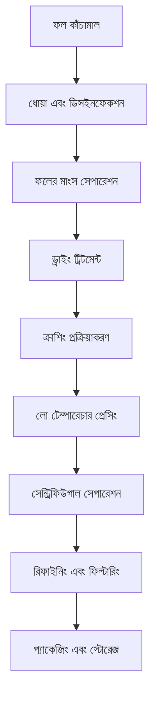

# ফল শ্রেণীর অয়েল ক্রপ সমাধান

## সারাংশ

ফল শ্রেণীর অয়েল ক্রপ মূলত বিভিন্ন ফলের ফলের মাংস, ফলের কার্নেল বা বীজ থেকে আসে, অনন্য পুষ্টি উপাদান এবং স্বাস্থ্য মূল্য রয়েছে। শানডং শেংশি হেচেং মেশিনারি কোং লিমিটেড পেশাদার ফল অয়েল ক্রপ প্রক্রিয়াকরণ সমাধান প্রদান করে, উচ্চমানের খাদ্য অয়েল এবং ফাংশনাল খাদ্যের বাজার চাহিদা পূরণ করে।

## প্রধান ফল ক্রপ

### 🥑 অ্যাভোকাডো / অ্যাভোকাডো (অ্যাভোকাডো অয়েল)
**অয়েল কনটেন্ট**: 15-25%
**বৈশিষ্ট্য**: অনস্যাচুরেটেড ফ্যাটি অ্যাসিড কনটেন্ট উচ্চ, সৌন্দর্য যত্ন
**প্রযোজ্য সরঞ্জাম**: 300/325 সিরিজ ডেডিকেটেড মেশিন
**প্রক্রিয়াকরণ প্রক্রিয়া**: ফলের মাংস সেপারেশন→লো টেম্পারেচার প্রেসিং→ফিল্টারিং→কোল্ড স্টোরেজ

### 🍇 আঙ্গুর বীজ (আঙ্গুর বীজ অয়েল)
**অয়েল কনটেন্ট**: 12-18%
**বৈশিষ্ট্য**: পলিফেনল কনটেন্ট উচ্চ, অ্যান্টিঅক্সিডেন্ট শক্তিশালী
**প্রযোজ্য সরঞ্জাম**: 300/325 সিরিজ ডেডিকেটেড মেশিন
**প্রক্রিয়াকরণ প্রক্রিয়া**: বীজ খোসা সেপারেশন→লো টেম্পারেচার প্রেসিং→ফিল্টারিং→রিফাইনিং

### 🎃 কুমড়া বীজ (কুমড়া বীজ অয়েল)
**অয়েল কনটেন্ট**: 35-45%
**বৈশিষ্ট্য**: ক্যারোটিন কনটেন্ট সমৃদ্ধ, পুষ্টি সামঞ্জস্যপূর্ণ
**প্রযোজ্য সরঞ্জাম**: 300/325 সিরিজ ডেডিকেটেড মেশিন
**প্রক্রিয়াকরণ প্রক্রিয়া**: খোসা রিমুভাল→লো টেম্পারেচার প্রেসিং→ফিল্টারিং

### 🍉 তরমুজ বীজ (তরমুজ বীজ অয়েল)
**অয়েল কনটেন্ট**: 40-50%
**বৈশিষ্ট্য**: প্রাকৃতিক কুলিং, গ্রীষ্মকালীন খাবারের জন্য উপযুক্ত
**প্রযোজ্য সরঞ্জাম**: 300/325 সিরিজ ডেডিকেটেড মেশিন
**প্রক্রিয়াকরণ প্রক্রিয়া**: খোসা রিমুভাল→লো টেম্পারেচার প্রেসিং→ফিল্টারিং

### 🧵 কটনসিড কার্নেল (কটনসিড অয়েল)
**অয়েল কনটেন্ট**: 35-45%
**বৈশিষ্ট্য**: শিল্প অয়েল, পেশাদার ডিটক্সিফিকেশন প্রয়োজন
**প্রযোজ্য সরঞ্জাম**: 425/480 সিরিজ ইন্ডাস্ট্রিয়াল মেশিন
**প্রক্রিয়াকরণ প্রক্রিয়া**: খোসা রিমুভাল→স্টিমিং→প্রেসিং→ডিটক্সিফিকেশন→রিফাইনিং

### 🍑 পীচ কার্নেল / খুবানি কার্নেল (কার্নেল অয়েল)
**অয়েল কনটেন্ট**: 40-50%
**বৈশিষ্ট্য**: মেডিসিনাল মূল্য, সৌন্দর্য যত্ন
**প্রযোজ্য সরঞ্জাম**: 300/325 সিরিজ ডেডিকেটেড মেশিন
**প্রক্রিয়াকরণ প্রক্রিয়া**: খোসা রিমুভাল→লো টেম্পারেচার প্রেসিং→ফিল্টারিং→রিফাইনিং

## সরঞ্জাম রেকমেন্ডেশন

### ছোট প্রক্রিয়াকরণ (দৈনিক প্রক্রিয়াকরণ 0.5-2 টন)
- **300/325 সিরিজ ডেডিকেটেড অয়েল প্রেস**
- ফল প্রি-ট্রিটমেন্ট সরঞ্জাম
- লো টেম্পারেচার কন্ট্রোল সিস্টেম
- ইনভেস্টমেন্ট খরচ: 400,000-1,000,000 ইউয়ান

### মিডিয়াম প্রক্রিয়াকরণ (দৈনিক প্রক্রিয়াকরণ 2-8 টন)
- **355/400 সিরিজ অয়েল প্রেস**
- অটোমেটেড প্রি-ট্রিটমেন্ট উৎপাদন লাইন
- তাপমাত্রা এবং আর্দ্রতা কন্ট্রোল সিস্টেম
- ইনভেস্টমেন্ট খরচ: 2,000,000-5,000,000 ইউয়ান

### বড় প্রক্রিয়াকরণ (দৈনিক প্রক্রিয়াকরণ 8 টনেরও বেশি)
- **425/480 সিরিজ অয়েল প্রেস**
- সম্পূর্ণ অটোমেটিক উৎপাদন লাইন
- বুদ্ধিমান ম্যানেজমেন্ট সিস্টেম
- ইনভেস্টমেন্ট খরচ: 8,000,000 ইউয়ানেরও বেশি

## প্রক্রিয়াকরণ প্রক্রিয়া ফ্লো

## প্রযুক্তিগত সুবিধা

### ❄️ লো টেম্পারেচার কোল্ড প্রেসিং
- পুষ্টি উপাদান সংরক্ষণ
- প্রাকৃতিক ফ্লেভার বজায় রাখা
- পণ্যের মূল্য বাড়ানো

### 🎯 সঠিক নিষ্কাশন
- ফলের মাংস পর্যাপ্ত সেপারেশন
- অয়েল সম্পূর্ণ নিষ্কাশন
- অশুদ্ধি কার্যকর অপসারণ

### 🔄 অবিরাম উৎপাদন
- অটোমেটেড উৎপাদন লাইন
- কন্টিনিউয়াস প্রেসিং প্রক্রিয়া
- বুদ্ধিমান কোয়ালিটি কন্ট্রোল

## পণ্যের প্রয়োগ

### 🍳 উচ্চমানের খাদ্য অয়েল
- বিশেষ পুষ্টিকর অয়েল
- জৈব স্বাস্থ্যকর অয়েল
- ফাংশনাল খাদ্য অয়েল

### 💄 সৌন্দর্য যত্ন
- প্রাকৃতিক স্কিন কেয়ার অয়েল
- ম্যাসাজ এসেনশিয়াল অয়েল
- হেয়ার কন্ডিশনার কাঁচামাল

### 💊 স্বাস্থ্য পুষ্টি পণ্য
- পুষ্টি সম্পূরক
- ফাংশনাল খাদ্য
- মেডিসিনাল প্রস্তুতি

## পুষ্টিগত মূল্য

### 🥑 অ্যাভোকাডো অয়েল
- ভিটামিন E কনটেন্ট উচ্চ
- অনস্যাচুরেটেড ফ্যাটি অ্যাসিড সমৃদ্ধ
- সৌন্দর্য যত্ন ইফেক্ট ভালো

### 🍇 আঙ্গুর বীজ অয়েল
- OPC কনটেন্ট সমৃদ্ধ
- অ্যান্টিঅক্সিডেন্ট ক্ষমতা শক্তিশালী
- হার্ট ভাসকুলার প্রোটেকশন

### 🎃 কুমড়া বীজ অয়েল
- জিঙ্ক এলিমেন্ট কনটেন্ট উচ্চ
- প্রোস্টেট স্বাস্থ্য
- ইমিউন সিস্টেম সাপোর্ট

## বাজার প্রসপেক্ট

### 📈 উন্নয়ন প্রবণতা
- ফাংশনাল খাদ্য উত্থান
- স্বাস্থ্য সৌন্দর্য চাহিদা বৃদ্ধি
- উচ্চমানের অয়েল বাজার সম্প্রসারণ

### 🎯 লক্ষ্য বাজার
- উচ্চমানের খাদ্য ব্র্যান্ড
- সৌন্দর্য যত্ন উদ্যোগ
- স্বাস্থ্য পণ্য ম্যানুফ্যাকচারার
- পেশাদার পুষ্টি পণ্য কোম্পানি

## সার্ভিস গ্যারান্টি

### 🛠️ প্রযুক্তিগত সহায়তা
- প্রক্রিয়া প্যারামিটার অপ্টিমাইজেশন
- সরঞ্জাম ইনস্টলেশন এবং ডিবাগিং
- অপারেটর প্রশিক্ষণ
- কোয়ালিটি কন্ট্রোল গাইডেন্স

### 🔧 আফটার সেলস সার্ভিস
- 7×24 ঘণ্টা প্রযুক্তিগত সহায়তা
- অ্যাক্সেসরি দ্রুত সরবরাহ
- নিয়মিত রক্ষণাবেক্ষণ
- প্রযুক্তিগত আপগ্রেড সার্ভিস

### 📊 ডেটা সার্ভিস
- উৎপাদন ডেটা অ্যানালিসিস
- কোয়ালিটি ডিটেকশন রিপোর্ট
- বাজার প্রবণতা অ্যানালিসিস
- গ্রাহক চাহিদা সার্ভে

## কেস শেয়ারিং

### শানডং উচ্চমানের ফল অয়েল প্রক্রিয়াকরণ কারখানা
- **সরঞ্জাম কনফিগারেশন**: 355 সিরিজ ডেডিকেটেড মেশিন×2 সেট
- **দৈনিক প্রক্রিয়াকরণ ক্যাপাসিটি**: 6 টন মিশ্র ফল
- **পণ্যের ধরন**: আঙ্গুর বীজ অয়েল, অ্যাভোকাডো অয়েল, কুমড়া বীজ অয়েল
- **বাজার পজিশনিং**: উচ্চমানের জৈব খাদ্য অয়েল
- **বার্ষিক বিক্রয়**: 15 মিলিয়ন ইউয়ান

### ঝেজিয়াং সৌন্দর্য যত্ন উদ্যোগ
- **সরঞ্জাম কনফিগারেশন**: 300 সিরিজ ডেডিকেটেড মেশিন×4 সেট
- **দৈনিক প্রক্রিয়াকরণ ক্যাপাসিটি**: 4 টন খুবানি কার্নেল
- **পণ্যের প্রয়োগ**: স্কিন কেয়ার পণ্য কাঁচামাল
- **পণ্যের কোয়ালিটি**: কসমেটিক্স মানদণ্ড মেনে চলে
- **রপ্তানি বাজার**: ইউরোপ, নর্থ আমেরিকা

### হেনান ফাংশনাল খাদ্য উদ্যোগ
- **সরঞ্জাম কনফিগারেশন**: 400 সিরিজ অয়েল প্রেস×1 সেট
- **দৈনিক প্রক্রিয়াকরণ ক্যাপাসিটি**: 3 টন আঙ্গুর বীজ
- **পণ্যের প্রয়োগ**: স্বাস্থ্য পণ্য কাঁচামাল
- **সার্টিফিকেশন মানদণ্ড**: GMP সার্টিফিকেশন
- **বাজার কভারেজ**: জাতীয় স্বাস্থ্য খাদ্য বাজার

## মানের মানদণ্ড

### 🏆 পণ্যের মানের মানদণ্ড
- জাতীয় খাদ্য অয়েল মানদণ্ড মেনে চলে
- জৈব খাদ্য সার্টিফিকেশন মেনে চলে
- রপ্তানি খাদ্য মানদণ্ড মেনে চলে
- সৌন্দর্য যত্ন মানদণ্ড মেনে চলে

### 🔍 পরীক্ষা আইটেম
- অ্যাসিড ভ্যালু পরীক্ষা
- পেরক্সাইড ভ্যালু পরীক্ষা
- রঙ এবং স্বচ্ছতা পরীক্ষা
- ভারী ধাতু কনটেন্ট পরীক্ষা
- কীটনাশক অবশিষ্ট পরীক্ষা
- পুষ্টি উপাদান অ্যানালিসিস

## টেকসই উন্নয়ন

### 🌱 পরিবেশবান্ধব উৎপাদন
- বর্জ্য পুনর্ব্যবহার
- শক্তি সাশ্রয় এবং নির্গমন হ্রাস প্রক্রিয়া
- সবুজ উৎপাদন মানদণ্ড

### 🔄 সম্পদ ব্যবহার
- ফলের সমন্বিত ব্যবহার
- উপজাত পণ্য ডেভেলপমেন্ট
- শিল্প চেইন এক্সটেনশন

## আমাদের সাথে যোগাযোগ করুন

আপনি যদি ফল শ্রেণীর অয়েল ক্রপ প্রক্রিয়াকরণ সমাধানে আগ্রহী হন, তাহলে আমাদের বিশেষজ্ঞ দলের সাথে যোগাযোগ করুন:

- 📞 **পরামর্শ হটলাইন**: +86 19906365856
- 📧 **ইমেইল**: gavin@oil-pressing-machine.com
- 📍 **ঠিকানা**: শানডং প্রদেশ, ওয়েইফ্যাং সিটি, কিংঝো সিটি, ডেভেলপমেন্ট জোন, ইনেং স্ট্রিট 5888 নম্বর

আমরা বিনামূল্যে প্রযুক্তিগত পরামর্শ, নমুনা পরীক্ষা এবং সাইট ভিজিট সেবা প্রদান করি, আপনার জন্য সবচেয়ে উপযুক্ত ফল অয়েল ক্রপ প্রক্রিয়াকরণ সমাধান কাস্টমাইজ করি।