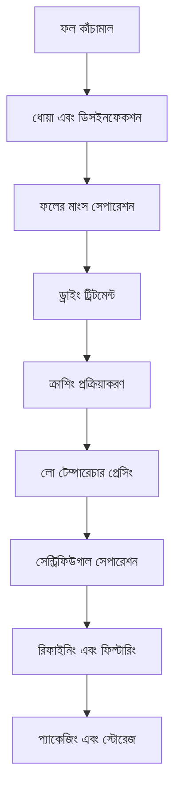

# ফল শ্রেণীর অয়েল ক্রপ সমাধান

## সারাংশ

ফলজাত তেলের কাঁচামাল ফলের শাঁস, কার্নেল বা বীজ থেকে আসে; কাঁচামালভেদে আর্দ্রতা, প্রি-ট্রিটমেন্ট, অক্সিডেশন নিয়ন্ত্রণ ও ফিল্টারিংয়ের প্রয়োজন আলাদা। শানডং শেংশি হেচেং মেশিনারি কোং লিমিটেড একটি যন্ত্রপাতি প্রস্তুতকারক; নমুনা, লক্ষ্য ক্ষমতা, পণ্যের মান এবং লিখিত সরবরাহসীমা ধরে উৎপাদন লাইন কনফিগার করতে হবে।

## প্রধান ফল ক্রপ

### 🥑 অ্যাভোকাডো / অ্যাভোকাডো (অ্যাভোকাডো অয়েল)
**অয়েল কনটেন্ট**: 15-25%
**বৈশিষ্ট্য**: অনস্যাচুরেটেড ফ্যাটি অ্যাসিড কনটেন্ট উচ্চ, সৌন্দর্য যত্ন
**প্রযোজ্য সরঞ্জাম**: 300/325 সিরিজ ডেডিকেটেড মেশিন
**প্রক্রিয়াকরণ প্রক্রিয়া**: ফলের মাংস সেপারেশন→লো টেম্পারেচার প্রেসিং→ফিল্টারিং→কোল্ড স্টোরেজ

### 🍇 আঙ্গুর বীজ (আঙ্গুর বীজ অয়েল)
**অয়েল কনটেন্ট**: 12-18%
**বৈশিষ্ট্য**: পলিফেনল কনটেন্ট উচ্চ, অ্যান্টিঅক্সিডেন্ট শক্তিশালী
**প্রযোজ্য সরঞ্জাম**: 300/325 সিরিজ ডেডিকেটেড মেশিন
**প্রক্রিয়াকরণ প্রক্রিয়া**: বীজ খোসা সেপারেশন→লো টেম্পারেচার প্রেসিং→ফিল্টারিং→রিফাইনিং

### 🎃 কুমড়া বীজ (কুমড়া বীজ অয়েল)
**অয়েল কনটেন্ট**: 35-45%
**বৈশিষ্ট্য**: ক্যারোটিন কনটেন্ট সমৃদ্ধ, পুষ্টি সামঞ্জস্যপূর্ণ
**প্রযোজ্য সরঞ্জাম**: 300/325 সিরিজ ডেডিকেটেড মেশিন
**প্রক্রিয়াকরণ প্রক্রিয়া**: খোসা রিমুভাল→লো টেম্পারেচার প্রেসিং→ফিল্টারিং

### 🍉 তরমুজ বীজ (তরমুজ বীজ অয়েল)
**অয়েল কনটেন্ট**: 40-50%
**বৈশিষ্ট্য**: প্রাকৃতিক কুলিং, গ্রীষ্মকালীন খাবারের জন্য উপযুক্ত
**প্রযোজ্য সরঞ্জাম**: 300/325 সিরিজ ডেডিকেটেড মেশিন
**প্রক্রিয়াকরণ প্রক্রিয়া**: খোসা রিমুভাল→লো টেম্পারেচার প্রেসিং→ফিল্টারিং

### 🧵 কটনসিড কার্নেল (কটনসিড অয়েল)
**অয়েল কনটেন্ট**: 35-45%
**বৈশিষ্ট্য**: শিল্প অয়েল, নির্দিষ্ট ডিটক্সিফিকেশন প্রক্রিয়া প্রয়োজন
**প্রযোজ্য সরঞ্জাম**: 426/480 সিরিজ ইন্ডাস্ট্রিয়াল মেশিন
**প্রক্রিয়াকরণ প্রক্রিয়া**: খোসা রিমুভাল→স্টিমিং→প্রেসিং→ডিটক্সিফিকেশন→রিফাইনিং

### 🍑 পীচ কার্নেল / খুবানি কার্নেল (কার্নেল অয়েল)
**অয়েল কনটেন্ট**: 40-50%
**বৈশিষ্ট্য**: মেডিসিনাল মূল্য, সৌন্দর্য যত্ন
**প্রযোজ্য সরঞ্জাম**: 300/325 সিরিজ ডেডিকেটেড মেশিন
**প্রক্রিয়াকরণ প্রক্রিয়া**: খোসা রিমুভাল→লো টেম্পারেচার প্রেসিং→ফিল্টারিং→রিফাইনিং

## সরঞ্জাম রেকমেন্ডেশন

### ছোট প্রক্রিয়াকরণ (দৈনিক প্রক্রিয়াকরণ 0.5-2 টন)
- **300/325 সিরিজ ডেডিকেটেড অয়েল প্রেস**
- ফল প্রি-ট্রিটমেন্ট সরঞ্জাম
- লো টেম্পারেচার কন্ট্রোল সিস্টেম
- ইনভেস্টমেন্ট খরচ: 400,000-1,000,000 ইউয়ান

### মিডিয়াম প্রক্রিয়াকরণ (দৈনিক প্রক্রিয়াকরণ 2-8 টন)
- **355/400 সিরিজ অয়েল প্রেস**
- অটোমেটেড প্রি-ট্রিটমেন্ট উৎপাদন লাইন
- তাপমাত্রা এবং আর্দ্রতা কন্ট্রোল সিস্টেম
- ইনভেস্টমেন্ট খরচ: 2,000,000-5,000,000 ইউয়ান

### বড় প্রক্রিয়াকরণ (দৈনিক প্রক্রিয়াকরণ 8 টনেরও বেশি)
- **426/480 সিরিজ অয়েল প্রেস**
- অটোমেশন-সমন্বিত উৎপাদন লাইন; অন্তর্ভুক্ত ধাপ কোটেশনে যাচাই করুন
- কন্ট্রোল/ম্যানেজমেন্ট সিস্টেমের ফাংশন কোটেশনে যাচাই করুন
- ইনভেস্টমেন্ট খরচ: 8,000,000 ইউয়ানেরও বেশি

## প্রক্রিয়াকরণ প্রক্রিয়া ফ্লো

```mermaid
graph TD
    A[ফল কাঁচামাল] --> B[ধোয়া এবং ডিসইনফেকশন]
    B --> C[ফলের মাংস সেপারেশন]
    C --> D[ড্রাইং ট্রিটমেন্ট]
    D --> E[ক্রাশিং প্রক্রিয়াকরণ]
    E --> F[লো টেম্পারেচার প্রেসিং]
    F --> G[সেন্ট্রিফিউগাল সেপারেশন]
    G --> H[রিফাইনিং এবং ফিল্টারিং]
    H --> I[প্যাকেজিং এবং স্টোরেজ]
```

## প্রক্রিয়া ও যাচাইয়ের বিষয়

### ❄️ লো টেম্পারেচার প্রেসিং
- লক্ষ্য সেটপয়েন্ট, কাঁচামালের প্রবেশ তাপমাত্রা এবং প্রেস থেকে বের হওয়া তেলের প্রকৃত তাপমাত্রা ট্রায়াল বা FAT-এ নথিভুক্ত করুন।
- পুষ্টি, রং, গন্ধ বা অক্সিডেশন সম্পর্কিত দাবি কেবল সম্মত নমুনা ও পরীক্ষাগার/সেন্সরি পদ্ধতির ফল দিয়ে যাচাই করুন।
- কুলিং, বন্ধ ট্যাংক বা আলো-নিয়ন্ত্রিত প্যাকেজিং দরকার হলে সংশ্লিষ্ট সরঞ্জাম কোটেশনে আছে কি না দেখুন।

### 🎯 সেপারেশন, পুনরুদ্ধার ও ফিল্টারিং
- শাঁস/বীজ আলাদা করা, শুকানো, ক্রাশিং, প্রেসিং ও ফিল্টারিংয়ের প্রতিটি ধাপের ইনপুট-আউটপুট সীমা লিখুন।
- তেল পুনরুদ্ধার, খৈলের অবশিষ্ট তেল এবং ফিল্টার-পরবর্তী অমিশ্রতা সম্মত কাঁচামাল ও মাপার পদ্ধতিতে গ্রহণ করুন।
- একাধিক ফলবীজ একই লাইনে চললে পরিষ্কার, পরিবর্তন সময় ও ক্রস-কন্টামিনেশন নিয়ন্ত্রণ পরীক্ষা করুন।

### 🔄 ক্ষমতা ও অটোমেশন
- ফিডিং, প্রেসিং, ফিল্টারিং ও প্যাকিংয়ের অটোমেশন কোন মডেল ও সহায়ক যন্ত্রে অন্তর্ভুক্ত তা কোটেশনে লিখুন।
- ঘণ্টা/দিনের ক্ষমতা কাঁচামাল, আর্দ্রতা, ব্যাচ/শিফট, পরিষ্কার ও রক্ষণাবেক্ষণ সময় ধরে FAT/SAT-এ যাচাই করুন।
- অ্যালার্ম, ইন্টারলক, ডেটা লগিং বা রেসিপি ফাংশন সরবরাহে থাকলে পরীক্ষার আইটেমে যোগ করুন।

## পণ্যের প্রয়োগ

### 🍳 উচ্চমানের খাদ্য অয়েল
- বিশেষ পুষ্টিকর অয়েল
- জৈব স্বাস্থ্যকর অয়েল
- ফাংশনাল খাদ্য অয়েল

### 💄 সৌন্দর্য যত্ন
- প্রাকৃতিক স্কিন কেয়ার অয়েল
- ম্যাসাজ এসেনশিয়াল অয়েল
- হেয়ার কন্ডিশনার কাঁচামাল

### 💊 স্বাস্থ্য পুষ্টি পণ্য
- পুষ্টি সম্পূরক
- ফাংশনাল খাদ্য
- মেডিসিনাল প্রস্তুতি

## পণ্য দাবি ও পরীক্ষার প্রমাণ

### 🥑 অ্যাভোকাডো অয়েল
- ভিটামিন E ও ফ্যাটি অ্যাসিডের দাবি প্রকৃত ব্যাচের পরীক্ষাগার রিপোর্ট দিয়ে যাচাই করুন।
- খাদ্য বা কসমেটিক ব্যবহারের জন্য আলাদা উপাদান, স্বাস্থ্যবিধি ও ট্রেসেবিলিটি শর্ত নির্ধারণ করুন।

### 🍇 আঙ্গুর বীজ অয়েল
- OPC বা অ্যান্টিঅক্সিডেন্ট দাবি থাকলে সম্মত পরীক্ষার পদ্ধতি, ইউনিট ও রিপোর্টিং সীমা লিখুন।
- স্বাস্থ্য-সম্পর্কিত দাবি ব্যবহারের আগে লক্ষ্য বাজারের আইন ও অনুমোদিত ভাষা যাচাই করুন।

### 🎃 কুমড়া বীজ অয়েল
- জিঙ্ক বা অন্য পুষ্টি উপাদানের দাবি প্রকৃত ব্যাচের পরীক্ষাগার রিপোর্ট দিয়ে যাচাই করুন।
- কোনো স্বাস্থ্য দাবি কেবল প্রযোজ্য বিধি ও পর্যাপ্ত প্রমাণ থাকলে ব্যবহার করুন।

## বাজার প্রসপেক্ট

### 📈 উন্নয়ন প্রবণতা
- ফাংশনাল খাদ্য উত্থান
- স্বাস্থ্য সৌন্দর্য চাহিদা বৃদ্ধি
- লক্ষ্য বাজারের পণ্যের মান, ফিল্টারিং, প্যাকেজিং ও লেবেলিং চাহিদা অর্ডারের আগে যাচাই করুন।

### 🎯 লক্ষ্য বাজার
- উচ্চমানের খাদ্য ব্র্যান্ড
- সৌন্দর্য যত্ন উদ্যোগ
- স্বাস্থ্য পণ্য ম্যানুফ্যাকচারার
- বিশেষায়িত পুষ্টিপণ্য কোম্পানি

## কোটেশন ও চুক্তিভিত্তিক সেবা

### 🛠️ প্রকৌশল ও সাইট সাপোর্ট
- প্রক্রিয়া-ফ্লো, মডেল, যন্ত্রপাতির তালিকা, লে-আউট, ইউটিলিটি ও ইন্টারফেসের প্রদেয় নথি লিখিতভাবে নির্ধারণ করুন।
- ইনস্টলেশন, কমিশনিং, প্রশিক্ষণ বা সাইট ভিজিটের উদ্দেশ্য, কাজের সীমা, লোক-দিন, সেবার বাইরে থাকা কাজ এবং খরচের দায়িত্ব কোটেশনে লিখুন।
- ফাউন্ডেশন, ইউটিলিটি, কাঁচামাল, লিফটিং, স্থানীয় শ্রম, নিরাপত্তা ও অনুমতির মধ্যে কোনটি ক্রেতা প্রস্তুত করবে তা চুক্তিতে নির্ধারণ করুন।

### 🧪 FAT/SAT ও গ্রহণযোগ্যতা
- FAT-এ কাঁচামাল, লোড, সময়, তাপমাত্রা, মাপার পদ্ধতি, নমুনা, নথি, পাস মানদণ্ড এবং বিচ্যুতি/পুনঃপরীক্ষার নিয়ম লিখুন।
- SAT-এ ইনস্টলেশন ও ইউটিলিটি প্রস্তুতি, ক্রেতা-সরবরাহকারীর দায়িত্ব, পরীক্ষার সীমা, স্বাক্ষর এবং অসম্পূর্ণ কাজের নিষ্পত্তি নির্ধারণ করুন।
- FAT/SAT না থাকলে বিকল্প পরিদর্শন, ভিডিও, নথি বা তৃতীয় পক্ষ যাচাইয়ের পরিসর লিখিতভাবে ঠিক করুন।

### 🔧 বিক্রয়োত্তর শর্ত
- ওয়ারেন্টির মেয়াদ, শুরুর তারিখ, আওতা, বাদ পড়া কারণ এবং দাবি করার নথি কোটেশন ও চুক্তিতে লিখুন।
- দূরবর্তী/সাইট সহায়তার মাধ্যম, লক্ষ্য প্রতিক্রিয়া সময়, ভ্রমণ ও শ্রম খরচ এবং সফটওয়্যার অ্যাক্সেসের শর্ত নির্ধারণ করুন।
- স্পেয়ার পার্টসের মডেল, পরিমাণ, মূল্য, সরবরাহ সময় ও স্টক দায়িত্ব নিশ্চিত করুন; রক্ষণাবেক্ষণ বা আপগ্রেড আলাদা কোটেশনসাপেক্ষ হতে পারে।

## ক্রয় কনফিগারেশন পরিস্থিতি

### একাধিক ফলবীজ তেল একই লাইনে

- প্রতিটি কাঁচামালের পরিচ্ছন্নতা, আর্দ্রতা, গুঁড়ার আকার এবং অ্যালার্জেন বা ক্রস-কন্টামিনেশন নিয়ন্ত্রণ নিশ্চিত করুন।
- ব্যাচ পরিবর্তনের সময় পরিষ্কার, ফিডিং, প্রেসিং ব্যারেল ও ফিল্টারের পরিবর্তন পদ্ধতি লিখুন।
- নমুনা পরীক্ষার ফল অনুযায়ী মূল প্রেস, ফিল্টার, ট্যাংক এবং প্যাকেজিং অংশ নির্বাচন করুন।

### খাদ্য, কসমেটিক বা উপাদান হিসেবে ব্যবহার

- লক্ষ্য ব্যবহারের জন্য প্রযোজ্য পণ্যমান, পরীক্ষার আইটেম, উপাদান ট্রেসেবিলিটি এবং প্যাকেজিং চাহিদা নির্ধারণ করুন।
- সার্টিফিকেশন দরকার হলে আবেদনকারী প্রতিষ্ঠান, উৎপাদন সাইট, পণ্যের পরিসর এবং বৈধ নথি আলাদাভাবে যাচাই করুন।

### গ্রহণযোগ্যতা তালিকা

- নমুনা পাঠানোর আগে ট্রায়ালের সম্ভাব্যতা, প্রয়োজনীয় পরিমাণ, প্রস্তুতি, ফি, পরিবহন/কাস্টমসের দায়িত্ব এবং অবশিষ্ট নমুনা ফেরত বা নিষ্পত্তি লিখিতভাবে নিশ্চিত করুন।
- কাঁচামাল, ইনপুট ওজন, চক্রের সময়, তেল ও খৈলের ওজন এবং ফিল্টার করা নমুনা নথিভুক্ত করুন।
- কোটেশনে মডেল, কনফিগারেশন, সহায়ক যন্ত্র, সরবরাহের পরিসর এবং পরিবর্তন নিয়ন্ত্রণ লিখুন।
- FAT/SAT-এর পাস মানদণ্ড, স্বাক্ষর, বিচ্যুতি সংশোধন ও পুনঃপরীক্ষার দায়িত্ব চুক্তিতে নিশ্চিত করুন।

## মানের মানদণ্ড

### 🏆 পণ্যের মানের মানদণ্ড
- জাতীয় খাদ্য অয়েল মানদণ্ড প্রযোজ্য হলে পরীক্ষার রিপোর্ট ও বৈধ নথি দিয়ে যাচাই করুন
- জৈব দাবি প্রয়োজন হলে প্রযোজ্য মান, সার্টিফিকেটধারী প্রতিষ্ঠান, পণ্যের পরিসর ও বৈধ নথি যাচাই করুন।
- রপ্তানি খাদ্য মানদণ্ড প্রযোজ্য হলে পরীক্ষার রিপোর্ট ও বৈধ নথি দিয়ে যাচাই করুন
- সৌন্দর্য যত্ন মানদণ্ড প্রযোজ্য হলে পরীক্ষার রিপোর্ট ও বৈধ নথি দিয়ে যাচাই করুন

### 🔍 পরীক্ষা আইটেম
- অ্যাসিড ভ্যালু পরীক্ষা
- পেরক্সাইড ভ্যালু পরীক্ষা
- রঙ এবং স্বচ্ছতা পরীক্ষা
- ভারী ধাতু কনটেন্ট পরীক্ষা
- কীটনাশক অবশিষ্ট পরীক্ষা
- পুষ্টি উপাদান অ্যানালিসিস

## টেকসই উন্নয়ন

### 🌱 পরিবেশবান্ধব উৎপাদন
- বর্জ্য পুনর্ব্যবহার
- শক্তি সাশ্রয় এবং নির্গমন হ্রাস প্রক্রিয়া
- সবুজ উৎপাদন মানদণ্ড

### 🔄 সম্পদ ব্যবহার
- ফলের সমন্বিত ব্যবহার
- উপজাত পণ্য ডেভেলপমেন্ট
- শিল্প চেইন এক্সটেনশন

## আমাদের সাথে যোগাযোগ করুন

আপনি যদি ফল বা ফলবীজ তেলের মেশিন/উৎপাদন লাইন কিনতে চান, প্রস্তুতকারকের লিখিত কোটেশনের জন্য প্রকল্পের তথ্য পাঠান:

- 📞 **কোটেশন হটলাইন**: +86 19906365856
- 📧 **ইমেইল**: gavin@oil-pressing-machine.com
- 📍 **ঠিকানা**: শানডং প্রদেশ, ওয়েইফ্যাং সিটি, কিংঝো সিটি, ডেভেলপমেন্ট জোন, ইনেং স্ট্রিট 5888 নম্বর

নমুনা ট্রায়াল, কারখানা পরীক্ষা বা সাইট ভিজিট কোটেশনে অন্তর্ভুক্ত আছে বলে ধরে নেবেন না। সম্ভাব্যতা, নমুনার পরিমাণ, ফি, পরিবহন দায়িত্ব এবং সাইট সাপোর্টের সীমা প্রস্তুতকারকের লিখিত কোটেশনে নিশ্চিত করুন।

## কারখানা কোটেশন ও উৎপাদন লাইন

লক্ষ্য ক্ষমতা, কাঁচামালের ধরন/আর্দ্রতা/অমিশ্রণ, প্রি-ট্রিটমেন্ট, কাঙ্ক্ষিত তেল ও প্যাকেজিং, ইউটিলিটি, সাইটের সীমা, গন্তব্য এবং বাজেট দিন। কোটেশনে মডেল ও পরিমাণ, সরবরাহের পূর্ণ পরিসর, মূল্য, কর ও পরিশোধের শর্ত, ডেলিভারি ও পরিবহন দায়িত্ব, FAT/SAT এবং বিক্রয়োত্তর শর্ত আলাদা করে লিখতে বলুন।

- [কারখানা কোটেশন নিন](/bn/contact/)

<!-- quote-cta -->
