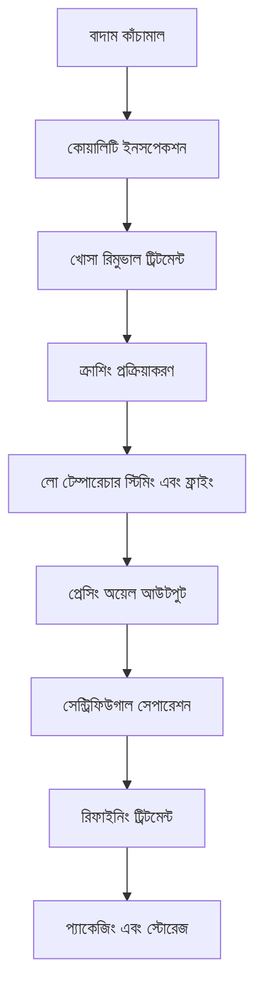

# বাদাম শ্রেণীর অয়েল ক্রপ সমাধান

## সারাংশ

বাদাম শ্রেণীর অয়েল ক্রপের অয়েল কনটেন্ট উচ্চ, পুষ্টিগত মূল্য সমৃদ্ধ, পণ্যের অ্যাডেড ভ্যালু উচ্চ। শানডং শেংশি হেচেং মেশিনারি কোং লিমিটেড পেশাদার বাদাম অয়েল ক্রপ প্রক্রিয়াকরণ সমাধান প্রদান করে, উচ্চমানের খাদ্য অয়েল থেকে সৌন্দর্য যত্ন পণ্যের কাঁচামাল পর্যন্ত বিভিন্ন চাহিদা পূরণ করে।

## প্রধান বাদাম ক্রপ

### 🥥 নারিকেল / নারিকেল (নারিকেল অয়েল, নারিকেল অয়েল)
**অয়েল কনটেন্ট**: 60-70%
**বৈশিষ্ট্য**: স্যাচুরেটেড ফ্যাটি অ্যাসিড কনটেন্ট উচ্চ, স্ট্যাবিলিটি ভালো
**প্রযোজ্য সরঞ্জাম**: 300/325 সিরিজ ডেডিকেটেড মেশিন
**প্রক্রিয়াকরণ প্রক্রিয়া**: নারিকেল মাংস সেপারেশন→ড্রাইং→লো টেম্পারেচার প্রেসিং→ফিল্টারিং

### 🌴 পাম ফল / পাম কার্নেল (পাম অয়েল, পাম কার্নেল অয়েল)
**অয়েল কনটেন্ট**: 45-55%
**বৈশিষ্ট্য**: শিল্প অয়েল, মেল্টিং পয়েন্ট মডারেট
**প্রযোজ্য সরঞ্জাম**: 425/480 সিরিজ ইন্ডাস্ট্রিয়াল মেশিন
**প্রক্রিয়াকরণ প্রক্রিয়া**: ফলের মাংস সেপারেশন→স্টিমিং→প্রেসিং→রিফাইনিং

### 🥜 আখরোট (আখরোট অয়েল)
**অয়েল কনটেন্ট**: 60-70%
**বৈশিষ্ট্য**: অনস্যাচুরেটেড ফ্যাটি অ্যাসিড সমৃদ্ধ, পুষ্টিগত মূল্য উচ্চ
**প্রযোজ্য সরঞ্জাম**: 300/325 সিরিজ ডেডিকেটেড মেশিন
**প্রক্রিয়াকরণ প্রক্রিয়া**: খোসা রিমুভাল→লো টেম্পারেচার প্রেসিং→ফিল্টারিং→কোল্ড স্টোরেজ

### 🌰 আমন্ড / বিটার আমন্ড (আমন্ড অয়েল)
**অয়েল কনটেন্ট**: 45-55%
**বৈশিষ্ট্য**: সৌন্দর্য যত্ন, মেডিসিনাল মূল্য
**প্রযোজ্য সরঞ্জাম**: 300/325 সিরিজ ডেডিকেটেড মেশিন
**প্রক্রিয়াকরণ প্রক্রিয়া**: খোসা রিমুভাল→লো টেম্পারেচার প্রেসিং→ফিল্টারিং→রিফাইনিং

### 🌰 হেজেলনাট (হেজেলনাট অয়েল)
**অয়েল কনটেন্ট**: 55-65%
**বৈশিষ্ট্য**: ভিটামিন E কনটেন্ট উচ্চ, অ্যান্টিঅক্সিডেন্ট
**প্রযোজ্য সরঞ্জাম**: 300/325 সিরিজ ডেডিকেটেড মেশিন
**প্রক্রিয়াকরণ প্রক্রিয়া**: খোসা রিমুভাল→লো টেম্পারেচার প্রেসিং→ফিল্টারিং

### 🥜 কাজু (কাজু অয়েল)
**অয়েল কনটেন্ট**: 40-50%
**বৈশিষ্ট্য**: বিশেষ সুগন্ধ, উচ্চমানের খাদ্য
**প্রযোজ্য সরঞ্জাম**: 300/325 সিরিজ ডেডিকেটেড মেশিন
**প্রক্রিয়াকরণ প্রক্রিয়া**: খোসা রিমুভাল→লো টেম্পারেচার প্রেসিং→ফিল্টারিং

### 🥜 পিস্তা (পিস্তা অয়েল)
**অয়েল কনটেন্ট**: 45-55%
**বৈশিষ্ট্য**: সবুজ স্বাস্থ্যকর, পুষ্টি সামঞ্জস্যপূর্ণ
**প্রযোজ্য সরঞ্জাম**: 300/325 সিরিজ ডেডিকেটেড মেশিন
**প্রক্রিয়াকরণ প্রক্রিয়া**: খোসা রিমুভাল→লো টেম্পারেচার প্রেসিং→ফিল্টারিং

## সরঞ্জাম রেকমেন্ডেশন

### ছোট প্রক্রিয়াকরণ (দৈনিক প্রক্রিয়াকরণ 0.5-2 টন)
- **300/325 সিরিজ ডেডিকেটেড অয়েল প্রেস**
- বাদাম প্রি-ট্রিটমেন্ট সরঞ্জাম
- লো টেম্পারেচার কন্ট্রোল সিস্টেম
- ইনভেস্টমেন্ট খরচ: 300,000-800,000 ইউয়ান

### মিডিয়াম প্রক্রিয়াকরণ (দৈনিক প্রক্রিয়াকরণ 2-10 টন)
- **355/400 সিরিজ অয়েল প্রেস**
- অটোমেটেড প্রি-ট্রিটমেন্ট উৎপাদন লাইন
- তাপমাত্রা কন্ট্রোল সিস্টেম
- ইনভেস্টমেন্ট খরচ: 1,500,000-4,000,000 ইউয়ান

### বড় প্রক্রিয়াকরণ (দৈনিক প্রক্রিয়াকরণ 10 টনেরও বেশি)
- **425/480 সিরিজ অয়েল প্রেস**
- সম্পূর্ণ অটোমেটিক উৎপাদন লাইন
- বুদ্ধিমান কন্ট্রোল সিস্টেম
- ইনভেস্টমেন্ট খরচ: 6,000,000 ইউয়ানেরও বেশি

## প্রক্রিয়াকরণ প্রক্রিয়া ফ্লো

## প্রযুক্তিগত সুবিধা

### ❄️ লো টেম্পারেচার প্রক্রিয়া
- পুষ্টি উপাদান সংরক্ষণ
- প্রাকৃতিক ফ্লেভার বজায় রাখা
- অয়েল কোয়ালিটি স্ট্যাবিলিটি বাড়ানো

### 🎯 সঠিক নিষ্কাশন
- বাদামের মাংস পর্যাপ্ত সেপারেশন
- অয়েল সম্পূর্ণ নিষ্কাশন
- অশুদ্ধি কার্যকর অপসারণ

### 🔄 অবিরাম উৎপাদন
- অটোমেটেড উৎপাদন লাইন
- কন্টিনিউয়াস প্রেসিং প্রক্রিয়া
- বুদ্ধিমান কোয়ালিটি কন্ট্রোল

## পণ্যের প্রয়োগ

### 🍳 উচ্চমানের খাদ্য অয়েল
- বিশেষ পুষ্টিকর অয়েল
- জৈব স্বাস্থ্যকর অয়েল
- ফাংশনাল খাদ্য অয়েল

### 💄 সৌন্দর্য যত্ন
- প্রাকৃতিক স্কিন কেয়ার অয়েল
- ম্যাসাজ এসেনশিয়াল অয়েল
- হেয়ার কন্ডিশনার কাঁচামাল

### 💊 স্বাস্থ্য পুষ্টি পণ্য
- পুষ্টি সম্পূরক
- ফাংশনাল খাদ্য
- মেডিসিনাল প্রস্তুতি

## বাজার প্রসপেক্ট

### 📈 উন্নয়ন প্রবণতা
- ফাংশনাল খাদ্য উত্থান
- সৌন্দর্য যত্ন বাজার সম্প্রসারণ
- উচ্চমানের অয়েল বাজার উন্নয়ন

### 🎯 লক্ষ্য বাজার
- উচ্চমানের খাদ্য ব্র্যান্ড
- সৌন্দর্য যত্ন উদ্যোগ
- স্বাস্থ্য পণ্য ম্যানুফ্যাকচারার
- ক্যাটারিং চেইন উদ্যোগ

## সার্ভিস গ্যারান্টি

### 🛠️ প্রযুক্তিগত সহায়তা
- প্রক্রিয়া প্যারামিটার অপ্টিমাইজেশন
- সরঞ্জাম ইনস্টলেশন এবং ডিবাগিং
- অপারেটর প্রশিক্ষণ
- কোয়ালিটি কন্ট্রোল গাইডেন্স

### 🔧 আফটার সেলস সার্ভিস
- 7×24 ঘণ্টা প্রযুক্তিগত সহায়তা
- অ্যাক্সেসরি দ্রুত সরবরাহ
- নিয়মিত রক্ষণাবেক্ষণ
- প্রযুক্তিগত আপগ্রেড সার্ভিস

### 📊 ডেটা সার্ভিস
- উৎপাদন ডেটা অ্যানালিসিস
- কোয়ালিটি ডিটেকশন রিপোর্ট
- বাজার প্রবণতা অ্যানালিসিস
- গ্রাহক চাহিদা সার্ভে

## কেস শেয়ারিং

### শানডং উচ্চমানের বাদাম অয়েল কারখানা
- **সরঞ্জাম কনফিগারেশন**: 355 সিরিজ ডেডিকেটেড মেশিন×2 সেট
- **দৈনিক প্রক্রিয়াকরণ ক্যাপাসিটি**: 8 টন মিশ্র বাদাম
- **পণ্যের ধরন**: আখরোট অয়েল, আমন্ড অয়েল, হেজেলনাট অয়েল
- **বাজার পজিশনিং**: উচ্চমানের জৈব খাদ্য অয়েল
- **বার্ষিক বিক্রয়**: 20 মিলিয়ন ইউয়ান

### ঝেজিয়াং সৌন্দর্য যত্ন উদ্যোগ
- **সরঞ্জাম কনফিগারেশন**: 300 সিরিজ ডেডিকেটেড মেশিন×3 সেট
- **দৈনিক প্রক্রিয়াকরণ ক্যাপাসিটি**: 3 টন আমন্ড
- **পণ্যের প্রয়োগ**: স্কিন কেয়ার পণ্য কাঁচামাল
- **পণ্যের কোয়ালিটি**: কসমেটিক্স মানদণ্ড মেনে চলে
- **রপ্তানি বাজার**: ইউরোপ, জাপান

### হেনান বাদাম প্রক্রিয়াকরণ উদ্যোগ
- **সরঞ্জাম কনফিগারেশন**: 400 সিরিজ অয়েল প্রেস×1 সেট
- **দৈনিক প্রক্রিয়াকরণ ক্যাপাসিটি**: 5 টন আখরোট
- **পণ্যের সিরিজ**: আখরোট অয়েল, আখরোট কার্নেল
- **ব্র্যান্ড নির্মাণ**: আঞ্চলিক বিখ্যাত ব্র্যান্ড
- **বাজার কভারেজ**: জাতীয় 20 টি প্রদেশ এবং শহর

## মানের মানদণ্ড

### 🏆 পণ্যের মানের মানদণ্ড
- জাতীয় খাদ্য অয়েল মানদণ্ড মেনে চলে
- জৈব খাদ্য সার্টিফিকেশন মেনে চলে
- রপ্তানি খাদ্য মানদণ্ড মেনে চলে
- সৌন্দর্য যত্ন মানদণ্ড মেনে চলে

### 🔍 পরীক্ষা আইটেম
- অ্যাসিড ভ্যালু পরীক্ষা
- পেরক্সাইড ভ্যালু পরীক্ষা
- রঙ এবং স্বচ্ছতা পরীক্ষা
- ভারী ধাতু কনটেন্ট পরীক্ষা
- কীটনাশক অবশিষ্ট পরীক্ষা

## আমাদের সাথে যোগাযোগ করুন

আপনি যদি বাদাম শ্রেণীর অয়েল ক্রপ প্রক্রিয়াকরণ সমাধানে আগ্রহী হন, তাহলে আমাদের বিশেষজ্ঞ দলের সাথে যোগাযোগ করুন:

- 📞 **পরামর্শ হটলাইন**: +86 19906365856
- 📧 **ইমেইল**: gavin@oil-pressing-machine.com
- 📍 **ঠিকানা**: শানডং প্রদেশ, ওয়েইফ্যাং সিটি, কিংঝো সিটি, ডেভেলপমেন্ট জোন, ইনেং স্ট্রিট 5888 নম্বর

আমরা বিনামূল্যে প্রযুক্তিগত পরামর্শ এবং সাইট ভিজিট সেবা প্রদান করি, আপনার জন্য সবচেয়ে উপযুক্ত বাদাম অয়েল ক্রপ প্রক্রিয়াকরণ সমাধান কাস্টমাইজ করি।