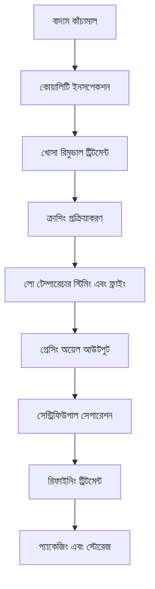

# বাদাম শ্রেণীর অয়েল ক্রপ সমাধান

## সারাংশ

বাদামজাত কাঁচামালে তেলের পরিমাণ, খোসা, আর্দ্রতা, অ্যালার্জেন ও অক্সিডেশন ঝুঁকি এক পণ্য থেকে অন্য পণ্যে আলাদা। শানডং শেংশি হেচেং মেশিনারি কোং লিমিটেড একটি যন্ত্রপাতি প্রস্তুতকারক; নমুনা, লক্ষ্য ক্ষমতা, চূড়ান্ত ব্যবহার এবং লিখিত সরবরাহসীমা ধরে উৎপাদন লাইন কনফিগার করতে হবে।

## প্রধান বাদাম ক্রপ

### 🥥 নারিকেল / নারিকেল (নারিকেল অয়েল, নারিকেল অয়েল)
**অয়েল কনটেন্ট**: 60-70%
**বৈশিষ্ট্য**: স্যাচুরেটেড ফ্যাটি অ্যাসিড কনটেন্ট উচ্চ, স্ট্যাবিলিটি ভালো
**প্রযোজ্য সরঞ্জাম**: 300/325 সিরিজ ডেডিকেটেড মেশিন
**প্রক্রিয়াকরণ প্রক্রিয়া**: নারিকেল মাংস সেপারেশন→ড্রাইং→লো টেম্পারেচার প্রেসিং→ফিল্টারিং

### 🌴 পাম ফল / পাম কার্নেল (পাম অয়েল, পাম কার্নেল অয়েল)
**অয়েল কনটেন্ট**: 45-55%
**বৈশিষ্ট্য**: শিল্প অয়েল, মেল্টিং পয়েন্ট মডারেট
**প্রযোজ্য সরঞ্জাম**: 426/480 সিরিজ ইন্ডাস্ট্রিয়াল মেশিন
**প্রক্রিয়াকরণ প্রক্রিয়া**: ফলের মাংস সেপারেশন→স্টিমিং→প্রেসিং→রিফাইনিং

### 🥜 আখরোট (আখরোট অয়েল)
**অয়েল কনটেন্ট**: 60-70%
**বৈশিষ্ট্য**: অনস্যাচুরেটেড ফ্যাটি অ্যাসিড সমৃদ্ধ, পুষ্টিগত মূল্য উচ্চ
**প্রযোজ্য সরঞ্জাম**: 300/325 সিরিজ ডেডিকেটেড মেশিন
**প্রক্রিয়াকরণ প্রক্রিয়া**: খোসা রিমুভাল→লো টেম্পারেচার প্রেসিং→ফিল্টারিং→কোল্ড স্টোরেজ

### 🌰 আমন্ড / বিটার আমন্ড (আমন্ড অয়েল)
**অয়েল কনটেন্ট**: 45-55%
**বৈশিষ্ট্য**: সৌন্দর্য যত্ন, মেডিসিনাল মূল্য
**প্রযোজ্য সরঞ্জাম**: 300/325 সিরিজ ডেডিকেটেড মেশিন
**প্রক্রিয়াকরণ প্রক্রিয়া**: খোসা রিমুভাল→লো টেম্পারেচার প্রেসিং→ফিল্টারিং→রিফাইনিং

### 🌰 হেজেলনাট (হেজেলনাট অয়েল)
**অয়েল কনটেন্ট**: 55-65%
**বৈশিষ্ট্য**: ভিটামিন E কনটেন্ট উচ্চ, অ্যান্টিঅক্সিডেন্ট
**প্রযোজ্য সরঞ্জাম**: 300/325 সিরিজ ডেডিকেটেড মেশিন
**প্রক্রিয়াকরণ প্রক্রিয়া**: খোসা রিমুভাল→লো টেম্পারেচার প্রেসিং→ফিল্টারিং

### 🥜 কাজু (কাজু অয়েল)
**অয়েল কনটেন্ট**: 40-50%
**বৈশিষ্ট্য**: বিশেষ সুগন্ধ, উচ্চমানের খাদ্য
**প্রযোজ্য সরঞ্জাম**: 300/325 সিরিজ ডেডিকেটেড মেশিন
**প্রক্রিয়াকরণ প্রক্রিয়া**: খোসা রিমুভাল→লো টেম্পারেচার প্রেসিং→ফিল্টারিং

### 🥜 পিস্তা (পিস্তা অয়েল)
**অয়েল কনটেন্ট**: 45-55%
**বৈশিষ্ট্য**: সবুজ স্বাস্থ্যকর, পুষ্টি সামঞ্জস্যপূর্ণ
**প্রযোজ্য সরঞ্জাম**: 300/325 সিরিজ ডেডিকেটেড মেশিন
**প্রক্রিয়াকরণ প্রক্রিয়া**: খোসা রিমুভাল→লো টেম্পারেচার প্রেসিং→ফিল্টারিং

## সরঞ্জাম রেকমেন্ডেশন

### ছোট প্রক্রিয়াকরণ (দৈনিক প্রক্রিয়াকরণ 0.5-2 টন)
- **300/325 সিরিজ ডেডিকেটেড অয়েল প্রেস**
- বাদাম প্রি-ট্রিটমেন্ট সরঞ্জাম
- লো টেম্পারেচার কন্ট্রোল সিস্টেম
- ইনভেস্টমেন্ট খরচ: 300,000-800,000 ইউয়ান

### মিডিয়াম প্রক্রিয়াকরণ (দৈনিক প্রক্রিয়াকরণ 2-10 টন)
- **355/400 সিরিজ অয়েল প্রেস**
- অটোমেটেড প্রি-ট্রিটমেন্ট উৎপাদন লাইন
- তাপমাত্রা কন্ট্রোল সিস্টেম
- ইনভেস্টমেন্ট খরচ: 1,500,000-4,000,000 ইউয়ান

### বড় প্রক্রিয়াকরণ (দৈনিক প্রক্রিয়াকরণ 10 টনেরও বেশি)
- **426/480 সিরিজ অয়েল প্রেস**
- অটোমেশন-সমন্বিত উৎপাদন লাইন; অন্তর্ভুক্ত ধাপ কোটেশনে যাচাই করুন
- কন্ট্রোল সিস্টেমের ফাংশন কোটেশনে যাচাই করুন
- ইনভেস্টমেন্ট খরচ: 6,000,000 ইউয়ানেরও বেশি

## প্রক্রিয়াকরণ প্রক্রিয়া ফ্লো

```mermaid
graph TD
    A[বাদাম কাঁচামাল] --> B[কোয়ালিটি ইনসপেকশন]
    B --> C[খোসা রিমুভাল ট্রিটমেন্ট]
    C --> D[ক্রাশিং প্রক্রিয়াকরণ]
    D --> E[লো টেম্পারেচার স্টিমিং এবং ফ্রাইং]
    E --> F[প্রেসিং অয়েল আউটপুট]
    F --> G[সেন্ট্রিফিউগাল সেপারেশন]
    G --> H[রিফাইনিং ট্রিটমেন্ট]
    H --> I[প্যাকেজিং এবং স্টোরেজ]
```

## প্রক্রিয়া ও যাচাইয়ের বিষয়

### ❄️ লো টেম্পারেচার প্রক্রিয়া
- লক্ষ্য সেটপয়েন্ট, কাঁচামালের প্রবেশ তাপমাত্রা এবং প্রেস থেকে বের হওয়া তেলের প্রকৃত তাপমাত্রা ট্রায়াল বা FAT-এ নথিভুক্ত করুন।
- পুষ্টি, রং, গন্ধ বা অক্সিডেশন সম্পর্কিত দাবি কেবল সম্মত নমুনা ও পরীক্ষাগার/সেন্সরি পদ্ধতির ফল দিয়ে যাচাই করুন।
- কুলিং, বন্ধ ট্যাংক বা আলো-নিয়ন্ত্রিত প্যাকেজিং দরকার হলে সংশ্লিষ্ট সরঞ্জাম কোটেশনে আছে কি না দেখুন।

### 🎯 সেপারেশন, পুনরুদ্ধার ও ফিল্টারিং
- খোসা ছাড়ানো, বাছাই, শুকানো, ক্রাশিং, প্রেসিং ও ফিল্টারিংয়ের প্রতিটি ধাপের ইনপুট-আউটপুট সীমা লিখুন।
- তেল পুনরুদ্ধার, খৈলের অবশিষ্ট তেল এবং ফিল্টার-পরবর্তী অমিশ্রতা সম্মত কাঁচামাল ও মাপার পদ্ধতিতে গ্রহণ করুন।
- পণ্য বদলের সময় পরিষ্কার, অ্যালার্জেন নিয়ন্ত্রণ ও লট ট্রেসেবিলিটি FAT/SAT-এর পরীক্ষার তালিকায় রাখুন।

### 🔄 ক্ষমতা ও অটোমেশন
- ফিডিং, প্রেসিং, ফিল্টারিং ও প্যাকিংয়ের অটোমেশন কোন মডেল ও সহায়ক যন্ত্রে অন্তর্ভুক্ত তা কোটেশনে লিখুন।
- ঘণ্টা/দিনের ক্ষমতা কাঁচামাল, আর্দ্রতা, ব্যাচ/শিফট, পরিষ্কার ও রক্ষণাবেক্ষণ সময় ধরে FAT/SAT-এ যাচাই করুন।
- অ্যালার্ম, ইন্টারলক, ডেটা লগিং বা রেসিপি ফাংশন সরবরাহে থাকলে পরীক্ষার আইটেমে যোগ করুন।

## পণ্যের প্রয়োগ

### 🍳 উচ্চমানের খাদ্য অয়েল
- বিশেষ পুষ্টিকর অয়েল
- জৈব স্বাস্থ্যকর অয়েল
- ফাংশনাল খাদ্য অয়েল

### 💄 সৌন্দর্য যত্ন
- প্রাকৃতিক স্কিন কেয়ার অয়েল
- ম্যাসাজ এসেনশিয়াল অয়েল
- হেয়ার কন্ডিশনার কাঁচামাল

### 💊 স্বাস্থ্য পুষ্টি পণ্য
- পুষ্টি সম্পূরক
- ফাংশনাল খাদ্য
- মেডিসিনাল প্রস্তুতি

## বাজার প্রসপেক্ট

### 📈 উন্নয়ন প্রবণতা
- ফাংশনাল খাদ্য উত্থান
- লক্ষ্য বাজারের পণ্যের মান, ফিল্টারিং, প্যাকেজিং ও লেবেলিং চাহিদা অর্ডারের আগে যাচাই করুন।
- উচ্চমানের অয়েল বাজার উন্নয়ন

### 🎯 লক্ষ্য বাজার
- উচ্চমানের খাদ্য ব্র্যান্ড
- সৌন্দর্য যত্ন উদ্যোগ
- স্বাস্থ্য পণ্য ম্যানুফ্যাকচারার
- ক্যাটারিং চেইন উদ্যোগ

## কোটেশন ও চুক্তিভিত্তিক সেবা

### 🛠️ প্রকৌশল ও সাইট সাপোর্ট
- প্রক্রিয়া-ফ্লো, মডেল, যন্ত্রপাতির তালিকা, লে-আউট, ইউটিলিটি, পরিষ্কার ও ইন্টারফেসের প্রদেয় নথি লিখিতভাবে নির্ধারণ করুন।
- ইনস্টলেশন, কমিশনিং, প্রশিক্ষণ বা সাইট ভিজিটের উদ্দেশ্য, কাজের সীমা, লোক-দিন, সেবার বাইরে থাকা কাজ এবং খরচের দায়িত্ব কোটেশনে লিখুন।
- ফাউন্ডেশন, ইউটিলিটি, কাঁচামাল, লিফটিং, স্থানীয় শ্রম, নিরাপত্তা ও অনুমতির মধ্যে কোনটি ক্রেতা প্রস্তুত করবে তা চুক্তিতে নির্ধারণ করুন।

### 🧪 FAT/SAT ও গ্রহণযোগ্যতা
- FAT-এ কাঁচামাল, লোড, সময়, তাপমাত্রা, মাপার পদ্ধতি, নমুনা, নথি, পাস মানদণ্ড এবং বিচ্যুতি/পুনঃপরীক্ষার নিয়ম লিখুন।
- SAT-এ ইনস্টলেশন ও ইউটিলিটি প্রস্তুতি, ক্রেতা-সরবরাহকারীর দায়িত্ব, পরীক্ষার সীমা, স্বাক্ষর এবং অসম্পূর্ণ কাজের নিষ্পত্তি নির্ধারণ করুন।
- FAT/SAT না থাকলে বিকল্প পরিদর্শন, ভিডিও, নথি বা তৃতীয় পক্ষ যাচাইয়ের পরিসর লিখিতভাবে ঠিক করুন।

### 🔧 বিক্রয়োত্তর শর্ত
- ওয়ারেন্টির মেয়াদ, শুরুর তারিখ, আওতা, বাদ পড়া কারণ এবং দাবি করার নথি কোটেশন ও চুক্তিতে লিখুন।
- দূরবর্তী/সাইট সহায়তার মাধ্যম, লক্ষ্য প্রতিক্রিয়া সময়, ভ্রমণ ও শ্রম খরচ এবং সফটওয়্যার অ্যাক্সেসের শর্ত নির্ধারণ করুন।
- স্পেয়ার পার্টসের মডেল, পরিমাণ, মূল্য, সরবরাহ সময় ও স্টক দায়িত্ব নিশ্চিত করুন; রক্ষণাবেক্ষণ বা আপগ্রেড আলাদা কোটেশনসাপেক্ষ হতে পারে।

## ক্রয় কনফিগারেশন পরিস্থিতি

### মিশ্র বাদাম বা একাধিক পণ্য

- আখরোট, আমন্ড, হেজেলনাট বা অন্য বাদামের জন্য আলাদা নমুনা পরীক্ষা করুন; একটি কাঁচামালের ফল অন্যটির জন্য ব্যবহার করবেন না।
- খোসা ছাড়ানো, বাছাই, কম তাপমাত্রায় শুকানো, গুঁড়া করা, প্রেসিং ও ফিল্টারিংয়ের অন্তর্ভুক্ত যন্ত্র নির্ধারণ করুন।
- পণ্য পরিবর্তনের সময় পরিষ্কার, অ্যালার্জেন নিয়ন্ত্রণ এবং লট ট্রেসেবিলিটির পদ্ধতি লিখুন।

### খাদ্য বা কসমেটিক কাঁচামাল

- লক্ষ্য ব্যবহারের জন্য প্রযোজ্য উপাদান, স্বাস্থ্যবিধি, পরীক্ষার আইটেম এবং প্যাকেজিং চাহিদা নিশ্চিত করুন।
- জৈব বা অন্য সার্টিফিকেশন দরকার হলে আইনি প্রতিষ্ঠান, উৎপাদন সাইট, পণ্যের পরিসর ও মেয়াদ যাচাই করুন।

### গ্রহণযোগ্যতা তালিকা

- নমুনা পাঠানোর আগে ট্রায়ালের সম্ভাব্যতা, প্রয়োজনীয় পরিমাণ, প্রস্তুতি, ফি, পরিবহন/কাস্টমসের দায়িত্ব এবং অবশিষ্ট নমুনা ফেরত বা নিষ্পত্তি লিখিতভাবে নিশ্চিত করুন।
- নমুনার আর্দ্রতা, প্রাক-প্রক্রিয়াকরণ, ইনপুট, তেল, খৈল, চক্রের সময় এবং তাপমাত্রা নথিভুক্ত করুন।
- মডেল ও লাইনের সংখ্যা শুধুমাত্র পরীক্ষিত চক্র, শিফট পরিকল্পনা এবং পরিষ্কার-পরিবর্তন সময় ধরে নির্ধারণ করুন।
- সরবরাহ, ইনস্টলেশন ও প্রশিক্ষণের সীমা লিখুন; FAT/SAT-এর পাস মানদণ্ড, স্বাক্ষর, সংশোধন ও পুনঃপরীক্ষার দায়িত্ব চুক্তিতে নিশ্চিত করুন।

## মানের মানদণ্ড

### 🏆 পণ্যের মানের মানদণ্ড
- জাতীয় খাদ্য অয়েল মানদণ্ড প্রযোজ্য হলে পরীক্ষার রিপোর্ট ও বৈধ নথি দিয়ে যাচাই করুন
- জৈব দাবি প্রয়োজন হলে প্রযোজ্য মান, সার্টিফিকেটধারী প্রতিষ্ঠান, পণ্যের পরিসর ও বৈধ নথি যাচাই করুন।
- রপ্তানি খাদ্য মানদণ্ড প্রযোজ্য হলে পরীক্ষার রিপোর্ট ও বৈধ নথি দিয়ে যাচাই করুন
- সৌন্দর্য যত্ন মানদণ্ড প্রযোজ্য হলে পরীক্ষার রিপোর্ট ও বৈধ নথি দিয়ে যাচাই করুন

### 🔍 পরীক্ষা আইটেম
- অ্যাসিড ভ্যালু পরীক্ষা
- পেরক্সাইড ভ্যালু পরীক্ষা
- রঙ এবং স্বচ্ছতা পরীক্ষা
- ভারী ধাতু কনটেন্ট পরীক্ষা
- কীটনাশক অবশিষ্ট পরীক্ষা

## আমাদের সাথে যোগাযোগ করুন

আপনি যদি বাদামজাত তেলের মেশিন বা উৎপাদন লাইন কিনতে চান, প্রস্তুতকারকের লিখিত কোটেশনের জন্য প্রকল্পের তথ্য পাঠান:

- 📞 **কোটেশন হটলাইন**: +86 19906365856
- 📧 **ইমেইল**: gavin@oil-pressing-machine.com
- 📍 **ঠিকানা**: শানডং প্রদেশ, ওয়েইফ্যাং সিটি, কিংঝো সিটি, ডেভেলপমেন্ট জোন, ইনেং স্ট্রিট 5888 নম্বর

নমুনা ট্রায়াল, কারখানা পরীক্ষা বা সাইট ভিজিট কোটেশনে অন্তর্ভুক্ত আছে বলে ধরে নেবেন না। সম্ভাব্যতা, নমুনার পরিমাণ, ফি, পরিবহন দায়িত্ব এবং সাইট সাপোর্টের সীমা প্রস্তুতকারকের লিখিত কোটেশনে নিশ্চিত করুন।

## কারখানা কোটেশন ও উৎপাদন লাইন

লক্ষ্য ক্ষমতা, বাদামের ধরন/খোসা/আর্দ্রতা/অমিশ্রণ, প্রি-ট্রিটমেন্ট, কাঙ্ক্ষিত তেল ও প্যাকেজিং, অ্যালার্জেন নিয়ন্ত্রণ, ইউটিলিটি, সাইটের সীমা, গন্তব্য এবং বাজেট দিন। কোটেশনে মডেল ও পরিমাণ, সরবরাহের পূর্ণ পরিসর, মূল্য, কর ও পরিশোধের শর্ত, ডেলিভারি ও পরিবহন দায়িত্ব, FAT/SAT এবং বিক্রয়োত্তর শর্ত আলাদা করে লিখতে বলুন।

- [কারখানা কোটেশন নিন](/bn/contact/)

<!-- quote-cta -->
