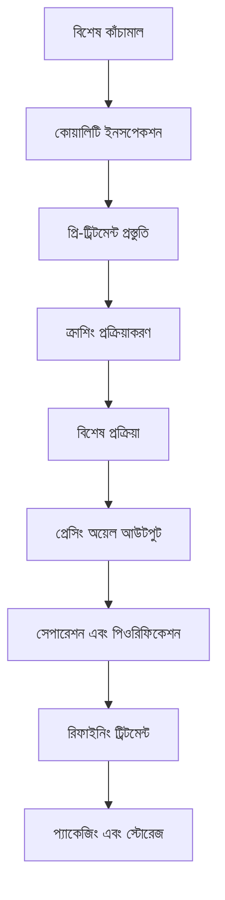

# অন্যান্য বিশেষ অয়েল ক্রপ সমাধান

## সারাংশ

বিশেষ অয়েল ক্রপ চালের ভুসি, কর্ন জার্ম, কাস্টর সিড ইত্যাদি অস্বাভাবিক অয়েল ক্রপ অন্তর্ভুক্ত করে, অনন্য পুষ্টিগত মূল্য এবং শিল্প প্রয়োগ মূল্য রয়েছে। শানডং শেংশি হেচেং মেশিনারি কোং লিমিটেড পেশাদার বিশেষ অয়েল ক্রপ প্রক্রিয়াকরণ সমাধান প্রদান করে, বহুমুখী বাজার চাহিদা পূরণ করে।

## প্রধান বিশেষ অয়েল ক্রপ

### 🍚 চালের ভুসি (চালের ভুসি অয়েল)
**অয়েল কনটেন্ট**: 15-25%
**বৈশিষ্ট্য**: প্রাকৃতিক অ্যান্টিঅক্সিডেন্ট γ-অরাইজানল কনটেন্ট উচ্চ
**প্রযোজ্য সরঞ্জাম**: 300/325 সিরিজ ডেডিকেটেড মেশিন
**প্রক্রিয়াকরণ প্রক্রিয়া**: চালের ভুসি নিষ্কাশন→লো টেম্পারেচার প্রেসিং→ফিল্টারিং→রিফাইনিং

### 🌽 কর্ন জার্ম (কর্ন অয়েল)
**অয়েল কনটেন্ট**: 35-45%
**বৈশিষ্ট্য**: ভিটামিন E কনটেন্ট সমৃদ্ধ, স্ট্যাবিলিটি ভালো
**প্রযোজ্য সরঞ্জাম**: 355/400 সিরিজ অয়েল প্রেস
**প্রক্রিয়াকরণ প্রক্রিয়া**: জার্ম সেপারেশন→ড্রাইং→প্রেসিং→ফিল্টারিং

### 🌿 কাস্টর সিড (কাস্টর অয়েল)
**অয়েল কনটেন্ট**: 45-55%
**বৈশিষ্ট্য**: শিল্প লুব্রিকেন্ট, বায়োডিজেল কাঁচামাল
**প্রযোজ্য সরঞ্জাম**: 425/480 সিরিজ ইন্ডাস্ট্রিয়াল মেশিন
**প্রক্রিয়াকরণ প্রক্রিয়া**: খোসা রিমুভাল→স্টিমিং→প্রেসিং→রিফাইনিং

### 🌶️ চিলি সিড (চিলি সিড অয়েল)
**অয়েল কনটেন্ট**: 15-25%
**বৈশিষ্ট্য**: ক্যাপসাইসিন কনটেন্ট উচ্চ, মেডিসিনাল স্বাস্থ্য মূল্য
**প্রযোজ্য সরঞ্জাম**: 300/325 সিরিজ ডেডিকেটেড মেশিন
**প্রক্রিয়াকরণ প্রক্রিয়া**: খোসা রিমুভাল→লো টেম্পারেচার প্রেসিং→ফিল্টারিং

### 🍇 আঙ্গুর বীজ / বাকউইট সিড (উচ্চ মূল্যের অয়েল)
**অয়েল কনটেন্ট**: 10-20%
**বৈশিষ্ট্য**: পলিফেনল কনটেন্ট উচ্চ, অ্যান্টিঅক্সিডেন্ট ক্ষমতা শক্তিশালী
**প্রযোজ্য সরঞ্জাম**: 300/325 সিরিজ ডেডিকেটেড মেশিন
**প্রক্রিয়াকরণ প্রক্রিয়া**: বীজ খোসা সেপারেশন→লো টেম্পারেচার প্রেসিং→ফিল্টারিং→রিফাইনিং

## সরঞ্জাম রেকমেন্ডেশন

### ছোট প্রক্রিয়াকরণ (দৈনিক প্রক্রিয়াকরণ 0.5-3 টন)
- **300/325 সিরিজ ডেডিকেটেড অয়েল প্রেস**
- বিশেষ প্রি-ট্রিটমেন্ট সরঞ্জাম
- লো টেম্পারেচার কন্ট্রোল সিস্টেম
- ইনভেস্টমেন্ট খরচ: 500,000-1,200,000 ইউয়ান

### মিডিয়াম প্রক্রিয়াকরণ (দৈনিক প্রক্রিয়াকরণ 3-15 টন)
- **355/400 সিরিজ অয়েল প্রেস**
- অটোমেটেড প্রি-ট্রিটমেন্ট উৎপাদন লাইন
- মাল্টি-স্টেজ ফিল্টারিং সিস্টেম
- ইনভেস্টমেন্ট খরচ: 2,500,000-6,000,000 ইউয়ান

### বড় প্রক্রিয়াকরণ (দৈনিক প্রক্রিয়াকরণ 15 টনেরও বেশি)
- **425/480 সিরিজ অয়েল প্রেস**
- সম্পূর্ণ অটোমেটিক উৎপাদন লাইন
- বুদ্ধিমান ম্যানেজমেন্ট সিস্টেম
- ইনভেস্টমেন্ট খরচ: 10,000,000 ইউয়ানেরও বেশি

## প্রক্রিয়াকরণ প্রক্রিয়া ফ্লো

## প্রযুক্তিগত সুবিধা

### 🎯 বিশেষ প্রক্রিয়া
- লক্ষ্যযুক্ত প্রি-ট্রিটমেন্ট
- ডেডিকেটেড প্রেসিং প্রক্রিয়া
- বিশেষ রিফাইনিং মেথড

### ❄️ লো টেম্পারেচার প্রোটেকশন
- অ্যাকটিভ উপাদান সংরক্ষণ
- প্রাকৃতিক বৈশিষ্ট্য বজায় রাখা
- পণ্যের মূল্য বাড়ানো

### 🔄 সঠিক নিয়ন্ত্রণ
- প্যারামিটার সঠিক নিয়ন্ত্রণ
- কোয়ালিটি রিয়েল-টাইম মনিটরিং
- অটোমেটিক অ্যাডজাস্টমেন্ট

## পণ্যের প্রয়োগ

### 💊 স্বাস্থ্য পণ্য কাঁচামাল
- প্রাকৃতিক অ্যান্টিঅক্সিডেন্ট
- ফাংশনাল পুষ্টি উপাদান
- মেডিসিনাল প্রস্তুতি কাঁচামাল

### 🏭 শিল্প অ্যাপ্লিকেশন
- লুব্রিকেন্ট বেস অয়েল
- বায়োডিজেল কাঁচামাল
- কেমিক্যাল কাঁচামাল

### 🍳 বিশেষ খাদ্য অয়েল
- উচ্চমানের পুষ্টিকর অয়েল
- ফাংশনাল খাদ্য অয়েল
- বিশেষ সিজনিং অয়েল

## পুষ্টি স্বাস্থ্য মূল্য

### 🍚 চালের ভুসি অয়েল
- γ-অরাইজানল কনটেন্ট উচ্চ
- অ্যান্টিঅক্সিডেন্ট ক্ষমতা শক্তিশালী
- হার্ট ভাসকুলার প্রোটেকশন

### 🌽 কর্ন অয়েল
- ভিটামিন E সমৃদ্ধ
- অনস্যাচুরেটেড ফ্যাটি অ্যাসিড সামঞ্জস্যপূর্ণ
- স্কিন স্বাস্থ্য প্রোটেকশন

### 🌶️ চিলি সিড অয়েল
- ক্যাপসাইসিন কনটেন্ট উচ্চ
- মেটাবলিজম প্রমোট
- ইমিউনিটি বাড়ানো

## বাজার প্রসপেক্ট

### 📈 উন্নয়ন প্রবণতা
- ফাংশনাল খাদ্য উত্থান
- প্রাকৃতিক অ্যান্টিঅক্সিডেন্ট বাজার সম্প্রসারণ
- বায়ো-বেসড ম্যাটেরিয়াল অ্যাপ্লিকেশন বৃদ্ধি

### 🎯 লক্ষ্য বাজার
- স্বাস্থ্য পণ্য উদ্যোগ
- খাদ্য প্রক্রিয়াকরণ উদ্যোগ
- কেমিক্যাল কাঁচামাল উদ্যোগ
- সৌন্দর্য যত্ন ব্র্যান্ড

## সার্ভিস গ্যারান্টি

### 🛠️ প্রযুক্তিগত সহায়তা
- বিশেষ প্রক্রিয়া গবেষণা এবং উন্নয়ন
- সরঞ্জাম কাস্টমাইজড ডিজাইন
- অপারেশন প্রযুক্তিগত ট্রেনিং
- কোয়ালিটি কন্ট্রোল গাইডেন্স

### 🔧 আফটার সেলস সার্ভিস
- 7×24 ঘণ্টা প্রযুক্তিগত সহায়তা
- ডেডিকেটেড অ্যাক্সেসরি সরবরাহ
- নিয়মিত প্রযুক্তিগত রক্ষণাবেক্ষণ
- প্রক্রিয়া অপ্টিমাইজেশন আপগ্রেড

### 📊 ডেটা সার্ভিস
- উৎপাদন ডেটা অ্যানালিসিস
- কোয়ালিটি ডিটেকশন রিপোর্ট
- বাজার প্রবণতা অ্যানালিসিস
- গ্রাহক চাহিদা সার্ভে

## কেস শেয়ারিং

### শানডং উচ্চমানের চালের ভুসি অয়েল প্রক্রিয়াকরণ উদ্যোগ
- **সরঞ্জাম কনফিগারেশন**: 355 সিরিজ ডেডিকেটেড মেশিন×2 সেট
- **দৈনিক প্রক্রিয়াকরণ ক্যাপাসিটি**: 10 টন চালের ভুসি
- **পণ্যের পজিশনিং**: উচ্চমানের পুষ্টিকর অয়েল
- **বাজার সুবিধা**: γ-অরাইজানল কনটেন্ট শিল্পে শীর্ষস্থানীয়
- **বার্ষিক বিক্রয়**: 8 মিলিয়ন ইউয়ান

### হেনান কর্ন অয়েল প্রক্রিয়াকরণ কারখানা
- **সরঞ্জাম কনফিগারেশন**: 400 সিরিজ অয়েল প্রেস×1 সেট
- **দৈনিক প্রক্রিয়াকরণ ক্যাপাসিটি**: 8 টন কর্ন জার্ম
- **পণ্যের কোয়ালিটি**: জাতীয় প্রথম স্তরের মানদণ্ড মেনে চলে
- **ব্র্যান্ড নির্মাণ**: আঞ্চলিক বিখ্যাত ব্র্যান্ড
- **বাজার কভারেজ**: জাতীয় 10 টি প্রদেশ এবং শহর

### হেবেই কাস্টর অয়েল প্রক্রিয়াকরণ উদ্যোগ
- **সরঞ্জাম কনফিগারেশন**: 425 সিরিজ ইন্ডাস্ট্রিয়াল মেশিন×1 সেট
- **দৈনিক প্রক্রিয়াকরণ ক্যাপাসিটি**: 12 টন কাস্টর সিড
- **পণ্যের প্রয়োগ**: শিল্প লুব্রিকেন্ট
- **কোয়ালিটি মানদণ্ড**: শিল্প মানদণ্ড মেনে চলে
- **বার্ষিক উৎপাদন**: 5,000 টন

## মানের মানদণ্ড

### 🏆 পণ্যের মানের মানদণ্ড
- জাতীয় সংশ্লিষ্ট মানদণ্ড মেনে চলে
- শিল্প কোয়ালিটি রিকোয়ারমেন্ট মেনে চলে
- রপ্তানি কোয়ালিটি মানদণ্ড মেনে চলে
- নিরাপত্তা এবং স্বাস্থ্য মানদণ্ড মেনে চলে

### 🔍 পরীক্ষা আইটেম
- ফিজিক্যাল এবং কেমিক্যাল ইন্ডিকেটর পরীক্ষা
- পুষ্টি উপাদান অ্যানালিসিস
- নিরাপত্তা পরীক্ষা
- স্ট্যাবিলিটি পরীক্ষা
- বিশেষ উপাদান পরীক্ষা

## প্রযুক্তিগত উদ্ভাবন

### 🔬 প্রক্রিয়া উদ্ভাবন
- নতুন নিষ্কাশন প্রযুক্তি
- লো টেম্পারেচার প্রোটেকশন প্রক্রিয়া
- উচ্চ দক্ষতা সেপারেশন প্রযুক্তি

### 📊 ডেটা-চালিত
- বুদ্ধিমান কোয়ালিটি কন্ট্রোল
- বিগ ডেটা অ্যানালিসিস অ্যাপ্লিকেশন
- প্রক্রিয়া প্যারামিটার অপ্টিমাইজেশন

### 🌱 টেকসই উন্নয়ন
- সম্পদের সমন্বিত ব্যবহার
- শক্তি সাশ্রয় এবং নির্গমন হ্রাস প্রক্রিয়া
- সবুজ উৎপাদন মানদণ্ড

## আমাদের সাথে যোগাযোগ করুন

আপনি যদি বিশেষ অয়েল ক্রপ প্রক্রিয়াকরণ সমাধানে আগ্রহী হন, তাহলে আমাদের বিশেষজ্ঞ দলের সাথে যোগাযোগ করুন:

- 📞 **পরামর্শ হটলাইন**: +86 19906365856
- 📧 **ইমেইল**: gavin@oil-pressing-machine.com
- 📍 **ঠিকানা**: শানডং প্রদেশ, ওয়েইফ্যাং সিটি, কিংঝো সিটি, ডেভেলপমেন্ট জোন, ইনেং স্ট্রিট 5888 নম্বর

আমরা বিনামূল্যে প্রযুক্তিগত পরামর্শ, নমুনা পরীক্ষা এবং প্রক্রিয়া ভেরিফিকেশন সেবা প্রদান করি, আপনার জন্য সবচেয়ে পেশাদার বিশেষ অয়েল ক্রপ প্রক্রিয়াকরণ সমাধান প্রদান করি।