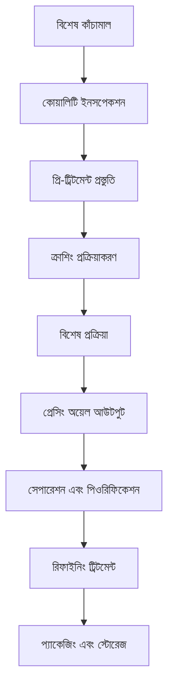

# অন্যান্য বিশেষ অয়েল ক্রপ সমাধান

## সারাংশ

বিশেষ তেলবীজের মধ্যে চালের ভুসি, কর্ন জার্ম ও কাস্টর সিডের মতো কাঁচামাল রয়েছে; প্রতিটির স্থিতিশীলকরণ, নিরাপত্তা, প্রেস/এক্সট্রাকশন ও রিফাইনিংয়ের প্রয়োজন আলাদা। শানডং শেংশি হেচেং মেশিনারি কোং লিমিটেড একটি যন্ত্রপাতি প্রস্তুতকারক; নমুনা, লক্ষ্য ক্ষমতা, চূড়ান্ত ব্যবহার এবং লিখিত সরবরাহসীমা ধরে উৎপাদন লাইন কনফিগার করতে হবে।

## প্রধান বিশেষ অয়েল ক্রপ

### 🍚 চালের ভুসি (চালের ভুসি অয়েল)
**অয়েল কনটেন্ট**: 15-25%
**বৈশিষ্ট্য**: প্রাকৃতিক অ্যান্টিঅক্সিডেন্ট γ-অরাইজানল কনটেন্ট উচ্চ
**প্রযোজ্য সরঞ্জাম**: 300/325 সিরিজ ডেডিকেটেড মেশিন
**প্রক্রিয়াকরণ প্রক্রিয়া**: চালের ভুসি নিষ্কাশন→লো টেম্পারেচার প্রেসিং→ফিল্টারিং→রিফাইনিং

### 🌽 কর্ন জার্ম (কর্ন অয়েল)
**অয়েল কনটেন্ট**: 35-45%
**বৈশিষ্ট্য**: ভিটামিন E কনটেন্ট সমৃদ্ধ, স্ট্যাবিলিটি ভালো
**প্রযোজ্য সরঞ্জাম**: 355/400 সিরিজ অয়েল প্রেস
**প্রক্রিয়াকরণ প্রক্রিয়া**: জার্ম সেপারেশন→ড্রাইং→প্রেসিং→ফিল্টারিং

### 🌿 কাস্টর সিড (কাস্টর অয়েল)
**অয়েল কনটেন্ট**: 45-55%
**বৈশিষ্ট্য**: শিল্প লুব্রিকেন্ট, বায়োডিজেল কাঁচামাল
**প্রযোজ্য সরঞ্জাম**: 426/480 সিরিজ ইন্ডাস্ট্রিয়াল মেশিন
**প্রক্রিয়াকরণ প্রক্রিয়া**: খোসা রিমুভাল→স্টিমিং→প্রেসিং→রিফাইনিং

### 🌶️ চিলি সিড (চিলি সিড অয়েল)
**অয়েল কনটেন্ট**: 15-25%
**বৈশিষ্ট্য**: ক্যাপসাইসিন কনটেন্ট উচ্চ, মেডিসিনাল স্বাস্থ্য মূল্য
**প্রযোজ্য সরঞ্জাম**: 300/325 সিরিজ ডেডিকেটেড মেশিন
**প্রক্রিয়াকরণ প্রক্রিয়া**: খোসা রিমুভাল→লো টেম্পারেচার প্রেসিং→ফিল্টারিং

### 🍇 আঙ্গুর বীজ / বাকউইট সিড (উচ্চ মূল্যের অয়েল)
**অয়েল কনটেন্ট**: 10-20%
**বৈশিষ্ট্য**: পলিফেনল কনটেন্ট উচ্চ, অ্যান্টিঅক্সিডেন্ট ক্ষমতা শক্তিশালী
**প্রযোজ্য সরঞ্জাম**: 300/325 সিরিজ ডেডিকেটেড মেশিন
**প্রক্রিয়াকরণ প্রক্রিয়া**: বীজ খোসা সেপারেশন→লো টেম্পারেচার প্রেসিং→ফিল্টারিং→রিফাইনিং

## সরঞ্জাম রেকমেন্ডেশন

### ছোট প্রক্রিয়াকরণ (দৈনিক প্রক্রিয়াকরণ 0.5-3 টন)
- **300/325 সিরিজ ডেডিকেটেড অয়েল প্রেস**
- বিশেষ প্রি-ট্রিটমেন্ট সরঞ্জাম
- লো টেম্পারেচার কন্ট্রোল সিস্টেম
- ইনভেস্টমেন্ট খরচ: 500,000-1,200,000 ইউয়ান

### মিডিয়াম প্রক্রিয়াকরণ (দৈনিক প্রক্রিয়াকরণ 3-15 টন)
- **355/400 সিরিজ অয়েল প্রেস**
- অটোমেটেড প্রি-ট্রিটমেন্ট উৎপাদন লাইন
- মাল্টি-স্টেজ ফিল্টারিং সিস্টেম
- ইনভেস্টমেন্ট খরচ: 2,500,000-6,000,000 ইউয়ান

### বড় প্রক্রিয়াকরণ (দৈনিক প্রক্রিয়াকরণ 15 টনেরও বেশি)
- **426/480 সিরিজ অয়েল প্রেস**
- অটোমেশন-সমন্বিত উৎপাদন লাইন; অন্তর্ভুক্ত ধাপ কোটেশনে যাচাই করুন
- কন্ট্রোল/ম্যানেজমেন্ট সিস্টেমের ফাংশন কোটেশনে যাচাই করুন
- ইনভেস্টমেন্ট খরচ: 10,000,000 ইউয়ানেরও বেশি

## প্রক্রিয়াকরণ প্রক্রিয়া ফ্লো

```mermaid
graph TD
    A[বিশেষ কাঁচামাল] --> B[কোয়ালিটি ইনসপেকশন]
    B --> C[প্রি-ট্রিটমেন্ট প্রস্তুতি]
    C --> D[ক্রাশিং প্রক্রিয়াকরণ]
    D --> E[বিশেষ প্রক্রিয়া]
    E --> F[প্রেসিং অয়েল আউটপুট]
    F --> G[সেপারেশন এবং পিওরিফিকেশন]
    G --> H[রিফাইনিং ট্রিটমেন্ট]
    H --> I[প্যাকেজিং এবং স্টোরেজ]
```

## প্রক্রিয়া ও যাচাইয়ের বিষয়

### 🎯 কাঁচামালভিত্তিক প্রক্রিয়া
- স্থিতিশীলকরণ, ডিহালিং, কন্ডিশনিং, প্রেসিং, ফিল্টারিং, এক্সট্রাকশন বা রিফাইনিংয়ের কোন ধাপ দরকার তা নমুনা ও চূড়ান্ত ব্যবহার ধরে নির্ধারণ করুন।
- খাদ্য ও শিল্প কাঁচামাল একই লাইনে চললে উপাদান, পরিষ্কার, বিচ্ছিন্নতা, নিরাপত্তা ও বর্জ্য ব্যবস্থাপনার শর্ত লিখুন।
- প্রক্রিয়া-ফ্লো, মূল যন্ত্র ও সহায়ক যন্ত্রের সীমানা প্রস্তুতকারকের কোটেশনে মিলিয়ে নিন।

### ❄️ তাপমাত্রা ও পণ্য দাবি
- নিম্ন তাপমাত্রার লক্ষ্য থাকলে কাঁচামালের প্রবেশ তাপমাত্রা, সেটপয়েন্ট, প্রকৃত তাপমাত্রা ও নমুনা সংগ্রহের পদ্ধতি নথিভুক্ত করুন।
- সক্রিয় উপাদান, রং, গন্ধ বা স্থিতিশীলতা সম্পর্কিত দাবি কেবল সম্মত পরীক্ষাগার পদ্ধতি ও প্রকৃত ব্যাচের রিপোর্ট দিয়ে যাচাই করুন।
- কুলিং, বন্ধ ট্যাংক বা বিশেষ প্যাকেজিং দরকার হলে সংশ্লিষ্ট সরঞ্জাম সরবরাহে আছে কি না দেখুন।

### 🔄 কন্ট্রোল ও ক্ষমতা
- তাপমাত্রা, চাপ, ফিড ও আর্দ্রতার রেঞ্জ, সেন্সর, ডেটা লগিং এবং স্বয়ংক্রিয়/ম্যানুয়াল মোড মডেলভিত্তিক ডেটাশিটে যাচাই করুন।
- ঘণ্টা/দিনের ক্ষমতা কাঁচামালের তাজা অবস্থা, আর্দ্রতা, প্রি-ট্রিটমেন্ট, লোড ও রক্ষণাবেক্ষণ শর্তে FAT/SAT দিয়ে গ্রহণ করুন।
- অ্যালার্ম, ইন্টারলক, নিরাপদ বন্ধ ও রেসিপি ফাংশন সরবরাহে থাকলে পরীক্ষার আইটেমে যোগ করুন।

## পণ্যের প্রয়োগ

### 💊 স্বাস্থ্য পণ্য কাঁচামাল
- প্রাকৃতিক অ্যান্টিঅক্সিডেন্ট
- ফাংশনাল পুষ্টি উপাদান
- মেডিসিনাল প্রস্তুতি কাঁচামাল

### 🏭 শিল্প অ্যাপ্লিকেশন
- লুব্রিকেন্ট বেস অয়েল
- বায়োডিজেল কাঁচামাল
- কেমিক্যাল কাঁচামাল

### 🍳 বিশেষ খাদ্য অয়েল
- উচ্চমানের পুষ্টিকর অয়েল
- ফাংশনাল খাদ্য অয়েল
- বিশেষ সিজনিং অয়েল

## পণ্য দাবি ও ব্যবহার যাচাই

### 🍚 চালের ভুসি অয়েল
- γ-অরাইজানল বা অ্যান্টিঅক্সিডেন্ট দাবি থাকলে সম্মত পরীক্ষার পদ্ধতি, ইউনিট ও রিপোর্টিং সীমা লিখুন।
- খাদ্য-সম্পর্কিত দাবি ব্যবহারের আগে লক্ষ্য বাজারের মান ও অনুমোদিত ভাষা যাচাই করুন।

### 🌽 কর্ন অয়েল
- ভিটামিন E ও ফ্যাটি অ্যাসিডের দাবি প্রকৃত ব্যাচের পরীক্ষাগার রিপোর্ট দিয়ে যাচাই করুন।
- খাদ্য বা কসমেটিক ব্যবহারের জন্য আলাদা উপাদান, স্বাস্থ্যবিধি ও ট্রেসেবিলিটি শর্ত নির্ধারণ করুন।

### 🌶️ চিলি সিড অয়েল
- ক্যাপসাইসিন বা অন্য বিশেষ উপাদানের মাত্রা সম্মত পদ্ধতি ও নিরাপত্তা সীমা দিয়ে যাচাই করুন।
- কোনো স্বাস্থ্য দাবি কেবল প্রযোজ্য বিধি ও পর্যাপ্ত প্রমাণ থাকলে ব্যবহার করুন।

## বাজার প্রসপেক্ট

### 📈 উন্নয়ন প্রবণতা
- ফাংশনাল খাদ্য উত্থান
- লক্ষ্য বাজারের পণ্যের মান, ফিল্টারিং, প্যাকেজিং ও লেবেলিং চাহিদা অর্ডারের আগে যাচাই করুন।
- বায়ো-বেসড ম্যাটেরিয়াল অ্যাপ্লিকেশন বৃদ্ধি

### 🎯 লক্ষ্য বাজার
- স্বাস্থ্য পণ্য উদ্যোগ
- খাদ্য প্রক্রিয়াকরণ উদ্যোগ
- কেমিক্যাল কাঁচামাল উদ্যোগ
- সৌন্দর্য যত্ন ব্র্যান্ড

## কোটেশন ও চুক্তিভিত্তিক সেবা

### 🛠️ প্রকৌশল ও সাইট সাপোর্ট
- প্রক্রিয়া-ফ্লো, মডেল, যন্ত্রপাতির তালিকা, লে-আউট, ইউটিলিটি, নিরাপত্তা ও ইন্টারফেসের প্রদেয় নথি লিখিতভাবে নির্ধারণ করুন।
- ইনস্টলেশন, কমিশনিং, প্রশিক্ষণ বা সাইট ভিজিটের উদ্দেশ্য, কাজের সীমা, লোক-দিন, সেবার বাইরে থাকা কাজ এবং খরচের দায়িত্ব কোটেশনে লিখুন।
- ফাউন্ডেশন, ইউটিলিটি, কাঁচামাল, লিফটিং, স্থানীয় শ্রম, বর্জ্য নিষ্পত্তি, নিরাপত্তা ও অনুমতির মধ্যে কোনটি ক্রেতা প্রস্তুত করবে তা চুক্তিতে নির্ধারণ করুন।

### 🧪 FAT/SAT ও গ্রহণযোগ্যতা
- FAT-এ কাঁচামাল, লোড, সময়, তাপমাত্রা, মাপার পদ্ধতি, নমুনা, নথি, পাস মানদণ্ড এবং বিচ্যুতি/পুনঃপরীক্ষার নিয়ম লিখুন।
- SAT-এ ইনস্টলেশন ও ইউটিলিটি প্রস্তুতি, ক্রেতা-সরবরাহকারীর দায়িত্ব, পরীক্ষার সীমা, স্বাক্ষর এবং অসম্পূর্ণ কাজের নিষ্পত্তি নির্ধারণ করুন।
- FAT/SAT না থাকলে বিকল্প পরিদর্শন, ভিডিও, নথি বা তৃতীয় পক্ষ যাচাইয়ের পরিসর লিখিতভাবে ঠিক করুন।

### 🔧 বিক্রয়োত্তর শর্ত
- ওয়ারেন্টির মেয়াদ, শুরুর তারিখ, আওতা, বাদ পড়া কারণ এবং দাবি করার নথি কোটেশন ও চুক্তিতে লিখুন।
- দূরবর্তী/সাইট সহায়তার মাধ্যম, লক্ষ্য প্রতিক্রিয়া সময়, ভ্রমণ ও শ্রম খরচ এবং সফটওয়্যার অ্যাক্সেসের শর্ত নির্ধারণ করুন।
- বিশেষ ও সাধারণ স্পেয়ার পার্টসের মডেল, পরিমাণ, মূল্য, সরবরাহ সময় ও স্টক দায়িত্ব নিশ্চিত করুন; রক্ষণাবেক্ষণ বা আপগ্রেড আলাদা কোটেশনসাপেক্ষ হতে পারে।

## ক্রয় কনফিগারেশন পরিস্থিতি

### চালের ভুসি, কর্ন জার্ম বা কাস্টর সিড

- কাঁচামালের তাজা অবস্থা, আর্দ্রতা, অমিশ্রণ এবং সংরক্ষণ সময় নিশ্চিত করে আলাদা নমুনা পরীক্ষা করুন।
- ডিহালিং, স্ট্যাবিলাইজেশন, কন্ডিশনিং, প্রেসিং, ফিল্টারিং বা রিফাইনিংয়ের কোন ধাপ সরবরাহে থাকবে তা লিখুন।
- খাদ্য ও শিল্প ব্যবহারের জন্য উপাদান, স্বাস্থ্যবিধি, নিরাপত্তা এবং বর্জ্য ব্যবস্থাপনার শর্ত আলাদাভাবে নির্ধারণ করুন।

### গ্রহণযোগ্যতা তালিকা

- নমুনা পাঠানোর আগে ট্রায়ালের সম্ভাব্যতা, প্রয়োজনীয় পরিমাণ, প্রস্তুতি, ফি, পরিবহন/কাস্টমসের দায়িত্ব এবং অবশিষ্ট নমুনা ফেরত বা নিষ্পত্তি লিখিতভাবে নিশ্চিত করুন।
- কাঁচামালের ব্যাচ, প্রস্তুতি, ইনপুট ওজন, চক্রের সময়, তরল ও অবশিষ্টাংশের পরিমাণ নথিভুক্ত করুন।
- পণ্যের উপাদান বা গুণমান দাবি থাকলে সম্মত পরীক্ষাগার পদ্ধতি ও রিপোর্ট ব্যবহার করুন।
- প্রযোজ্য মান বা সার্টিফিকেশন দরকার হলে আইনি প্রতিষ্ঠান, পণ্যের পরিসর এবং বৈধ নথি যাচাই করুন।
- কোটেশনে মডেল, সহায়ক যন্ত্র, সরবরাহের সীমা, ইনস্টলেশন এবং সাইট সহায়তা লিখুন; FAT/SAT-এর পাস মানদণ্ড, স্বাক্ষর, সংশোধন ও পুনঃপরীক্ষার দায়িত্ব চুক্তিতে নিশ্চিত করুন।

## মানের মানদণ্ড

### 🏆 পণ্যের মানের মানদণ্ড
- জাতীয় সংশ্লিষ্ট মানদণ্ড প্রযোজ্য হলে পরীক্ষার রিপোর্ট ও বৈধ নথি দিয়ে যাচাই করুন
- শিল্প কোয়ালিটি রিকোয়ারমেন্ট প্রযোজ্য হলে পরীক্ষার রিপোর্ট ও বৈধ নথি দিয়ে যাচাই করুন
- রপ্তানি কোয়ালিটি মানদণ্ড প্রযোজ্য হলে পরীক্ষার রিপোর্ট ও বৈধ নথি দিয়ে যাচাই করুন
- নিরাপত্তা এবং স্বাস্থ্য মানদণ্ড প্রযোজ্য হলে পরীক্ষার রিপোর্ট ও বৈধ নথি দিয়ে যাচাই করুন

### 🔍 পরীক্ষা আইটেম
- ফিজিক্যাল এবং কেমিক্যাল ইন্ডিকেটর পরীক্ষা
- পুষ্টি উপাদান অ্যানালিসিস
- নিরাপত্তা পরীক্ষা
- স্ট্যাবিলিটি পরীক্ষা
- বিশেষ উপাদান পরীক্ষা

## প্রযুক্তিগত আপগ্রেড মূল্যায়ন

### 🔬 প্রক্রিয়া পরিবর্তন
- নতুন এক্সট্রাকশন বা সেপারেশন পদ্ধতি প্রস্তাব করা হলে প্রক্রিয়া-বিবরণ, ট্রায়াল রেকর্ড, নিরাপত্তা ও ইউটিলিটি চাহিদা নিন।
- নিম্ন তাপমাত্রার প্রক্রিয়ায় সেটপয়েন্ট, প্রকৃত তাপমাত্রা, ক্ষমতা ও পণ্যের পরীক্ষার ফল তুলনা করুন।
- সেপারেশন কর্মক্ষমতা গ্রহণের জন্য ইনপুট, আউটপুট, বিশুদ্ধতা/অমিশ্রতা এবং মাপার পদ্ধতি লিখুন।

### 📊 ডেটা-চালিত
- সেন্সর, ডেটা লগিং, রিপোর্ট বা অ্যানালিটিক্স কেবল সরবরাহে থাকলে কোটেশন ও FAT তালিকায় যোগ করুন।
- প্যারামিটার পরিবর্তনের আগে ও পরে একই কাঁচামাল এবং মাপার পদ্ধতিতে ফল তুলনা করুন।
- সফটওয়্যার লাইসেন্স, ডেটা মালিকানা, রিমোট অ্যাক্সেস ও আপডেটের শর্ত চুক্তিতে লিখুন।

### 🌱 টেকসই উন্নয়ন
- সম্পদের সমন্বিত ব্যবহার
- শক্তি সাশ্রয় এবং নির্গমন হ্রাস প্রক্রিয়া
- সবুজ উৎপাদন মানদণ্ড

## আমাদের সাথে যোগাযোগ করুন

আপনি যদি বিশেষ তেলবীজের মেশিন বা উৎপাদন লাইন কিনতে চান, প্রস্তুতকারকের লিখিত কোটেশনের জন্য প্রকল্পের তথ্য পাঠান:

- 📞 **কোটেশন হটলাইন**: +86 19906365856
- 📧 **ইমেইল**: gavin@oil-pressing-machine.com
- 📍 **ঠিকানা**: শানডং প্রদেশ, ওয়েইফ্যাং সিটি, কিংঝো সিটি, ডেভেলপমেন্ট জোন, ইনেং স্ট্রিট 5888 নম্বর

নমুনা ট্রায়াল, প্রক্রিয়া যাচাই, কারখানা পরীক্ষা বা সাইট ভিজিট কোটেশনে অন্তর্ভুক্ত আছে বলে ধরে নেবেন না। সম্ভাব্যতা, নমুনার পরিমাণ, ফি, পরিবহন দায়িত্ব এবং সাইট সাপোর্টের সীমা প্রস্তুতকারকের লিখিত কোটেশনে নিশ্চিত করুন।

## কারখানা কোটেশন ও উৎপাদন লাইন

লক্ষ্য ক্ষমতা, কাঁচামালের ধরন/তাজা অবস্থা/আর্দ্রতা/অমিশ্রণ, চূড়ান্ত ব্যবহার, প্রয়োজনীয় প্রি-ট্রিটমেন্ট ও রিফাইনিং, ইউটিলিটি, সাইটের সীমা, গন্তব্য এবং বাজেট দিন। কোটেশনে মডেল ও পরিমাণ, সরবরাহের পূর্ণ পরিসর, মূল্য, কর ও পরিশোধের শর্ত, ডেলিভারি ও পরিবহন দায়িত্ব, FAT/SAT এবং বিক্রয়োত্তর শর্ত আলাদা করে লিখতে বলুন।

- [কারখানা কোটেশন নিন](/bn/contact/)

<!-- quote-cta -->
