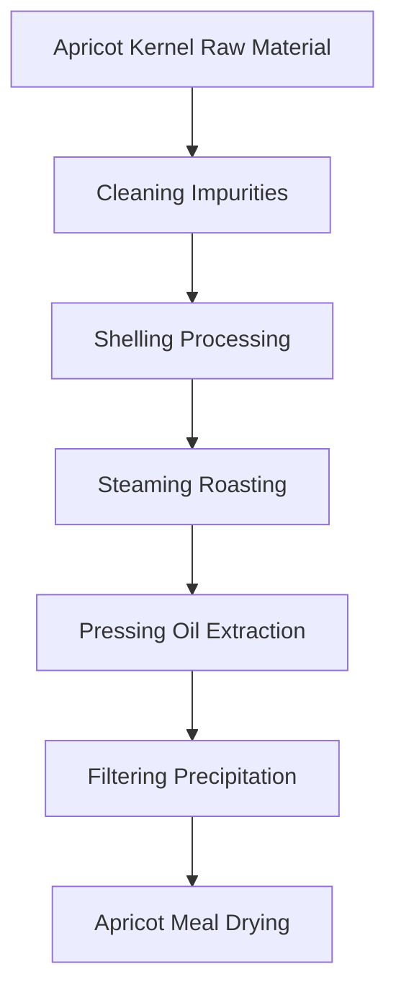
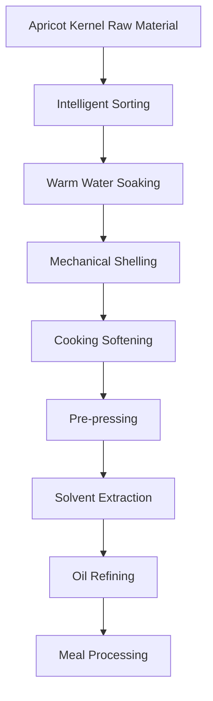

# Apricot Kernel (Apricot Oil) Solutions

## Overview

Apricot kernel is an important oilseed crop, and apricot oil has unique nutritional and application value. Shandong Shengshi Hecheng Machinery Co., Ltd. provides professional apricot kernel pressing solutions, offering complete equipment and services from small workshops to large factories.

## Apricot Kernel Characteristics

### 📊 Basic Parameters
- **Oil Content**: 40-50%
- **Protein Content**: 20-25%
- **Main Fatty Acids**: Oleic acid (60-70%), Linoleic acid (20-30%)
- **Suitable Temperature**: Pressing temperature controlled at 70-90℃

### 🌱 Growth Characteristics
- **Growth Cycle**: Apricot trees have long growth cycles, seeds mature in one year
- **Suitable Climate**: Temperate climate, abundant sunshine
- **Soil Requirements**: Well-drained, fertile soil
- **Annual Production**: Global apricot production about 4 million tons

## Processing Technology

### Traditional Process Flow

### Modern Process Flow

## Equipment Recommendations

### Small Scale Processing (1-5 tons/day)
- **300/325 Series Special Oil Press**
- Apricot kernel preprocessing equipment
- Simple refining system
- Investment Cost: 400,000-1,200,000 RMB

### Medium Scale Processing (5-20 tons/day)
- **355/400 Series Oil Press**
- Automated preprocessing line
- Continuous refining equipment
- Investment Cost: 2-6 million RMB

### Large Scale Processing (20+ tons/day)
- **425/480 Series Oil Press**
- Full automatic production line
- Intelligent management system
- Investment Cost: 10 million RMB+

## Technical Advantages

### 🎯 Precise Control
- Temperature control: ±2℃ accuracy
- Pressure control: Intelligent adjustment
- Roasting time: Optimal process parameters

### 💧 Oil Quality Guarantee
- Cold pressing process preserves nutrition
- Physical pressing ensures purity
- Oil yield up to 45-48%

### 🔄 Continuous Production
- Automated production process
- Continuous pressing technology
- Intelligent quality monitoring

## Product Applications

### 🍳 Edible Oil
- Apricot oil: High-quality edible oil
- Blended oil: Mixed with other oils
- Special oil: High-end nutritional oil

### 🥛 By-products
- Apricot meal: High-quality protein feed
- Apricot shells: Fuel or feed
- Apricot protein: Food additives

### 💊 Functional Products
- Apricot polyphenols
- Apricot vitamin E
- Apricot phospholipids

## Market Analysis

### 📈 Development Trends
- Healthy edible oil demand growth
- Beauty care oil market expansion
- Export trade opportunities increase

### 🎯 Target Markets
- Edible oil processing enterprises
- Cosmetic production enterprises
- Food processing enterprises
- Export trading enterprises

## Success Cases

### Shandong Apricot Oil Processing Plant
- **Equipment Configuration**: 400 Series Oil Press × 4 units
- **Daily Processing Capacity**: 40 tons apricot kernels
- **Oil Yield**: 47%
- **Annual Production**: 4,000 tons apricot oil
- **Market Coverage**: 10 provinces and cities nationwide

### Xinjiang Apricot Oil Enterprise
- **Equipment Configuration**: 355 Series Special Press × 3 units
- **Daily Processing Capacity**: 15 tons apricot kernels
- **Product Quality**: National first-class standards
- **Brand Building**: Regional well-known brand
- **Annual Sales**: 30 million RMB

### Gansu Premium Apricot Oil Brand
- **Equipment Configuration**: 325 Series Special Press × 6 units
- **Daily Processing Capacity**: 12 tons premium apricot kernels
- **Product Quality**: Organic food certification
- **Market Positioning**: Premium organic edible oil
- **Export Market**: Europe, USA

## Quality Standards

### 🏆 Product Quality Standards
- Meets national edible oil standards
- Meets food safety standards
- Meets export food standards
- Meets organic food certification

### 🔍 Testing Items
- Acid value testing
- Peroxide value testing
- Color transparency testing
- Heavy metal content testing
- Aflatoxin testing
- Pesticide residue testing

## Sustainable Development

### 🌱 Environmental Production
- Waste recycling utilization
- Energy saving and emission reduction processes
- Green production standards

### 🔄 Resource Utilization
- By-product comprehensive utilization
- Industrial chain extension
- Circular economy model

### 🌍 Social Responsibility
- Support farmer income increase
- Ensure food safety
- Protect ecological environment

## Contact Us

If you are interested in apricot kernel pressing solutions, please contact our technical team:

- 📞 **Hotline**: +86 19906365856
- 📧 **Email**: sales@oil-pressing-machine.com
- 📍 **Address**: No. 5888, Yineng Street, Development Zone, Qingzhou City, Shandong Province, China

We provide free technical consultation, sample testing, and on-site inspection services to provide you with the most suitable apricot kernel pressing solutions.