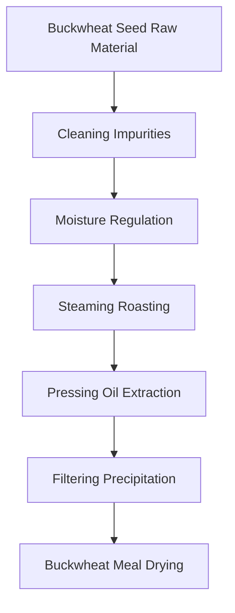
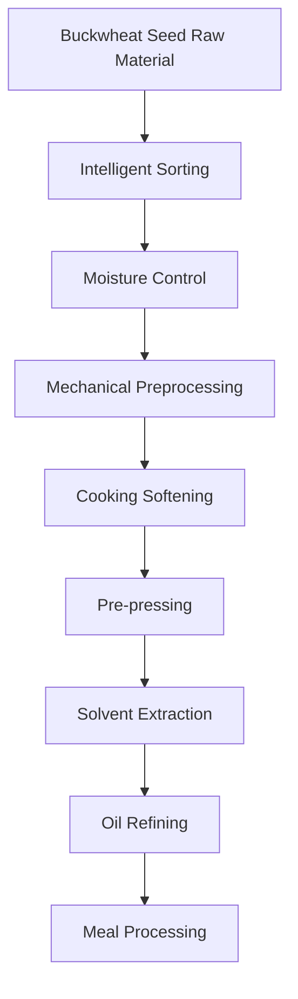

# Buckwheat (Buckwheat Oil) Solutions

## Overview

Buckwheat seed is an important oilseed crop, and buckwheat oil has unique nutritional and application value. Shandong Shengshi Hecheng Machinery Co., Ltd. provides professional buckwheat seed pressing solutions, offering complete equipment and services from small workshops to large factories.

## Buckwheat Seed Characteristics

### 📊 Basic Parameters
- **Oil Content**: 25-35%
- **Protein Content**: 10-15%
- **Main Fatty Acids**: Oleic acid (30-40%), Linoleic acid (40-50%)
- **Suitable Temperature**: Pressing temperature controlled at 70-90℃

### 🌱 Growth Characteristics
- **Growth Cycle**: 80-100 days
- **Suitable Climate**: Cool, humid climate
- **Soil Requirements**: Poor, well-drained soil
- **Annual Production**: Global buckwheat production about 3 million tons

## Processing Technology

### Traditional Process Flow

### Modern Process Flow

## Equipment Recommendations

### Small Scale Processing (5-10 tons/day)
- **300/325 Series Special Oil Press**
- Buckwheat seed preprocessing equipment
- Simple refining system
- Investment Cost: 500,000-1,500,000 RMB

### Medium Scale Processing (10-50 tons/day)
- **355/400 Series Oil Press**
- Automated preprocessing line
- Continuous refining equipment
- Investment Cost: 3-8 million RMB

### Large Scale Processing (50+ tons/day)
- **425/480 Series Oil Press**
- Full automatic production line
- Intelligent management system
- Investment Cost: 15 million RMB+

## Technical Advantages

### 🎯 Precise Control
- Temperature control: ±2℃ accuracy
- Pressure control: Intelligent adjustment
- Moisture control: Optimal process parameters

### 💧 Oil Quality Guarantee
- Low temperature pressing preserves nutrition
- Physical pressing ensures purity
- Oil yield up to 28-30%

### 🔄 Continuous Production
- Automated production process
- Continuous pressing technology
- Intelligent quality monitoring

## Product Applications

### 🍳 Edible Oil
- Buckwheat oil: High-quality edible oil
- Blended oil: Mixed with other oils
- Special oil: High-end nutritional oil

### 🥛 By-products
- Buckwheat meal: High-quality protein feed
- Buckwheat fiber: Feed additives
- Buckwheat protein: Food additives

### 💊 Functional Products
- Buckwheat polyphenols
- Buckwheat vitamin E
- Buckwheat phospholipids

## Market Analysis

### 📈 Development Trends
- Healthy edible oil demand growth
- Premium grain oil market expansion
- Export trade opportunities increase

### 🎯 Target Markets
- Edible oil processing enterprises
- Food processing enterprises
- Grain processing enterprises
- Export trading enterprises

## Success Cases

### Yunnan Buckwheat Oil Processing Plant
- **Equipment Configuration**: 400 Series Oil Press × 6 units
- **Daily Processing Capacity**: 60 tons buckwheat seeds
- **Oil Yield**: 29%
- **Annual Production**: 4,000 tons buckwheat oil
- **Market Coverage**: Southwest region

### Shanxi Buckwheat Oil Enterprise
- **Equipment Configuration**: 355 Series Special Press × 4 units
- **Daily Processing Capacity**: 25 tons buckwheat seeds
- **Product Quality**: National first-class standards
- **Brand Building**: Regional well-known brand
- **Annual Sales**: 30 million RMB

### Inner Mongolia Premium Buckwheat Oil Brand
- **Equipment Configuration**: 325 Series Special Press × 8 units
- **Daily Processing Capacity**: 15 tons premium buckwheat seeds
- **Product Quality**: Organic food certification
- **Market Positioning**: Premium organic edible oil
- **Export Market**: Asia, Europe

## Quality Standards

### 🏆 Product Quality Standards
- Meets national edible oil standards
- Meets food safety standards
- Meets export food standards
- Meets organic food certification

### 🔍 Testing Items
- Acid value testing
- Peroxide value testing
- Color transparency testing
- Heavy metal content testing
- Aflatoxin testing
- Pesticide residue testing

## Sustainable Development

### 🌱 Environmental Production
- Waste recycling utilization
- Energy saving and emission reduction processes
- Green production standards

### 🔄 Resource Utilization
- By-product comprehensive utilization
- Industrial chain extension
- Circular economy model

### 🌍 Social Responsibility
- Support farmer income increase
- Ensure food safety
- Protect ecological environment

## Contact Us

If you are interested in buckwheat seed pressing solutions, please contact our technical team:

- 📞 **Hotline**: +86 19906365856
- 📧 **Email**: sales@oil-pressing-machine.com
- 📍 **Address**: No. 5888, Yineng Street, Development Zone, Qingzhou City, Shandong Province, China

We provide free technical consultation, sample testing, and on-site inspection services to provide you with the most suitable buckwheat seed pressing solutions.