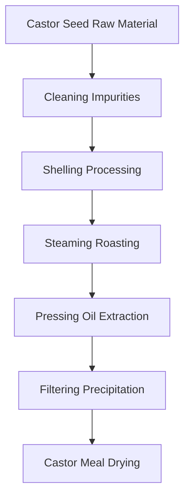
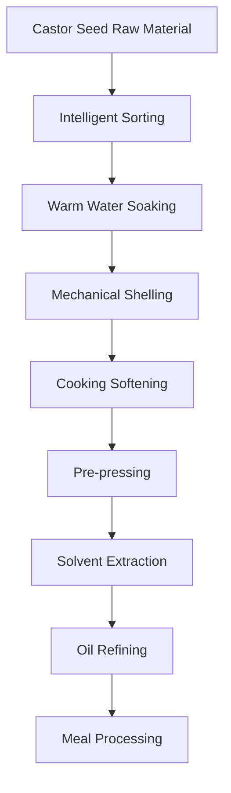

# Castor Seed (Castor Oil) Solutions

## Overview

Castor seed is an important oilseed crop, rich in special oil, and can extract castor oil. Castor oil has unique physicochemical properties, mainly used in industrial fields such as lubricants, coatings, and medicine. Shandong Shengshi Hecheng Machinery Co., Ltd. provides professional castor seed pressing solutions, offering complete equipment and services from small workshops to large factories.

## Castor Seed Characteristics

### 📊 Basic Parameters
- **Oil Content**: 45-55%
- **Protein Content**: 18-22%
- **Main Component**: Ricinoleic acid (80-90%)
- **Suitable Temperature**: Pressing temperature controlled at 80-100℃

### 🌱 Growth Characteristics
- **Growth Cycle**: 150-180 days
- **Suitable Climate**: Warm, humid climate
- **Soil Requirements**: Fertile, well-drained soil
- **Annual Production**: Global castor production about 2 million tons

## Processing Technology

### Traditional Process Flow

### Modern Process Flow

## Equipment Recommendations

### Small Scale Processing (2-10 tons/day)
- **300/325 Series Special Oil Press**
- Castor seed preprocessing equipment
- Simple refining system
- Investment Cost: 500,000-1,500,000 RMB

### Medium Scale Processing (10-50 tons/day)
- **355/400 Series Oil Press**
- Automated preprocessing line
- Continuous refining equipment
- Investment Cost: 3-8 million RMB

### Large Scale Processing (50+ tons/day)
- **425/480 Series Oil Press**
- Full automatic production line
- Intelligent management system
- Investment Cost: 15 million RMB+

## Technical Advantages

### 🎯 Precise Control
- Temperature control: ±2℃ accuracy
- Pressure control: Intelligent adjustment
- Roasting time: Optimal process parameters

### 💧 Oil Quality Guarantee
- Hot pressing process highlights characteristics
- Physical pressing ensures purity
- Oil yield up to 50-52%

### 🔄 Continuous Production
- Automated production process
- Continuous pressing technology
- Intelligent quality monitoring

## Product Applications

### 🏭 Industrial Applications
- Castor oil: High-quality industrial oil
- Lubricants: Mechanical lubrication
- Coatings: Paint production

### 🥛 By-products
- Castor meal: High-quality protein feed
- Castor shells: Fuel or feed
- Castor protein: Industrial additives

### 💊 Functional Products
- Ricinoleic acid
- Castor polyphenols
- Castor phospholipids

## Market Analysis

### 📈 Development Trends
- Industrial oil demand growth
- Green industrial raw material expansion
- Export trade opportunities increase

### 🎯 Target Markets
- Industrial oil processing enterprises
- Coating production enterprises
- Lubricant enterprises
- Export trading enterprises

## Success Cases

### India Castor Oil Processing Plant
- **Equipment Configuration**: 400 Series Oil Press × 6 units
- **Daily Processing Capacity**: 80 tons castor seeds
- **Oil Yield**: 51%
- **Annual Production**: 8,000 tons castor oil
- **Market Coverage**: Multiple countries worldwide

### China Castor Oil Enterprise
- **Equipment Configuration**: 355 Series Special Press × 4 units
- **Daily Processing Capacity**: 30 tons castor seeds
- **Product Quality**: Industrial standards
- **Brand Building**: International well-known brand
- **Annual Sales**: 60 million RMB

### Brazil Premium Castor Oil Brand
- **Equipment Configuration**: 325 Series Special Press × 8 units
- **Daily Processing Capacity**: 20 tons premium castor seeds
- **Product Quality**: International industrial standards
- **Market Positioning**: Premium industrial oil
- **Export Market**: Europe, Americas

## Quality Standards

### 🏆 Product Quality Standards
- Meets industrial oil standards
- Meets export industrial standards
- Meets safe transportation standards

### 🔍 Testing Items
- Acid value testing
- Viscosity testing
- Color transparency testing
- Heavy metal content testing
- Impurity content testing

## Sustainable Development

### 🌱 Environmental Production
- Waste recycling utilization
- Energy saving and emission reduction processes
- Green production standards

### 🔄 Resource Utilization
- By-product comprehensive utilization
- Industrial chain extension
- Circular economy model

### 🌍 Social Responsibility
- Support farmer income increase
- Ensure production safety
- Protect ecological environment

## Contact Us

If you are interested in castor seed pressing solutions, please contact our technical team:

- 📞 **Hotline**: 400-888-8888
- 📧 **Email**: sales@oil-pressing-machine.com
- 📍 **Address**: No. 5888, Yineng Street, Development Zone, Qingzhou City, Shandong Province, China

We provide free technical consultation, sample testing, and on-site inspection services to provide you with the most suitable castor seed pressing solutions.