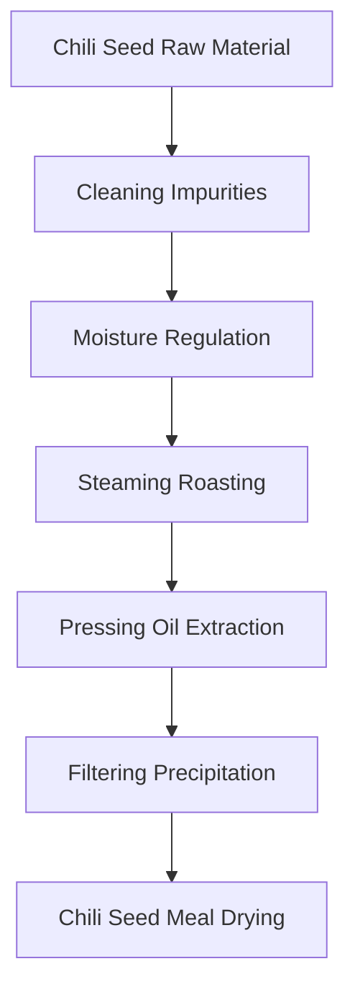
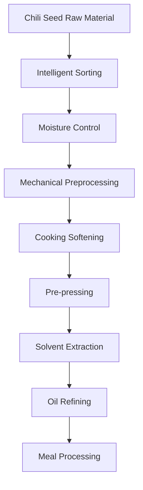

# Chili Seed (Chili Seed Oil) Solutions

## Overview

Chili seed is a by-product of chili processing, rich in high-quality oil, and can extract nutritious chili seed oil. Chili seed oil has unique flavor and nutritional value, widely used in edible oil and food processing. Shandong Shengshi Hecheng Machinery Co., Ltd. provides professional chili seed pressing solutions, offering complete equipment and services from small workshops to large factories.

## Chili Seed Characteristics

### 📊 Basic Parameters
- **Oil Content**: 15-25%
- **Protein Content**: 15-20%
- **Main Fatty Acids**: Oleic acid (20-30%), Linoleic acid (50-60%)
- **Suitable Temperature**: Pressing temperature controlled at 70-90℃

### 🌱 Source Characteristics
- **Source**: Chili processing by-product
- **Freshness Requirements**: Should be processed promptly to maintain oil quality
- **Storage Conditions**: Low temperature, dry environment
- **Annual Production**: Global chili production about 35 million tons, seed production about 5 million tons

## Processing Technology

### Traditional Process Flow

### Modern Process Flow

## Equipment Recommendations

### Small Scale Processing (5-10 tons/day)
- **300/325 Series Special Oil Press**
- Chili seed preprocessing equipment
- Simple refining system
- Investment Cost: 500,000-1,500,000 RMB

### Medium Scale Processing (10-50 tons/day)
- **355/400 Series Oil Press**
- Automated preprocessing line
- Continuous refining equipment
- Investment Cost: 3-8 million RMB

### Large Scale Processing (50+ tons/day)
- **425/480 Series Oil Press**
- Full automatic production line
- Intelligent management system
- Investment Cost: 15 million RMB+

## Technical Advantages

### 🎯 Precise Control
- Temperature control: ±2℃ accuracy
- Pressure control: Intelligent adjustment
- Moisture control: Optimal process parameters

### 💧 Oil Quality Guarantee
- Low temperature pressing preserves nutrition
- Physical pressing ensures purity
- Oil yield up to 18-20%

### 🔄 Continuous Production
- Automated production process
- Continuous pressing technology
- Intelligent quality monitoring

## Product Applications

### 🍳 Edible Oil
- Chili seed oil: High-quality edible oil
- Blended oil: Mixed with other oils
- Special oil: High-end nutritional oil

### 🥛 By-products
- Chili seed meal: High-quality protein feed
- Chili seed fiber: Feed additives
- Chili seed protein: Food additives

### 💊 Functional Products
- Chili seed polyphenols
- Chili seed vitamin E
- Chili seed phospholipids

## Market Analysis

### 📈 Development Trends
- By-product utilization demand growth
- Healthy edible oil market expansion
- Export trade opportunities increase

### 🎯 Target Markets
- Edible oil processing enterprises
- Chili processing enterprises
- Food processing enterprises
- Feed processing enterprises

## Success Cases

### Hunan Chili Seed Oil Processing Plant
- **Equipment Configuration**: 400 Series Oil Press × 6 units
- **Daily Processing Capacity**: 60 tons chili seeds
- **Oil Yield**: 19%
- **Annual Production**: 2,500 tons chili seed oil
- **Market Coverage**: Central China region

### Sichuan Chili Seed Oil Enterprise
- **Equipment Configuration**: 355 Series Special Press × 4 units
- **Daily Processing Capacity**: 25 tons chili seeds
- **Product Quality**: National first-class standards
- **Brand Building**: Regional well-known brand
- **Annual Sales**: 35 million RMB

### Yunnan Premium Chili Seed Oil Brand
- **Equipment Configuration**: 325 Series Special Press × 8 units
- **Daily Processing Capacity**: 15 tons premium chili seeds
- **Product Quality**: Organic food certification
- **Market Positioning**: Premium organic edible oil
- **Export Market**: Southeast Asia, Japan

## Quality Standards

### 🏆 Product Quality Standards
- Meets national edible oil standards
- Meets food safety standards
- Meets export food standards
- Meets organic food certification

### 🔍 Testing Items
- Acid value testing
- Peroxide value testing
- Color transparency testing
- Heavy metal content testing
- Aflatoxin testing
- Pesticide residue testing

## Sustainable Development

### 🌱 Environmental Production
- Waste recycling utilization
- Energy saving and emission reduction processes
- Green production standards

### 🔄 Resource Utilization
- By-product comprehensive utilization
- Industrial chain extension
- Circular economy model

### 🌍 Social Responsibility
- Support farmer income increase
- Ensure food safety
- Protect ecological environment

## Contact Us

If you are interested in chili seed pressing solutions, please contact our technical team:

- 📞 **Hotline**: 400-888-8888
- 📧 **Email**: sales@oil-pressing-machine.com
- 📍 **Address**: No. 5888, Yineng Street, Development Zone, Qingzhou City, Shandong Province, China

We provide free technical consultation, sample testing, and on-site inspection services to provide you with the most suitable chili seed pressing solutions.