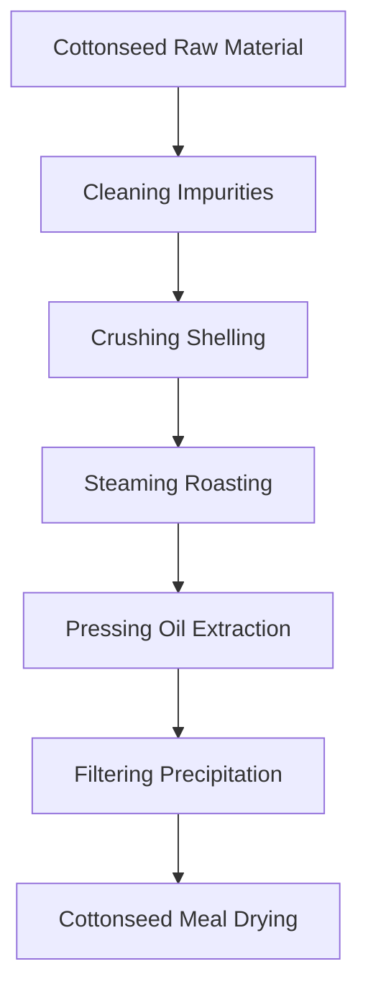
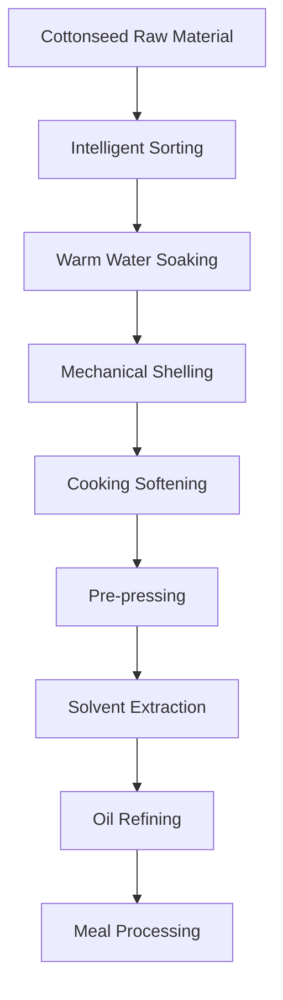

# Cottonseed (Cottonseed Oil) Solutions

## Overview

Cottonseed is an important oilseed crop, and cottonseed oil has extensive industrial and edible applications. Shandong Shengshi Hecheng Machinery Co., Ltd. provides professional cottonseed pressing solutions, offering complete equipment and services from small workshops to large factories.

## Cottonseed Characteristics

### 📊 Basic Parameters
- **Oil Content**: 35-45%
- **Protein Content**: 20-25%
- **Main Fatty Acids**: Linoleic acid (45-55%), Palmitic acid (20-25%), Oleic acid (15-20%)
- **Suitable Temperature**: Pressing temperature controlled at 60-80℃

### 🌱 Growth Characteristics
- **Growth Cycle**: 150-180 days
- **Suitable Climate**: Warm, dry areas
- **Soil Requirements**: Fertile, well-drained soil
- **Annual Production**: Global annual production exceeds 50 million tons

## Processing Technology

### Traditional Process Flow

### Modern Process Flow

## Equipment Recommendations

### Small Scale Processing (5-15 tons/day)
- **355/400 Series Oil Press**
- Cottonseed preprocessing line
- Simple refining equipment
- Investment Cost: 1.5-3.5 million RMB

### Medium Scale Processing (15-40 tons/day)
- **425/480 Series Oil Press**
- Complete preprocessing line
- Continuous refining equipment
- Investment Cost: 6-12 million RMB

### Large Scale Processing (40+ tons/day)
- **500 Series Large Oil Press**
- Full automatic production line
- Intelligent management system
- Investment Cost: 18 million RMB+

## Technical Advantages

### 🎯 Precise Control
- Temperature control: ±2℃ accuracy
- Pressure control: Intelligent adjustment
- Humidity control: Optimal moisture content

### 💧 Oil Quality Guarantee
- Professional detoxification process
- Physical pressing without chemical residues
- Industry-leading oil yield (38-42%)

### 🔄 Continuous Production
- 24-hour uninterrupted operation
- Automated feeding and discharging
- Intelligent fault alarm

## Product Applications

### 🍳 Edible Oil
- Cottonseed oil: Edible after detoxification
- Blended oil: Mixed with other oils
- Special oil: Industrial oil

### 🥛 By-products
- Cottonseed meal: High-quality protein feed
- Cottonseed protein: Food additives
- Cottonseed phospholipids: Functional ingredients

### 🏭 Industrial Applications
- Lubricating oil base oil
- Biodiesel raw material
- Chemical raw materials

## Market Analysis

### 📈 Development Trends
- Industrial oil demand growth
- Biodiesel market expansion
- By-product comprehensive utilization improvement

### 🎯 Target Markets
- Edible oil processing enterprises
- Feed processing enterprises
- Chemical raw material enterprises
- Biodiesel production enterprises

## Success Cases

### Shandong Large Cottonseed Oil Processing Plant
- **Equipment Configuration**: 480 Series Oil Press × 8 units
- **Daily Processing Capacity**: 100 tons cottonseed
- **Oil Yield**: 40%
- **Annual Production**: 12,000 tons cottonseed oil
- **Market Coverage**: 20 provinces and cities nationwide

### Henan Modern Cottonseed Oil Enterprise
- **Equipment Configuration**: 500 Series Oil Press × 6 units
- **Daily Processing Capacity**: 80 tons cottonseed
- **Product Quality**: Meets national first-class standards
- **By-product Utilization**: 80,000 tons cottonseed meal annual production
- **Economic Benefits**: 200 million RMB annual sales

### Xinjiang Cottonseed Oil Processing Enterprise
- **Equipment Configuration**: 400 Series Special Press × 5 units
- **Daily Processing Capacity**: 50 tons cottonseed
- **Product Quality**: Organic food certification
- **Brand Positioning**: Premium edible cottonseed oil
- **Market Positioning**: Northwest regional market

## Quality Standards

### 🏆 Product Quality Standards
- Meets national cottonseed oil standards (GB 1538)
- Meets food safety standards
- Meets export food standards
- Meets industrial oil standards

### 🔍 Testing Items
- Acid value testing
- Peroxide value testing
- Color transparency testing
- Heavy metal content testing
- Aflatoxin testing
- Gossypol content testing

## Sustainable Development

### 🌱 Environmental Production
- Waste recycling utilization
- Energy saving and emission reduction processes
- Green production standards

### 🔄 Resource Utilization
- By-product comprehensive utilization
- Industrial chain extension
- Circular economy model

### 🌍 Social Responsibility
- Support cotton farmer income increase
- Ensure food safety
- Protect ecological environment

## Contact Us

If you are interested in cottonseed pressing solutions, please contact our technical team:

- 📞 **Hotline**: +86 19906365856
- 📧 **Email**: sales@oil-pressing-machine.com
- 📍 **Address**: No. 5888, Yineng Street, Development Zone, Qingzhou City, Shandong Province, China

We provide free technical consultation, sample testing, and on-site inspection services to provide you with the most suitable cottonseed pressing solutions.