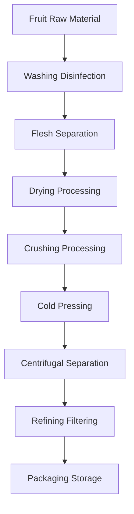

# Fruit Oil Solutions

## Overview

Fruit oils come from various fruit flesh, kernels, or seeds, featuring unique nutritional components and health value. Shandong Shengshi Hecheng Machinery Co., Ltd. provides professional fruit oil processing solutions to meet the market demand for high-end edible oils and functional foods.

## Main Fruit Crops

### 🥑 Avocado/Cow Oil Fruit (Avocado Oil)
**Oil Content**: 15-25%
**Features**: High unsaturated fatty acid content, beauty and skincare
**Suitable Equipment**: 300/325 Series Special Press
**Processing Technology**: Flesh separation → Cold pressing → Filtering → Refrigeration

### 🍇 Grape Seeds (Grape Seed Oil)
**Oil Content**: 12-18%
**Features**: High polyphenol content, strong antioxidant
**Suitable Equipment**: 300/325 Series Special Press
**Processing Technology**: Seed shell separation → Cold pressing → Filtering → Refining

### 🎃 Pumpkin Seeds (Pumpkin Seed Oil)
**Oil Content**: 35-45%
**Features**: Rich in carotene, balanced nutrition
**Suitable Equipment**: 300/325 Series Special Press
**Processing Technology**: Shelling → Cold pressing → Filtering

### 🍉 Watermelon Seeds (Watermelon Seed Oil)
**Oil Content**: 40-50%
**Features**: Naturally cool, suitable for summer consumption
**Suitable Equipment**: 300/325 Series Special Press
**Processing Technology**: Shelling → Cold pressing → Filtering

### 🧵 Cottonseed Kernels (Cottonseed Oil)
**Oil Content**: 35-45%
**Features**: Industrial oil, requires professional detoxification
**Suitable Equipment**: 425/480 Series Industrial Press
**Processing Technology**: Shelling → Steaming → Pressing → Detoxification → Refining

### 🍑 Peach Kernel/Almond Kernel (Kernel Oil)
**Oil Content**: 40-50%
**Features**: Medicinal value, beauty and skincare
**Suitable Equipment**: 300/325 Series Special Press
**Processing Technology**: Shelling → Cold pressing → Filtering → Refining

## Equipment Recommendations

### Small Scale Processing (0.5-2 tons/day)
- **300/325 Series Special Oil Press**
- Fruit preprocessing equipment
- Temperature control system
- Investment Cost: 400,000-1,000,000 RMB

### Medium Scale Processing (2-8 tons/day)
- **355/400 Series Oil Press**
- Automated preprocessing line
- Temperature humidity control system
- Investment Cost: 2,000,000-5,000,000 RMB

### Large Scale Processing (8+ tons/day)
- **425/480 Series Oil Press**
- Full automatic production line
- Intelligent management system
- Investment Cost: 8,000,000 RMB+

## Processing Flow

## Technical Features

### ❄️ Cold Pressing Technology
- Preserve nutritional components
- Maintain natural flavor
- Increase product value

### 🎯 Precise Extraction
- Full flesh separation
- Complete oil extraction
- Effective impurity removal

### 🔄 Continuous Production
- Automated production line
- Continuous pressing process
- Intelligent quality control

## Product Applications

### 🍳 High-end Edible Oil
- Special nutritional oil
- Organic healthy oil
- Functional edible oil

### 💄 Beauty and Skincare
- Natural skincare oil
- Massage essential oil
- Hair care product raw material

### 💊 Health Nutrition Products
- Nutritional supplements
- Functional foods
- Medicinal preparations

## Nutritional Value

### 🥑 Avocado Oil
- High vitamin E content
- Rich unsaturated fatty acids
- Good beauty and skincare effects

### 🍇 Grape Seed Oil
- Rich in OPC
- Strong antioxidant capacity
- Cardiovascular protection

### 🎃 Pumpkin Seed Oil
- High zinc content
- Prostate health
- Immune system support

## Market Prospects

### 📈 Development Trends
- Functional food rise
- Health beauty demand growth
- High-end oil market expansion

### 🎯 Target Markets
- High-end food brands
- Beauty and skincare enterprises
- Health product manufacturers
- Professional nutrition companies

## Service Guarantee

### 🛠️ Technical Support
- Process parameter optimization
- Equipment installation debugging
- Operation personnel training
- Quality control guidance

### 🔧 After-sales Service
- 7×24 hours technical support
- Parts fast supply
- Regular maintenance service
- Technical upgrade service

### 📊 Data Services
- Production data analysis
- Quality inspection report
- Market trend analysis
- Customer demand research

## Success Cases

### Shandong High-end Fruit Oil Processing Factory
- **Equipment Configuration**: 355 Series Special Press × 2 units
- **Daily Processing Capacity**: 6 tons mixed fruits
- **Product Categories**: Grape seed oil, avocado oil, pumpkin seed oil
- **Market Positioning**: High-end organic edible oil
- **Annual Sales**: 15,000,000 RMB

### Zhejiang Beauty and Skincare Enterprise
- **Equipment Configuration**: 300 Series Special Press × 4 units
- **Daily Processing Capacity**: 4 tons almond kernels
- **Product Application**: Skincare product raw material
- **Product Quality**: Meets cosmetic standards
- **Export Market**: Europe, North America

### Henan Functional Food Enterprise
- **Equipment Configuration**: 400 Series Oil Press × 1 unit
- **Daily Processing Capacity**: 3 tons grape seeds
- **Product Application**: Health product raw material
- **Quality Standard**: GMP certification
- **Annual Production**: 2,000 tons

## Quality Standards

### 🏆 Product Quality Standards
- Meets national edible oil standards
- Meets organic food certification
- Meets export food standards
- Meets beauty and skincare standards

### 🔍 Testing Items
- Acid value testing
- Peroxide value testing
- Color transparency testing
- Heavy metal content testing
- Pesticide residue testing
- Nutritional component analysis

## Sustainable Development

### 🌱 Environmental Protection Production
- Waste recycling utilization
- Energy saving and emission reduction process
- Green production standards

### 🔄 Resource Utilization
- Comprehensive fruit utilization
- By-product development
- Industrial chain extension

## Contact Us

If you are interested in fruit oil processing solutions, please contact our expert team:

- 📞 **Hotline**: 400-888-8888
- 📧 **Email**: sales@oil-pressing-machine.com
- 📍 **Address**: No. 5888, Yineng Street, Development Zone, Qingzhou City, Shandong Province, China

We provide free technical consultation, sample testing, and on-site inspection services, customizing the most suitable fruit oil processing solutions for you.