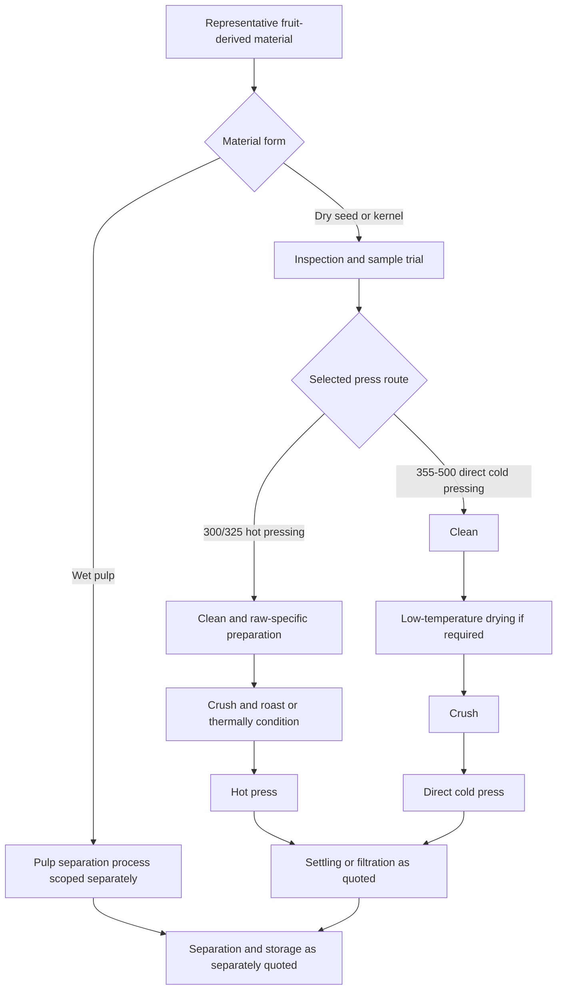

# Fruit Oil Solutions

## Procurement Scope

"Fruit oil" can mean oil recovered from wet pulp, dried fruit seed, or a hard stone kernel. These materials do not share one process. Moisture, residual pulp and sugar, shell removal, ripeness, fermentation, oxidation, natural toxicants, and the intended food, cosmetic, or industrial use must be reviewed before a press or production line is quoted.

This page does not state a fixed oil content, recovery, batch load, daily output, investment, operating schedule, or finished-oil grade. A valid factory quote must identify the exact material form, sample condition, pretreatment owner, equipment list, acceptance method, and downstream scope.

## Raw Material Differences

| Fruit-derived material | Differences to confirm | Process boundary |
| --- | --- | --- |
| Fresh oil-bearing pulp such as avocado | Variety, ripeness, pulp-to-stone separation, water content, storage time, enzymatic change, and required separation method | Wet pulping, malaxing, centrifuging, or other liquid separation is a separate process; wet pulp must not be assumed suitable for a seed or kernel hydraulic press |
| Grape seed and other winery or juice by-product seeds | Residual skin, pulp, sugar, fermentation history, washing, drying, storage age, and fine solids | Confirm cleaning, low-temperature drying if needed, crushing, direct cold pressing, and filtration from a representative dried-seed sample |
| Pumpkin and watermelon seed | Whole seed or kernel, hull ratio, edible grade, moisture, roasting history, and flavor target | Confirm whether dehulling is buyer-supplied or included; select hot or cold route from the target product and trial |
| Peach, apricot, almond, and other stone kernels | Stone removal, kernel identity, sweet or bitter variety, breakage, storage, and regulated natural compounds | Do not assume food or cosmetic suitability; shelling, testing, treatment, and destination compliance must be assigned in writing |

Pulp, seed, and kernel results are not interchangeable. Each species, material form, supplier, and pretreatment condition requires its own trial basis.

## Press Route and Pretreatment Boundary

The following machine rule applies to prepared dry seeds or kernels, not to untreated wet fruit pulp.

| Route | Press models | Required sequence | Use boundary |
| --- | --- | --- | --- |
| Hot pressing | 300/325 series | Clean and sort, remove shells or stones as required, crush, roast or thermally condition, then press | Proposed primarily for a heat-prepared or roasted product; the trial establishes the material condition and thermal program |
| Direct cold pressing | 355-500 series | Clean, use low-temperature drying only when required, crush, then press directly | No roasting, steaming, or cooking is assumed between crushing and pressing; suitability and model are confirmed on the prepared sample |

```mermaid
flowchart TD
    A[Representative fruit-derived material] --> B{Material form}
    B -->|Wet pulp| C[Pulp separation process scoped separately]
    B -->|Dry seed or kernel| D[Inspection and sample trial]
    D --> E{Selected press route}
    E -->|300/325 hot pressing| F[Clean and raw-specific preparation]
    F --> G[Crush and roast or thermally condition]
    G --> H[Hot press]
    E -->|355-500 direct cold pressing| I[Clean]
    I --> J[Low-temperature drying if required]
    J --> K[Crush]
    K --> L[Direct cold press]
    H --> M[Settling or filtration as quoted]
    L --> M
    C --> N[Separation and storage as separately quoted]
    M --> N
```

Washing, pulping, stone removal, shelling, low-temperature drying, roasting, pressing, centrifuging, filtration, refining, refrigeration, filling, utilities, and waste treatment are separate scope items. Only the signed equipment list and interface schedule determine who supplies each step.

## Representative Sample and Trial Conditions

Before dispatch, agree the sample quantity, required preservation or drying, packing, transport temperature if relevant, customs handling, trial charge, cleaning, consumables, and return or disposal in writing.

The sample record should identify:

- Species and variety, origin, supplier, harvest or processing lot, ripeness or production date, and storage history
- Whole fruit, pulp, wet seed, dried seed, in-shell stone, or clean kernel form
- Moisture, residual pulp or sugar, shell fraction, foreign matter, damage, fermentation or rancidity indicators, and laboratory oil content when available
- Existing washing, pulping, drying, shelling, roasting, stabilization, or chemical treatment
- Intended oil use, cake or residue use, hot or cold route, flavor, filtration, separation, refining, storage, and packaging target
- Required laboratory methods, allergen controls, safety data, and destination restrictions

The trial report should record actual preparation, net input, moisture, particle size, temperature history, pressure program, complete cycle, separated oil or liquid, cake or residue, losses, filtration basis, cleaning observations, and laboratory samples. Quoted throughput must use the verified full process and bottleneck, including pulp preparation or drying where included.

## Equipment List for a Manufacturer Quote

Depending on material form, a fruit-oil quotation may include:

- Receiving, inspection, washing, sorting, and foreign-material removal
- Pulping, destoning, seed recovery, or kernel-shell separation where specifically engineered
- Low-temperature dryer for a prepared-seed or kernel cold-press route when the sample requires it
- Crusher selected from the seed or kernel trial
- Roaster or thermal conditioner for a 300/325 hot-press route
- Selected 355-500 press for direct cold pressing of cleaned, conditionally dried, crushed seed or kernel
- Pulp separation, centrifuging, or decanting equipment only where separately specified for wet material
- Oil collection, settling, pumping, filtration, and protected or temperature-managed storage
- Cake, pulp, wastewater, stone, shell, and by-product handling interfaces
- Electrical cabinet, guards, controls, manuals, drawings, and agreed spare parts
- Optional refining, filling, refrigeration, laboratory, utility, or packing systems quoted separately

The quotation must distinguish a complete process line from a press-only supply.

## Quote Inputs and Price Basis

For a localized factory price and procurement comparison, provide:

- Exact species, material form, supplier condition, and all products expected on the line
- Target pulp-separation, hot-press, or direct cold-press route
- Target throughput, batch or shift plan, seasonal availability, cleaning and changeover pattern
- Destination country and city, layout, access, floor loading, lifting, drainage, and storage conditions
- Electrical supply, heating and cooling sources, water, compressed air, ventilation, wastewater treatment, and refrigeration available
- Contact materials, filtration or separation basis, oil storage, refining, filling, packaging, and by-product boundary
- Buyer product specification, laboratory methods, document language, destination compliance list, and acceptance plan
- Currency, trade term, delivery point, export packing, freight, insurance, tax, commissioning, training, and spare-parts request
- Budget range where alternative production-line scopes need to be compared

The manufacturer quote should itemize the base equipment, optional preparation and downstream systems, exclusions, utilities, commercial terms, delivery basis, documents, FAT/SAT, and after-sales. Investment analysis must use current buyer-side raw material, utilities, labor, logistics, tax, finance, waste, and product-price inputs.

## FAT and SAT

### Factory Acceptance Test (FAT)

The written FAT protocol must identify the material form and sample condition. For seed or kernel pressing, it should cover preparation, equipment identity, included safety functions, net input, complete cycle, temperature history, oil and cake collection, filtration, cleaning, laboratory sampling, and documents. A wet-pulp project requires a separate mass-balance and separation protocol. Trial charges, consumables, third-party testing, and repeat testing must be allocated before FAT.

### Site Acceptance Test (SAT)

SAT should verify site readiness, utilities, sanitation and drainage, installation interfaces, raw-material equivalence, operator participation, full-process runs, sampling, laboratory comparison, cleaning, training records, and issue closure. Travel, visas, local labor, lifting, accommodation, consumables, testing, and return visits are included only when written and priced.

## Compliance and After-sales Confirmation

The buyer must state the intended food, cosmetic, supplement, feed, or industrial use and the country of sale. The contract should assign responsibility for product and facility standards, machinery and electrical safety, food-contact materials, allergen and cross-contamination control, natural toxicants in stone kernels, wastewater, waste, labels, laboratory tests, and any import or export documents.

No national, export, organic, food, cosmetic, or other certification is included by default. Certificates and reports must be current and checked for the named company, factory, machine, process, product, and destination. The equipment configuration is not proof that the finished oil complies.

After-sales terms must state warranty start and coverage, exclusions, support channels and response window, remote and on-site scope, labor and travel charges, parts identification, price and lead-time confirmation, consumables, manuals, training, and maintenance responsibilities. Service availability and response commitments are limited to the signed terms.

## Contact Us

For fruit-oil production-line procurement, equipment selection, a factory price, or a written project quotation, contact the technical and commercial team:

- **Hotline**: +86 19906365856
- **Email**: gavin@oil-pressing-machine.com
- **Address**: No. 5888, Yineng Street, Development Zone, Qingzhou City, Shandong Province, China

## Related Links

- [Solutions Overview](/en/solutions/)
- [Avocado Solutions](/en/solutions/avocado)
- [Grape Seed Solutions](/en/solutions/grape-seed)
- [Pumpkin Seed Solutions](/en/solutions/pumpkin-seed)
- [400 Series Hydraulic Oil Press](/en/products/400)
- [Contact Technical Team](/en/contact/)
- [Chinese page](/zh/solutions/fruits)

## Get Price & Quote

Send the material form, sample record, proposed process route, target production plan, site utilities, destination requirements, equipment boundary, and commercial terms. The resulting manufacturer quotation can then separate pulp, seed or kernel preparation, pressing, filtration, downstream options, delivery, acceptance, and after-sales costs.

- [Get Price & Quote](/en/contact/)

<!-- quote-cta -->
