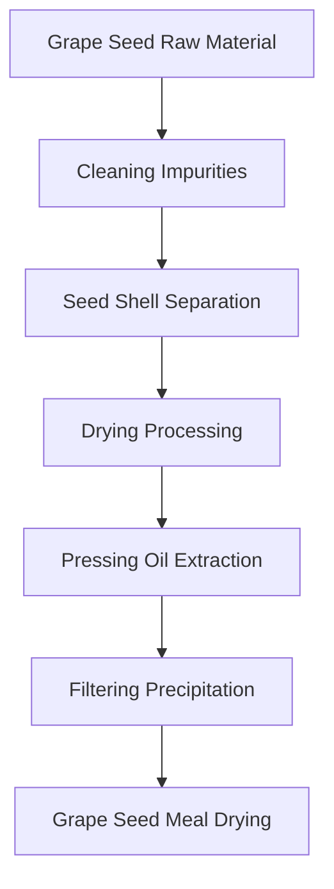
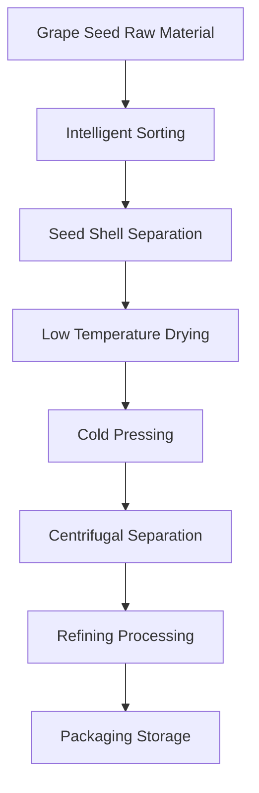

# Grape Seed (Grape Seed Oil) Solutions

## Overview

Grape seed is an important oilseed crop, and grape seed oil has unique nutritional and application value. Shandong Shengshi Hecheng Machinery Co., Ltd. provides professional grape seed pressing solutions, offering complete equipment and services from small workshops to large factories.

## Grape Seed Characteristics

### 📊 Basic Parameters
- **Oil Content**: 12-18%
- **Protein Content**: 10-15%
- **Main Fatty Acids**: Linoleic acid (65-75%), Oleic acid (15-20%), Linolenic acid (5-8%)
- **Suitable Temperature**: Pressing temperature controlled at 60-80℃

### 🌱 Growth Characteristics
- **Growth Cycle**: 2-3 years
- **Suitable Climate**: Temperate, warm areas
- **Soil Requirements**: Fertile, well-drained soil
- **Annual Production**: Global annual production exceeds 1 million tons

## Processing Technology

### Traditional Process Flow

### Modern Process Flow

## Equipment Recommendations

### Small Scale Processing (2-10 tons/day)
- **300/325 Series Special Oil Press**
- Grape seed preprocessing equipment
- Simple refining system
- Investment Cost: 500,000-1,500,000 RMB

### Medium Scale Processing (10-30 tons/day)
- **355/400 Series Oil Press**
- Automated preprocessing line
- Continuous refining equipment
- Investment Cost: 2-6 million RMB

### Large Scale Processing (30+ tons/day)
- **425/480 Series Oil Press**
- Full automatic production line
- Intelligent management system
- Investment Cost: 10 million RMB+

## Technical Advantages

### 🎯 Precise Control
- Temperature control: ±2℃ accuracy
- Pressure control: Intelligent adjustment
- Humidity control: Optimal moisture content

### 💧 Oil Quality Guarantee
- Low temperature process preserves nutrition
- Physical pressing without chemical residues
- Oil yield up to 13-16%

### 🔄 Continuous Production
- 24-hour uninterrupted operation
- Automated feeding and discharging
- Intelligent fault alarm

## Product Applications

### 🍳 Edible Oil
- Grape seed oil: Main edible oil variety
- Blended oil: Mixed with other oils
- Special oil: High-end nutritional oil

### 💄 Beauty and Skincare
- Grape seed oil: Natural skin care oil
- Blended oil: Mixed with other oils
- Special oil: High-end nutritional oil

### 💊 Health Products
- Grape seed oil: Nutritional supplement
- Blended oil: Mixed with other oils
- Special oil: High-end nutritional oil

## Market Analysis

### 📈 Development Trends
- Premium edible oil, antioxidant product demand growth
- Premium grape seed oil market expansion
- Export trade opportunities increase

### 🎯 Target Markets
- Edible oil processing enterprises
- Food processing enterprises
- Beauty and skincare enterprises
- Export trading enterprises

## Success Cases

### Shandong Large Grape Seed Oil Processing Plant
- **Equipment Configuration**: 400 Series Oil Press × 6 units
- **Daily Processing Capacity**: 50 tons grape seeds
- **Oil Yield**: 13%
- **Annual Production**: 6,000 tons grape seed oil
- **Market Coverage**: 20 provinces and cities nationwide

### Henan Professional Grape Seed Oil Enterprise
- **Equipment Configuration**: 355 Series Special Press × 4 units
- **Daily Processing Capacity**: 25 tons grape seeds
- **Product Quality**: National first-class standards
- **Brand Building**: Regional well-known brand
- **Annual Sales**: 20 million RMB

### Zhejiang Premium Grape Seed Oil Brand
- **Equipment Configuration**: 325 Series Special Press × 5 units
- **Daily Processing Capacity**: 15 tons premium grape seeds
- **Product Quality**: Organic food certification
- **Market Positioning**: Premium organic edible oil
- **Export Market**: Europe, USA

## Quality Standards

### 🏆 Product Quality Standards
- Meets national grape seed oil standards
- Meets food safety standards
- Meets export food standards
- Meets organic food certification

### 🔍 Testing Items
- Acid value testing
- Peroxide value testing
- Color transparency testing
- Heavy metal content testing
- Pesticide residue testing

## Sustainable Development

### 🌱 Environmental Production
- Waste recycling utilization
- Energy saving and emission reduction processes
- Green production standards

### 🔄 Resource Utilization
- By-product comprehensive utilization
- Industrial chain extension
- Circular economy model

### 🌍 Social Responsibility
- Support farmer income increase
- Ensure food safety
- Protect ecological environment

## Contact Us

If you are interested in grape seed pressing solutions, please contact our technical team:

- 📞 **Hotline**: +86 19906365856
- 📧 **Email**: sales@oil-pressing-machine.com
- 📍 **Address**: No. 5888, Yineng Street, Development Zone, Qingzhou City, Shandong Province, China

We provide free technical consultation, sample testing, and on-site inspection services to provide you with the most suitable grape seed pressing solutions.