# Large Modern Factory Solutions

## Overview

Large modern factory solutions are specially designed for large enterprises, well-known brands, and export processing enterprises, providing fully automated and intelligent oil processing production lines to help you build an industry-leading modern oil processing base. Shandong Shengshi Hecheng Machinery Co., Ltd. provides complete industrial chain solutions from factory planning to global marketing.

## Applicable Scenarios

### 🏭 Large Enterprises
- **Target Users**: State-owned enterprises, listed companies
- **Daily Processing Capacity**: 50-200 tons
- **Investment Budget**: 20,000,000-80,000,000 RMB

### 🏢 Well-known Brands
- **Target Users**: National well-known oil brands
- **Daily Processing Capacity**: 30-150 tons
- **Investment Budget**: 15,000,000-60,000,000 RMB

### 🌐 Export Processing
- **Target Users**: Export trading enterprises, multinational companies
- **Daily Processing Capacity**: 40-180 tons
- **Investment Budget**: 18,000,000-70,000,000 RMB

## Main Equipment Configuration

### Standard Configuration (20,000,000-40,000,000 RMB)
- **425/480 Series Oil Press** × 5-10 units
- Full automatic preprocessing production line
- Continuous refining equipment system
- Intelligent warehousing and logistics system

### Enhanced Configuration (40,000,000-70,000,000 RMB)
- **480/500 Series Intelligent Oil Press** × 8-15 units
- Full automated production line cluster
- Intelligent management system platform
- Brand packaging automated production line

### Flagship Configuration (70,000,000-100,000,000 RMB)
- **500 Series Super Oil Press** × 10-20 units
- Full intelligent factory system
- Industrial internet platform
- Global supply chain management system

## Processing Flow

```mermaid
graph TD
    A[Raw Material Reception] --> B[Intelligent Sorting]
    B --> C[Automated Crushing Shelling]
    C --> D[Continuous Steaming Softening]
    D --> E[High-pressure Continuous Pressing]
    E --> F[High-speed Centrifugal Separation]
    F --> G[Multi-level Refining Processing]
    G --> H[Intelligent Filling Packaging]
    H --> I[Automated立体 Storage]
    I --> J[Intelligent Logistics Distribution]
```

## Technical Features

### 🤖 Full Intelligence
- Industrial internet platform
- AI quality control system
- Intelligent operation and maintenance management system
- Big data analysis platform

### ⚡ Ultra-high Efficiency
- Large-scale continuous production
- Automated logistics system
- Energy optimization management system
- Maximum production efficiency

### 🎯 Excellent Quality
- Multi-level refining process
- Online quality inspection
- Product traceability system
- International quality standards

## Applicable Oil Crops

### 🌾 Main Grain and Oil Crops
- **Soybean**: Large-scale pressing, export-grade products
- **Peanut**: High-end peanut oil, brand operation
- **Sesame**: Professional sesame oil production line
- **Rapeseed**: Rapeseed oil refining process

### 🥜 Nut Crops
- **Walnut**: Walnut oil deep processing production line
- **Almond**: Almond oil beauty and skincare series
- **Hazelnut**: Hazelnut oil high-end brand

### 🥑 Fruit Crops
- **Grape Seed**: Grape seed oil health product raw material
- **Pumpkin Seed**: Pumpkin seed oil nutritional food

## Product Series

### 🍳 Edible Oil Series
- Ordinary edible oil
- High-end nutritional oil
- Organic food oil
- Special seasoning oil

### 💄 Functional Oil Products
- Beauty and skincare oil
- Health nutritional oil
- Infant edible oil
- Special medical food oil

### 🏭 Industrial Oil
- Biodiesel raw material
- Lubricant base oil
- Chemical raw material oil

## Investment Return Analysis

### 💰 Cost Structure
- **Equipment Investment**: 20,000,000-80,000,000 RMB
- **Factory Construction**: 10,000,000-30,000,000 RMB
- **Working Capital**: 10,000,000-20,000,000 RMB
- **Total Investment**: 40,000,000-130,000,000 RMB

### 📈 Revenue Expectations
- **Annual Sales**: 200,000,000-1,000,000,000 RMB
- **Gross Profit Margin**: 20-30%
- **Annual Net Profit**: 20,000,000-50,000,000 RMB
- **Investment Recovery Period**: 3-5 years

## Service Guarantee

### 🛠️ Technical Support
- Overall factory planning and design
- Production line system integration
- Intelligent platform construction
- Technical team training

### 🔧 After-sales Service
- Three-year equipment quality guarantee
- 24-hour technical support center
- Regular maintenance service
- Technical upgrade service

### 📊 Business Support
- Market strategic planning
- Brand building consulting
- Supply chain management
- International operation guidance

## Success Cases

### Shandong Large Grain and Oil Group
- **Equipment Configuration**: 480 Series Oil Press × 12 units
- **Daily Processing Capacity**: 150 tons soybean
- **Investment Cost**: 65,000,000 RMB
- **Annual Sales**: 800,000,000 RMB
- **Market Position**: Industry leading enterprise

### Henan Well-known Oil Brand
- **Equipment Configuration**: 500 Series Oil Press × 8 units
- **Daily Processing Capacity**: 120 tons mixed oil crops
- **Investment Cost**: 58,000,000 RMB
- **Annual Sales**: 600,000,000 RMB
- **Brand Value**: 1,500,000,000 RMB

### Zhejiang Export Processing Enterprise
- **Equipment Configuration**: 425 Series Oil Press × 15 units
- **Daily Processing Capacity**: 180 tons oil crops
- **Investment Cost**: 72,000,000 RMB
- **Annual Export Value**: 400,000,000 RMB
- **Export Markets**: 50 countries and regions

## Quality Management System

### 🏆 Quality Standards
- Meets international edible oil standards
- Passed HACCP system certification
- Meets organic food certification
- Passed ISO9001 quality certification
- Passed FSSC22000 certification

### 🔍 Testing Capabilities
- Full physical and chemical indicators testing
- Nutritional component analysis
- Safety testing
- Stability testing
- Sensory quality evaluation

## Sustainable Development

### 🌱 Environmental Production
- Zero emission production system
- Waste resource utilization
- Clean energy application
- Green factory certification

### 🔄 Circular Economy
- Comprehensive by-product utilization
- Industrial chain integration
- Resource recycling utilization
- Ecological industrial park construction

## Industrial Ecosystem

### 🏭 Industrial Cluster
- Upstream raw material base construction
- Downstream product deep processing
- Logistics and warehousing system
- R&D innovation center

### 🌐 Global Layout
- International market expansion
- Overseas factory construction
- Global supply chain management
- Transnational brand operation

## Contact Us

If you are interested in large modern factory solutions, please contact our technical team:

- 📞 **Hotline**: +86 19906365856
- 📧 **Email**: sales@oil-pressing-machine.com
- 📍 **Address**: No. 5888, Yineng Street, Development Zone, Qingzhou City, Shandong Province, China

We provide free factory planning consultation, project feasibility analysis, and on-site investigation services to create a world-class modern oil processing factory for you.