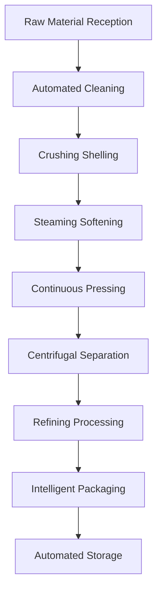

# Medium-sized Oil Factory Solutions

## Overview

Medium-sized oil factory solutions are specially designed for professional oil mills, regional brands, and chain enterprises, providing efficient and stable oil processing production lines to help you establish regional oil processing brands. Shandong Shengshi Hecheng Machinery Co., Ltd. provides comprehensive solutions from production line design to brand operations.

## Applicable Scenarios

### 🏭 Professional Oil Mill
- **Target Users**: Independent oil processing enterprises
- **Daily Processing Capacity**: 5-15 tons
- **Investment Budget**: 1,000,000-3,000,000 RMB

### 🏢 Regional Brand
- **Target Users**: Regional oil brand enterprises
- **Daily Processing Capacity**: 8-20 tons
- **Investment Budget**: 2,000,000-5,000,000 RMB

### 🏪 Chain Enterprise
- **Target Users**: Oil chain stores, franchisees
- **Daily Processing Capacity**: 5-12 tons
- **Investment Budget**: 1,500,000-4,000,000 RMB

## Main Equipment Configuration

### Standard Configuration (1,000,000-2,000,000 RMB)
- **355 Series Oil Press** × 1-2 units
- Automated preprocessing production line
- Multi-level filtering and refining system
- Intelligent control system

### Enhanced Configuration (2,000,000-4,000,000 RMB)
- **355/400 Series Oil Press** × 2-3 units
- Full automatic preprocessing production line
- Continuous refining equipment system
- Automated warehousing and logistics system

### Flagship Configuration (4,000,000-6,000,000 RMB)
- **400 Series Intelligent Oil Press** × 2-4 units
- Full automated production line
- Intelligent management system
- Brand packaging production line

## Processing Flow

## Technical Features

### ⚡ High-efficiency Production
- Automated production line, high production efficiency
- 24-hour continuous production capacity
- Intelligent quality control system

### 🎯 Quality Assurance
- Multi-level refining process, high oil yield
- Precise temperature and pressure control
- Stable and reliable product quality

### 🔧 Intelligent Management
- Real-time production data monitoring
- Equipment operation status analysis
- Energy consumption optimization management system

## Applicable Oil Crops

### 🌾 Main Grain and Oil Crops
- **Soybean**: Large-scale processing, suitable for industrialization
- **Peanut**: High-quality peanut oil, brand operation
- **Sesame**: Professional sesame oil production line
- **Rapeseed**: Rapeseed oil refining process

### 🥜 Nut Crops
- **Walnut**: Walnut oil deep processing production line
- **Almond**: Almond oil beauty and skincare series
- **Hazelnut**: Hazelnut oil high-end brand

### 🥑 Fruit Crops
- **Grape Seed**: Grape seed oil health product raw material
- **Pumpkin Seed**: Pumpkin seed oil nutritional food

## Product Series

### 🍳 Edible Oil Series
- Ordinary edible oil
- High-end nutritional oil
- Organic food oil
- Special seasoning oil

### 💄 Functional Oil Products
- Beauty and skincare oil
- Health nutritional oil
- Infant edible oil
- Special medical food oil

### 🏭 Industrial Oil
- Biodiesel raw material
- Lubricant base oil
- Chemical raw material oil

## Investment Return Analysis

### 💰 Cost Structure
- **Equipment Investment**: 1,000,000-5,000,000 RMB
- **Factory Construction**: 500,000-2,000,000 RMB
- **Working Capital**: 500,000-1,500,000 RMB
- **Total Investment**: 2,000,000-8,500,000 RMB

### 📈 Revenue Expectations
- **Annual Sales**: 5,000,000-20,000,000 RMB
- **Gross Profit Margin**: 25-35%
- **Annual Net Profit**: 1,500,000-5,000,000 RMB
- **Investment Recovery Period**: 2-3 years

## Service Guarantee

### 🛠️ Technical Support
- Overall production line design
- Equipment installation and debugging services
- Systematic operator training
- Production process optimization guidance

### 🔧 After-sales Service
- Two-year equipment quality guarantee
- 24-hour technical support hotline
- Regular maintenance service
- Technical upgrade service

### 📊 Business Support
- Market research analysis reports
- Brand building consulting services
- Sales channel expansion guidance
- Financial management suggestions

## Success Cases

### Shandong Professional Peanut Oil Mill
- **Equipment Configuration**: 355 Series Oil Press × 3 units
- **Daily Processing Capacity**: 12 tons peanuts
- **Investment Cost**: 2,800,000 RMB
- **Annual Sales**: 12,000,000 RMB
- **Market Coverage**: 50 counties and cities in the province

### Henan Regional Oil Brand
- **Equipment Configuration**: 400 Series Oil Press × 2 units
- **Daily Processing Capacity**: 15 tons mixed oil crops
- **Investment Cost**: 3,800,000 RMB
- **Annual Sales**: 15,000,000 RMB
- **Brand Value**: 30,000,000 RMB

### Zhejiang Oil Chain Enterprise
- **Equipment Configuration**: 355 Series Oil Press × 4 units
- **Daily Processing Capacity**: 18 tons oil crops
- **Investment Cost**: 4,500,000 RMB
- **Number of Stores**: 25 chain stores
- **Annual Sales**: 18,000,000 RMB

## Quality Management System

### 🏆 Quality Standards
- Meets national edible oil standards
- Passed HACCP system certification
- Meets organic food certification
- Passed ISO9001 quality certification

### 🔍 Testing Capabilities
- Full physical and chemical indicators testing
- Nutritional component analysis
- Safety testing
- Stability testing
- Sensory quality evaluation

## Sustainable Development

### 🌱 Environmental Production
- Wastewater recycling system
- Comprehensive waste utilization
- Energy saving and emission reduction technology
- Green production standards

### 🔄 Resource Utilization
- By-product deep processing
- Industrial chain extension
- Circular economy model
- Comprehensive resource utilization

## Development Planning

### 📈 Scale Expansion
- Expand production capacity
- Increase product variety
- Expand market scope
- Enhance brand influence

### 🎯 Industrial Upgrading
- Intelligent transformation
- Digital management
- Branded operation
- International development

## Contact Us

If you are interested in medium-sized oil factory solutions, please contact our technical team:

- 📞 **Hotline**: +86 19906365856
- 📧 **Email**: sales@oil-pressing-machine.com
- 📍 **Address**: No. 5888, Yineng Street, Development Zone, Qingzhou City, Shandong Province, China

We provide free project feasibility analysis, equipment configuration scheme design, and on-site investigation services to create the most competitive medium-sized oil factory solution for you.