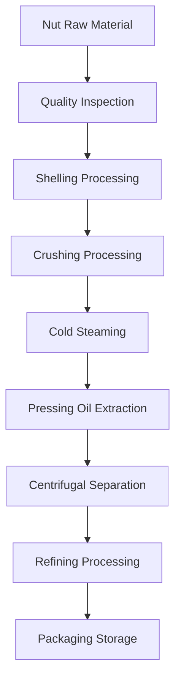

# Nut Oil Solutions

## Overview

Nut oils have high oil content, rich nutritional value, and high added value. Shandong Shengshi Hecheng Machinery Co., Ltd. provides professional nut oil processing solutions to meet the needs of high-end edible oils and beauty and skincare product raw materials.

## Main Nut Crops

### 🥥 Coconut/Coconut Meat (Coconut Oil)
**Oil Content**: 60-70%
**Features**: High saturated fatty acid content, good stability
**Suitable Equipment**: 300/325 Series Special Press
**Processing Technology**: Coconut meat separation → Drying → Cold pressing → Filtering

### 🌴 Palm Fruit/Palm Kernel (Palm Oil/Palm Kernel Oil)
**Oil Content**: 45-55%
**Features**: Industrial oil, moderate melting point
**Suitable Equipment**: 425/480 Series Industrial Press
**Processing Technology**: Pulp separation → Cooking → Pressing → Refining

### 🥜 Walnut (Walnut Oil)
**Oil Content**: 60-70%
**Features**: Rich in unsaturated fatty acids, high nutritional value
**Suitable Equipment**: 300/325 Series Special Press
**Processing Technology**: Shelling → Cold pressing → Filtering → Refrigeration

### 🌰 Almond/Bitter Almond (Almond Oil)
**Oil Content**: 45-55%
**Features**: Beauty and skincare, medicinal value
**Suitable Equipment**: 300/325 Series Special Press
**Processing Technology**: Shelling → Cold pressing → Filtering → Refining

### 🌰 Hazelnut (Hazelnut Oil)
**Oil Content**: 55-65%
**Features**: High vitamin E content, antioxidant
**Suitable Equipment**: 300/325 Series Special Press
**Processing Technology**: Shelling → Cold pressing → Filtering

### 🥜 Cashew (Cashew Oil)
**Oil Content**: 40-50%
**Features**: Special aroma, high-end edible
**Suitable Equipment**: 300/325 Series Special Press
**Processing Technology**: Shelling → Cold pressing → Filtering

### 🥜 Pistachio (Pistachio Oil)
**Oil Content**: 45-55%
**Features**: Green and healthy, balanced nutrition
**Suitable Equipment**: 300/325 Series Special Press
**Processing Technology**: Shelling → Cold pressing → Filtering

## Equipment Recommendations

### Small Scale Processing (0.5-2 tons/day)
- **300/325 Series Special Oil Press**
- Nut preprocessing equipment
- Temperature control system
- Investment Cost: 300,000-800,000 RMB

### Medium Scale Processing (2-10 tons/day)
- **355/400 Series Oil Press**
- Automated preprocessing line
- Temperature control system
- Investment Cost: 1,500,000-4,000,000 RMB

### Large Scale Processing (10+ tons/day)
- **425/480 Series Oil Press**
- Full automatic production line
- Intelligent control system
- Investment Cost: 6,000,000 RMB+

## Processing Flow

## Technical Features

### ❄️ Cold Pressing Technology
- Preserve nutritional components
- Retain natural aroma
- Improve oil stability

### 🎯 Precise Control
- Temperature control: ±1℃ accuracy
- Pressure control: Intelligent adjustment
- Time control: Optimal process parameters

### 🔄 Continuous Production
- Automated production line
- Continuous pressing process
- Intelligent monitoring system

## Product Applications

### 🍳 Edible Oil
- High-end edible oil
- Special nutritional oil
- Organic food oil

### 💄 Beauty and Skincare
- Natural skincare oil
- Massage essential oil
- Hair care product raw material

### 💊 Health Products
- Nutritional supplements
- Functional foods
- Medicinal preparations

## Market Analysis

### 📈 Market Prospects
- Health food demand growth
- Beauty and skincare market expansion
- High-end oil market development

### 🎯 Target Customers
- High-end food brands
- Beauty and skincare enterprises
- Health product manufacturers
- Professional nutrition companies

## Service Guarantee

### 🛠️ Technical Support
- Process parameter optimization
- Equipment debugging operation
- Operation personnel training
- Quality control guidance

### 🔧 After-sales Service
- 7×24 hours technical support
- Parts fast supply
- Regular maintenance service
- Technical upgrade service

### 📊 Data Services
- Production data analysis
- Quality inspection report
- Market trend analysis
- Customer demand research

## Success Cases

### Shandong High-end Nut Oil Factory
- **Equipment Configuration**: 355 Series Special Press × 2 units
- **Daily Processing Capacity**: 8 tons mixed nuts
- **Product Categories**: Walnut oil, almond oil, hazelnut oil
- **Market Positioning**: High-end organic edible oil
- **Annual Sales**: 20,000,000 RMB

### Zhejiang Beauty and Skincare Enterprise
- **Equipment Configuration**: 300 Series Special Press × 3 units
- **Daily Processing Capacity**: 3 tons almond kernels
- **Product Application**: Skincare product raw material
- **Product Quality**: Meets cosmetic standards
- **Export Market**: Europe, Japan

### Henan Nut Processing Enterprise
- **Equipment Configuration**: 400 Series Oil Press × 1 unit
- **Daily Processing Capacity**: 5 tons walnuts
- **Product Series**: Walnut oil, walnut kernels
- **Brand Building**: Regional well-known brand
- **Market Coverage**: Nationwide 20+ provinces

## Quality Standards

### 🏆 Product Quality Standards
- Meets national edible oil standards
- Meets organic food certification
- Meets export food standards
- Meets beauty and skincare standards

### 🔍 Testing Items
- Acid value testing
- Peroxide value testing
- Color transparency testing
- Heavy metal content testing
- Pesticide residue testing

## Contact Us

If you are interested in nut oil processing solutions, please contact our expert team:

- 📞 **Hotline**: 400-888-8888
- 📧 **Email**: sales@oil-pressing-machine.com
- 📍 **Address**: No. 5888, Yineng Street, Development Zone, Qingzhou City, Shandong Province, China

We provide free technical consultation and on-site inspection services, customizing the most suitable nut oil processing solutions for you.