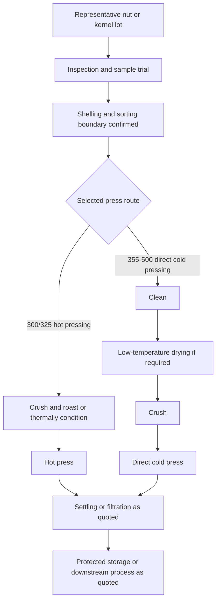

# Nut Oil Solutions

## Procurement Scope

Nut-oil projects depend on whether the purchase material is a whole nut, an in-shell lot, a food-grade kernel, dried copra, or another prepared fraction. Kernel damage, rancidity, moisture, shell fragments, allergens, storage history, and the intended oil and cake markets change the process and the production-line price.

This page does not assign a fixed oil content, recovery, batch load, daily capacity, investment, operating schedule, or finished-oil grade. A factory quotation should use a representative sample and state every included preparation, press, filter, document, and service item.

## Raw Material Differences

| Nut or kernel group | Differences to confirm | Pretreatment boundary |
| --- | --- | --- |
| Walnut, hazelnut, and pistachio kernels | Whole or broken kernels, shell fragments, oxidation or rancidity indicators, moisture, grade, and allergen segregation | Confirm whether shelling and optical or manual sorting are buyer-supplied or included; select crushing and pressing by trial |
| Almond and stone-fruit kernels | Sweet or bitter variety, shell removal, intended food, cosmetic, or industrial use, and regulated natural compounds | Do not assume edibility or cosmetic suitability; laboratory and destination requirements must be agreed before equipment selection |
| Cashew | Kernel grade, roasting history, shell contamination, and separation from cashew-shell liquid | Raw shell handling is a separate safety process; the press quote applies only to the material form identified in the trial unless shelling is expressly included |
| Coconut or copra | Fresh meat, dried copra, particle size, moisture, storage and mold condition | Fresh coconut-milk processing is separate; a press line is selected only for the prepared solid material stated in the quotation |
| Palm fruit or palm kernel | Fresh fruit and kernel are different feedstocks with different extraction routes | A fresh palm-fruit line is outside a nut hydraulic-press scope unless separately engineered; prepared palm kernel requires its own sample trial |

Each nut species and grade must be tested separately. Mixed-nut capacity, cleaning, allergen changeover, and oil quality cannot be inferred from a different kernel.

## Press Route and Pretreatment Boundary

| Route | Press models | Required sequence | Use boundary |
| --- | --- | --- | --- |
| Hot pressing | 300/325 series | Clean and sort, shell or separate kernels as required, crush, roast or thermally condition, then press | Proposed primarily where roasted flavor or heat preparation is part of the product specification; conditions are established by trial |
| Direct cold pressing | 355-500 series | Clean, use low-temperature drying only when required, crush, then press directly | No roasting, steaming, or cooking is assumed after crushing; the selected model and filtration are based on the prepared-kernel test |

```mermaid
flowchart TD
    A[Representative nut or kernel lot] --> B[Inspection and sample trial]
    B --> C[Shelling and sorting boundary confirmed]
    C --> D{Selected press route}
    D -->|300/325 hot pressing| E[Crush and roast or thermally condition]
    E --> F[Hot press]
    D -->|355-500 direct cold pressing| G[Clean]
    G --> H[Low-temperature drying if required]
    H --> I[Crush]
    I --> J[Direct cold press]
    F --> K[Settling or filtration as quoted]
    J --> K
    K --> L[Protected storage or downstream process as quoted]
```

Shelling, sorting, low-temperature drying, roasting, refining, filling, cold storage, allergen segregation, utilities, laboratory testing, and waste handling are included only when named in the signed equipment and responsibility lists.

## Representative Sample and Trial Conditions

Agree the sample quantity, packing, courier or freight method, customs handling, trial charge, cleaning charge where applicable, consumables, and sample return or disposal before dispatch.

The sample record should identify:

- Common and botanical name, variety, origin, supplier, lot, production date, and storage conditions
- Whole nut, in-shell nut, kernel, copra, or other prepared form
- Moisture, shell fraction, broken or damaged material, foreign matter, mold, rancidity indicators, and laboratory oil content when available
- Previous drying, roasting, blanching, shelling, or chemical treatment
- Required hot-press or direct cold-press route, flavor, color, filtration, storage, and oil application
- Intended use and specification for press cake, meal, or other co-products
- Allergen controls, cleaning expectations, and any safety or destination-market restrictions

The trial record should include preparation, net input, particle size, moisture, temperature history, pressure program, complete cycle, collected oil, cake, losses, settling or filtration basis, cleaning and changeover observations, and agreed laboratory methods. Production capacity is calculated from the verified cycle and every line bottleneck.

## Equipment List for a Manufacturer Quote

A nut-oil line may require:

- Receiving, inspection, sorting, and foreign-material removal
- Optional sheller, cracker, kernel-shell separator, grader, or damaged-kernel removal
- Low-temperature dryer where required for the 355-500 cold-press route
- Crusher selected for the kernel and press trial
- Roaster or thermal conditioner for the 300/325 hot-press route
- Selected press, hydraulic unit, contact parts, guards, and controls
- Oil collection, settling, pumping, filtration, and protected storage
- Cake collection, cooling, breaking, or packing interfaces
- Allergen-segregated utensils, vessels, or cleaning provisions when specified
- Electrical cabinet, drawings, manuals, agreed spare parts, and installation interfaces
- Optional refining, filling, refrigeration, laboratory, utility, or packing equipment quoted separately

Only the signed bill of equipment and exclusions list defines what the manufacturer supplies.

## Quote Inputs and Price Basis

For a localized equipment price and supplier comparison, provide:

- Every nut or kernel to be processed and the annual or seasonal material plan
- Target hot-press or direct cold-press route, target products, and changeover policy
- Target throughput, batch and shift pattern, cleaning allowance, and storage plan
- Destination country and city, site layout, access, floor loading, and lifting arrangements
- Available electrical supply, heating source, water, compressed air, ventilation, drainage, and cold storage
- Product-contact material, allergen, sanitation, filtration, storage, refining, and filling requirements
- Buyer laboratory methods, packaging format, document language, and destination compliance list
- Currency, trade term, delivery point, export packing, freight, insurance, tax, commissioning, training, and spare-parts request
- Budget range if the buyer wants alternative line configurations compared on the same commercial basis

The quotation should separate base equipment, options, exclusions, freight and trade terms, utility assumptions, delivery basis, inspection and acceptance, document package, commissioning, and after-sales. Financial returns must use the buyer's current local prices for kernels, products, labor, utilities, logistics, tax, finance, and waste handling.

## FAT and SAT

### Factory Acceptance Test (FAT)

The FAT protocol should identify the exact nut sample and preparation, equipment configuration, included safety functions, no-load and loaded checks, net input, complete cycle, oil and cake collection, temperature record, filtration basis, allergen cleaning observations, laboratory samples, documents, and acceptance criteria. Trial fees, sample handling, consumables, third-party tests, and any repeat FAT must be allocated in writing.

### Site Acceptance Test (SAT)

The SAT protocol should confirm site readiness, utilities, foundations and access, installation responsibilities, material equivalence to the FAT sample, operating and cleaning method, trained personnel, repeat runs, laboratory comparison, records, and issue closure. Travel, visas, local labor, lifting, accommodation, consumables, and return visits are included only if stated and priced.

## Compliance and After-sales Confirmation

The contract must identify whether the oil and cake are intended for food, feed, cosmetics, supplements, or industrial use and list the destination requirements. Allergen management, food-contact materials, sanitation, worker safety, environmental controls, labels, laboratory testing, and any controls for bitter kernels, raw cashew shell material, mold, or contaminants require assigned responsibility.

No national, export, organic, food, cosmetic, or other certification is assumed. Any certificate or test report must be current and checked for the named company, factory, machine, process, product, and destination. The press supplier does not determine the legal status of the finished product.

After-sales terms must be written: warranty start and coverage, exclusions, support channels and response window, remote and site-service boundary, labor and travel charges, spare-part identification, price and lead-time confirmation, consumables, manuals, training, and preventive-maintenance duties. Service availability and response commitments are limited to the signed terms.

## Contact Us

For nut-oil equipment procurement, a production-line configuration, a manufacturer price, or a formal quotation, contact the technical and commercial team:

- **Hotline**: +86 19906365856
- **Email**: gavin@oil-pressing-machine.com
- **Address**: No. 5888, Yineng Street, Development Zone, Qingzhou City, Shandong Province, China

## Related Links

- [Solutions Overview](/en/solutions/)
- [Walnut Solutions](/en/solutions/walnut)
- [Almond Solutions](/en/solutions/almond)
- [Cashew Solutions](/en/solutions/cashew)
- [426 Series Hydraulic Oil Press](/en/products/426)
- [Contact Technical Team](/en/contact/)
- [Chinese page](/zh/solutions/nuts)

## Get Price & Quote

Send the material and sample record, process route, target production plan, site utilities, line boundary, destination requirements, and commercial terms. The manufacturer quote can then show comparable equipment, options, landed-cost inputs, acceptance, and after-sales items.

- [Get Price & Quote](/en/contact/)

<!-- quote-cta -->
