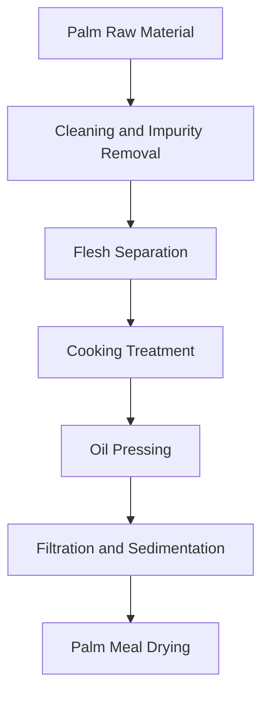
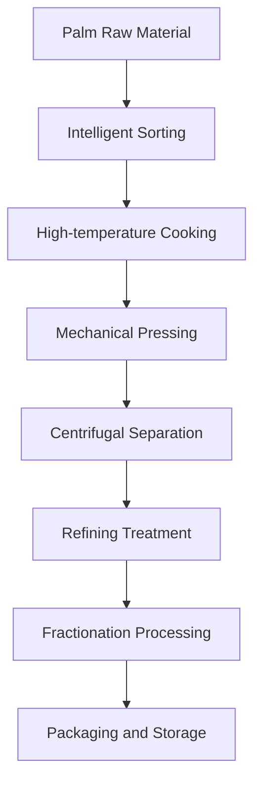

# Palm (Palm Oil) Solution

## Overview

Palm is an important oil crop, palm oil has unique nutritional value and application value. Shandong Shengshi Hecheng Machinery Co., Ltd. provides professional palm pressing solutions, from small workshops to large factories with complete equipment and services.

## Palm Characteristics

### 📊 Basic Parameters
- **Oil Content**: 45-55%
- **Protein Content**: 2-3%
- **Main Fatty Acids**: Palmitic acid (40-45%), Oleic acid (35-40%), Linoleic acid (8-12%)
- **Suitable Temperature**: Pressing temperature controlled at 80-100℃

### 🌱 Growth Characteristics
- **Growth Cycle**: 2-3 years
- **Suitable Climate**: Tropical, rainforest areas
- **Soil Requirements**: Fertile, humid soil
- **Annual Production**: Global annual production exceeds 70 million tons

## Processing Technology

### Traditional Process Flow

### Modern Process Flow

## Equipment Recommendations

### Small Processing (Daily 2-10 tons)
- **300/325 Series Special Press**
- Palm preprocessing equipment
- Simple refining system
- Investment cost: 500,000-1,500,000 yuan

### Medium Processing (Daily 10-30 tons)
- **355/400 Series Press**
- Automated preprocessing production line
- Continuous refining equipment
- Investment cost: 2,000,000-6,000,000 yuan

### Large Processing (Daily 30 tons+)
- **425/480 Series Press**
- Fully automatic production line
- Intelligent management system
- Investment cost: 10,000,000 yuan+

## Technical Advantages

### 🎯 Precise Control
- Temperature control: ±2℃ precision
- Pressure control: Intelligent adjustment
- Humidity control: Optimal moisture content

### 💧 Oil Quality Guarantee
- Low-temperature process preserves nutrition
- Physical pressing without chemical residues
- Oil yield up to 48-52%

### 🔄 Continuous Production
- 24-hour uninterrupted operation
- Automated feeding and discharging
- Intelligent fault alarm

## Product Applications

### 🍳 Edible Oil
- Palm oil: Main edible oil variety
- Blended oil: Mixed with other oils
- Special oil: High-end nutritional oil

### 🏭 Industrial Oil
- Palm oil: Base oil raw material
- Blended oil: Mixed with other oils
- Special oil: High-end nutritional oil

### 🏭 Biodiesel
- Palm oil: Biodiesel raw material
- Blended oil: Mixed with other oils
- Special oil: High-end nutritional oil

### 🏭 Chemical Raw Materials
- Palm oil: Chemical raw material
- Blended oil: Mixed with other oils
- Special oil: High-end nutritional oil

## Market Analysis

### 📈 Development Trends
- Growing demand for food processing, biofuels, and chemical raw materials
- Expanding high-end palm oil market
- Increasing export trade opportunities

### 🎯 Target Markets
- Edible oil processing enterprises
- Food processing enterprises
- Biodiesel production enterprises
- Chemical raw material enterprises

## Success Cases

### Shandong Large Palm Oil Processing Plant
- **Equipment Configuration**: 400 series press ×6 units
- **Daily Processing Capacity**: 50 tons palm
- **Oil Yield**: 48%
- **Annual Production**: 6,000 tons palm oil
- **Market Coverage**: 20 provinces nationwide

### Henan Professional Palm Oil Enterprise
- **Equipment Configuration**: 355 series special machine ×4 units
- **Daily Processing Capacity**: 25 tons palm
- **Product Quality**: National first-class standard
- **Brand Building**: Regional well-known brand
- **Annual Sales**: 20,000,000 yuan

### Zhejiang High-end Palm Oil Brand
- **Equipment Configuration**: 325 series special machine ×5 units
- **Daily Processing Capacity**: 15 tons premium palm
- **Product Quality**: Organic food certification
- **Market Positioning**: High-end organic edible oil
- **Export Markets**: Europe, USA

## Quality Standards

### 🏆 Product Quality Standards
- Complies with national palm oil standards
- Complies with food safety standards
- Complies with export food standards
- Complies with organic food certification

### 🔍 Testing Items
- Acid value testing
- Peroxide value testing
- Color and transparency testing
- Heavy metal content testing
- Pesticide residue testing

## Sustainable Development

### 🌱 Environmental Production
- Waste recycling and utilization
- Energy-saving and emission-reduction processes
- Green production standards

### 🔄 Resource Utilization
- By-product comprehensive utilization
- Industrial chain extension
- Circular economy model

### 🌍 Social Responsibility
- Support farmer income increase
- Ensure food safety
- Protect ecological environment

## Contact Us

If you are interested in palm pressing solutions, please contact our technical team:

- 📞 **Consultation Hotline**: +86 19906365856
- 📧 **Email**: sales@oil-pressing-machine.com
- 📍 **Address**: No. 5888 Yineng Street, Development Zone, Qingzhou City, Weifang City, Shandong Province

We provide free technical consultation, sample testing, and on-site inspection services to provide you with the most suitable palm pressing solution.