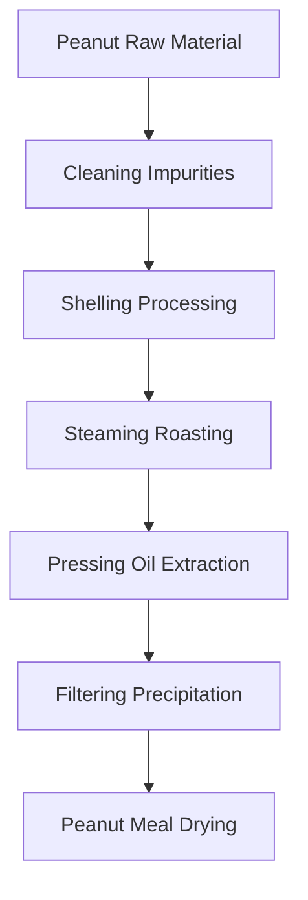
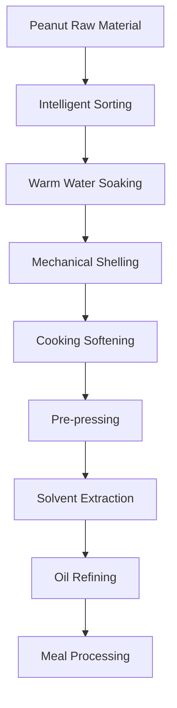

# Peanut (Peanut Oil) Solutions

## Overview

Peanut is an important oilseed and cash crop, and peanut oil has unique aroma and rich nutritional value. Shandong Shengshi Hecheng Machinery Co., Ltd. provides professional peanut pressing solutions to meet different needs from small workshops to large factories.

## Peanut Characteristics

### 📊 Basic Parameters
- **Oil Content**: 45-55%
- **Protein Content**: 25-30%
- **Main Fatty Acids**: Oleic acid (40-50%), Linoleic acid (30-40%)
- **Suitable Temperature**: Pressing temperature controlled at 80-100℃

### 🌱 Growth Characteristics
- **Growth Cycle**: 120-150 days
- **Suitable Climate**: Warm, sunny areas
- **Soil Requirements**: Loose, fertile sandy soil
- **Annual Production**: China annual production exceeds 16 million tons

## Processing Technology

### Traditional Process Flow

### Modern Process Flow

## Equipment Recommendations

### Small Scale Processing (2-10 tons/day)
- **300/325 Series Special Oil Press**
- Peanut preprocessing equipment
- Simple refining system
- Investment Cost: 500,000-1,500,000 RMB

### Medium Scale Processing (10-50 tons/day)
- **355/400 Series Oil Press**
- Automated preprocessing line
- Continuous refining equipment
- Investment Cost: 3-8 million RMB

### Large Scale Processing (50+ tons/day)
- **425/480 Series Oil Press**
- Full automatic production line
- Intelligent management system
- Investment Cost: 15 million RMB+

## Technical Advantages

### 🎯 Precise Control
- Temperature control: ±2℃ accuracy
- Pressure control: Intelligent adjustment
- Roasting time: Optimal process parameters

### 💧 Oil Quality Guarantee
- Hot pressing process highlights aroma
- Physical pressing ensures purity
- Oil yield up to 48-50%

### 🔄 Continuous Production
- Automated production process
- Continuous pressing technology
- Intelligent quality monitoring

## Product Applications

### 🍳 Edible Oil
- Peanut oil: High-quality edible oil
- Blended oil: Mixed with other oils
- Special oil: High-end nutritional oil

### 🥛 By-products
- Peanut meal: High-quality protein feed
- Peanut shells: Fuel or feed
- Peanut protein: Food additives

### 💊 Functional Products
- Peanut arachidonic acid
- Peanut polyphenols
- Peanut phospholipids

## Market Analysis

### 📈 Development Trends
- Healthy edible oil demand growth
- Premium peanut oil market expansion
- Export trade opportunities increase

### 🎯 Target Markets
- Edible oil processing enterprises
- Food processing enterprises
- Catering chain enterprises
- Export trading enterprises

## Success Cases

### Shandong Large Peanut Oil Processing Plant
- **Equipment Configuration**: 400 Series Oil Press × 6 units
- **Daily Processing Capacity**: 80 tons peanuts
- **Oil Yield**: 48.5%
- **Annual Production**: 8,000 tons peanut oil
- **Market Coverage**: 15 provinces and cities nationwide

### Henan Professional Peanut Oil Enterprise
- **Equipment Configuration**: 355 Series Special Press × 4 units
- **Daily Processing Capacity**: 30 tons peanuts
- **Product Quality**: National first-class standards
- **Brand Building**: Regional well-known brand
- **Annual Sales**: 50 million RMB

### Guangdong Premium Peanut Oil Brand
- **Equipment Configuration**: 325 Series Special Press × 8 units
- **Daily Processing Capacity**: 20 tons premium peanuts
- **Product Quality**: Organic food certification
- **Market Positioning**: Premium organic edible oil
- **Export Market**: Southeast Asia, Japan

## Quality Standards

### 🏆 Product Quality Standards
- Meets national peanut oil standards (GB 1535)
- Meets food safety standards
- Meets export food standards
- Meets organic food certification

### 🔍 Testing Items
- Acid value testing
- Peroxide value testing
- Color transparency testing
- Heavy metal content testing
- Aflatoxin testing
- Pesticide residue testing

## Sustainable Development

### 🌱 Environmental Production
- Waste recycling utilization
- Energy saving and emission reduction processes
- Green production standards

### 🔄 Resource Utilization
- By-product comprehensive utilization
- Industrial chain extension
- Circular economy model

### 🌍 Social Responsibility
- Support farmer income increase
- Ensure food safety
- Protect ecological environment

## Contact Us

If you are interested in peanut pressing solutions, please contact our technical team:

- 📞 **Hotline**: 400-888-8888
- 📧 **Email**: sales@oil-pressing-machine.com
- 📍 **Address**: No. 5888, Yineng Street, Development Zone, Qingzhou City, Shandong Province, China

We provide free technical consultation, sample testing, and on-site inspection services to provide you with the most suitable peanut pressing solutions.