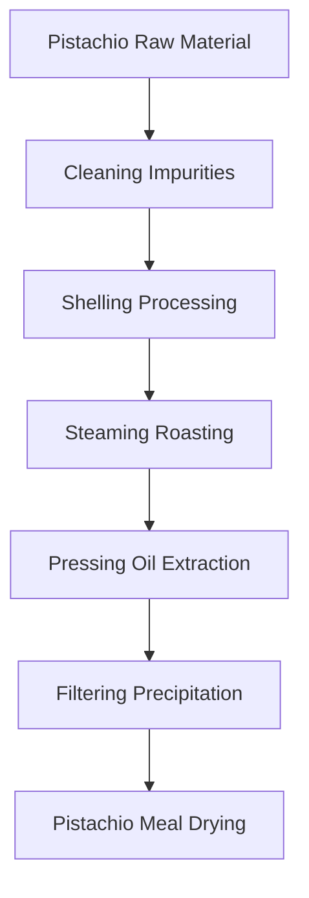
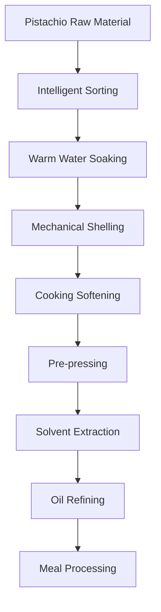

# Pistachio (Pistachio Oil) Solutions

## Overview

Pistachio is a nutritious nut, rich in high-quality oil, and can extract valuable pistachio oil. Pistachio oil has unique flavor and nutritional components, widely used in premium edible oil and food processing. Shandong Shengshi Hecheng Machinery Co., Ltd. provides professional pistachio pressing solutions, offering complete equipment and services from small workshops to large factories.

## Pistachio Characteristics

### 📊 Basic Parameters
- **Oil Content**: 50-60%
- **Protein Content**: 15-20%
- **Main Fatty Acids**: Oleic acid (50-60%), Linoleic acid (25-35%)
- **Suitable Temperature**: Pressing temperature controlled at 75-95℃

### 🌱 Growth Characteristics
- **Growth Cycle**: Tree has long growth cycle, fruit matures over many years
- **Suitable Climate**: Arid, warm climate
- **Soil Requirements**: Well-drained, alkaline soil
- **Annual Production**: Global pistachio production about 1 million tons

## Processing Technology

### Traditional Process Flow

### Modern Process Flow

## Equipment Recommendations

### Small Scale Processing (1-5 tons/day)
- **300/325 Series Special Oil Press**
- Pistachio preprocessing equipment
- Simple refining system
- Investment Cost: 400,000-1,200,000 RMB

### Medium Scale Processing (5-20 tons/day)
- **355/400 Series Oil Press**
- Automated preprocessing line
- Continuous refining equipment
- Investment Cost: 2-6 million RMB

### Large Scale Processing (20+ tons/day)
- **425/480 Series Oil Press**
- Full automatic production line
- Intelligent management system
- Investment Cost: 10 million RMB+

## Technical Advantages

### 🎯 Precise Control
- Temperature control: ±2℃ accuracy
- Pressure control: Intelligent adjustment
- Roasting time: Optimal process parameters

### 💧 Oil Quality Guarantee
- Cold pressing process preserves nutrition
- Physical pressing ensures purity
- Oil yield up to 55-58%

### 🔄 Continuous Production
- Automated production process
- Continuous pressing technology
- Intelligent quality monitoring

## Product Applications

### 🍳 Edible Oil
- Pistachio oil: High-quality edible oil
- Blended oil: Mixed with other oils
- Special oil: High-end nutritional oil

### 🥛 By-products
- Pistachio meal: High-quality protein feed
- Pistachio shells: Fuel or feed
- Pistachio protein: Food additives

### 💊 Functional Products
- Pistachio polyphenols
- Pistachio vitamin E
- Pistachio phospholipids

## Market Analysis

### 📈 Development Trends
- Healthy edible oil demand growth
- Premium nut oil market expansion
- Export trade opportunities increase

### 🎯 Target Markets
- Edible oil processing enterprises
- Food processing enterprises
- Nut processing enterprises
- Export trading enterprises

## Success Cases

### Iran Pistachio Oil Processing Plant
- **Equipment Configuration**: 400 Series Oil Press × 5 units
- **Daily Processing Capacity**: 50 tons pistachios
- **Oil Yield**: 56%
- **Annual Production**: 5,000 tons pistachio oil
- **Market Coverage**: Middle East, Europe

### USA Pistachio Oil Enterprise
- **Equipment Configuration**: 355 Series Special Press × 4 units
- **Daily Processing Capacity**: 20 tons pistachios
- **Product Quality**: National first-class standards
- **Brand Building**: International well-known brand
- **Annual Sales**: 80 million RMB

### China Premium Pistachio Oil Brand
- **Equipment Configuration**: 325 Series Special Press × 6 units
- **Daily Processing Capacity**: 15 tons premium pistachios
- **Product Quality**: Organic food certification
- **Market Positioning**: Premium organic edible oil
- **Export Market**: Asia, Europe

## Quality Standards

### 🏆 Product Quality Standards
- Meets national edible oil standards
- Meets food safety standards
- Meets export food standards
- Meets organic food certification

### 🔍 Testing Items
- Acid value testing
- Peroxide value testing
- Color transparency testing
- Heavy metal content testing
- Aflatoxin testing
- Pesticide residue testing

## Sustainable Development

### 🌱 Environmental Production
- Waste recycling utilization
- Energy saving and emission reduction processes
- Green production standards

### 🔄 Resource Utilization
- By-product comprehensive utilization
- Industrial chain extension
- Circular economy model

### 🌍 Social Responsibility
- Support farmer income increase
- Ensure food safety
- Protect ecological environment

## Contact Us

If you are interested in pistachio pressing solutions, please contact our technical team:

- 📞 **Hotline**: 400-888-8888
- 📧 **Email**: sales@oil-pressing-machine.com
- 📍 **Address**: No. 5888, Yineng Street, Development Zone, Qingzhou City, Shandong Province, China

We provide free technical consultation, sample testing, and on-site inspection services to provide you with the most suitable pistachio pressing solutions.