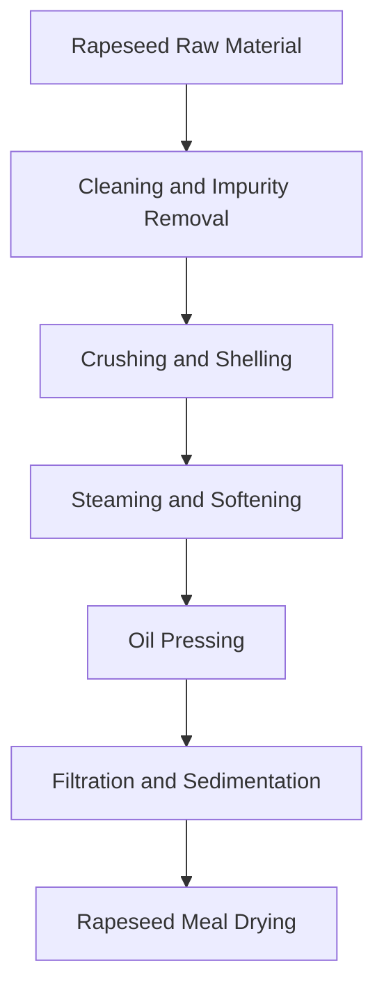
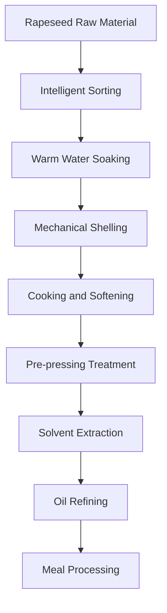

# Rapeseed (Rapeseed Oil) Solution

## Overview

Rapeseed is an important oil crop, rapeseed oil is one of the major edible oils globally. Shandong Shengshi Hecheng Machinery Co., Ltd. provides professional rapeseed pressing solutions, from small workshops to large factories with complete equipment and services.

## Rapeseed Characteristics

### 📊 Basic Parameters
- **Oil Content**: 35-45%
- **Protein Content**: 20-25%
- **Main Fatty Acids**: Oleic acid (55-70%), Linoleic acid (15-25%), Linolenic acid (5-10%)
- **Suitable Temperature**: Pressing temperature controlled at 60-80℃

### 🌱 Growth Characteristics
- **Growth Cycle**: 90-120 days
- **Suitable Climate**: Cool, humid areas
- **Soil Requirements**: Fertile, neutral soil
- **Annual Production**: Global annual production exceeds 70 million tons

## Processing Technology

### Traditional Process Flow

### Modern Process Flow

## Equipment Recommendations

### Small Processing (Daily 5-15 tons)
- **355/400 Series Press**
- Rapeseed preprocessing production line
- Simple refining equipment
- Investment cost: 1,500,000-3,500,000 yuan

### Medium Processing (Daily 15-50 tons)
- **425/480 Series Press**
- Complete preprocessing production line
- Continuous refining equipment
- Investment cost: 6,000,000-15,000,000 yuan

### Large Processing (Daily 50 tons+)
- **500 Series Large Press**
- Fully automatic production line
- Intelligent management system
- Investment cost: 20,000,000 yuan+

## Technical Advantages

### 🎯 Precise Control
- Temperature control: ±2℃ precision
- Pressure control: Intelligent adjustment
- Humidity control: Optimal moisture content

### 💧 Oil Quality Guarantee
- Cold pressing process preserves nutrition
- Physical pressing without chemical residues
- Oil yield industry-leading (38-42%)

### 🔄 Continuous Production
- 24-hour uninterrupted operation
- Automated feeding and discharging
- Intelligent fault alarm

## Product Applications

### 🍳 Edible Oil
- Rapeseed oil: Main edible oil variety
- Blended oil: Mixed with other oils
- Special oil: High-end nutritional oil

### 🥛 By-products
- Rapeseed meal: High-quality protein feed
- Rapeseed protein: Food additives
- Rapeseed phospholipids: Functional ingredients

### 💊 Functional Products
- Rapeseed isoflavones
- Rapeseed polyphenols
- Rapeseed sterols

## Market Analysis

### 📈 Development Trends
- Growing demand for healthy edible oils
- Organic rapeseed planting expansion
- By-product comprehensive utilization improvement

### 🎯 Target Markets
- Edible oil processing enterprises
- Feed processing enterprises
- Food processing enterprises
- Export trade enterprises

## Success Cases

### Shandong Large Rapeseed Oil Processing Plant
- **Equipment Configuration**: 480 series press ×8 units
- **Daily Processing Capacity**: 120 tons rapeseed
- **Oil Yield**: 40.5%
- **Annual Production**: 150,000 tons rapeseed oil
- **Market Coverage**: 25 provinces nationwide

### Hubei Modern Rapeseed Oil Enterprise
- **Equipment Configuration**: 500 series press ×6 units
- **Daily Processing Capacity**: 80 tons rapeseed
- **Product Quality**: Complies with national first-class standards
- **By-product Utilization**: Rapeseed meal annual production 100,000 tons
- **Economic Benefits**: Annual sales 300,000,000 yuan

### Sichuan Organic Rapeseed Oil Brand
- **Equipment Configuration**: 400 series special machine ×5 units
- **Daily Processing Capacity**: 40 tons organic rapeseed
- **Product Quality**: Organic food certification
- **Brand Positioning**: High-end organic edible oil
- **Market Positioning**: First- and second-tier city high-end markets

## Quality Standards

### 🏆 Product Quality Standards
- Complies with national rapeseed oil standards (GB 1536)
- Complies with food safety standards
- Complies with export food standards
- Complies with organic food certification

### 🔍 Testing Items
- Acid value testing
- Peroxide value testing
- Color and transparency testing
- Heavy metal content testing
- Erucic acid content testing
- Pesticide residue testing

## Sustainable Development

### 🌱 Environmental Production
- Waste recycling and utilization
- Energy-saving and emission-reduction processes
- Green production standards

### 🔄 Resource Utilization
- By-product comprehensive utilization
- Industrial chain extension
- Circular economy model

### 🌍 Social Responsibility
- Support local planting
- Increase farmer income
- Ensure food safety

## Contact Us

If you are interested in rapeseed pressing solutions, please contact our technical team:

- 📞 **Consultation Hotline**: +86 19906365856
- 📧 **Email**: sales@oil-pressing-machine.com
- 📍 **Address**: No. 5888 Yineng Street, Development Zone, Qingzhou City, Weifang City, Shandong Province

We provide free technical consultation, sample testing, and on-site inspection services to provide you with the most suitable rapeseed pressing solution.