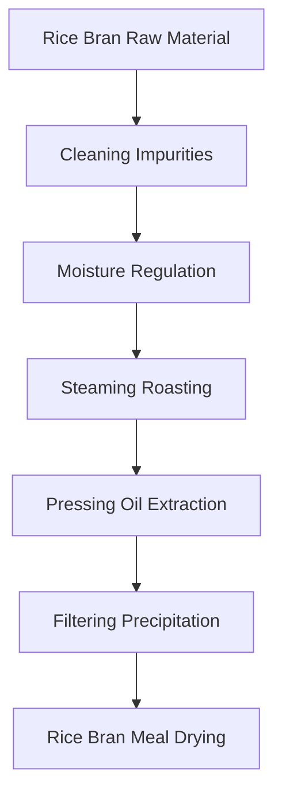
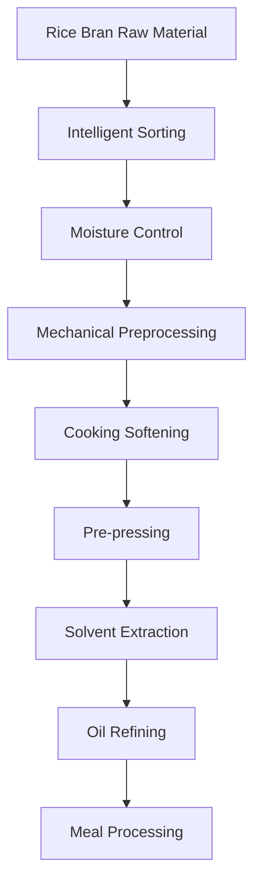

# Rice Bran (Rice Bran Oil) Solutions

## Overview

Rice bran is a by-product of rice processing, rich in high-quality oil, and can extract nutritious rice bran oil. Rice bran oil has unique flavor and nutritional value, widely used in edible oil and food processing. Shandong Shengshi Hecheng Machinery Co., Ltd. provides professional rice bran pressing solutions, offering complete equipment and services from small workshops to large factories.

## Rice Bran Characteristics

### 📊 Basic Parameters
- **Oil Content**: 15-25%
- **Protein Content**: 12-15%
- **Main Fatty Acids**: Oleic acid (40-50%), Linoleic acid (30-40%)
- **Suitable Temperature**: Pressing temperature controlled at 60-80℃

### 🌱 Source Characteristics
- **Source**: Rice processing by-product
- **Freshness Requirements**: Should be processed promptly to maintain oil quality
- **Storage Conditions**: Low temperature, dry environment
- **Annual Production**: Global rice production about 500 million tons, rice bran production about 150 million tons

## Processing Technology

### Traditional Process Flow

### Modern Process Flow

## Equipment Recommendations

### Small Scale Processing (5-10 tons/day)
- **300/325 Series Special Oil Press**
- Rice bran preprocessing equipment
- Simple refining system
- Investment Cost: 500,000-1,500,000 RMB

### Medium Scale Processing (10-50 tons/day)
- **355/400 Series Oil Press**
- Automated preprocessing line
- Continuous refining equipment
- Investment Cost: 3-8 million RMB

### Large Scale Processing (50+ tons/day)
- **425/480 Series Oil Press**
- Full automatic production line
- Intelligent management system
- Investment Cost: 15 million RMB+

## Technical Advantages

### 🎯 Precise Control
- Temperature control: ±2℃ accuracy
- Pressure control: Intelligent adjustment
- Moisture control: Optimal process parameters

### 💧 Oil Quality Guarantee
- Low temperature pressing preserves nutrition
- Physical pressing ensures purity
- Oil yield up to 20-22%

### 🔄 Continuous Production
- Automated production process
- Continuous pressing technology
- Intelligent quality monitoring

## Product Applications

### 🍳 Edible Oil
- Rice bran oil: High-quality edible oil
- Blended oil: Mixed with other oils
- Special oil: High-end nutritional oil

### 🥛 By-products
- Rice bran meal: High-quality protein feed
- Rice bran fiber: Feed additives
- Rice bran protein: Food additives

### 💊 Functional Products
- Rice bran polyphenols
- Rice bran vitamin E
- Rice bran phospholipids

## Market Analysis

### 📈 Development Trends
- By-product utilization demand growth
- Healthy edible oil market expansion
- Export trade opportunities increase

### 🎯 Target Markets
- Edible oil processing enterprises
- Rice processing enterprises
- Food processing enterprises
- Feed processing enterprises

## Success Cases

### Hunan Rice Bran Oil Processing Plant
- **Equipment Configuration**: 400 Series Oil Press × 6 units
- **Daily Processing Capacity**: 60 tons rice bran
- **Oil Yield**: 21%
- **Annual Production**: 3,000 tons rice bran oil
- **Market Coverage**: Central China region

### Jiangsu Rice Bran Oil Enterprise
- **Equipment Configuration**: 355 Series Special Press × 4 units
- **Daily Processing Capacity**: 25 tons rice bran
- **Product Quality**: National first-class standards
- **Brand Building**: Regional well-known brand
- **Annual Sales**: 40 million RMB

### Guangdong Premium Rice Bran Oil Brand
- **Equipment Configuration**: 325 Series Special Press × 8 units
- **Daily Processing Capacity**: 15 tons premium rice bran
- **Product Quality**: Organic food certification
- **Market Positioning**: Premium organic edible oil
- **Export Market**: Southeast Asia, Japan

## Quality Standards

### 🏆 Product Quality Standards
- Meets national edible oil standards
- Meets food safety standards
- Meets export food standards
- Meets organic food certification

### 🔍 Testing Items
- Acid value testing
- Peroxide value testing
- Color transparency testing
- Heavy metal content testing
- Aflatoxin testing
- Pesticide residue testing

## Sustainable Development

### 🌱 Environmental Production
- Waste recycling utilization
- Energy saving and emission reduction processes
- Green production standards

### 🔄 Resource Utilization
- By-product comprehensive utilization
- Industrial chain extension
- Circular economy model

### 🌍 Social Responsibility
- Support farmer income increase
- Ensure food safety
- Protect ecological environment

## Contact Us

If you are interested in rice bran pressing solutions, please contact our technical team:

- 📞 **Hotline**: 400-888-8888
- 📧 **Email**: sales@oil-pressing-machine.com
- 📍 **Address**: No. 5888, Yineng Street, Development Zone, Qingzhou City, Shandong Province, China

We provide free technical consultation, sample testing, and on-site inspection services to provide you with the most suitable rice bran pressing solutions.