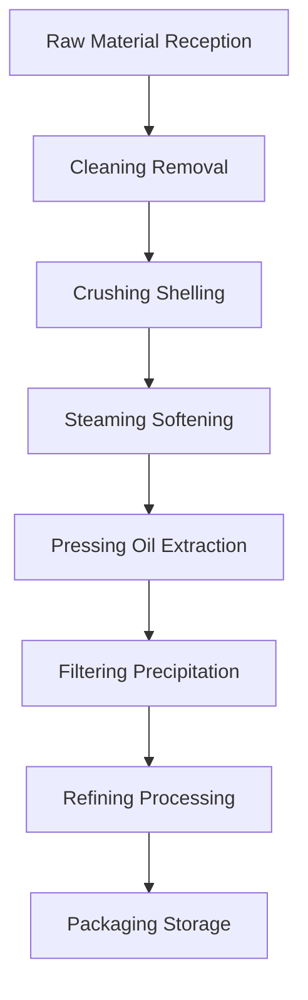

# Seed Oil Solutions

## Overview

Seed oils are the main source of industrial and edible oils, featuring high yield, low cost, and mature processing technology. Shandong Shengshi Hecheng Machinery Co., Ltd. provides complete seed oil processing solutions from small workshops to large factories.

## Main Seed Crops

### 🌱 Soybean (Soybean Oil)
**Oil Content**: 18-22%
**Features**: High-quality protein source, clear oil
**Suitable Equipment**: 355/400 Series Oil Press
**Processing Technology**: Soaking → Steaming → Pressing → Filtering

### 🥜 Peanut (Peanut Oil)
**Oil Content**: 45-55%
**Features**: Rich aroma, high nutrition
**Suitable Equipment**: 300/325 Series Oil Press
**Processing Technology**: Shelling → Steaming → Pressing → Filtering

### 🌰 Sesame (Sesame Oil)
**Oil Content**: 50-60%
**Features**: Unique aroma, strong antioxidant
**Suitable Equipment**: 300/325 Series Special Press
**Processing Technology**: Cleaning → Roasting → Pressing → Filtering

### 🌿 Rapeseed/Canola (Rapeseed Oil)
**Oil Content**: 35-45%
**Features**: High yield, affordable price
**Suitable Equipment**: 355/400 Series Oil Press
**Processing Technology**: Shelling → Steaming → Pressing → Refining

### 🌻 Sunflower Seeds (Sunflower Oil)
**Oil Content**: 40-50%
**Features**: Golden color, refreshing taste
**Suitable Equipment**: 355/400 Series Oil Press
**Processing Technology**: Shelling → Steaming → Pressing → Filtering

### 🧵 Cottonseed (Cottonseed Oil)
**Oil Content**: 30-40%
**Features**: Industrial oil, requires detoxification
**Suitable Equipment**: 425/480 Series Industrial Press
**Processing Technology**: Shelling → Steaming → Pressing → Detoxification → Refining

### 🌾 Flaxseed/Linseed (Flaxseed Oil)
**Oil Content**: 35-45%
**Features**: High Omega-3 content
**Suitable Equipment**: 300/325 Series Special Press
**Processing Technology**: Cold Pressing → Filtering → Refrigeration

### 🍵 Tea Seeds/Camellia Seeds (Tea Seed Oil)
**Oil Content**: 25-35%
**Features**: High tea polyphenol content, antioxidant
**Suitable Equipment**: 300/325 Series Oil Press
**Processing Technology**: Shelling → Cold Pressing → Filtering

### 🌱 Perilla Seeds (Perilla Oil/Ssu Seed Oil)
**Oil Content**: 40-50%
**Features**: Special aroma, medicinal value
**Suitable Equipment**: 300/325 Series Special Press
**Processing Technology**: Cold Pressing → Filtering → Refining

## Equipment Recommendations

### Small Scale Processing (1-5 tons/day)
- **300/325 Series Oil Press**
- Basic preprocessing equipment
- Simple filtering system
- Investment Cost: 200,000-500,000 RMB

### Medium Scale Processing (5-20 tons/day)
- **355/400 Series Oil Press**
- Complete preprocessing line
- Fine filtering system
- Investment Cost: 1,000,000-3,000,000 RMB

### Large Scale Processing (20+ tons/day)
- **425/480 Series Oil Press**
- Full automatic preprocessing line
- Refining equipment system
- Investment Cost: 5,000,000 RMB+

## Processing Flow

## Technical Advantages

### 🎯 Precise Control
- Temperature control: ±2℃ accuracy
- Pressure control: Precise adjustment
- Humidity control: Optimal moisture content

### 🔄 Continuous Production
- 24-hour uninterrupted operation
- Automated feeding discharging
- Intelligent fault alarm

### 💧 Oil Quality Guarantee
- Physical pressing, no chemical residue
- Cold pressing process retains nutrients
- Industry-leading oil yield

## Market Prospects

### 📈 Development Trends
- Healthy edible oil demand growth
- Organic food market expansion
- Export trade opportunities increase

### 🎯 Target Markets
- Domestic food processing enterprises
- Export trading companies
- Health food brands
- Catering chains

## Service Guarantee

### 🛠️ Technical Support
- Equipment installation debugging
- Operation personnel training
- Process technology guidance
- Formula optimization suggestions

### 🔧 After-sales Service
- 24-hour technical support
- Parts timely supply
- Regular maintenance service
- Lifetime technical service

### 📊 Data Services
- Production data real-time monitoring
- Equipment operation status analysis
- Energy consumption optimization suggestions
- Production quality statistics

## Case Studies

### Shandong Large Oil Factory
- **Equipment Configuration**: 425 Series Oil Press × 5 units
- **Daily Processing Capacity**: 50 tons soybean
- **Oil Yield**: 18.5%
- **Annual Production**: 3,000 tons soybean oil
- **Return on Investment**: 2-year payback

### Henan Professional Peanut Oil Factory
- **Equipment Configuration**: 355 Series Oil Press × 3 units
- **Daily Processing Capacity**: 15 tons peanuts
- **Oil Yield**: 48%
- **Product Quality**: National first-class standard
- **Market Coverage**: 20 cities in the province

## Contact Us

If you are interested in seed oil processing solutions, please contact our technical team:

- 📞 **Hotline**: +86 19906365856
- 📧 **Email**: sales@oil-pressing-machine.com
- 📍 **Address**: No. 5888, Yineng Street, Development Zone, Qingzhou City, Shandong Province, China

We will provide personalized solutions based on your specific needs and technical support.