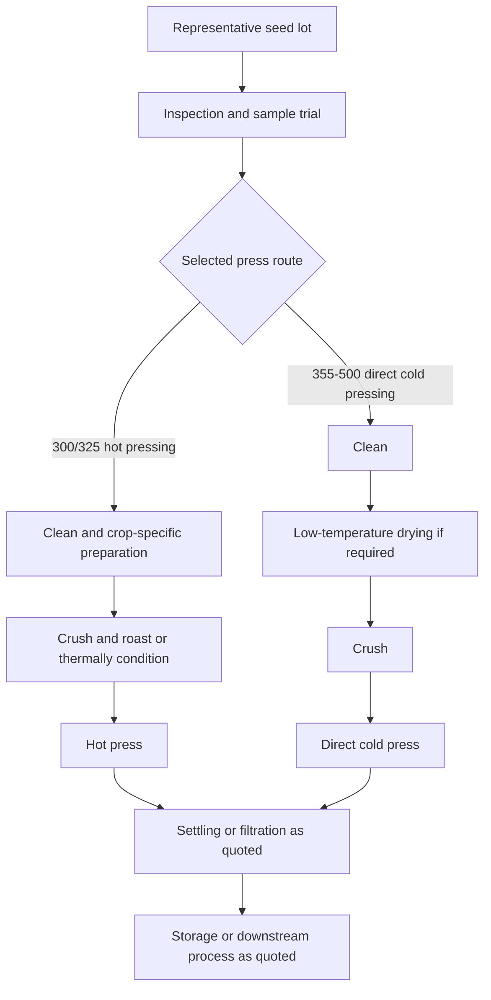

# Seed Oil Solutions

## Procurement Scope

Seed oil projects vary with the exact crop, variety, harvest and storage history, impurity level, moisture, hull ratio, measured oil content, required oil profile, and intended use of the press cake. A comparable factory quote must therefore be based on a representative sample, a defined process route, the site conditions, and a written supply boundary.

This page does not set a fixed oil content, recovery, batch load, daily output, investment, operating schedule, or finished-oil grade. Any performance or acceptance value must come from an agreed trial method and be written into the quotation or contract.

## Raw Material Differences

| Seed group | Differences to confirm | Pretreatment decision |
| --- | --- | --- |
| Soybean and peanut | Variety, moisture, skins or shells, damaged material, storage condition, meal or cake use, and food-safety risks such as aflatoxin for peanuts | Decide whether grading, shelling, dehulling, crushing, heating, or cold preparation is required from the sample and product target |
| Sesame, rapeseed, perilla, and flaxseed | Small-particle cleaning, fines, flow behavior, oxidation sensitivity, flavor target, and changeover risk | Select screens and cleaning steps; use thermal conditioning only for the hot-press route |
| Sunflower, cottonseed, and camellia seed | Hull ratio, kernel damage, foreign matter, and the effect of hulls on pressing and filtration | Confirm dehulling or shell separation by trial; cottonseed also requires a written food-safety and refining assessment |
| Grape seed and other by-product seeds | Residual pulp or sugar, fermentation history, drying condition, fine solids, and storage age | Confirm cleaning, low-temperature drying where needed, crushing, filtration load, and whether the material is suitable for pressing |

Different seeds must be tested separately. Results from one crop, variety, supplier, or harvest lot are not a performance basis for another.

## Press Route and Pretreatment Boundary

| Route | Press models | Required sequence | Use boundary |
| --- | --- | --- | --- |
| Hot pressing | 300/325 series | Clean and sort, complete crop-specific shelling or dehulling as required, crush, roast or thermally condition, then press | Proposed primarily where a hot-pressed flavor or heat-prepared process is required; temperatures and holding conditions come from the sample trial |
| Direct cold pressing | 355-500 series | Clean, use low-temperature drying only when the sample requires it, crush, then press directly | No roasting, steaming, or cooking is assumed between crushing and pressing; model selection is confirmed by trial and line balance |

```mermaid
flowchart TD
    A[Representative seed lot] --> B[Inspection and sample trial]
    B --> C{Selected press route}
    C -->|300/325 hot pressing| D[Clean and crop-specific preparation]
    D --> E[Crush and roast or thermally condition]
    E --> F[Hot press]
    C -->|355-500 direct cold pressing| G[Clean]
    G --> H[Low-temperature drying if required]
    H --> I[Crush]
    I --> J[Direct cold press]
    F --> K[Settling or filtration as quoted]
    J --> K
    K --> L[Storage or downstream process as quoted]
```

The equipment supplier's boundary starts and ends only where the signed equipment list says it does. Receiving, dehulling, roasting, low-temperature drying, refining, filling, utilities, buildings, laboratory work, and waste handling are excluded unless individually listed and priced.

## Representative Sample and Trial Conditions

Before sample dispatch, confirm the sample quantity, packaging, transport, customs handling, trial charge, consumables, and return or disposal arrangement in writing.

The sample record should identify:

- Crop and variety, origin, supplier, harvest or production lot, and storage history
- Whole seed, kernel, or by-product form; impurity, hull, damaged-material, and moisture condition
- Laboratory oil content and method when available, without treating it as guaranteed press recovery
- Existing cleaning, dehulling, drying, roasting, or other treatment already applied
- Intended hot-press or cold-press route, oil use, cake use, filtration level, and laboratory specification
- Photos, safety information, allergen controls, and known contaminants relevant to transport and testing

The written trial record should state the actual preparation, net input, moisture, particle size, temperature history, pressure program, complete cycle, collected oil, cake, losses, filtration basis, cleaning time, and laboratory methods used. Quoted throughput must be calculated from the verified complete cycle and line bottlenecks, not from a model name alone.

## Equipment List for a Manufacturer Quote

A seed-oil production-line quotation may include the following items, but only signed line items form the supply scope:

- Raw-material receiving and inspection provisions
- Cleaning and sorting equipment selected for the actual impurity profile
- Optional sheller, dehuller, separator, or grader for the specified seed
- Crusher or flaker selected from the trial particle-size requirement
- Roaster or thermal conditioner for a 300/325 hot-press route
- Low-temperature dryer only where required for a 355-500 cold-press route
- Selected press, hydraulic unit, product-contact parts, guards, and controls
- Oil collection, settling, pumping, filtration, and storage equipment
- Cake discharge, collection, cooling, or packing interfaces as required
- Electrical cabinet, cables within the stated boundary, manuals, drawings, and agreed spare parts
- Optional refining, filling, laboratory, utility, or material-handling systems quoted separately

## Quote Inputs and Price Basis

For a usable factory price and procurement comparison, send:

- Exact raw material and all materials expected on the same line
- Target hot-press or direct cold-press route and required oil and cake products
- Target throughput, batch pattern, shift plan, seasonal schedule, and changeover frequency
- Destination country and city, installation site, available floor area, access and lifting limits
- Voltage, frequency, phase, heating source, water, compressed air, ventilation, and drainage available at site
- Required contact materials, filtration basis, storage, refining, filling, and packaging boundary
- Required document language, destination standards, inspection documents, and buyer acceptance method
- Preferred currency, trade term, delivery point, packing, freight, insurance, tax treatment, commissioning, training, and spare-parts scope
- Budget range when it is to be used for comparing configurations rather than as a performance assumption

The quotation should itemize the machine model and quantity, included auxiliaries, optional items, exclusions, utility assumptions, commercial terms, quotation validity, delivery basis, document package, and after-sales scope. Local prices for raw material, labor, utilities, finance, tax, freight, and product sales remain buyer inputs to any investment calculation.

## FAT and SAT

### Factory Acceptance Test (FAT)

FAT is performed only when its scope, sample, method, cost, and acceptance criteria are agreed in writing. The protocol should cover equipment identity and configuration, included safety functions, no-load and loaded operation, the agreed material preparation, mass balance, complete cycle, temperature record, filtration basis, oil and cake sampling, cleaning, documents, and deviations. Results are recorded in a signed report; values not stated in that protocol are not guaranteed.

### Site Acceptance Test (SAT)

SAT should define site readiness, utilities, foundations, lifting and labor responsibilities, installation and commissioning scope, the raw material to be used, operator participation, repeat-run method, laboratory tests, training records, and issue closure. Travel, visas, accommodation, local transport, consumables, third-party testing, and return visits must be allocated and priced in the quotation or contract.

## Compliance and After-sales Confirmation

The buyer must identify the destination market and whether the oil and cake are intended for food, feed, cosmetics, supplements, or industrial use. Applicable product, facility, electrical, machinery-safety, food-contact, labeling, allergen, environmental, and worker-safety requirements must be listed by responsible party in the contract.

No national, export, organic, food, cosmetic, or other certification is included by default. Current certificates and reports must be checked for the named legal entity, factory, machine, process, product, and destination. Pressing equipment alone does not establish finished-oil compliance.

After-sales terms must state the warranty start point and coverage, exclusions, support channels and response window, remote and on-site responsibilities, labor and travel charges, spare-part specification and lead-time confirmation, consumables, training, document language, and maintenance duties. Service availability and response commitments are limited to the signed terms.

## Contact Us

For seed-oil equipment selection, production-line pricing, supplier comparison, or a project quotation, contact the technical and commercial team:

- **Hotline**: +86 19906365856
- **Email**: gavin@oil-pressing-machine.com
- **Address**: No. 5888, Yineng Street, Development Zone, Qingzhou City, Shandong Province, China

## Related Links

- [Solutions Overview](/en/solutions/)
- [Soybean Solutions](/en/solutions/soybean)
- [Peanut Solutions](/en/solutions/peanut)
- [Rapeseed Solutions](/en/solutions/rapeseed)
- [Product Series Overview](/en/products/)
- [Contact Technical Team](/en/contact/)
- [Chinese page](/zh/solutions/seed-oils)

## Get Price & Quote

Send the material record, process route, target throughput, site utilities, destination, equipment boundary, and commercial terms. The resulting manufacturer quote can then separate the base production line, options, freight, commissioning, documentation, and after-sales items for procurement review.

- [Get Price & Quote](/en/contact/)

<!-- quote-cta -->
