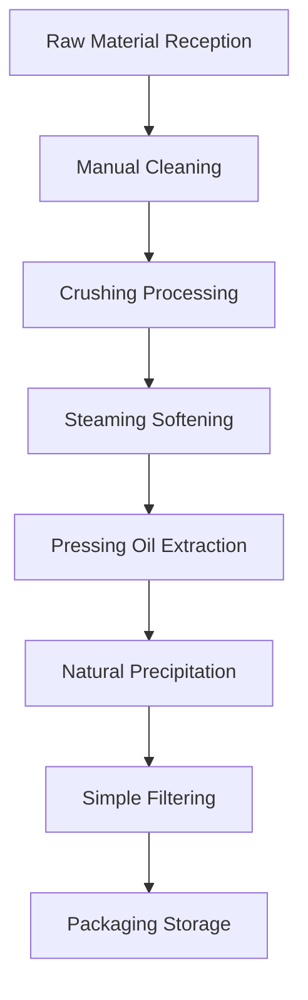

# Small Oil Mill Solutions

## Overview

Small oil mill solutions are specially designed for entrepreneurs, rural cooperatives, and family workshops, providing cost-effective oil processing equipment and technology to help you quickly start your oil processing business. Shandong Shengshi Hecheng Machinery Co., Ltd. provides comprehensive service support from equipment selection to technical training.

## Applicable Scenarios

### 🏠 Family Workshop
- **Target Users**: Rural entrepreneurs, family farm owners
- **Daily Processing Capacity**: 0.5-1 ton
- **Investment Budget**: 150,000-300,000 RMB

### 🏘️ Rural Cooperative
- **Target Users**: Village collectives, farmers' professional cooperatives
- **Daily Processing Capacity**: 1-3 tons
- **Investment Budget**: 300,000-500,000 RMB

### 🏪 Small Store
- **Target Users**: Individual entrepreneurs, specialty oil stores
- **Daily Processing Capacity**: 0.5-2 tons
- **Investment Budget**: 200,000-400,000 RMB

## Main Equipment Configuration

### Basic Configuration (150,000-300,000 RMB)
- **300 Series Oil Press** × 1 unit
- Basic cleaning equipment
- Simple filtering system
- Basic electrical control cabinet

### Standard Configuration (300,000-500,000 RMB)
- **300/325 Series Oil Press** × 1 unit
- Automatic feeding system
- Multi-level filtering equipment
- Temperature control system
- Basic automation control

## Processing Flow

## Technical Features

### 💰 Economic and Practical
- Small equipment investment, quick return
- Simple operation, easy maintenance
- Low energy consumption, low operating costs

### 🎯 Flexible and Versatile
- Can process multiple oil crops
- Production scale can be flexibly adjusted
- Diversified product options

### 🔧 Easy to Operate
- Mainly manual operation with automation assistance
- Low technical requirements, easy to learn and use
- Simple maintenance

## Applicable Oil Crops

### 🌾 Main Grain and Oil Crops
- **Soybean**: 18-22% oil content, suitable for small-scale processing
- **Peanut**: 45-55% oil content, high-quality edible oil
- **Sesame**: 50-60% oil content, rich aroma

### 🥜 Nut Crops
- **Walnut**: 60-70% oil content, high-end nutritional oil
- **Almond**: 45-55% oil content, beauty and skincare
- **Hazelnut**: 55-65% oil content, rich in vitamin E

### 🥑 Fruit Crops
- **Grape Seed**: 12-18% oil content, strong antioxidant
- **Pumpkin Seed**: 35-45% oil content, balanced nutrition

## Product Applications

### 🍳 Edible Oil
- Family self-use oil
- Characteristic farmhouse oil
- Small batch customized oil

### 🏪 Retail Sales
- Farmers' market sales
- Community store operations
- Online platform sales

### 🎁 Gift Customization
- Characteristic gift oil
- Festival customized oil
- Corporate welfare oil

## Investment Return Analysis

### 💰 Cost Structure
- **Equipment Investment**: 200,000-500,000 RMB
- **Factory Construction**: 100,000-200,000 RMB
- **Working Capital**: 50,000-100,000 RMB
- **Total Investment**: 350,000-800,000 RMB

### 📈 Revenue Expectations
- **Monthly Sales**: 50,000-150,000 RMB
- **Gross Profit Margin**: 30-50%
- **Monthly Net Profit**: 20,000-60,000 RMB
- **Investment Recovery Period**: 8-18 months

## Service Guarantee

### 🛠️ Technical Support
- Equipment installation and debugging guidance
- On-site operator training
- Production process technical guidance
- Formula optimization suggestions

### 🔧 After-sales Service
- One-year equipment quality guarantee
- 24-hour technical consultation service
- Timely parts supply
- Regular return visits and maintenance

### 📊 Business Guidance
- Market analysis reports
- Sales channel suggestions
- Brand building guidance
- Business strategy consultation

## Success Cases

### Shandong Village-level Oil Mill
- **Equipment Configuration**: 300 Series Oil Press × 1 unit
- **Daily Processing Capacity**: 1.5 tons peanuts
- **Investment Cost**: 250,000 RMB
- **Monthly Sales**: 80,000 RMB
- **Investment Recovery**: 10 months

### Henan Family Farm
- **Equipment Configuration**: 325 Series Oil Press × 1 unit
- **Daily Processing Capacity**: 2 tons mixed oil crops
- **Investment Cost**: 350,000 RMB
- **Monthly Sales**: 120,000 RMB
- **Specialty Products**: Organic sesame oil

### Zhejiang Specialty Oil Store
- **Equipment Configuration**: 300 Series Oil Press × 1 unit
- **Daily Processing Capacity**: 1 ton walnuts
- **Investment Cost**: 280,000 RMB
- **Monthly Sales**: 150,000 RMB
- **Market Positioning**: High-end gift oil

## Quality Standards

### 🏆 Product Quality Standards
- Meets national edible oil hygiene standards
- Meets local specialty agricultural product standards
- Meets organic food certification requirements

### 🔍 Testing Items
- Acid value testing
- Peroxide value testing
- Impurity content testing
- Sensory quality evaluation

## Development Suggestions

### 📈 Upgrade Path
- Expand production scale
- Improve automation level
- Expand product variety
- Establish brand image

### 🎯 Market Expansion
- Develop online sales channels
- Participate in agricultural product exhibitions
- Establish dealer network
- Conduct brand marketing

## Contact Us

If you are interested in small oil mill solutions, please contact our technical team:

- 📞 **Hotline**: +86 19906365856
- 📧 **Email**: sales@oil-pressing-machine.com
- 📍 **Address**: No. 5888, Yineng Street, Development Zone, Qingzhou City, Shandong Province, China

We provide free project evaluation, equipment selection consultation, and on-site investigation services to customize the most suitable small oil mill solution for you.