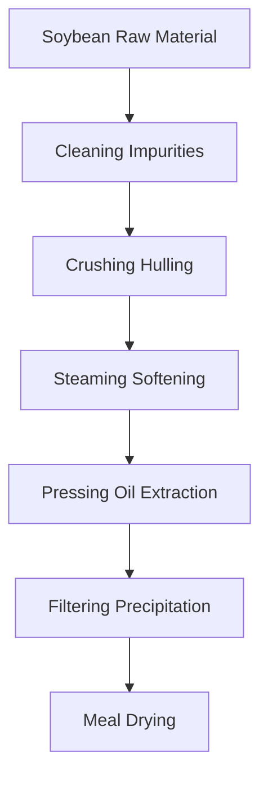
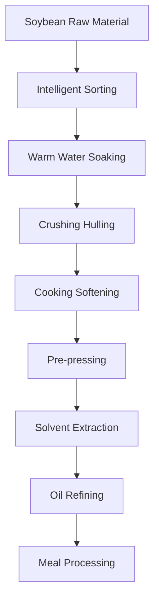

# Soybean (Soybean Oil) Solutions

## Overview

Soybean is one of the world's most important oilseed crops, and soybean oil is a major edible oil variety. Shandong Shengshi Hecheng Machinery Co., Ltd. provides professional soybean pressing solutions, from small workshops to large factories with complete equipment and services.

## Soybean Characteristics

### 📊 Basic Parameters
- **Oil Content**: 18-22%
- **Protein Content**: 35-40%
- **Main Fatty Acids**: Linoleic acid (50-60%), Oleic acid (20-30%), Linolenic acid (5-10%)
- **Suitable Temperature**: Pressing temperature controlled at 60-80℃

### 🌱 Growth Characteristics
- **Growth Cycle**: 90-150 days
- **Suitable Climate**: Temperate and subtropical regions
- **Soil Requirements**: Fertile, well-drained soil
- **Annual Production**: Global annual production exceeds 300 million tons

## Processing Technology

### Traditional Process Flow

### Modern Process Flow

## Equipment Recommendations

### Small Scale Processing (5-20 tons/day)
- **355/400 Series Oil Press**
- Soybean preprocessing line
- Simple refining equipment
- Investment Cost: 2-5 million RMB

### Medium Scale Processing (20-100 tons/day)
- **425/480 Series Oil Press**
- Complete preprocessing line
- Continuous refining equipment
- Investment Cost: 8-20 million RMB

### Large Scale Processing (100+ tons/day)
- **500 Series Large Oil Press**
- Full automatic production line
- Intelligent management system
- Investment Cost: 30 million RMB+

## Technical Advantages

### 🎯 Precise Control
- Temperature control: ±2℃ accuracy
- Pressure control: Intelligent adjustment
- Humidity control: Optimal moisture content
- Time control: Optimal process parameters

### 💧 Oil Quality Guarantee
- Cold pressing process retains nutrients
- Physical pressing without chemical residue
- Industry-leading oil yield (18-20%)

### 🔄 Continuous Production
- 24-hour uninterrupted operation
- Automated feeding and discharging
- Intelligent fault alarm

## Product Applications

### 🍳 Edible Oil
- Soybean oil: Main edible oil variety
- Blended oil: Mixed with other oils
- Special oil: High-end nutritional oil

### 🥛 By-products
- Soybean meal: High-quality protein feed
- Soy milk: Food processing raw material
- Soybean hull: By-product comprehensive utilization

### 💊 Functional Products
- Soybean lecithin
- Soybean isoflavones
- Soybean protein products

## Market Analysis

### 📈 Development Trends
- Healthy edible oil demand growth
- Organic soybean planting expansion
- By-product comprehensive utilization improvement

### 🎯 Target Markets
- Edible oil processing enterprises
- Feed processing enterprises
- Food processing enterprises
- Export trading enterprises

## Success Cases

### Shandong Large Soybean Oil Processing Plant
- **Equipment Configuration**: 480 Series Oil Press × 8 units
- **Daily Processing Capacity**: 200 tons soybeans
- **Oil Yield**: 19.2%
- **Annual Production**: 12,000 tons soybean oil
- **Market Coverage**: 20 provinces and cities nationwide

### Henan Modern Soybean Oil Enterprise
- **Equipment Configuration**: 500 Series Oil Press × 6 units
- **Daily Processing Capacity**: 150 tons soybeans
- **Product Quality**: Meets national first-class standards
- **By-product Utilization**: 80,000 tons soybean meal annually
- **Economic Benefits**: 200 million RMB annual sales

### Northeast Organic Soybean Oil Brand
- **Equipment Configuration**: 400 Series Special Press × 4 units
- **Daily Processing Capacity**: 50 tons organic soybeans
- **Product Quality**: Organic food certification
- **Brand Positioning**: High-end organic edible oil
- **Market Positioning**: First and second-tier city premium market

## Quality Standards

### 🏆 Product Quality Standards
- Meets national soybean oil standards (GB 1534)
- Meets food safety standards
- Meets export food standards
- Meets organic food certification

### 🔍 Testing Items
- Acid value testing
- Peroxide value testing
- Color transparency testing
- Heavy metal content testing
- Pesticide residue testing
- Aflatoxin testing

## Sustainable Development

### 🌱 Environmental Production
- Waste recycling utilization
- Energy saving and emission reduction processes
- Green production standards

### 🔄 Resource Utilization
- By-product comprehensive utilization
- Industrial chain extension
- Circular economy model

### 🌍 Social Responsibility
- Support local planting
- Increase farmer income
- Ensure food safety

## Contact Us

If you are interested in soybean pressing solutions, please contact our technical team:

- 📞 **Hotline**: 400-888-8888
- 📧 **Email**: sales@oil-pressing-machine.com
- 📍 **Address**: No. 5888, Yineng Street, Development Zone, Qingzhou City, Shandong Province, China

We provide free technical consultation, sample testing, and on-site inspection services to provide you with the most suitable soybean pressing solutions.