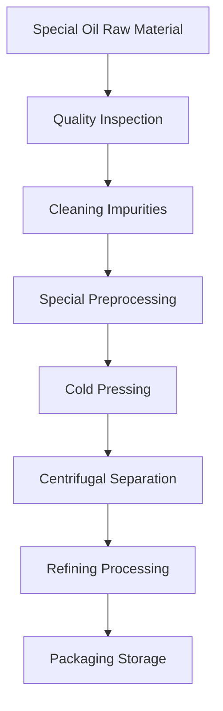

# Special Oil Processing Solutions

## Overview

Special oils include sesame, flaxseed, perilla seeds and other high-value oil crops with unique nutritional components and health value. Shandong Shengshi Hecheng Machinery Co., Ltd. provides professional special oil processing solutions to meet the market demand for high-end edible oils and functional foods.

## Main Special Oil Crops

### 🌰 Sesame (Sesame Oil)
**Oil Content**: 50-60%
**Features**: Unique aroma, strong antioxidant capacity
**Suitable Equipment**: 300/325 Series Special Press
**Processing Technology**: Cleaning → Roasting → Cold pressing → Filtering

### 🌾 Flaxseed/Linseed (Flaxseed Oil)
**Oil Content**: 35-45%
**Features**: High Omega-3 content, balanced nutrition
**Suitable Equipment**: 300/325 Series Special Press
**Processing Technology**: Cold pressing → Filtering → Refrigeration

### 🌱 Perilla Seeds (Perilla Oil/Ssu Seed Oil)
**Oil Content**: 40-50%
**Features**: Special aroma, high medicinal value
**Suitable Equipment**: 300/325 Series Special Press
**Processing Technology**: Cold pressing → Filtering → Refrigeration

### 🍵 Tea Seeds/Camellia Seeds (Tea Seed Oil)
**Oil Content**: 25-35%
**Features**: High tea polyphenol content, antioxidant
**Suitable Equipment**: 300/325 Series Oil Press
**Processing Technology**: Shelling → Cold pressing → Filtering

### 🌿 Castor Seeds (Castor Oil)
**Oil Content**: 45-55%
**Features**: Industrial lubricant oil, biodiesel raw material
**Suitable Equipment**: 425/480 Series Industrial Press
**Processing Technology**: Shelling → Cooking → Pressing → Refining

## Equipment Recommendations

### Small Scale Processing (0.5-2 tons/day)
- **300/325 Series Special Oil Press**
- Special oil preprocessing equipment
- Temperature control system
- Investment Cost: 400,000-1,000,000 RMB

### Medium Scale Processing (2-10 tons/day)
- **355/400 Series Oil Press**
- Automated preprocessing line
- Temperature control system
- Investment Cost: 2,000,000-5,000,000 RMB

### Large Scale Processing (10+ tons/day)
- **425/480 Series Oil Press**
- Full automatic production line
- Intelligent management system
- Investment Cost: 8,000,000 RMB+

## Processing Flow

## Technical Features

### ❄️ Cold Pressing Technology
- Preserve nutritional components
- Maintain natural aroma
- Improve oil stability

### 🎯 Precise Control
- Temperature control: ±1℃ accuracy
- Pressure control: Intelligent adjustment
- Time control: Optimal process parameters

### 🔄 Continuous Production
- Automated feeding system
- Continuous pressing process
- Intelligent monitoring system

## Product Applications

### 🍳 High-end Edible Oil
- Sesame oil: Seasoning and cooking
- Flaxseed oil: Nutritional health
- Tea seed oil: Healthy consumption

### 💄 Beauty and Skincare
- Natural skincare oil
- Massage essential oil
- Hair care product raw material

### 💊 Health Products
- Nutritional supplements
- Functional foods
- Medicinal preparations

### 🏭 Industrial Applications
- Lubricant base oil
- Biodiesel raw material
- Chemical raw materials

## Nutritional Value

### 🌰 Sesame Oil
- Rich in vitamin E content
- Strong antioxidant capacity
- Cardiovascular health protection

### 🌾 Flaxseed Oil
- High Omega-3 fatty acid content
- Improve cardiovascular health
- Anti-inflammatory effects

### 🍵 Tea Seed Oil
- High tea polyphenol content
- Strong antioxidant capacity
- Good beauty and skincare effects

## Market Prospects

### 📈 Development Trends
- Functional food demand growth
- Health beauty market expansion
- High-end oil market development

### 🎯 Target Markets
- High-end food brands
- Beauty and skincare enterprises
- Health product manufacturers
- Professional nutrition companies

## Service Guarantee

### 🛠️ Technical Support
- Process parameter optimization
- Equipment debugging operation
- Operation personnel training
- Quality control guidance

### 🔧 After-sales Service
- 7×24 hours technical support
- Parts fast supply
- Regular maintenance service
- Technical upgrade service

### 📊 Data Services
- Production data analysis
- Quality inspection report
- Market trend analysis
- Customer demand research

## Success Cases

### Shandong High-end Sesame Oil Processing Plant
- **Equipment Configuration**: 325 Series Special Press × 3 units
- **Daily Processing Capacity**: 5 tons sesame
- **Product Positioning**: High-end organic sesame oil
- **Market Advantage**: Pure sesame aroma
- **Annual Sales**: 15,000,000 RMB

### Henan Flaxseed Oil Production Enterprise
- **Equipment Configuration**: 300 Series Special Press × 4 units
- **Daily Processing Capacity**: 3 tons flaxseed
- **Product Quality**: Organic food certification
- **Market Positioning**: Nutritional health oil products
- **Export Market**: Europe, North America

### Zhejiang Tea Seed Oil Brand Enterprise
- **Equipment Configuration**: 355 Series Oil Press × 2 units
- **Daily Processing Capacity**: 8 tons tea seeds
- **Product Quality**: Meets cosmetic standards
- **Product Application**: Beauty and skincare products
- **Annual Sales**: 20,000,000 RMB

## Quality Standards

### 🏆 Product Quality Standards
- Meets relevant national standards
- Meets organic food certification
- Meets export food standards
- Meets beauty and skincare standards

### 🔍 Testing Items
- Acid value testing
- Peroxide value testing
- Color transparency testing
- Heavy metal content testing
- Pesticide residue testing
- Nutritional component analysis

## Technological Innovation

### 🔬 Process Innovation
- New extraction technology
- Low-temperature protection process
- Efficient separation technology

### 📊 Data-driven
- Intelligent quality control
- Big data analysis application
- Process parameter optimization

### 🌱 Sustainable Development
- Resource comprehensive utilization
- Energy saving and emission reduction process
- Green production standards

## Contact Us

If you are interested in special oil processing solutions, please contact our expert team:

- 📞 **Hotline**: +86 19906365856
- 📧 **Email**: sales@oil-pressing-machine.com
- 📍 **Address**: No. 5888, Yineng Street, Development Zone, Qingzhou City, Shandong Province, China

We provide free technical consultation, sample testing, and process verification services to provide you with the most professional special oil processing solutions.