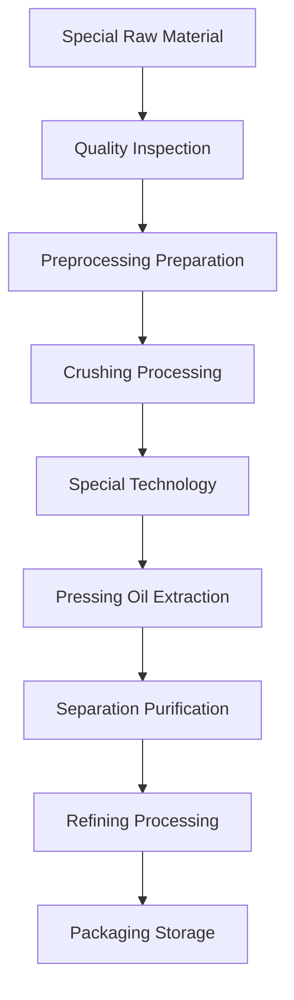

# Special Oil Solutions

## Overview

Special oils include rice bran, corn germ, castor seeds, etc., featuring unique nutritional value and industrial applications. Shandong Shengshi Hecheng Machinery Co., Ltd. provides professional special oil processing solutions to meet diversified market demands.

## Main Special Oil Crops

### 🍚 Rice Bran (Rice Bran Oil)
**Oil Content**: 15-25%
**Features**: Natural antioxidant γ-oryzanol content high
**Suitable Equipment**: 300/325 Series Special Press
**Processing Technology**: Rice bran extraction → Cold pressing → Filtering → Refining

### 🌽 Corn Germ (Corn Oil)
**Oil Content**: 35-45%
**Features**: Rich in vitamin E, good stability
**Suitable Equipment**: 355/400 Series Oil Press
**Processing Technology**: Germ separation → Drying → Pressing → Filtering

### 🌿 Castor Seeds (Castor Oil)
**Oil Content**: 45-55%
**Features**: Industrial lubricant oil, biodiesel raw material
**Suitable Equipment**: 425/480 Series Industrial Press
**Processing Technology**: Shelling → Cooking → Pressing → Refining

### 🌶️ Chili Seeds (Chili Seed Oil)
**Oil Content**: 15-25%
**Features**: High capsaicin content, health care value
**Suitable Equipment**: 300/325 Series Special Press
**Processing Technology**: Shelling → Cold pressing → Filtering

### 🍇 Grape Seeds/Buckwheat Seeds (High-value Oil)
**Oil Content**: 10-20%
**Features**: High polyphenol content, strong antioxidant capacity
**Suitable Equipment**: 300/325 Series Special Press
**Processing Technology**: Seed shell separation → Cold pressing → Filtering → Refining

## Equipment Recommendations

### Small Scale Processing (0.5-3 tons/day)
- **300/325 Series Special Oil Press**
- Special preprocessing equipment
- Temperature control system
- Investment Cost: 500,000-1,200,000 RMB

### Medium Scale Processing (3-15 tons/day)
- **355/400 Series Oil Press**
- Automated preprocessing line
- Multi-level filtering system
- Investment Cost: 2,500,000-6,000,000 RMB

### Large Scale Processing (15+ tons/day)
- **425/480 Series Oil Press**
- Full automatic production line
- Intelligent management system
- Investment Cost: 10,000,000 RMB+

## Processing Flow

## Technical Advantages

### 🎯 Special Technology
- Targeted preprocessing
- Dedicated pressing process
- Special refining methods

### ❄️ Low-temperature Protection
- Preserve active ingredients
- Maintain natural characteristics
- Increase product value

### 🔄 Precise Control
- Parameter precise control
- Quality real-time monitoring
- Automated adjustment

## Product Applications

### 💊 Health Product Raw Materials
- Natural antioxidants
- Functional nutrients
- Medicinal preparations

### 🏭 Industrial Applications
- Lubricant base oil
- Biodiesel raw material
- Chemical raw materials

### 🍳 Special Edible Oil
- High-end nutritional oil
- Functional edible oil
- Special seasoning oil

## Nutritional Health Value

### 🍚 Rice Bran Oil
- High γ-oryzanol content
- Strong antioxidant capacity
- Cardiovascular protection

### 🌽 Corn Oil
- Rich in vitamin E
- Balanced unsaturated fatty acids
- Skin health protection

### 🌶️ Chili Seed Oil
- High capsaicin content
- Promote metabolism
- Enhance immunity

## Market Prospects

### 📈 Development Trends
- Functional food demand growth
- Natural antioxidant market expansion
- Bio-based material application increase

### 🎯 Target Markets
- Health product enterprises
- Food processing enterprises
- Chemical raw material enterprises
- Beauty and skincare brands

## Service Guarantee

### 🛠️ Technical Support
- Special process research
- Equipment custom design
- Operation technology training
- Quality control guidance

### 🔧 After-sales Service
- 7×24 hours technical support
- Special parts supply
- Regular technical maintenance
- Process optimization upgrade

### 📊 Data Services
- Production data analysis
- Quality inspection report
- Market trend analysis
- Customer demand research

## Case Studies

### Shandong Rice Bran Oil Processing Enterprise
- **Equipment Configuration**: 355 Series Special Press × 2 units
- **Daily Processing Capacity**: 10 tons rice bran
- **Product Positioning**: High-end nutritional oil
- **Market Advantage**: γ-oryzanol content industry leading
- **Annual Sales**: 8,000,000 RMB

### Henan Corn Oil Processing Factory
- **Equipment Configuration**: 400 Series Oil Press × 1 unit
- **Daily Processing Capacity**: 8 tons corn germ
- **Product Quality**: Meets national first-class standard
- **Brand Building**: Regional well-known brand
- **Market Coverage**: Nationwide 10+ provinces

### Hebei Castor Oil Processing Enterprise
- **Equipment Configuration**: 425 Series Industrial Press × 1 unit
- **Daily Processing Capacity**: 12 tons castor seeds
- **Product Application**: Industrial lubricant oil
- **Quality Standard**: Meets industrial standards
- **Annual Production**: 50,000 tons

## Quality Standards

### 🏆 Product Quality Standards
- Meets relevant national standards
- Meets industry quality requirements
- Meets export quality standards
- Meets safety and hygiene standards

### 🔍 Testing Items
- Physicochemical indicators testing
- Nutritional component analysis
- Safety testing
- Stability testing
- Special component testing

## Technological Innovation

### 🔬 Process Innovation
- New extraction technology
- Low-temperature protection process
- Efficient separation technology

### 📊 Data-driven
- Intelligent quality control
- Big data analysis application
- Process parameter optimization

### 🌱 Sustainable Development
- Resource comprehensive utilization
- Energy saving and emission reduction process
- Green production standards

## Contact Us

If you are interested in special oil processing solutions, please contact our expert team:

- 📞 **Hotline**: +86 19906365856
- 📧 **Email**: gavin@oil-pressing-machine.com
- 📍 **Address**: No. 5888, Yineng Street, Development Zone, Qingzhou City, Shandong Province, China

We provide free technical consultation, sample testing, and process verification services, providing you with the most professional special oil processing solutions.