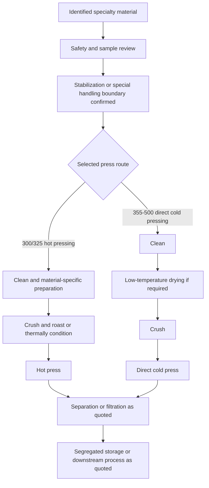

# Special Oil Solutions

## Procurement Scope

Specialty oil materials cannot be grouped by name alone. Rice bran, corn germ, castor seed, chili seed, and other by-products differ in freshness, particle size, biological or chemical hazards, stabilization needs, filtration load, product use, and legal status. The process and factory price must be built from the actual material and destination requirements.

This page does not set a fixed oil content, recovery, batch load, daily output, investment, operating schedule, or product grade. Pressing suitability, equipment configuration, and acceptance values require a representative sample, written test method, and signed quotation or contract.

## Raw Material Differences

| Specialty material | Differences to confirm | Pretreatment and safety boundary |
| --- | --- | --- |
| Rice bran | Bran rather than husk, milling source, freshness, stabilization history, moisture, fines, rancidity indicators, and high filter loading | Stabilization and storage timing must be assigned before pressing; the press supplier does not assume incoming bran has been stabilized |
| Corn germ | Germ purity, residual starch or fiber, moisture, drying history, storage, and intended food or industrial route | Confirm cleaning, low-temperature drying when needed, crushing, pressing, filtration, and any downstream refining as separate line items |
| Castor seed | Seed condition, hull, composition, SDS, worker exposure, toxic cake, cleaning, and industrial product specification | Treat as a dedicated non-food project unless competent parties document otherwise; containment, cake handling, detoxification, and disposal are not assumed |
| Chili seed | Residual pulp, capsaicinoid carryover, odor, dust, moisture, and cross-contamination risk | Confirm cleaning, ventilation, personal-protection responsibilities, dedicated contact parts or cleaning, and the intended food or industrial specification |
| Other unconventional seed or by-product | Identity, source process, contaminants, corrosiveness, solvent or chemical history, and legal status | No press selection is made until safety data, a representative sample, product target, and disposal route are reviewed |

Results from one specialty material cannot be transferred to another. A familiar crop name is not a substitute for lot-specific data.

## Press Route and Pretreatment Boundary

| Route | Press models | Required sequence | Use boundary |
| --- | --- | --- | --- |
| Hot pressing | 300/325 series | Clean and complete material-specific safety or stabilization steps, crush, roast or thermally condition, then press | Proposed primarily where thermal preparation is required and the material is confirmed suitable; the heating program is established by trial |
| Direct cold pressing | 355-500 series | Clean, use low-temperature drying only when required, crush, then press directly | No roasting, steaming, or cooking is assumed between crushing and pressing; stabilization or detoxification, where required, is a separate written boundary |

```mermaid
flowchart TD
    A[Identified specialty material] --> B[Safety and sample review]
    B --> C[Stabilization or special handling boundary confirmed]
    C --> D{Selected press route}
    D -->|300/325 hot pressing| E[Clean and material-specific preparation]
    E --> F[Crush and roast or thermally condition]
    F --> G[Hot press]
    D -->|355-500 direct cold pressing| H[Clean]
    H --> I[Low-temperature drying if required]
    I --> J[Crush]
    J --> K[Direct cold press]
    G --> L[Separation or filtration as quoted]
    K --> L
    L --> M[Segregated storage or downstream process as quoted]
```

Stabilization, detoxification, dust control, ventilation, dedicated cleaning, refining, solvent extraction, filling, utilities, laboratory testing, and hazardous cake or waste handling are excluded unless the quotation names the equipment, method, responsible party, and acceptance requirement.

## Representative Sample and Trial Conditions

Before sample dispatch, agree legality of transport, sample quantity, SDS or composition documents, packing, customs, trial charge, cleaning and disposal charges, consumables, return, and waste route in writing. A sample may be declined when identity, safety, or disposal cannot be established.

The sample record should identify:

- Common and technical name, botanical source where relevant, supplier, origin, lot, production date, and source process
- Seed, germ, bran, kernel, powder, pellet, or other form; moisture, particle distribution, bulk behavior, impurities, and laboratory oil content when available
- Freshness, storage temperature, stabilization, drying, heat, solvent, chemical, or fermentation history
- SDS, known toxicants, allergens, corrosive components, dust risks, odors, and prohibited cross-contact
- Intended food, feed, cosmetic, supplement, chemical, lubricant, or other industrial application
- Required oil, cake, filtrate, emissions, wastewater, cleaning, storage, and disposal specifications

The trial record should state actual preparation, net input, moisture, particle size, temperature history, pressure program, complete cycle, collected fractions, cake or residue, losses, filter basis, cleaning observations, exposure controls, and laboratory methods. Throughput is a trial and line-balance result, not a category-level promise.

## Equipment List for a Manufacturer Quote

A specialty-oil production-line quotation may include:

- Receiving, identification, sampling, and quarantine provisions
- Cleaning, screening, separation, dust collection, or containment selected for the material
- Stabilizer or other dedicated pretreatment only where separately engineered and accepted
- Low-temperature dryer where required for the 355-500 direct cold-press route
- Crusher selected from the material trial
- Roaster or thermal conditioner for an approved 300/325 hot-press route
- Selected press, hydraulic unit, compatible contact parts, seals, guards, and controls
- Oil or liquid collection, settling, pumping, filtration, and segregated storage
- Cake, fines, wastewater, emission, cleaning, and waste interfaces
- Electrical cabinet, documentation, drawings, agreed spare parts, and installation interfaces
- Optional refining, filling, laboratory, utility, solvent-extraction, or packaging systems quoted as separate scopes

The equipment list must distinguish food-contact and non-food use and identify any dedicated parts or changeover restrictions.

## Quote Inputs and Price Basis

For a manufacturer price and procurement comparison, provide:

- Exact material identity, source process, sample condition, safety data, and all planned feedstocks
- Target hot-press or direct cold-press route and required product applications
- Target throughput, batch or shift plan, seasonal supply, segregation, cleaning, and changeover policy
- Destination country and city, site classification, layout, access, floor loading, lifting, ventilation, and waste route
- Electrical supply, heating or cooling source, water, compressed air, extraction, drainage, and treatment facilities
- Required contact materials, seals, filtration, storage, refining, filling, packaging, and containment
- Product and facility standards, laboratory methods, documents, third-party inspection, and acceptance plan
- Currency, trade term, delivery point, export packing, freight, insurance, tax, commissioning, training, and spare-parts request
- Budget range if alternative production-line boundaries are to be compared

The quote should separately price the press, preparation, filtration, safety systems, downstream equipment, documents, acceptance testing, delivery, commissioning, and after-sales. Investment calculations must use current local raw-material, product, labor, utility, compliance, logistics, tax, finance, cleaning, and disposal costs supplied by the buyer.

## FAT and SAT

### Factory Acceptance Test (FAT)

FAT requires an approved sample and written safety review. The protocol should cover equipment identity, compatible contact parts, included guards and controls, no-load and loaded operation, preparation, mass balance, complete cycle, temperature record, collected fractions, filtration, exposure controls, cleaning, waste handling, sampling, documents, and acceptance criteria. Trial charges, special cleaning, protective equipment, analysis, disposal, and repeat testing must be allocated beforehand.

### Site Acceptance Test (SAT)

SAT should confirm site classification and readiness, utilities, ventilation and waste facilities, installation responsibilities, equivalence of site material to the FAT sample, trained operators, full-process runs, sampling and laboratory comparison, cleaning, traceability, and issue closure. Travel, visas, local labor, lifting, accommodation, consumables, third-party services, waste disposal, and return visits are included only when written and priced.

## Compliance and After-sales Confirmation

The buyer must state the destination and intended use. The contract should assign responsibility for machinery and electrical safety, food-contact status where applicable, chemicals and SDS, worker exposure, allergens, toxic cake, emissions, wastewater, waste classification, product standards, labels, import or export documents, and third-party laboratory testing.

No national, export, food, organic, cosmetic, pharmaceutical, industrial, or other certification is included by default. Any certificate or report must be current and verified for the named legal entity, factory, machine, process, product, and destination. A press configuration does not establish that a specialty oil is lawful or compliant.

After-sales terms must state warranty start and coverage, exclusions for feedstock or corrosion where applicable, support channels and response window, remote and site-service boundary, labor and travel charges, special-part identification, price and lead-time confirmation, consumables, cleaning and maintenance duties, manuals, and training. Service availability and response commitments are limited to the signed terms.

## Contact Us

For specialty-oil equipment procurement, factory pricing, production-line design, or a written commercial quotation, contact the technical and commercial team:

- **Hotline**: +86 19906365856
- **Email**: gavin@oil-pressing-machine.com
- **Address**: No. 5888, Yineng Street, Development Zone, Qingzhou City, Shandong Province, China

## Related Links

- [Solutions Overview](/en/solutions/)
- [Rice Bran Solutions](/en/solutions/rice-bran)
- [Corn Germ Solutions](/en/solutions/corn-germ)
- [Castor Seed Solutions](/en/solutions/castor-seed)
- [500 Series Hydraulic Oil Press](/en/products/500)
- [Contact Technical Team](/en/contact/)
- [Chinese page](/zh/solutions/special-oils)

## Get Price & Quote

Send the material identity and safety file, representative sample record, process route, target production plan, site conditions, destination requirements, equipment boundary, and commercial terms. The manufacturer quotation can then separate process, safety, delivery, acceptance, compliance-document, and after-sales costs.

- [Get Price & Quote](/en/contact/)

<!-- quote-cta -->
