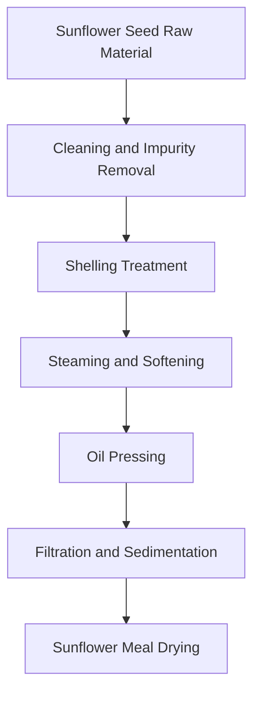
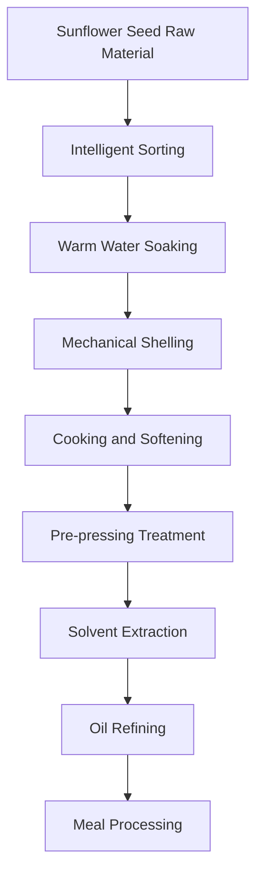

# Sunflower Seed (Sunflower Oil) Solution

## Overview

Sunflower seed is an important oil crop, sunflower oil has golden color and refreshing taste. Shandong Shengshi Hecheng Machinery Co., Ltd. provides professional sunflower seed pressing solutions, from small workshops to large factories with complete equipment and services.

## Sunflower Seed Characteristics

### 📊 Basic Parameters
- **Oil Content**: 40-50%
- **Protein Content**: 15-20%
- **Main Fatty Acids**: Linoleic acid (55-75%), Oleic acid (14-35%), Palmitic acid (4-9%)
- **Suitable Temperature**: Pressing temperature controlled at 60-80℃

### 🌱 Growth Characteristics
- **Growth Cycle**: 80-120 days
- **Suitable Climate**: Warm, sunny areas
- **Soil Requirements**: Fertile, well-drained soil
- **Annual Production**: Global annual production exceeds 500 million tons

## Processing Technology

### Traditional Process Flow

### Modern Process Flow

## Equipment Recommendations

### Small Processing (Daily 3-10 tons)
- **300/325 Series Special Press**
- Sunflower seed preprocessing equipment
- Simple refining system
- Investment cost: 800,000-2,000,000 yuan

### Medium Processing (Daily 10-30 tons)
- **355/400 Series Press**
- Automated preprocessing production line
- Continuous refining equipment
- Investment cost: 4,000,000-10,000,000 yuan

### Large Processing (Daily 30 tons+)
- **425/480 Series Press**
- Fully automatic production line
- Intelligent management system
- Investment cost: 15,000,000 yuan+

## Technical Advantages

### 🎯 Precise Control
- Temperature control: ±2℃ precision
- Pressure control: Intelligent adjustment
- Humidity control: Optimal moisture content

### 💧 Oil Quality Guarantee
- Cold pressing process preserves nutrition
- Physical pressing without chemical residues
- Oil yield up to 42-48%

### 🔄 Continuous Production
- Automated production process
- Continuous pressing technology
- Intelligent quality monitoring

## Product Applications

### 🍳 Edible Oil
- Sunflower oil: Main edible oil variety
- Blended oil: Mixed with other oils
- Special oil: High-end nutritional oil

### 🥛 By-products
- Sunflower meal: High-quality protein feed
- Sunflower hulls: Fuel or feed
- Sunflower protein: Food additives

### 💊 Functional Products
- Sunflower phospholipids
- Sunflower sterols
- Sunflower polyphenols

## Market Analysis

### 📈 Development Trends
- Growing demand for healthy edible oils
- Expanding high-end sunflower oil market
- Increasing export trade opportunities

### 🎯 Target Markets
- Edible oil processing enterprises
- Food processing enterprises
- Chain catering enterprises
- Export trade enterprises

## Success Cases

### Shandong Large Sunflower Oil Processing Plant
- **Equipment Configuration**: 400 series press ×6 units
- **Daily Processing Capacity**: 60 tons sunflower seeds
- **Oil Yield**: 45%
- **Annual Production**: 6,000 tons sunflower oil
- **Market Coverage**: 20 provinces nationwide

### Henan Professional Sunflower Oil Enterprise
- **Equipment Configuration**: 355 series special machine ×4 units
- **Daily Processing Capacity**: 25 tons sunflower seeds
- **Product Quality**: National first-class standard
- **Brand Building**: Regional well-known brand
- **Annual Sales**: 25,000,000 yuan

### Northeast High-end Sunflower Oil Brand
- **Equipment Configuration**: 325 series special machine ×5 units
- **Daily Processing Capacity**: 15 tons premium sunflower seeds
- **Product Quality**: Organic food certification
- **Market Positioning**: High-end organic edible oil
- **Export Markets**: Russia, Europe

## Quality Standards

### 🏆 Product Quality Standards
- Complies with national sunflower oil standards (GB 1537)
- Complies with food safety standards
- Complies with export food standards
- Complies with organic food certification

### 🔍 Testing Items
- Acid value testing
- Peroxide value testing
- Color and transparency testing
- Heavy metal content testing
- Pesticide residue testing
- Benzo[a]pyrene testing

## Sustainable Development

### 🌱 Environmental Production
- Waste recycling and utilization
- Energy-saving and emission-reduction processes
- Green production standards

### 🔄 Resource Utilization
- By-product comprehensive utilization
- Industrial chain extension
- Circular economy model

### 🌍 Social Responsibility
- Support farmer income increase
- Ensure food safety
- Protect ecological environment

## Contact Us

If you are interested in sunflower seed pressing solutions, please contact our technical team:

- 📞 **Consultation Hotline**: +86 19906365856
- 📧 **Email**: sales@oil-pressing-machine.com
- 📍 **Address**: No. 5888 Yineng Street, Development Zone, Qingzhou City, Weifang City, Shandong Province

We provide free technical consultation, sample testing, and on-site inspection services to provide you with the most suitable sunflower seed pressing solution.