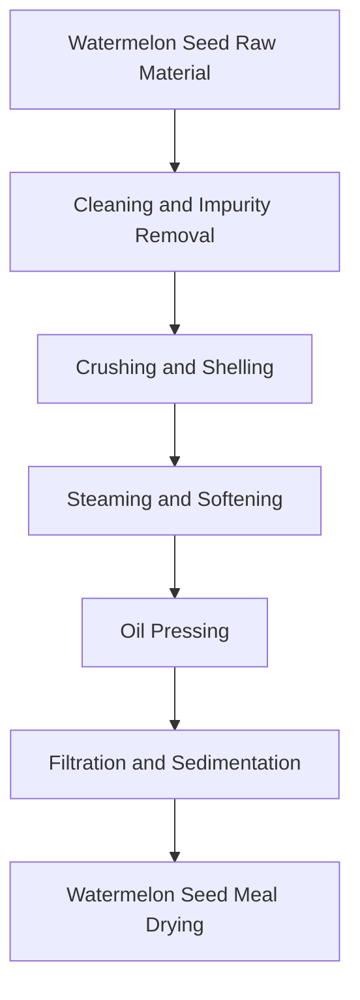
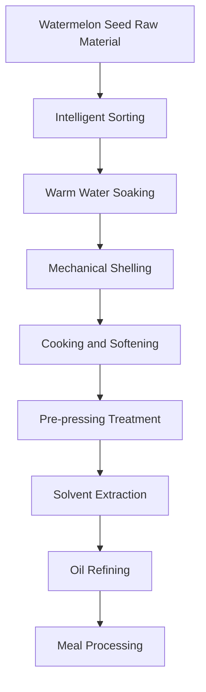

# Watermelon Seed (Watermelon Seed Oil) Solution

## Overview

Watermelon seed is an important oil crop, watermelon seed oil has unique nutritional value and application value. Shandong Shengshi Hecheng Machinery Co., Ltd. provides professional watermelon seed pressing solutions, from small workshops to large factories with complete equipment and services.

## Watermelon Seed Characteristics

### 📊 Basic Parameters
- **Oil Content**: 40-50%
- **Protein Content**: 25-30%
- **Main Fatty Acids**: Linoleic acid (50-60%), Oleic acid (20-30%), Palmitic acid (8-12%)
- **Suitable Temperature**: Pressing temperature controlled at 60-80℃

### 🌱 Growth Characteristics
- **Growth Cycle**: 80-100 days
- **Suitable Climate**: Warm, dry areas
- **Soil Requirements**: Sandy, fertile soil
- **Annual Production**: Global annual production exceeds 500,000 tons

## Processing Technology

### Traditional Process Flow

### Modern Process Flow

## Equipment Recommendations

### Small Processing (Daily 2-10 tons)
- **300/325 Series Special Press**
- Watermelon seed preprocessing equipment
- Simple refining system
- Investment cost: 500,000-1,500,000 yuan

### Medium Processing (Daily 10-30 tons)
- **355/400 Series Press**
- Automated preprocessing production line
- Continuous refining equipment
- Investment cost: 2,000,000-6,000,000 yuan

### Large Processing (Daily 30 tons+)
- **425/480 Series Press**
- Fully automatic production line
- Intelligent management system
- Investment cost: 10,000,000 yuan+

## Technical Advantages

### 🎯 Precise Control
- Temperature control: ±2℃ precision
- Pressure control: Intelligent adjustment
- Humidity control: Optimal moisture content

### 💧 Oil Quality Guarantee
- Low-temperature process preserves nutrition
- Physical pressing without chemical residues
- Oil yield up to 42-48%

### 🔄 Continuous Production
- 24-hour uninterrupted operation
- Automated feeding and discharging
- Intelligent fault alarm

## Product Applications

### 🍳 Edible Oil
- Watermelon seed oil: Main edible oil variety
- Blended oil: Mixed with other oils
- Special oil: High-end nutritional oil

### 💊 Health Products
- Watermelon seed oil: Nutritional supplement
- Blended oil: Mixed with other oils
- Special oil: High-end nutritional oil

### 🏭 Industrial Oil
- Watermelon seed oil: Base oil raw material
- Blended oil: Mixed with other oils
- Special oil: High-end nutritional oil

## Market Analysis

### 📈 Development Trends
- Growing demand for specialty edible oils and nutritional health products
- Expanding high-end watermelon seed oil market
- Increasing export trade opportunities

### 🎯 Target Markets
- Edible oil processing enterprises
- Food processing enterprises
- Health product enterprises
- Export trade enterprises

## Success Cases

### Shandong Large Watermelon Seed Oil Processing Plant
- **Equipment Configuration**: 400 series press ×6 units
- **Daily Processing Capacity**: 50 tons watermelon seeds
- **Oil Yield**: 42%
- **Annual Production**: 6,000 tons watermelon seed oil
- **Market Coverage**: 20 provinces nationwide

### Henan Professional Watermelon Seed Oil Enterprise
- **Equipment Configuration**: 355 series special machine ×4 units
- **Daily Processing Capacity**: 25 tons watermelon seeds
- **Product Quality**: National first-class standard
- **Brand Building**: Regional well-known brand
- **Annual Sales**: 20,000,000 yuan

### Zhejiang High-end Watermelon Seed Oil Brand
- **Equipment Configuration**: 325 series special machine ×5 units
- **Daily Processing Capacity**: 15 tons premium watermelon seeds
- **Product Quality**: Organic food certification
- **Market Positioning**: High-end organic edible oil
- **Export Markets**: Europe, USA

## Quality Standards

### 🏆 Product Quality Standards
- Complies with national watermelon seed oil standards
- Complies with food safety standards
- Complies with export food standards
- Complies with organic food certification

### 🔍 Testing Items
- Acid value testing
- Peroxide value testing
- Color and transparency testing
- Heavy metal content testing
- Pesticide residue testing

## Sustainable Development

### 🌱 Environmental Production
- Waste recycling and utilization
- Energy-saving and emission-reduction processes
- Green production standards

### 🔄 Resource Utilization
- By-product comprehensive utilization
- Industrial chain extension
- Circular economy model

### 🌍 Social Responsibility
- Support farmer income increase
- Ensure food safety
- Protect ecological environment

## Contact Us

If you are interested in watermelon seed pressing solutions, please contact our technical team:

- 📞 **Consultation Hotline**: +86 19906365856
- 📧 **Email**: sales@oil-pressing-machine.com
- 📍 **Address**: No. 5888 Yineng Street, Development Zone, Qingzhou City, Weifang City, Shandong Province

We provide free technical consultation, sample testing, and on-site inspection services to provide you with the most suitable watermelon seed pressing solution.