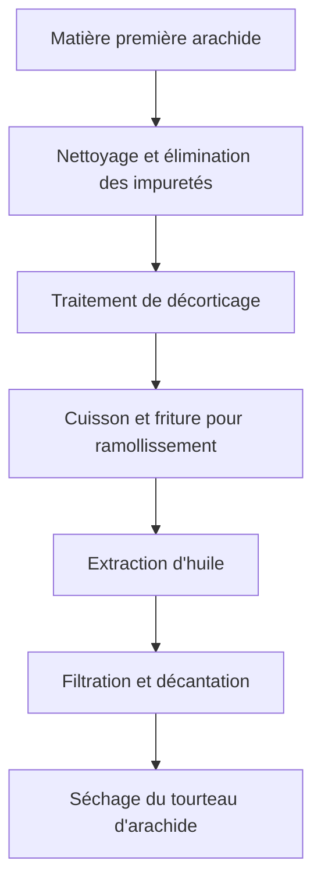
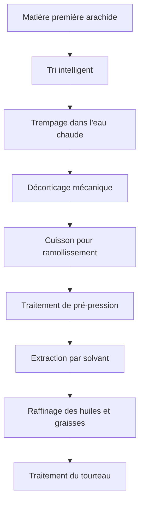

# Solution arachide (huile d'arachide)

## Aperçu

L'arachide est une culture oléagineuse et économique importante, l'huile d'arachide a une saveur unique et une valeur nutritionnelle riche. Shandong Shengshi Hecheng Machinery Co., Ltd. fournit des solutions professionnelles d'extraction d'arachide, répondant aux besoins différents des petits ateliers aux grandes usines.

## Caractéristiques de l'arachide

### 📊 Paramètres de base
- **Teneur en huile**: 45-55%
- **Teneur en protéines**: 25-30%
- **Acides gras principaux**: Acide oléique (40-50%), acide linoléique (30-40%)
- **Température appropriée**: Contrôle de la température d'extraction à 80-100℃

### 🌱 Caractéristiques de croissance
- **Cycle de croissance**: 120-150 jours
- **Climat approprié**: Régions chaudes et ensoleillées
- **Exigences du sol**: Sol sableux lâche et fertile
- **Production annuelle**: Production annuelle chinoise dépassant 16 millions de tonnes

## Processus de traitement

### Processus traditionnel

### Processus moderne

## Solution d'extraction à chaud
Broyeur de pâte pour broyage en granules + wok à fond plat avec huile conductrice de chaleur pour friture de pâte + presse à huile (modèle 300) + broyeur de gâteau + filtre à huile plat 15 couches

## Solution d'extraction à froid
Broyeur de pâte pour broyage en granules + presse à huile (modèle 300) + broyeur de gâteau + filtre à huile plat 15 couches

## Recommandations d'équipement

### Petit traitement (extraction à chaud production d'huile quotidienne d'environ 1 tonne, système de travail 24 heures, incluant broyeur de pâte pour broyage en granules + wok à fond plat avec huile conductrice de chaleur pour friture de pâte + presse à huile (300) + broyeur de gâteau + filtre à huile plat 15 couches)
- **Presse d'extraction spécialisée série 300**
- Équipement de prétraitement d'arachide
- Système de raffinage simple
- Coût d'investissement : environ 60 000 yuans

### Traitement moyen (2 ensembles d'équipement, extraction à chaud production d'huile quotidienne d'environ 2 tonnes, système de travail 24 heures, incluant broyeur de pâte pour broyage en granules + wok à fond plat avec huile conductrice de chaleur pour friture de pâte + presse à huile (300) + broyeur de gâteau + filtre à huile plat 15 couches)
- **Presse d'extraction série 300**
- Intégration de la chaîne d'huile
- Même processus + production d'huile plus élevée
- Système de raffinage simple
- Coût d'investissement : environ 130 000 yuans (incluant wok de friture personnalisé + filtre à huile personnalisé)

### Grand traitement (5 ensembles d'équipement, extraction à chaud production d'huile quotidienne de plus de 5 tonnes, système de travail 24 heures, incluant broyeur de pâte pour broyage en granules + wok à fond plat avec huile conductrice de chaleur pour friture de pâte + presse à huile (300) + broyeur de gâteau + filtre à huile plat 20 couches)
- **Presse d'extraction série 300**
- Intégration de la chaîne d'huile
- Même processus + production d'huile plus élevée
- 
- Coût d'investissement : plus de 15 millions de yuans

### Grand traitement (extraction à chaud production d'huile quotidienne de plus de 5 tonnes, système de travail horaire, incluant broyeur de pâte pour broyage en granules + wok à fond plat avec huile conductrice de chaleur pour friture de pâte + presse à huile (300) + broyeur de gâteau + filtre à huile plat 15 couches)
- **Presse d'extraction série 425/480**
- Ligne de production entièrement automatique
- Système de gestion intelligent
- Coût d'investissement : plus de 15 millions de yuans

## Avantages technologiques

### 🎯 Contrôle précis
- Contrôle de température : précision ±2℃
- Contrôle de pression : régulation intelligente
- Temps de friture : paramètres de processus optimaux

### 💧 Garantie de qualité d'huile
- Processus d'extraction à chaud mettant en valeur la saveur
- Extraction physique garantissant la pureté
- Rendement en huile atteignant 48-50%

### 🔄 Production continue
- Processus de production automatisé
- Processus d'extraction continue
- Surveillance intelligente de la qualité

## Applications de produits

### 🍳 Huile comestible
- Huile d'arachide : huile comestible de qualité
- Huile mélangée : mélangée avec d'autres huiles et graisses
- Huile spéciale : huile nutritionnelle haut de gamme

### 🥛 Produits dérivés
- Tourteau d'arachide : aliment protéique de qualité
- Coques d'arachide : combustible ou aliment
- Protéine d'arachide : additif alimentaire

### 💊 Produits fonctionnels
- Acide arachidonique
- Polyphénols d'arachide
- Phospholipides d'arachide

## Analyse de marché

### 📈 Tendances de développement
- Croissance de la demande d'huile comestible saine
- Expansion du marché d'huile d'arachide haut de gamme
- Augmentation des opportunités de commerce d'exportation

### 🎯 Marché cible
- Entreprises de transformation d'huile comestible
- Entreprises de transformation alimentaire
- Entreprises de chaînes de restauration
- Entreprises de commerce d'exportation

## Normes de qualité

### 🏆 Normes de qualité de produit
- Conforme aux normes nationales d'huile d'arachide (GB 1535)
- Conforme aux normes de sécurité alimentaire
- Conforme aux normes d'exportation alimentaire
- Conforme à la certification alimentaire biologique

### 🔍 Éléments de test
- Test d'indice d'acide
- Test de valeur de peroxyde
- Test de couleur et transparence
- Test de teneur en métaux lourds
- Test d'aflatoxine
- Test de résidus de pesticides

## Développement durable

### 🌱 Production respectueuse de l'environnement
- Recyclage des déchets
- Processus d'économie d'énergie et de réduction des émissions
- Normes de production verte

### 🔄 Utilisation des ressources
- Utilisation complète des produits dérivés
- Extension de la chaîne industrielle
- Mode d'économie circulaire

### 🌍 Responsabilité sociale
- Soutien à l'augmentation des revenus des agriculteurs
- Garantie de la sécurité alimentaire
- Protection de l'environnement écologique

## Contactez-nous

Si vous êtes intéressé par les solutions d'extraction d'arachide, veuillez contacter notre équipe technique :

- 📞 **Ligne de consultation** : +86 19906365856
- 📧 **Email** : gavin@oil-pressing-machine.com
- 📍 **Adresse** : No. 5888 Yinen Street, Zone de développement de Qingzhou, Weifang, Shandong

Nous fournissons des consultations techniques gratuites, des tests d'échantillons et des visites sur site, pour vous fournir la solution d'extraction d'arachide la plus adaptée.