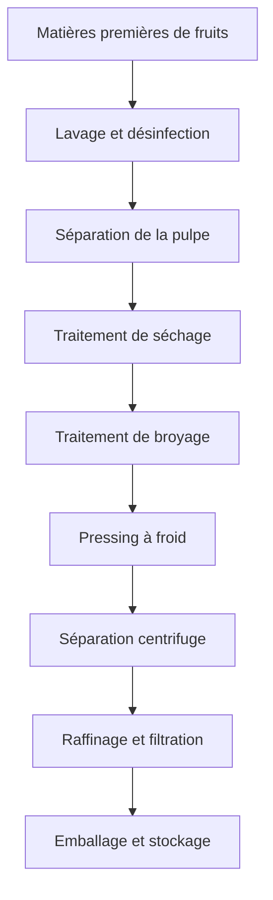

# Solutions d'huile de fruits

## Aperçu

Les huiles de fruits proviennent de diverses pulpes de fruits, noyaux ou graines, présentant des composants nutritionnels uniques et une valeur santé. Shandong Shengshi Hecheng Machinery Co., Ltd. fournit des solutions professionnelles de transformation d'huile de fruits pour répondre à la demande du marché d'huiles alimentaires haut de gamme et d'aliments fonctionnels.

## Principales cultures fruitières

### 🥑 Avocat/Fruit d'huile de vache (Huile d'avocat)
**Teneur en huile** : 15-25%
**Caractéristiques** : Haute teneur en acides gras insaturés, beauté et soins de la peau
**Équipement approprié** : Presse spéciale série 300/325
**Technologie de transformation** : Séparation de la pulpe → Pressing à froid → Filtration → Réfrigération

### 🍇 Pépins de raisin (Huile de pépins de raisin)
**Teneur en huile** : 12-18%
**Caractéristiques** : Haute teneur en polyphénols, antioxydant puissant
**Équipement approprié** : Presse spéciale série 300/325
**Technologie de transformation** : Séparation de la coque des graines → Pressing à froid → Filtration → Raffinage

### 🎃 Graines de citrouille (Huile de graines de citrouille)
**Teneur en huile** : 35-45%
**Caractéristiques** : Riche en carotène, nutrition équilibrée
**Équipement approprié** : Presse spéciale série 300/325
**Technologie de transformation** : Décorticage → Pressing à froid → Filtration

### 🍉 Graines de pastèque (Huile de graines de pastèque)
**Teneur en huile** : 40-50%
**Caractéristiques** : Naturellement rafraîchissant, adapté à la consommation estivale
**Équipement approprié** : Presse spéciale série 300/325
**Technologie de transformation** : Décorticage → Pressing à froid → Filtration

### 🧵 Noyaux de graines de coton (Huile de coton)
**Teneur en huile** : 35-45%
**Caractéristiques** : Huile industrielle, nécessite une détoxification professionnelle
**Équipement approprié** : Presse industrielle série 425/480
**Technologie de transformation** : Décorticage → Cuisson à la vapeur → Pressing → Détoxification → Raffinage

### 🍑 Noyau de pêche/Noyau d'amande (Huile de noyaux)
**Teneur en huile** : 40-50%
**Caractéristiques** : Valeur médicinale, beauté et soins de la peau
**Équipement approprié** : Presse spéciale série 300/325
**Technologie de transformation** : Décorticage → Pressing à froid → Filtration → Raffinage

## Recommandations d'équipement

### Transformation à petite échelle (0,5-2 tonnes/jour)
- **Presse spéciale pour huile série 300/325**
- Équipement de prétraitement des fruits
- Système de contrôle de température
- Coût d'investissement : 400 000-1 000 000 yuans

### Transformation à moyenne échelle (2-8 tonnes/jour)
- **Presse pour huile série 355/400**
- Ligne de prétraitement automatisée
- Système de contrôle de température et d'humidité
- Coût d'investissement : 2 000 000-5 000 000 yuans

### Transformation à grande échelle (8+ tonnes/jour)
- **Presse pour huile série 425/480**
- Ligne de production entièrement automatique
- Système de gestion intelligent
- Coût d'investissement : 8 000 000 yuans+

## Processus de transformation

## Avantages techniques

### ❄️ Technologie de pressage à froid
- Conservation des composants nutritionnels
- Conservation de la saveur naturelle
- Augmentation de la valeur du produit

### 🎯 Extraction précise
- Séparation complète de la pulpe
- Extraction complète de l'huile
- Élimination efficace des impuretés

### 🔄 Production continue
- Ligne de production automatisée
- Processus de pressage continu
- Contrôle qualité intelligent

## Applications des produits

### 🍳 Huile alimentaire haut de gamme
- Huile nutritionnelle spéciale
- Huile saine biologique
- Huile alimentaire fonctionnelle

### 💄 Beauté et soins de la peau
- Huile naturelle pour soins de la peau
- Huile essentielle pour massage
- Matière première pour produits capillaires

### 💊 Produits de santé et de nutrition
- Compléments nutritionnels
- Aliments fonctionnels
- Préparations médicamenteuses

## Valeur nutritionnelle

### 🥑 Huile d'avocat
- Haute teneur en vitamine E
- Riche en acides gras insaturés
- Bons effets de beauté et de soins de la peau

### 🍇 Huile de pépins de raisin
- Riche en OPC
- Capacité antioxydante puissante
- Protection cardiovasculaire

### 🎃 Huile de graines de citrouille
- Haute teneur en zinc
- Santé de la prostate
- Soutien du système immunitaire

## Perspectives du marché

### 📈 Tendances de développement
- Essor des aliments fonctionnels
- Croissance de la demande de beauté santé
- Expansion du marché des huiles haut de gamme

### 🎯 Marchés cibles
- Marques alimentaires haut de gamme
- Entreprises de soins de la peau
- Fabricants de produits de santé
- Sociétés professionnelles de nutrition

## Garantie de service

### 🛠️ Support technique
- Optimisation des paramètres de processus
- Installation et mise en service de l'équipement
- Formation du personnel opérationnel
- Orientation sur le contrôle de qualité

### 🔧 Service après-vente
- Support technique 7×24 heures
- Fourniture rapide de pièces détachées
- Service de maintenance régulier
- Services de mise à niveau technique

### 📊 Services de données
- Analyse des données de production
- Rapport d'inspection de qualité
- Analyse des tendances du marché
- Recherche sur les besoins des clients

## Études de cas

### Usine de transformation d'huile de fruits haut de gamme du Shandong
- **Configuration de l'équipement** : Presse spéciale série 355 × 2 unités
- **Capacité de traitement quotidienne** : 6 tonnes de fruits mélangés
- **Catégories de produits** : Huile de pépins de raisin, huile d'avocat, huile de graines de citrouille
- **Positionnement du marché** : Huile alimentaire biologique haut de gamme
- **Ventes annuelles** : 15 000 000 yuans

### Entreprise de soins de la peau du Zhejiang
- **Configuration de l'équipement** : Presse spéciale série 300 × 4 unités
- **Capacité de traitement quotidienne** : 4 tonnes de noyaux d'amande
- **Application du produit** : Matière première pour produits de soin de la peau
- **Qualité du produit** : Répond aux normes cosmétiques
- **Marché d'exportation** : Europe, Amérique du Nord

### Entreprise d'aliments fonctionnels du Henan
- **Configuration de l'équipement** : Presse pour huile série 400 × 1 unité
- **Capacité de traitement quotidienne** : 3 tonnes de pépins de raisin
- **Application du produit** : Matière première pour produits de santé
- **Norme de qualité** : Certification GMP
- **Production annuelle** : 2 000 tonnes

## Normes de qualité

### 🏆 Normes de qualité des produits
- Répond aux normes nationales d'huiles alimentaires
- Répond à la certification de produits biologiques
- Répond aux normes d'aliments d'exportation
- Répond aux normes de beauté et de soins de la peau

### 🔍 Éléments de test
- Test de valeur d'acidité
- Test de valeur de peroxyde
- Test de couleur et de transparence
- Test de teneur en métaux lourds
- Test de résidus de pesticides
- Analyse des composants nutritionnels

## Développement durable

### 🌱 Production respectueuse de l'environnement
- Valorisation du recyclage des déchets
- Processus d'économie d'énergie et de réduction des émissions
- Standards de production verte

### 🔄 Valorisation des ressources
- Utilisation complète des fruits
- Développement de sous-produits
- Extension de la chaîne industrielle

## Nous contacter

Si vous êtes intéressé par les solutions de transformation d'huile de fruits, veuillez contacter notre équipe d'experts :

- 📞 **Ligne directe** : +86 19906365856
- 📧 **Email** : sales@oil-pressing-machine.com
- 📍 **Adresse** : N° 5888, rue Yineng, zone de développement, ville de Qingzhou, ville de Weifang, province du Shandong, Chine

Nous fournissons des consultations techniques gratuites, des tests d'échantillons et des services d'inspection sur site, en personnalisant les solutions de transformation d'huile de fruits les plus adaptées pour vous.