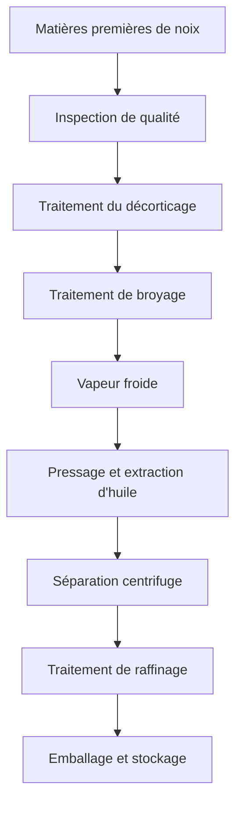

# Solutions d'huile de noix

## Aperçu

Les huiles de noix ont une teneur élevée en huile, une valeur nutritionnelle riche et une valeur ajoutée élevée. Shandong Shengshi Hecheng Machinery Co., Ltd. fournit des solutions professionnelles de transformation d'huile de noix pour répondre aux besoins d'huiles alimentaires haut de gamme et de matières premières pour produits de soin de la peau.

## Principales cultures de noix

### 🥥 Noix de coco/Pulpe de noix de coco (Huile de noix de coco)
**Teneur en huile** : 60-70%
**Caractéristiques** : Haute teneur en acides gras saturés, bonne stabilité
**Équipement approprié** : Presse spéciale série 300/325
**Technologie de transformation** : Séparation de la pulpe de noix de coco → Séchage → Pressage à froid → Filtration

### 🌴 Fruit de palme/Noyau de palme (Huile de palme/Huile de noyau de palme)
**Teneur en huile** : 45-55%
**Caractéristiques** : Huile industrielle, point de fusion modéré
**Équipement approprié** : Presse industrielle série 425/480
**Technologie de transformation** : Séparation de la pulpe → Cuisson → Pressage → Raffinage

### 🥜 Noix (Huile de noix)
**Teneur en huile** : 60-70%
**Caractéristiques** : Riche en acides gras insaturés, haute valeur nutritionnelle
**Équipement approprié** : Presse spéciale série 300/325
**Technologie de transformation** : Décorticage → Pressage à froid → Filtration → Réfrigération

### 🌰 Amande/Amande amère (Huile d'amande)
**Teneur en huile** : 45-55%
**Caractéristiques** : Beauté et soins de la peau, valeur médicinale
**Équipement approprié** : Presse spéciale série 300/325
**Technologie de transformation** : Décorticage → Pressage à froid → Filtration → Raffinage

### 🌰 Noisette (Huile de noisette)
**Teneur en huile** : 55-65%
**Caractéristiques** : Haute teneur en vitamine E, antioxydant
**Équipement approprié** : Presse spéciale série 300/325
**Technologie de transformation** : Décorticage → Pressage à froid → Filtration

### 🥜 Noix de cajou (Huile de noix de cajou)
**Teneur en huile** : 40-50%
**Caractéristiques** : Arôme spécial, aliment de haute qualité
**Équipement approprié** : Presse spéciale série 300/325
**Technologie de transformation** : Décorticage → Pressage à froid → Filtration

### 🥜 Pistache (Huile de pistache)
**Teneur en huile** : 45-55%
**Caractéristiques** : Vert et sain, nutrition équilibrée
**Équipement approprié** : Presse spéciale série 300/325
**Technologie de transformation** : Décorticage → Pressage à froid → Filtration

## Recommandations d'équipement

### Transformation à petite échelle (0,5-2 tonnes/jour)
- **Presse spéciale pour huile série 300/325**
- Équipement de prétraitement des noix
- Système de contrôle de température
- Coût d'investissement : 300 000-800 000 yuans

### Transformation à moyenne échelle (2-10 tonnes/jour)
- **Presse pour huile série 355/400**
- Ligne de prétraitement automatisée
- Système de contrôle de température
- Coût d'investissement : 1 500 000-4 000 000 yuans

### Transformation à grande échelle (10+ tonnes/jour)
- **Presse pour huile série 425/480**
- Ligne de production entièrement automatique
- Système de contrôle intelligent
- Coût d'investissement : 6 000 000 yuans+

## Processus de transformation

## Avantages techniques

### ❄️ Technologie de pressage à froid
- Conservation des composants nutritionnels
- Conservation de l'arôme naturel
- Amélioration de la stabilité de l'huile

### 🎯 Contrôle précis
- Contrôle de température : précision ±1℃
- Contrôle de pression : réglage intelligent
- Contrôle du temps : paramètres de processus optimaux

### 🔄 Production continue
- Ligne de production automatisée
- Processus de pressage continu
- Système de surveillance intelligent

## Applications des produits

### 🍳 Huile alimentaire
- Huile alimentaire haut de gamme
- Huile nutritionnelle spéciale
- Huile alimentaire biologique

### 💄 Beauté et soins de la peau
- Huile naturelle pour soins de la peau
- Huile essentielle pour massage
- Matière première pour produits capillaires

### 💊 Produits de santé
- Compléments nutritionnels
- Aliments fonctionnels
- Préparations médicamenteuses

## Perspectives du marché

### 📈 Tendances de développement
- Croissance de la demande de produits alimentaires sains
- Expansion du marché de la beauté et des soins de la peau
- Développement du marché des huiles haut de gamme

### 🎯 Marchés cibles
- Marques alimentaires haut de gamme
- Entreprises de soins de la peau
- Fabricants de produits de santé
- Sociétés professionnelles de nutrition

## Garantie de service

### 🛠️ Support technique
- Optimisation des paramètres de processus
- Mise en service et exploitation de l'équipement
- Formation du personnel opérationnel
- Orientation sur le contrôle de qualité

### 🔧 Service après-vente
- Support technique 7×24 heures
- Fourniture rapide de pièces détachées
- Service de maintenance régulier
- Services de mise à niveau technique

### 📊 Services de données
- Analyse des données de production
- Rapport d'inspection de qualité
- Analyse des tendances du marché
- Recherche sur les besoins des clients

## Études de cas

### Usine d'huile de noix haut de gamme du Shandong
- **Configuration de l'équipement** : Presse spéciale série 355 × 2 unités
- **Capacité de traitement quotidienne** : 8 tonnes de noix mélangées
- **Catégories de produits** : Huile de noix, huile d'amande, huile de noisette
- **Positionnement du marché** : Huile alimentaire biologique haut de gamme
- **Ventes annuelles** : 20 000 000 yuans

### Entreprise de soins de la peau du Zhejiang
- **Configuration de l'équipement** : Presse spéciale série 300 × 3 unités
- **Capacité de traitement quotidienne** : 3 tonnes de noyaux d'amande
- **Application du produit** : Matière première pour produits de soin de la peau
- **Qualité du produit** : Répond aux normes cosmétiques
- **Marché d'exportation** : Europe, Japon

### Entreprise de transformation de noix du Henan
- **Configuration de l'équipement** : Presse pour huile série 400 × 1 unité
- **Capacité de traitement quotidienne** : 5 tonnes de noix
- **Série de produits** : Huile de noix, noyaux de noix
- **Création de marque** : Marque régionale connue
- **Couverture du marché** : 20+ provinces à l'échelle nationale

## Normes de qualité

### 🏆 Normes de qualité des produits
- Répond aux normes nationales d'huiles alimentaires
- Répond à la certification de produits biologiques
- Répond aux normes d'aliments d'exportation
- Répond aux normes de beauté et de soins de la peau

### 🔍 Éléments de test
- Test de valeur d'acidité
- Test de valeur de peroxyde
- Test de couleur et de transparence
- Test de teneur en métaux lourds
- Test de résidus de pesticides

## Nous contacter

Si vous êtes intéressé par les solutions de transformation d'huile de noix, veuillez contacter notre équipe d'experts :

- 📞 **Ligne directe** : +86 19906365856
- 📧 **Email** : sales@oil-pressing-machine.com
- 📍 **Adresse** : N° 5888, rue Yineng, zone de développement, ville de Qingzhou, ville de Weifang, province du Shandong, Chine

Nous fournissons des consultations techniques gratuites et des services d'inspection sur site, en personnalisant les solutions de transformation d'huile de noix les plus adaptées pour vous.