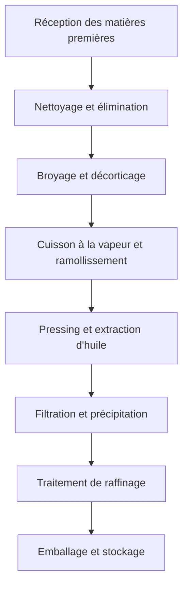

# Solutions d'huile de graines

## Aperçu

Les huiles de graines sont la principale source d'huiles industrielles et alimentaires, caractérisées par un rendement élevé, un faible coût et une technologie de transformation mature. Shandong Shengshi Hecheng Machinery Co., Ltd. fournit des solutions complètes de transformation d'huile de graines de petites ateliers à grandes usines.

## Principales cultures oléagineuses

### 🌱 Soja (Huile de soja)
**Teneur en huile** : 18-22%
**Caractéristiques** : Source de protéines de haute qualité, huile claire
**Équipement approprié** : Presse à huile série 355/400
**Technologie de transformation** : Trempage → Cuisson à la vapeur → Pressing → Filtration

### 🥜 Arachide (Huile d'arachide)
**Teneur en huile** : 45-55%
**Caractéristiques** : Arôme riche, haute nutrition
**Équipement approprié** : Presse à huile série 300/325
**Technologie de transformation** : Décorticage → Cuisson à la vapeur → Pressing → Filtration

### 🌰 Sésame (Huile de sésame)
**Teneur en huile** : 50-60%
**Caractéristiques** : Arôme unique, antioxydant puissant
**Équipement approprié** : Presse spéciale série 300/325
**Technologie de transformation** : Nettoyage → Torréfaction → Pressing → Filtration

### 🌿 Colza/Canola (Huile de colza)
**Teneur en huile** : 35-45%
**Caractéristiques** : Rendement élevé, prix abordable
**Équipement approprié** : Presse à huile série 355/400
**Technologie de transformation** : Décorticage → Cuisson à la vapeur → Pressing → Raffinage

### 🌻 Graines de tournesol (Huile de tournesol)
**Teneur en huile** : 40-50%
**Caractéristiques** : Couleur dorée, goût rafraîchissant
**Équipement approprié** : Presse à huile série 355/400
**Technologie de transformation** : Décorticage → Cuisson à la vapeur → Pressing → Filtration

### 🧵 Graines de coton (Huile de coton)
**Teneur en huile** : 35-45%
**Caractéristiques** : Huile industrielle, nécessite une détoxification
**Équipement approprié** : Presse industrielle série 425/480
**Technologie de transformation** : Décorticage → Cuisson à la vapeur → Pressing → Détoxification → Raffinage

### 🍇 Pépins de raisin (Huile de pépins de raisin)
**Teneur en huile** : 12-18%
**Caractéristiques** : Riche en nutriments, antioxydant puissant
**Équipement approprié** : Presse spéciale série 300/325
**Technologie de transformation** : Décorticage → Pressing à froid → Filtration → Raffinage

### 🌾 Sarrasin (Huile de sarrasin)
**Teneur en huile** : 25-35%
**Caractéristiques** : Huile céréalière, nutrition équilibrée
**Équipement approprié** : Presse spéciale série 300/325
**Technologie de transformation** : Nettoyage → Cuisson à la vapeur → Pressing → Filtration

### 🌾 Lin (Huile de lin)
**Teneur en huile** : 35-45%
**Caractéristiques** : Haute teneur en oméga-3
**Équipement approprié** : Presse spéciale série 300/325
**Technologie de transformation** : Pressing à froid → Filtration → Réfrigération

### 🍵 Graines de thé/Graines de camélia (Huile de graines de thé)
**Teneur en huile** : 25-35%
**Caractéristiques** : Haute teneur en polyphénols de thé, antioxydant
**Équipement approprié** : Presse à huile série 300/325
**Technologie de transformation** : Décorticage → Pressing à froid → Filtration

### 🌱 Graines de périlla (Huile de périlla/Huile de graines de ssu)
**Teneur en huile** : 40-50%
**Caractéristiques** : Arôme spécial, valeur médicinale
**Équipement approprié** : Presse spéciale série 300/325
**Technologie de transformation** : Pressing à froid → Filtration → Raffinage

## Recommandations d'équipement

### Transformation à petite échelle (1-5 tonnes/jour)
- **Presse à huile série 300/325**
- Équipement de prétraitement de base
- Système de filtration simple
- Coût d'investissement : 200 000-500 000 yuans

### Transformation à moyenne échelle (5-20 tonnes/jour)
- **Presse à huile série 355/400**
- Ligne de prétraitement complète
- Système de filtration fine
- Coût d'investissement : 1 000 000-3 000 000 yuans

### Transformation à grande échelle (20+ tonnes/jour)
- **Presse à huile série 425/480**
- Ligne de prétraitement entièrement automatique
- Système d'équipement de raffinage
- Coût d'investissement : 5 000 000 yuans+

## Processus de transformation

## Avantages techniques

### 🎯 Contrôle précis
- Contrôle de température : précision ±2℃
- Contrôle de pression : réglage précis
- Contrôle d'humidité : teneur en humidité optimale

### 🔄 Production continue
- Fonctionnement ininterrompu 24 heures
- Alimentation et déchargement automatisés
- Alarme de panne intelligente

### 💧 Garantie de qualité de l'huile
- Pressing physique, sans résidus chimiques
- Procédé de pressage à froid préserve les nutriments
- Rendement en huile leader de l'industrie

## Perspectives du marché

### 📈 Tendances de développement
- Croissance de la demande d'huiles alimentaires saines
- Expansion du marché des produits biologiques
- Augmentation des opportunités de commerce exportateur

### 🎯 Marchés cibles
- Entreprises de transformation alimentaire intérieures
- Sociétés commerciales exportatrices
- Marques d'aliments santé
- Chaînes de restauration

## Garantie de service

### 🛠️ Support technique
- Installation et mise en service de l'équipement
- Formation du personnel opérationnel
- Orientation sur la technologie du processus
- Suggestions d'optimisation de formule

### 🔧 Service après-vente
- Support technique 24 heures
- Fourniture rapide de pièces détachées
- Service de maintenance régulier
- Service technique à vie

### 📊 Services de données
- Surveillance en temps réel des données de production
- Analyse de l'état de fonctionnement de l'équipement
- Suggestions d'optimisation de la consommation d'énergie
- Statistiques de qualité de production

## Études de cas

### Grande huilerie du Shandong
- **Configuration de l'équipement** : Presse à huile série 425 × 5 unités
- **Capacité de traitement quotidienne** : 50 tonnes de soja
- **Rendement en huile** : 18,5%
- **Production annuelle** : 3 000 tonnes d'huile de soja
- **Retour sur investissement** : Remboursement en 2 ans

### Usine professionnelle d'huile d'arachide du Henan
- **Configuration de l'équipement** : Presse à huile série 355 × 3 unités
- **Capacité de traitement quotidienne** : 15 tonnes d'arachides
- **Rendement en huile** : 48%
- **Qualité du produit** : Norme nationale de première classe
- **Couverture du marché** : 20 villes de la province

## Nous contacter

Si vous êtes intéressé par les solutions de transformation d'huile de graines, veuillez contacter notre équipe technique :

- 📞 **Ligne directe** : +86 19906365856
- 📧 **Email** : gavin@oil-pressing-machine.com
- 📍 **Adresse** : N° 5888, rue Yineng, zone de développement, ville de Qingzhou, ville de Weifang, province du Shandong, Chine

Nous fournirons des solutions personnalisées en fonction de vos besoins spécifiques et un support technique.