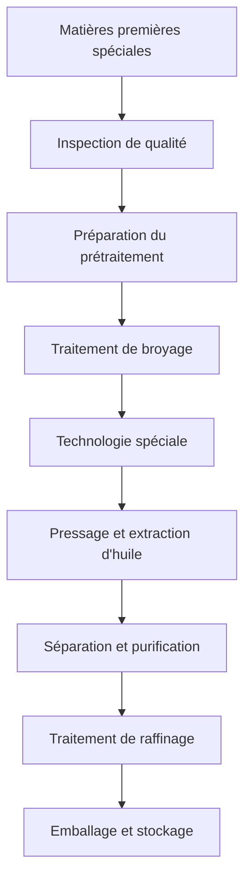

# Solutions d'huiles spéciales

## Aperçu

Les huiles spéciales comprennent la son d'origine, le germe de maïs, les graines de ricin, etc., présentant une valeur nutritionnelle unique et des applications industrielles. Shandong Shengshi Hecheng Machinery Co., Ltd. fournit des solutions professionnelles de transformation d'huiles spéciales pour répondre aux demandes diversifiées du marché.

## Principales cultures d'huiles spéciales

### 🍚 Son d'origine (Huile de son d'origine)
**Teneur en huile** : 15-25%
**Caractéristiques** : Haute teneur en antioxydant naturel γ-oryzanol
**Équipement approprié** : Presse spéciale série 300/325
**Technologie de transformation** : Extraction de son d'origine → Pressage à froid → Filtration → Raffinage

### 🌽 Germe de maïs (Huile de maïs)
**Teneur en huile** : 35-45%
**Caractéristiques** : Riche en vitamine E, bonne stabilité
**Équipement approprié** : Presse à huile série 355/400
**Technologie de transformation** : Séparation des germes → Séchage → Pressage → Filtration

### 🌿 Graines de ricin (Huile de ricin)
**Teneur en huile** : 45-55%
**Caractéristiques** : Huile lubrifiante industrielle, matière première pour biodiesel
**Équipement approprié** : Presse industrielle série 425/480
**Technologie de transformation** : Décorticage → Cuisson → Pressage → Raffinage

### 🌶️ Graines de piment (Huile de graines de piment)
**Teneur en huile** : 15-25%
**Caractéristiques** : Haute teneur en capsaïcine, valeur pour la santé
**Équipement approprié** : Presse spéciale série 300/325
**Technologie de transformation** : Décorticage → Pressage à froid → Filtration

### 🍇 Pépins de raisin/Graines de sarrasin (Huile de haute valeur)
**Teneur en huile** : 10-20%
**Caractéristiques** : Haute teneur en polyphénols, forte capacité antioxydante
**Équipement approprié** : Presse spéciale série 300/325
**Technologie de transformation** : Séparation de la coque des graines → Pressage à froid → Filtration → Raffinage

## Recommandations d'équipement

### Transformation à petite échelle (0,5-3 tonnes/jour)
- **Presse spéciale pour huile série 300/325**
- Équipement de prétraitement spécial
- Système de contrôle de température
- Coût d'investissement : 500 000-1 200 000 yuans

### Transformation à moyenne échelle (3-15 tonnes/jour)
- **Presse à huile série 355/400**
- Ligne de prétraitement automatisée
- Système de filtration multi-niveaux
- Coût d'investissement : 2 500 000-6 000 000 yuans

### Transformation à grande échelle (15+ tonnes/jour)
- **Presse à huile série 425/480**
- Ligne de production entièrement automatique
- Système de gestion intelligent
- Coût d'investissement : 10 000 000 yuans+

## Processus de transformation

## Avantages techniques

### 🎯 Technologie spéciale
- Prétraitement ciblé
- Processus de pressage dédié
- Méthodes de raffinage spéciales

### ❄️ Protection basse température
- Conservation des ingrédients actifs
- Maintien des caractéristiques naturelles
- Augmentation de la valeur du produit

### 🔄 Contrôle précis
- Contrôle précis des paramètres
- Surveillance en temps réel de la qualité
- Réglage automatique

## Applications des produits

### 💊 Matières premières pour produits de santé
- Antioxydants naturels
- Nutriments fonctionnels
- Préparations médicamenteuses

### 🏭 Applications industrielles
- Huile de base lubrifiante
- Matière première pour biodiesel
- Matières premières chimiques

### 🍳 Huile alimentaire spéciale
- Huile nutritionnelle haut de gamme
- Huile alimentaire fonctionnelle
- Huile d'assaisonnement spéciale

## Valeur nutritionnelle et santé

### 🍚 Huile de son d'origine
- Haute teneur en γ-oryzanol
- Forte capacité antioxydante
- Protection cardiovasculaire

### 🌽 Huile de maïs
- Riche en vitamine E
- Acides gras insaturés équilibrés
- Protection de la santé de la peau

### 🌶️ Huile de graines de piment
- Haute teneur en capsaïcine
- Stimuler le métabolisme
- Renforcer l'immunité

## Perspectives du marché

### 📈 Tendances de développement
- Croissance de la demande d'aliments fonctionnels
- Expansion du marché des antioxydants naturels
- Augmentation de l'application de matériaux bio-sourcés

### 🎯 Marchés cibles
- Entreprises de produits de santé
- Entreprises de transformation alimentaire
- Entreprises de matières premières chimiques
- Marques de beauté et de soins de la peau

## Garantie de service

### 🛠️ Support technique
- Recherche de processus spéciaux
- Conception personnalisée d'équipements
- Formation aux technologies d'exploitation
- Orientation sur le contrôle de qualité

### 🔧 Service après-vente
- Support technique 7×24 heures
- Fourniture de pièces spéciales
- Maintenance technique régulière
- Mise à jour de l'optimisation du processus

### 📊 Services de données
- Analyse des données de production
- Rapport d'inspection de qualité
- Analyse des tendances du marché
- Recherche sur les besoins des clients

## Études de cas

### Entreprise de transformation d'huile de son d'origine du Shandong
- **Configuration de l'équipement** : Presse spéciale série 355 × 2 unités
- **Capacité de traitement quotidienne** : 10 tonnes de son d'origine
- **Positionnement du produit** : Huile nutritionnelle haut de gamme
- **Avantage concurrentiel** : Teneur en γ-oryzanol leader de l'industrie
- **Ventes annuelles** : 8 000 000 yuans

### Usine de transformation d'huile de maïs du Henan
- **Configuration de l'équipement** : Presse à huile série 400 × 1 unité
- **Capacité de traitement quotidienne** : 8 tonnes de germes de maïs
- **Qualité du produit** : Répond au standard national de première classe
- **Création de marque** : Marque régionale connue
- **Couverture du marché** : 10+ provinces à l'échelle nationale

### Entreprise de transformation d'huile de ricin du Hebei
- **Configuration de l'équipement** : Presse industrielle série 425 × 1 unité
- **Capacité de traitement quotidienne** : 12 tonnes de graines de ricin
- **Application du produit** : Huile lubrifiante industrielle
- **Norme de qualité** : Répond aux standards industriels
- **Production annuelle** : 50 000 tonnes

## Normes de qualité

### 🏆 Normes de qualité des produits
- Répond aux normes nationales pertinentes
- Répond aux exigences de qualité de l'industrie
- Répond aux normes de qualité d'exportation
- Répond aux normes de sécurité et d'hygiène

### 🔍 Éléments de test
- Test des indicateurs physico-chimiques
- Analyse des composants nutritionnels
- Test de sécurité
- Test de stabilité
- Test de composants spéciaux

## Innovation technologique

### 🔬 Innovation du processus
- Nouvelle technologie d'extraction
- Processus de protection basse température
- Technologie de séparation efficace

### 📊 Piloté par les données
- Contrôle qualité intelligent
- Application de l'analyse de big data
- Optimisation des paramètres de processus

### 🌱 Développement durable
- Valorisation complète des ressources
- Processus d'économie d'énergie et de réduction des émissions
- Standards de production verte

## Nous contacter

Si vous êtes intéressé par les solutions de transformation d'huiles spéciales, veuillez contacter notre équipe d'experts :

- 📞 **Ligne directe** : +86 19906365856
- 📧 **Email** : sales@oil-pressing-machine.com
- 📍 **Adresse** : N° 5888, rue Yineng, zone de développement, ville de Qingzhou, ville de Weifang, province du Shandong, Chine

Nous fournissons des consultations techniques gratuites, des tests d'échantillons et des services de vérification de processus, en vous offrant les solutions de transformation d'huiles spéciales les plus professionnelles.