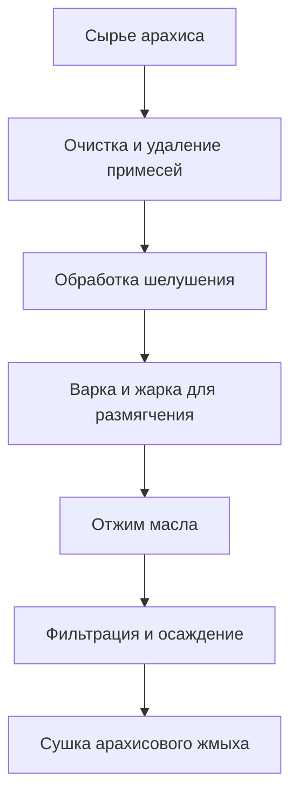
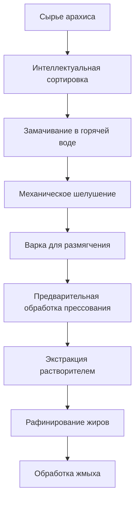

# Решение для арахиса (арахисовое масло)

## Обзор

Арахис - важная масличная и экономическая культура, арахисовое масло имеет уникальный вкус и богатую питательную ценность. Shandong Shengshi Hecheng Machinery Co., Ltd. предоставляет профессиональные решения для отжима арахиса, отвечая различным потребностям от малых мастерских до крупных заводов.

## Характеристики арахиса

### 📊 Основные параметры
- **Содержание масла**: 45-55%
- **Содержание белка**: 25-30%
- **Основные жирные кислоты**: Олеиновая кислота (40-50%), линолевая кислота (30-40%)
- **Подходящая температура**: Контроль температуры отжима при 80-100℃

### 🌱 Характеристики роста
- **Цикл роста**: 120-150 дней
- **Подходящий климат**: Теплые и солнечные регионы
- **Требования к почве**: Рыхлая и плодородная песчаная почва
- **Годовое производство**: Годовое производство в Китае превышает 16 миллионов тонн

## Процесс обработки

### Традиционный процесс

### Современный процесс

## Решение горячего отжима
Дробилка пасты для измельчения в гранулы + вок с плоским дном с проводящим тепло маслом для жарки пасты + маслобойный пресс (модель 300) + дробилка лепешки + плоский фильтр масла 15 слоев

## Решение холодного отжима
Дробилка пасты для измельчения в гранулы + маслобойный пресс (модель 300) + дробилка лепешки + плоский фильтр масла 15 слоев

## Рекомендации по оборудованию

### Маленькая обработка (горячий отжим ежедневное производство масла около 1 тонны, система работы 24 часа, включая дробилку пасты для измельчения в гранулы + вок с плоским дном с проводящим тепло маслом для жарки пасты + маслобойный пресс (300) + дробилку лепешки + плоский фильтр масла 15 слоев)
- **Специализированный пресс серии 300**
- Оборудование предварительной обработки арахиса
- Простая система рафинирования
- Стоимость инвестиций: около 60 000 юаней

### Средняя обработка (2 комплекта оборудования, горячий отжим ежедневное производство масла около 2 тонн, система работы 24 часа, включая дробилку пасты для измельчения в гранулы + вок с плоским дном с проводящим тепло маслом для жарки пасты + маслобойный пресс (300) + дробилку лепешки + плоский фильтр масла 15 слоев)
- **Пресс серии 300**
- Интеграция масляной цепи
- Тот же процесс + более высокое производство масла
- Простая система рафинирования
- Стоимость инвестиций: около 130 000 юаней (включая индивидуальный вок для жарки + индивидуальный фильтр масла)

### Большая обработка (5 комплектов оборудования, горячий отжим ежедневное производство масла более 5 тонн, система работы 24 часа, включая дробилку пасты для измельчения в гранулы + вок с плоским дном с проводящим тепло маслом для жарки пасты + маслобойный пресс (300) + дробилку лепешки + плоский фильтр масла 20 слоев)
- **Пресс серии 300**
- Интеграция масляной цепи
- Тот же процесс + более высокое производство масла
- 
- Стоимость инвестиций: более 15 миллионов юаней

### Большая обработка (горячий отжим ежедневное производство масла более 5 тонн, система работы почасовая, включая дробилку пасты для измельчения в гранулы + вок с плоским дном с проводящим тепло маслом для жарки пасты + маслобойный пресс (300) + дробилку лепешки + плоский фильтр масла 15 слоев)
- **Пресс серии 425/480**
- Полностью автоматическая линия производства
- Интеллектуальная система управления
- Стоимость инвестиций: более 15 миллионов юаней

## Технические преимущества

### 🎯 Точный контроль
- Контроль температуры: точность ±2℃
- Контроль давления: интеллектуальная регулировка
- Время жарки: оптимальные параметры процесса

### 💧 Гарантия качества масла
- Процесс горячего отжима подчеркивающий вкус
- Физический отжим гарантирующий чистоту
- Выход масла достигающий 48-50%

### 🔄 Непрерывное производство
- Автоматизированный процесс производства
- Непрерывный процесс отжима
- Интеллектуальный мониторинг качества

## Применение продуктов

### 🍳 Пищевое масло
- Арахисовое масло: качественное пищевое масло
- Смешанное масло: смешанное с другими жирами
- Специальное масло: высококачественное питательное масло

### 🥛 Побочные продукты
- Арахисовый жмых: качественный протеиновый корм
- Арахисовая скорлупа: топливо или корм
- Арахисовый белок: пищевая добавка

### 💊 Функциональные продукты
- Арахидоновая кислота
- Арахисовые полифенолы
- Арахисовые фосфолипиды

## Анализ рынка

### 📈 Тенденции развития
- Рост спроса на здоровое пищевое масло
- Расширение рынка высококачественного арахисового масла
- Увеличение возможностей экспортной торговли

### 🎯 Целевой рынок
- Предприятия по переработке пищевого масла
- Предприятия по переработке пищевых продуктов
- Предприятия ресторанных сетей
- Предприятия экспортной торговли

## Стандарты качества

### 🏆 Стандарты качества продукта
- Соответствует национальным стандартам арахисового масла (GB 1535)
- Соответствует стандартам безопасности пищевых продуктов
- Соответствует стандартам экспорта пищевых продуктов
- Соответствует сертификации органических пищевых продуктов

### 🔍 Элементы тестирования
- Тест кислотного индекса
- Тест перекисного значения
- Тест цвета и прозрачности
- Тест содержания тяжелых металлов
- Тест афлатоксина
- Тест остатков пестицидов

## Устойчивое развитие

### 🌱 Экологичное производство
- Переработка отходов
- Процессы экономии энергии и сокращения выбросов
- Стандарты зеленого производства

### 🔄 Использование ресурсов
- Комплексное использование побочных продуктов
- Расширение промышленной цепочки
- Модель круговой экономики

### 🌍 Социальная ответственность
- Поддержка увеличения доходов фермеров
- Гарантия безопасности пищевых продуктов
- Защита экологической среды

## Свяжитесь с нами

Если вы заинтересованы в решениях для отжима арахиса, пожалуйста, свяжитесь с нашей технической командой:

- 📞 **Линия консультаций**: +86 19906365856
- 📧 **Email**: gavin@oil-pressing-machine.com
- 📍 **Адрес**: № 5888, улица Иньэнь, зона развития Цинчжоу, Вэйфан, Шаньдун

Мы предоставляем бесплатные технические консультации, тестирование образцов и посещения на месте, чтобы предоставить вам наиболее подходящее решение для отжима арахиса.