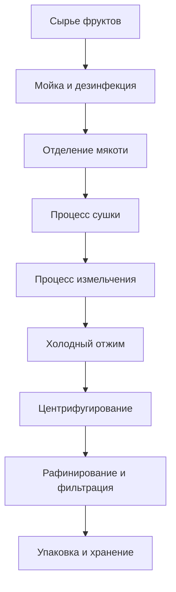

# Решения для масла фруктов

## Обзор

Масла фруктов получают из различных плодов, косточек или семян, обладая уникальными питательными компонентами и ценностью для здоровья. Компания Shandong Shengshi Hecheng Machinery Co., Ltd. предоставляет профессиональные решения для переработки масла фруктов, чтобы удовлетворить рыночный спрос на высококачественные пищевые масла и функциональные продукты питания.

## Основные плодовые культуры

### 🥑 Авокадо/Плод коровьего масла (Масло авокадо)
**Содержание масла**: 15-25%
**Особенности**: Высокое содержание ненасыщенных жирных кислот, красота и уход за кожей
**Подходящее оборудование**: Специальный пресс серии 300/325
**Технология переработки**: Отделение мякоти → Холодный отжим → Фильтрация → Охлаждение

### 🍇 Виноградные косточки (Масло виноградных косточек)
**Содержание масла**: 12-18%
**Особенности**: Высокое содержание полифенолов, сильный антиоксидант
**Подходящее оборудование**: Специальный пресс серии 300/325
**Технология переработки**: Отделение скорлупы семян → Холодный отжим → Фильтрация → Рафинирование

### 🎃 Тыквенные семечки (Масло тыквенных семечек)
**Содержание масла**: 35-45%
**Особенности**: Богато каротином, сбалансированное питание
**Подходящее оборудование**: Специальный пресс серии 300/325
**Технология переработки**: Обдирка → Холодный отжим → Фильтрация

### 🍉 Арбузные семечки (Масло арбузных семечек)
**Содержание масла**: 40-50%
**Особенности**: Естественно освежающее, подходит для летнего потребления
**Подходящее оборудование**: Специальный пресс серии 300/325
**Технология переработки**: Обдирка → Холодный отжим → Фильтрация

### 🧵 Ядра хлопковых семян (Хлопковое масло)
**Содержание масла**: 35-45%
**Особенности**: Промышленное масло, требует профессиональной детоксикации
**Подходящее оборудование**: Промышленный пресс серии 425/480
**Технология переработки**: Обдирка → Пропаривание → Отжим → Детоксикация → Рафинирование

### 🍑 Косточка персика/Косточка миндаля (Масло косточек)
**Содержание масла**: 40-50%
**Особенности**: Лекарственная ценность, красота и уход за кожей
**Подходящее оборудование**: Специальный пресс серии 300/325
**Технология переработки**: Обдирка → Холодный отжим → Фильтрация → Рафинирование

## Рекомендации по оборудованию

### Переработка в небольших масштабах (0,5-2 тонны/день)
- **Специальный пресс для масла серии 300/325**
- Оборудование предварительной обработки фруктов
- Система контроля температуры
- Стоимость инвестиций: 400 000-1 000 000 юаней

### Переработка в средних масштабах (2-8 тонн/день)
- **Пресс для масла серии 355/400**
- Автоматизированная линия предварительной обработки
- Система контроля температуры и влажности
- Стоимость инвестиций: 2 000 000-5 000 000 юаней

### Переработка в крупных масштабах (8+ тонн/день)
- **Пресс для масла серии 425/480**
- Полностью автоматическая производственная линия
- Интеллектуальная система управления
- Стоимость инвестиций: 8 000 000 юаней+

## Технологический процесс

## Технические преимущества

### ❄️ Технология холодного отжима
- Сохранение питательных компонентов
- Сохранение естественного вкуса
- Повышение стоимости продукции

### 🎯 Точная экстракция
- Полное отделение мякоти
- Полный отжим масла
- Эффективное удаление примесей

### 🔄 Непрерывное производство
- Автоматизированная производственная линия
- Непрерывный процесс отжима
- Интеллектуальный контроль качества

## Применение продукции

### 🍳 Высококачественное пищевое масло
- Специальное питательное масло
- Органическое здоровое масло
- Функциональное пищевое масло

### 💄 Красота и уход за кожей
- Натуральное масло для ухода за кожей
- Эфирное масло для массажа
- Сырье для продуктов по уходу за волосами

### 💊 Продукты для здоровья и питания
- Пищевые добавки
- Функциональные продукты питания
- Лекарственные препараты

## Питательная ценность

### 🥑 Масло авокадо
- Высокое содержание витамина Е
- Богато ненасыщенными жирными кислотами
- Хорошие эффекты красоты и ухода за кожей

### 🍇 Масло виноградных косточек
- Богато OPC
- Сильная антиоксидантная способность
- Защита сердечно-сосудистой системы

### 🎃 Масло тыквенных семечек
- Высокое содержание цинка
- Здоровье простаты
- Поддержка иммунной системы

## Перспективы рынка

### 📈 Тенденции развития
- Рост функциональных продуктов питания
- Рост спроса на здоровую красоту
- Расширение рынка высококачественных масел

### 🎯 Целевые рынки
- Высококачественные пищевые бренды
- Предприятия по уходу за кожей
- Производители продуктов для здоровья
- Профессиональные компании по питанию

## Гарантия обслуживания

### 🛠️ Техническая поддержка
- Оптимизация параметров процесса
- Установка и наладка оборудования
- Обучение операционного персонала
- Руководство по контролю качества

### 🔧 Послепродажное обслуживание
- Техническая поддержка 7×24 часа
- Быстрая поставка запчастей
- Регулярное сервисное обслуживание
- Услуги технического обновления

### 📊 Услуги по работе с данными
- Анализ производственных данных
- Отчет о контроле качества
- Анализ рыночных тенденций
- Исследование потребительских потребностей

## Кейсы

### Фабрика высококачественной переработки масла фруктов в провинции Шаньдун
- **Конфигурация оборудования**: Специальный пресс серии 355 × 2 единицы
- **Ежедневная мощность переработки**: 6 тонн смешанных фруктов
- **Категории продукции**: Масло виноградных косточек, масло авокадо, масло тыквенных семечек
- **Позиционирование рынка**: Высококачественное органическое пищевое масло
- **Годовые продажи**: 15 000 000 юаней

### Предприятие по уходу за кожей в провинции Чжэцзян
- **Конфигурация оборудования**: Специальный пресс серии 300 × 4 единицы
- **Ежедневная мощность переработки**: 4 тонны ядер миндаля
- **Применение продукта**: Сырье для продуктов по уходу за кожей
- **Качество продукции**: Соответствует косметическим стандартам
- **Экспортный рынок**: Европа, Северная Америка

### Предприятие функциональных продуктов питания в провинции Хэнань
- **Конфигурация оборудования**: Пресс для масла серии 400 × 1 единица
- **Ежедневная мощность переработки**: 3 тонны виноградных косточек
- **Применение продукта**: Сырье для продуктов для здоровья
- **Стандарт качества**: Сертификация GMP
- **Годовое производство**: 2 000 тонн

## Стандарты качества

### 🏆 Стандарты качества продукции
- Соответствует национальным стандартам пищевых масел
- Соответствует сертификации органических продуктов
- Соответствует стандартам экспортных продуктов питания
- Соответствует стандартам красоты и ухода за кожей

### 🔍 Параметры тестирования
- Тестирование кислотности
- Тестирование перекисного числа
- Тестирование цвета и прозрачности
- Тестирование содержания тяжелых металлов
- Тестирование остатков пестицидов
- Анализ питательных компонентов

## Устойчивое развитие

### 🌱 Экологичное производство
- Переработка и использование отходов
- Процесс энергосбережения и снижения выбросов
- Стандарты экологичного производства

### 🔄 Использование ресурсов
- Комплексное использование фруктов
- Разработка побочных продуктов
- Расширение промышленной цепочки

## Свяжитесь с нами

Если вас интересуют решения для переработки масла фруктов, пожалуйста, свяжитесь с нашей экспертной командой:

- 📞 **Горячая линия**: +86 19906365856
- 📧 **Электронная почта**: sales@oil-pressing-machine.com
- 📍 **Адрес**: № 5888, улица Иньнэн, зона развития, город Цинчжоу, город Вэйфан, провинция Шаньдун, Китай

Мы предоставляем бесплатные технические консультации, тестирование образцов и услуги выездного обследования, индивидуально подбирая наиболее подходящие решения для переработки масла фруктов.