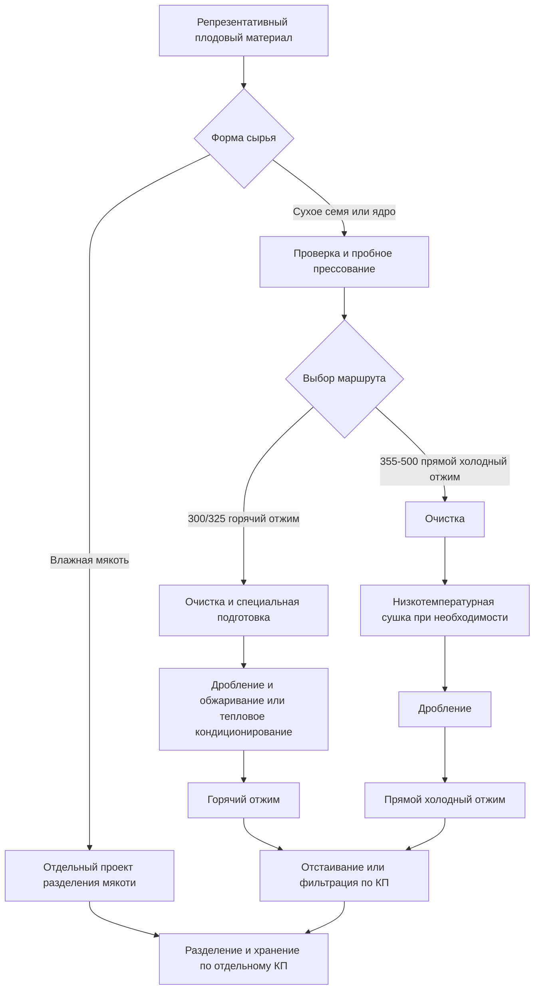

# Решения для масла фруктов

## Закупочная задача

Под фруктовым маслом могут подразумевать продукт из влажной мякоти, высушенных семян или твердого ядра косточки. Для этих материалов нет единого маршрута. До запроса пресса и линии проверяют влажность, остатки мякоти и сахара, спелость, ферментацию и окисление, удаление косточки и скорлупы, природные регулируемые соединения и пищевое, косметическое либо промышленное назначение.

На странице не задаются типовое содержание масла, выход, загрузка партии, суточная производительность, сумма инвестиций, режим работы или сорт готового продукта. Действующее заводское КП должно указывать точную форму сырья, состояние образца, владельца каждой стадии подготовки, комплектацию, приемку и последующие процессы.

## Различия сырья

| Материал из плодов | Что требуется уточнить | Граница процесса |
| --- | --- | --- |
| Влажная масличная мякоть, например авокадо | Сорт, спелость, отделение мякоти от косточки, вода, срок хранения, ферментативные изменения и требуемый способ разделения | Измельчение мякоти, смешивание, центрифугирование и другое влажное разделение являются отдельной технологией; влажную мякоть нельзя по умолчанию подавать в гидравлический пресс для семян или ядер |
| Виноградные косточки и другие семена после виноделия или производства сока | Остатки кожуры, мякоти и сахара, ферментация, мойка, сушка, срок хранения и мелкая фракция | По репрезентативному сухому образцу подтвердить очистку, низкотемпературную сушку при необходимости, дробление, прямой холодный отжим и фильтрацию |
| Семена тыквы и арбуза | Целое семя или ядро, доля оболочки, пищевой сорт, влажность, предыдущая обжарка и вкус | Указать, выполняет ли покупатель обрушивание или оно входит в поставку; маршрут выбрать по продукту и пробе |
| Ядра персика, абрикоса, миндаля и других косточковых | Удаление косточки и скорлупы, идентичность ядра, сладкий или горький сорт, повреждение, хранение и природные регулируемые соединения | Не считать сырье пригодным для пищи или косметики без проверки; ответственность за шелушение, анализы, обработку и рынок назначения закрепить письменно |

Результаты мякоти, семени и ядра не взаимозаменяемы. Для каждого вида, формы, поставщика и состояния подготовки нужна собственная проба.

## Маршрут пресса и граница подготовки

Следующее правило моделей относится только к подготовленным сухим семенам или ядрам, а не к необработанной влажной мякоти.

| Маршрут | Модели пресса | Обязательная последовательность | Граница применения |
| --- | --- | --- | --- |
| Горячий отжим | Серии 300/325 | Очистка и сортировка, удаление косточек или оболочки при необходимости, дробление, обжаривание либо тепловое кондиционирование, затем прессование | Основной вариант для продукта с тепловой подготовкой или жареным ароматом; состояние материала и режим определяют пробой |
| Прямой холодный отжим | Серии 355-500 | Очистка, низкотемпературная сушка только при необходимости, дробление и сразу холодное прессование | Между дроблением и прессом не предполагаются обжаривание, пропаривание или варка; пригодность и модель подтверждают на подготовленном образце |

```mermaid
flowchart TD
    A[Репрезентативный плодовый материал] --> B{Форма сырья}
    B -->|Влажная мякоть| C[Отдельный проект разделения мякоти]
    B -->|Сухое семя или ядро| D[Проверка и пробное прессование]
    D --> E{Выбор маршрута}
    E -->|300/325 горячий отжим| F[Очистка и специальная подготовка]
    F --> G[Дробление и обжаривание или тепловое кондиционирование]
    G --> H[Горячий отжим]
    E -->|355-500 прямой холодный отжим| I[Очистка]
    I --> J[Низкотемпературная сушка при необходимости]
    J --> K[Дробление]
    K --> L[Прямой холодный отжим]
    H --> M[Отстаивание или фильтрация по КП]
    L --> M
    C --> N[Разделение и хранение по отдельному КП]
    M --> N
```

Мойка, измельчение мякоти, удаление косточек и скорлупы, низкотемпературная сушка, обжаривание, прессование, центрифугирование, фильтрация, рафинация, охлаждение, розлив, инженерные сети и отходы являются отдельными позициями. Ответственность определяют подписанные спецификация и таблица интерфейсов.

## Образец и условия испытания

До отправки письменно согласуют количество, консервацию или сушку, упаковку, температурный режим перевозки при необходимости, таможню, стоимость пробы, очистку, расходные материалы, возврат или утилизацию.

Карточка образца должна содержать:

- Вид и сорт, происхождение, поставщика, партию урожая или переработки, спелость или дату производства и хранение
- Форму целого плода, мякоти, влажного семени, сухого семени, косточки в оболочке или чистого ядра
- Влажность, остатки мякоти или сахара, долю оболочки, примеси, повреждения, ферментацию или прогоркание и лабораторное содержание масла при наличии
- Предыдущую мойку, измельчение мякоти, сушку, шелушение, обжаривание, стабилизацию или химическую обработку
- Назначение масла и остатка, горячий или холодный маршрут, вкус, фильтрацию, разделение, рафинацию, хранение и упаковку
- Лабораторные методы, аллергены, сведения о безопасности и ограничения рынка назначения

Отчет по пробе фиксирует подготовку, массу нетто, влажность, размер частиц, температурную историю, программу давления, полный цикл, отделенное масло или жидкость, жмых или остаток, потери, основу фильтрации, очистку и лабораторные образцы. Производительность в КП рассчитывают по полному включенному процессу и его узкому месту, в том числе по подготовке мякоти или сушке, если они входят в линию.

## Комплектация для заводского КП

В зависимости от формы сырья предложение может включать:

- Приемку, контроль, мойку, сортировку и удаление примесей
- Отдельно спроектированные измельчение мякоти, удаление косточек, возврат семян или отделение ядра
- Низкотемпературную сушилку для маршрута 355-500 при необходимости
- Дробилку по результату пробы семени или ядра
- Обжарочный аппарат или тепловой кондиционер для маршрута 300/325
- Пресс 355-500 для прямого холодного отжима очищенного, при необходимости низкотемпературно высушенного и дробленого семени или ядра
- Сепаратор, центрифугу или декантер только в отдельно согласованном проекте влажной мякоти
- Сбор, отстаивание, перекачку, фильтрацию и защищенное либо температурно регулируемое хранение масла
- Интерфейсы для жмыха, мякоти, сточных вод, косточек, скорлупы и побочных продуктов
- Шкаф управления, ограждения, управление, руководства, чертежи и согласованные запчасти
- Отдельно оцениваемые рафинацию, розлив, охлаждение, лабораторию, инженерные сети и упаковку

В КП необходимо отличать полную технологическую линию от поставки одного пресса.

## Исходные данные для цены

Для локализованной заводской цены и сравнения закупочных предложений предоставьте:

- Точный вид, форму сырья, состояние поставки и все продукты одной линии
- Маршрут разделения мякоти, горячего или прямого холодного отжима
- Целевую производительность, партии или смены, сезонность, очистку и смену продукта
- Страну и город, планировку, доступ, нагрузку на пол, подъем, дренаж и хранение
- Электроснабжение, источники тепла и холода, воду, сжатый воздух, вентиляцию, очистку стоков и охлаждаемое хранение
- Контактные материалы, основу фильтрации или разделения, хранение, рафинацию, розлив, упаковку и побочные продукты
- Спецификацию покупателя, лабораторные методы, язык документов, требования рынка назначения и план приемки
- Валюту, Инкотермс, пункт поставки, экспортную упаковку, перевозку, страхование, налоги, пусконаладку, обучение и запчасти
- Бюджетный диапазон, если сравниваются разные границы производственной линии

КП производителя должно отдельно показывать базовые машины, опциональную подготовку и последующие участки, исключения, сети, коммерческие условия, поставку, документы, FAT/SAT и сервис. Инвестиционную модель строят по актуальным данным покупателя о сырье, энергии, труде, логистике, налогах, финансировании, отходах и цене продукта.

## FAT и SAT

### FAT - заводские приемочные испытания

Письменный протокол FAT должен точно назвать форму и состояние образца. Для семени или ядра проверяют подготовку, идентификацию оборудования, предусмотренные защитные функции, массу нетто, полный цикл, температуры, сбор масла и жмыха, фильтрацию, очистку, лабораторные образцы и документы. Для влажной мякоти нужен отдельный протокол материального баланса и разделения. Стоимость пробы, расходников, сторонних анализов и повторных испытаний распределяют до FAT.

### SAT - приемка на площадке

SAT подтверждает готовность площадки, сети, санитарные условия и дренаж, монтажные интерфейсы, соответствие местного сырья, участие операторов, полные технологические прогоны, отбор проб, лабораторное сравнение, очистку, обучение и закрытие замечаний. Поездки, визы, местный труд, подъем, проживание, расходники, анализы и повторный выезд входят только после письменной оценки.

## Соответствие требованиям и сервис

Покупатель указывает пищевое, косметическое, для добавок, кормовое или промышленное применение и страну продажи. В договоре распределяют ответственность за требования к продукту и предприятию, безопасность машин и электрики, пищевой контакт, аллергены и перекрестное загрязнение, природные соединения ядер, стоки, отходы, маркировку, лабораторные анализы и импортно-экспортные документы.

Сертификация для национального, экспортного, органического, пищевого или косметического рынка не следует из комплектации. Документы проверяют по юридическому лицу, заводу, машине, процессу, продукту, сроку действия и стране назначения. Конфигурация оборудования не подтверждает соответствие готового масла.

Сервисные условия должны фиксировать начало и объем гарантии, исключения, каналы и окно ответа, удаленную и выездную границу, оплату труда и поездок, идентификацию запчастей, цену и срок поставки, расходники, руководства, обучение и обслуживание. Услуги вне договора в поставку не входят.

## Свяжитесь с нами

Для закупки линии фруктового масла, подбора оборудования, заводской цены или письменного КП свяжитесь с технической и коммерческой командой:

- **Горячая линия**: +86 19906365856
- **Электронная почта**: gavin@oil-pressing-machine.com
- **Адрес**: № 5888, улица Иньнэн, зона развития, город Цинчжоу, город Вэйфан, провинция Шаньдун, Китай

## Запросить цену и расчёт

Передайте форму сырья, карточку образца, предлагаемый маршрут, производственный план, сети площадки, требования назначения, границу оборудования и коммерческие условия. Заводское КП сможет отдельно показать подготовку мякоти, семени или ядра, прессование, фильтрацию, опции, поставку, приемку и сервис.

- [Запросить цену и расчёт](/ru/contact/)

<!-- quote-cta -->
