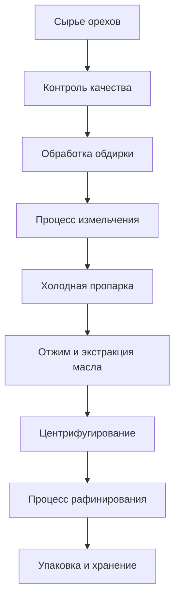

# Решения для масла орехов

## Обзор

Масла орехов имеют высокое содержание масла, богатую питательную ценность и высокую добавленную стоимость. Компания Shandong Shengshi Hecheng Machinery Co., Ltd. предоставляет профессиональные решения для переработки масла орехов, чтобы удовлетворить потребности в высококачественных пищевых маслах и сырье для продуктов по уходу за кожей.

## Основные ореховые культуры

### 🥥 Кокос/Кокосовая мякоть (Кокосовое масло)
**Содержание масла**: 60-70%
**Особенности**: Высокое содержание насыщенных жирных кислот, хорошая стабильность
**Подходящее оборудование**: Специальный пресс серии 300/325
**Технология переработки**: Отделение кокосовой мякоти → Сушка → Холодный отжим → Фильтрация

### 🌴 Плоды пальмы/Ядро пальмы (Пальмовое масло/Масло ядра пальмы)
**Содержание масла**: 45-55%
**Особенности**: Промышленное масло, умеренная температура плавления
**Подходящее оборудование**: Промышленный пресс серии 425/480
**Технология переработки**: Отделение мякоти → Варка → Отжим → Рафинирование

### 🥜 Грецкий орех (Масло грецкого ореха)
**Содержание масла**: 60-70%
**Особенности**: Богат ненасыщенными жирными кислотами, высокая питательная ценность
**Подходящее оборудование**: Специальный пресс серии 300/325
**Технология переработки**: Обдирка → Холодный отжим → Фильтрация → Охлаждение

### 🌰 Миндаль/Горький миндаль (Миндальное масло)
**Содержание масла**: 45-55%
**Особенности**: Красота и уход за кожей, лекарственная ценность
**Подходящее оборудование**: Специальный пресс серии 300/325
**Технология переработки**: Обдирка → Холодный отжим → Фильтрация → Рафинирование

### 🌰 Лещина (Масло лещины)
**Содержание масла**: 55-65%
**Особенности**: Высокое содержание витамина Е, антиоксидант
**Подходящее оборудование**: Специальный пресс серии 300/325
**Технология переработки**: Обдирка → Холодный отжим → Фильтрация

### 🥜 Кешью (Масло кешью)
**Содержание масла**: 40-50%
**Особенности**: Специальный аромат, высококачественное пищевое
**Подходящее оборудование**: Специальный пресс серии 300/325
**Технология переработки**: Обдирка → Холодный отжим → Фильтрация

### 🥜 Фисташки (Масло фисташек)
**Содержание масла**: 45-55%
**Особенности**: Зеленые и здоровые, сбалансированное питание
**Подходящее оборудование**: Специальный пресс серии 300/325
**Технология переработки**: Обдирка → Холодный отжим → Фильтрация

## Рекомендации по оборудованию

### Переработка в небольших масштабах (0,5-2 тонны/день)
- **Специальный пресс для масла серии 300/325**
- Оборудование предварительной обработки орехов
- Система контроля температуры
- Стоимость инвестиций: 300 000-800 000 юаней

### Переработка в средних масштабах (2-10 тонн/день)
- **Пресс для масла серии 355/400**
- Автоматизированная линия предварительной обработки
- Система контроля температуры
- Стоимость инвестиций: 1 500 000-4 000 000 юаней

### Переработка в крупных масштабах (10+ тонн/день)
- **Пресс для масла серии 425/480**
- Полностью автоматическая производственная линия
- Интеллектуальная система управления
- Стоимость инвестиций: 6 000 000 юаней+

## Технологический процесс

## Технические преимущества

### ❄️ Технология холодного отжима
- Сохранение питательных компонентов
- Сохранение естественного аромата
- Повышение стабильности масла

### 🎯 Точный контроль
- Контроль температуры: точность ±1℃
- Контроль давления: интеллектуальная регулировка
- Контроль времени: оптимальные параметры процесса

### 🔄 Непрерывное производство
- Автоматизированная производственная линия
- Непрерывный процесс отжима
- Интеллектуальная система мониторинга

## Применение продукции

### 🍳 Пищевое масло
- Высококачественное пищевое масло
- Специальное питательное масло
- Органическое пищевое масло

### 💄 Красота и уход за кожей
- Натуральное масло для ухода за кожей
- Эфирное масло для массажа
- Сырье для продуктов по уходу за волосами

### 💊 Продукты для здоровья
- Пищевые добавки
- Функциональные продукты питания
- Лекарственные препараты

## Перспективы рынка

### 📈 Тенденции развития
- Рост спроса на здоровую пищу
- Расширение рынка красоты и ухода за кожей
- Развитие рынка высококачественных масел

### 🎯 Целевые рынки
- Высококачественные пищевые бренды
- Предприятия по уходу за кожей
- Производители продуктов для здоровья
- Профессиональные компании по питанию

## Гарантия обслуживания

### 🛠️ Техническая поддержка
- Оптимизация параметров процесса
- Настройка и эксплуатация оборудования
- Обучение операционного персонала
- Руководство по контролю качества

### 🔧 Послепродажное обслуживание
- Техническая поддержка 7×24 часа
- Быстрая поставка запчастей
- Регулярное сервисное обслуживание
- Услуги технического обновления

### 📊 Услуги по работе с данными
- Анализ производственных данных
- Отчет о контроле качества
- Анализ рыночных тенденций
- Исследование потребительских потребностей

## Кейсы

### Фабрика высококачественного масла орехов в провинции Шаньдун
- **Конфигурация оборудования**: Специальный пресс серии 355 × 2 единицы
- **Ежедневная мощность переработки**: 8 тонн смешанных орехов
- **Категории продукции**: Масло грецкого ореха, миндальное масло, масло лещины
- **Позиционирование рынка**: Высококачественное органическое пищевое масло
- **Годовые продажи**: 20 000 000 юаней

### Предприятие по уходу за кожей в провинции Чжэцзян
- **Конфигурация оборудования**: Специальный пресс серии 300 × 3 единицы
- **Ежедневная мощность переработки**: 3 тонны ядер миндаля
- **Применение продукта**: Сырье для продуктов по уходу за кожей
- **Качество продукции**: Соответствует косметическим стандартам
- **Экспортный рынок**: Европа, Япония

### Предприятие по переработке орехов в провинции Хэнань
- **Конфигурация оборудования**: Пресс для масла серии 400 × 1 единица
- **Ежедневная мощность переработки**: 5 тонн грецких орехов
- **Серия продукции**: Масло грецкого ореха, ядра грецкого ореха
- **Создание бренда**: Региональный известный бренд
- **Охват рынка**: По всей стране 20+ провинций

## Стандарты качества

### 🏆 Стандарты качества продукции
- Соответствует национальным стандартам пищевых масел
- Соответствует сертификации органических продуктов
- Соответствует стандартам экспортных продуктов питания
- Соответствует стандартам красоты и ухода за кожей

### 🔍 Параметры тестирования
- Тестирование кислотности
- Тестирование перекисного числа
- Тестирование цвета и прозрачности
- Тестирование содержания тяжелых металлов
- Тестирование остатков пестицидов

## Свяжитесь с нами

Если вас интересуют решения для переработки масла орехов, пожалуйста, свяжитесь с нашей экспертной командой:

- 📞 **Горячая линия**: +86 19906365856
- 📧 **Электронная почта**: gavin@oil-pressing-machine.com
- 📍 **Адрес**: № 5888, улица Иньнэн, зона развития, город Цинчжоу, город Вэйфан, провинция Шаньдун, Китай

Мы предоставляем бесплатные технические консультации и услуги выездного обследования, индивидуально подбирая наиболее подходящие решения для переработки масла орехов.