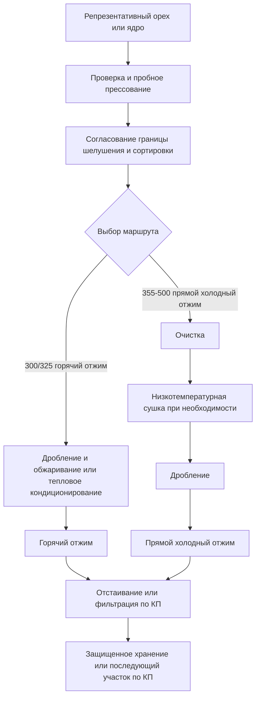

# Решения для масла орехов

## Закупочная задача

При закупке ореховой линии сначала различают орех в скорлупе, очищенное ядро, дробленое ядро, копру или другую подготовленную фракцию. Повреждение и прогоркание ядра, влажность, частицы скорлупы, аллергены, хранение и назначение масла и жмыха меняют процесс, комплектацию и заводскую цену.

На странице не задаются типовое содержание масла, выход, загрузка партии, суточная производительность, сумма инвестиций, график работы или сорт готового масла. КП производителя должно опираться на репрезентативный образец и четко разделять включенные и исключенные операции, оборудование, документы и услуги.

## Различия сырья

| Орех или ядро | Что требуется уточнить | Граница подготовки |
| --- | --- | --- |
| Грецкий орех, фундук и фисташка | Целое или дробленое ядро, скорлупа, показатели окисления или прогоркания, влажность, сорт и разделение аллергенов | Указать, выполняет ли покупатель раскалывание и сортировку или оборудование входит в поставку; дробление и пресс выбрать по пробе |
| Миндаль и ядра косточковых плодов | Сладкий или горький сорт, удаление косточки и скорлупы, пищевое, косметическое или промышленное назначение, природные регулируемые соединения | Не считать сырье пищевым или косметическим без проверки; лабораторные и национальные требования согласовать до подбора оборудования |
| Кешью | Сорт ядра, история обжаривания, загрязнение скорлупой и отделение жидкости скорлупы кешью | Работа с сырой скорлупой является отдельным опасным процессом; КП на пресс относится только к форме образца, если шелушение явно не включено |
| Кокос или копра | Свежая мякоть либо копра, влажность, размер частиц, хранение и плесень | Переработка свежего кокосового молока является отдельным маршрутом; пресс подбирают только для подготовленного твердого материала в КП |
| Плод пальмы или пальмоядро | Свежий плод и ядро являются разным сырьем с разными маршрутами извлечения | Линия свежих плодов не входит в обычную область орехового гидравлического пресса; подготовленное пальмоядро требует отдельной пробы |

Каждый вид, сорт и поставщик проходят отдельную пробу. Результат одного ядра не определяет производительность смеси, очистку при смене, аллергенный контроль или качество другого масла.

## Маршрут пресса и граница подготовки

| Маршрут | Модели пресса | Обязательная последовательность | Граница применения |
| --- | --- | --- | --- |
| Горячий отжим | Серии 300/325 | Очистка и сортировка, необходимое удаление скорлупы, дробление, обжаривание либо тепловое кондиционирование, затем прессование | Основной вариант для жареного вкуса или требуемой тепловой подготовки; режим устанавливают по образцу |
| Прямой холодный отжим | Серии 355-500 | Очистка, низкотемпературная сушка только при необходимости, дробление и сразу холодное прессование | Между дроблением и прессом не предполагаются обжаривание, пропаривание или варка; модель и фильтрацию подтверждают на ядре |

```mermaid
flowchart TD
    A[Репрезентативный орех или ядро] --> B[Проверка и пробное прессование]
    B --> C[Согласование границы шелушения и сортировки]
    C --> D{Выбор маршрута}
    D -->|300/325 горячий отжим| E[Дробление и обжаривание или тепловое кондиционирование]
    E --> F[Горячий отжим]
    D -->|355-500 прямой холодный отжим| G[Очистка]
    G --> H[Низкотемпературная сушка при необходимости]
    H --> I[Дробление]
    I --> J[Прямой холодный отжим]
    F --> K[Отстаивание или фильтрация по КП]
    J --> K
    K --> L[Защищенное хранение или последующий участок по КП]
```

Шелушение, сортировка, низкотемпературная сушка, обжаривание, рафинация, розлив, охлаждаемое хранение, разделение аллергенов, инженерные сети, лаборатория и отходы входят только в подписанные спецификацию, матрицу ответственности и перечень исключений.

## Образец и условия испытания

До отправки письменно согласуют количество, упаковку, курьерскую или грузовую перевозку, таможню, стоимость пробы, необходимую очистку, расходные материалы, возврат или утилизацию.

Карточка образца должна содержать:

- Обычное и ботаническое название, сорт, происхождение, поставщика, партию, дату производства и хранение
- Форму ореха в скорлупе, ядра, копры или другого подготовленного материала
- Влажность, долю скорлупы, повреждения, примеси, плесень, показатели прогоркания и лабораторное содержание масла при наличии
- Предыдущую сушку, обжаривание, бланширование, шелушение или химическую обработку
- Горячий или прямой холодный маршрут, вкус, цвет, фильтрацию, хранение и применение масла
- Назначение и спецификацию жмыха, муки или других сопутствующих продуктов
- Аллергенный контроль, требования к очистке, ограничения безопасности и рынка назначения

Протокол включает фактическую подготовку, массу нетто, размер частиц, влажность, температурную историю, программу давления, полный цикл, масло, жмых, потери, основу отстаивания или фильтрации, наблюдения по очистке и смене продукта, лабораторные методы. Производительность рассчитывают по проверенному циклу и всем узким местам линии.

## Комплектация для заводского КП

Ореховая линия может потребовать:

- Приемку, контроль, сортировку и удаление посторонних включений
- Опциональные раскалывание, шелушение, отделение скорлупы, калибровку или удаление поврежденных ядер
- Низкотемпературную сушилку для маршрута 355-500 при необходимости
- Дробилку, выбранную по ядру и пробе
- Обжарочный аппарат или тепловой кондиционер для маршрута 300/325
- Выбранный пресс, гидростанцию, контактные части, ограждения и управление
- Сбор, отстаивание, перекачку, фильтрацию и защищенное хранение масла
- Сбор, охлаждение, дробление или упаковочный интерфейс для жмыха
- Раздельные по аллергенам емкости, инвентарь или мойку, если это указано
- Шкаф управления, чертежи, руководства, согласованные запчасти и монтажные интерфейсы
- Отдельно оцениваемые рафинацию, розлив, охлаждение, лабораторию, инженерные сети и упаковку

Объем поставки определяют только подписанные спецификация и перечень исключений.

## Исходные данные для цены

Для локализованной цены оборудования и сравнения поставщиков предоставьте:

- Все орехи и ядра, которые планируется перерабатывать, и сезонный план сырья
- Горячий или прямой холодный маршрут, продукты и правила смены
- Целевую производительность, схему партий и смен, время очистки и хранение
- Страну и город проекта, планировку, доступ, нагрузку на пол и подъемные средства
- Электроснабжение, тепло, воду, сжатый воздух, вентиляцию, дренаж и холодное хранение
- Контактные материалы, аллергены, санитарные требования, фильтрацию, хранение, рафинацию и розлив
- Методы лаборатории покупателя, упаковку, язык документов и перечень требований страны назначения
- Валюту, Инкотермс, пункт поставки, экспортную упаковку, перевозку, страхование, налоги, пусконаладку, обучение и запчасти
- Бюджетный диапазон, если требуется сравнить варианты линии на одинаковой коммерческой базе

В КП раздельно указывают базовое оборудование, опции, исключения, перевозку и Инкотермс, допущения по сетям, поставку, инспекцию и приемку, документы, пусконаладку и сервис. Окупаемость рассчитывают только по актуальным данным покупателя о стоимости ядра, продукта, труда, энергии, логистики, налогов, финансирования и отходов.

## FAT и SAT

### FAT - заводские приемочные испытания

Протокол FAT должен назвать точный орех и подготовку, комплектацию, предусмотренные защитные функции, холостой и рабочий режим, массу нетто, полный цикл, сбор масла и жмыха, температуры, основу фильтрации, наблюдения по аллергенной очистке, лабораторные образцы, документы и критерии. Стоимость пробы, обращения с образцом, расходников, сторонних анализов и повторного FAT согласуют заранее.

### SAT - приемка на площадке

Протокол SAT подтверждает готовность площадки, сети, фундамент и доступ, монтажные обязанности, соответствие сырья образцу FAT, методы работы и очистки, обученных сотрудников, повторные прогоны, лабораторное сравнение, записи и закрытие замечаний. Поездки, визы, местный труд, подъем, проживание, расходники и повторный выезд входят только как оцененные позиции КП.

## Соответствие требованиям и сервис

В договоре указывают пищевое, кормовое, косметическое, для добавок или промышленное назначение масла и жмыха, а также требования страны назначения. Распределяют ответственность за аллергены, пищевой контакт, санитарную обработку, охрану труда, экологию, маркировку, анализы и контроль горьких ядер, сырой скорлупы кешью, плесени и загрязнителей.

Сертификация для национального, экспортного, органического, пищевого или косметического рынка не следует из выбора оборудования. Документы проверяют по юридическому лицу, заводу, машине, процессу, продукту, сроку действия и стране назначения. Правовой статус готового продукта не определяется одним поставщиком пресса.

В сервисных условиях письменно фиксируют начало и объем гарантии, исключения, каналы и окно ответа, границу удаленного и выездного сервиса, оплату труда и поездок, идентификацию запчастей, цену и срок поставки, расходники, руководства, обучение и профилактическое обслуживание. Услуги вне договора в поставку не входят.

## Свяжитесь с нами

Для закупки орехового пресса или линии, подбора комплектации, заводской цены и официального КП свяжитесь с технической и коммерческой командой:

- **Горячая линия**: +86 19906365856
- **Электронная почта**: gavin@oil-pressing-machine.com
- **Адрес**: № 5888, улица Иньнэн, зона развития, город Цинчжоу, город Вэйфан, провинция Шаньдун, Китай

## Запросить цену и расчёт

Передайте карточку сырья и образца, маршрут, производственный план, сети площадки, границу линии, требования страны назначения и коммерческие условия. Заводское КП сможет показать сопоставимые машины, опции, составляющие цены с доставкой, приемку и сервис.

- [Запросить цену и расчёт](/ru/contact/)

<!-- quote-cta -->
