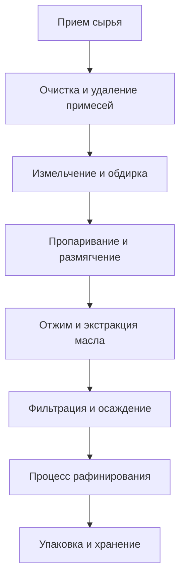

# Решения для масла семян

## Обзор

Масла семян являются основным источником промышленных и пищевых масел, отличающихся высокой урожайностью, низкой стоимостью и зрелой технологией переработки. Компания Shandong Shengshi Hecheng Machinery Co., Ltd. предоставляет полные решения для переработки масла семян от небольших мастерских до крупных фабрик.

## Основные масличные культуры

### 🌱 Соевый боб (Соевое масло)
**Содержание масла**: 18-22%
**Особенности**: Высококачественный источник белка, прозрачное масло
**Подходящее оборудование**: Пресс для масла серии 355/400
**Технология переработки**: Замачивание → Пропаривание → Отжим → Фильтрация

### 🥜 Арахис (Арахисовое масло)
**Содержание масла**: 45-55%
**Особенности**: Богатый аромат, высокая питательность
**Подходящее оборудование**: Пресс для масла серии 300/325
**Технология переработки**: Обдирка → Пропаривание → Отжим → Фильтрация

### 🌰 Кунжут (Кунжутное масло)
**Содержание масла**: 50-60%
**Особенности**: Уникальный аромат, сильный антиоксидант
**Подходящее оборудование**: Специальный пресс серии 300/325
**Технология переработки**: Очистка → Обжарка → Отжим → Фильтрация

### 🌿 Рапс/Канола (Рапсовое масло)
**Содержание масла**: 35-45%
**Особенности**: Высокая урожайность, доступная цена
**Подходящее оборудование**: Пресс для масла серии 355/400
**Технология переработки**: Обдирка → Пропаривание → Отжим → Рафинирование

### 🌻 Семена подсолнечника (Подсолнечное масло)
**Содержание масла**: 40-50%
**Особенности**: Золотистый цвет, освежающий вкус
**Подходящее оборудование**: Пресс для масла серии 355/400
**Технология переработки**: Обдирка → Пропаривание → Отжим → Фильтрация

### 🧵 Хлопковое семя (Хлопковое масло)
**Содержание масла**: 35-45%
**Особенности**: Промышленное масло, требует детоксикации
**Подходящее оборудование**: Промышленный пресс серии 425/480
**Технология переработки**: Обдирка → Пропаривание → Отжим → Детоксикация → Рафинирование

### 🍇 Виноградные косточки (Масло виноградных косточек)
**Содержание масла**: 12-18%
**Особенности**: Богато питательными веществами, сильный антиоксидант
**Подходящее оборудование**: Специальный пресс серии 300/325
**Технология переработки**: Обдирка → Холодный отжим → Фильтрация → Рафинирование

### 🌾 Гречиха (Гречишное масло)
**Содержание масла**: 25-35%
**Особенности**: Зерновое масло, сбалансированное питание
**Подходящее оборудование**: Специальный пресс серии 300/325
**Технология переработки**: Очистка → Пропаривание → Отжим → Фильтрация

### 🌾 Льняное семя (Льняное масло)
**Содержание масла**: 35-45%
**Особенности**: Высокое содержание омега-3
**Подходящее оборудование**: Специальный пресс серии 300/325
**Технология переработки**: Холодный отжим → Фильтрация → Охлаждение

### 🍵 Чайные семена/Семена камелии (Масло чайных семян)
**Содержание масла**: 25-35%
**Особенности**: Высокое содержание полифенолов чая, антиоксидант
**Подходящее оборудование**: Пресс для масла серии 300/325
**Технология переработки**: Обдирка → Холодный отжим → Фильтрация

### 🌱 Семена периллы (Масло периллы/Масло семян ссу)
**Содержание масла**: 40-50%
**Особенности**: Специальный аромат, лекарственная ценность
**Подходящее оборудование**: Специальный пресс серии 300/325
**Технология переработки**: Холодный отжим → Фильтрация → Рафинирование

## Рекомендации по оборудованию

### Переработка в небольших масштабах (1-5 тонн/день)
- **Пресс для масла серии 300/325**
- Базовое оборудование предварительной обработки
- Простая система фильтрации
- Стоимость инвестиций: 200 000-500 000 юаней

### Переработка в средних масштабах (5-20 тонн/день)
- **Пресс для масла серии 355/400**
- Полная линия предварительной обработки
- Система тонкой фильтрации
- Стоимость инвестиций: 1 000 000-3 000 000 юаней

### Переработка в крупных масштабах (20+ тонн/день)
- **Пресс для масла серии 425/480**
- Полностью автоматическая линия предварительной обработки
- Система оборудования для рафинирования
- Стоимость инвестиций: 5 000 000 юаней+

## Технологический процесс

## Технические преимущества

### 🎯 Точный контроль
- Контроль температуры: точность ±2℃
- Контроль давления: точная регулировка
- Контроль влажности: оптимальное содержание влаги

### 🔄 Непрерывное производство
- 24-часовая непрерывная работа
- Автоматическая подача и выгрузка
- Интеллектуальная сигнализация о неисправностях

### 💧 Гарантия качества масла
- Физическое прессование, без химических остатков
- Процесс холодного отжима сохраняет питательные вещества
- Лидирующий в отрасли выход масла

## Перспективы рынка

### 📈 Тенденции развития
- Рост спроса на здоровые пищевые масла
- Расширение рынка органических продуктов
- Увеличение возможностей экспортной торговли

### 🎯 Целевые рынки
- Внутренние предприятия по переработке продуктов питания
- Экспортные торговые компании
- Бренды здорового питания
- Сети общественного питания

## Гарантия обслуживания

### 🛠️ Техническая поддержка
- Установка и наладка оборудования
- Обучение операционного персонала
- Руководство по технологическому процессу
- Предложения по оптимизации формулы

### 🔧 Послепродажное обслуживание
- 24-часовая техническая поддержка
- Своевременное снабжение запчастями
- Регулярное сервисное обслуживание
- Пожизненное техническое обслуживание

### 📊 Услуги по работе с данными
- Мониторинг производственных данных в реальном времени
- Анализ состояния работы оборудования
- Предложения по оптимизации энергопотребления
- Статистика качества производства

## Кейсы

### Крупная маслобойня в провинции Шаньдун
- **Конфигурация оборудования**: Пресс для масла серии 425 × 5 единиц
- **Ежедневная мощность переработки**: 50 тонн сои
- **Выход масла**: 18,5%
- **Годовое производство**: 3 000 тонн соевого масла
- **Окупаемость инвестиций**: 2 года

### Профессиональная фабрика арахисового масла в провинции Хэнань
- **Конфигурация оборудования**: Пресс для масла серии 355 × 3 единицы
- **Ежедневная мощность переработки**: 15 тонн арахиса
- **Выход масла**: 48%
- **Качество продукции**: Национальный первый класс
- **Охват рынка**: 20 городов в провинции

## Свяжитесь с нами

Если вас интересуют решения для переработки масла семян, пожалуйста, свяжитесь с нашей технической командой:

- 📞 **Горячая линия**: +86 19906365856
- 📧 **Электронная почта**: gavin@oil-pressing-machine.com
- 📍 **Адрес**: № 5888, улица Иньнэн, зона развития, город Цинчжоу, город Вэйфан, провинция Шаньдун, Китай

Мы предоставим персонализированные решения в соответствии с вашими конкретными потребностями и техническую поддержку.