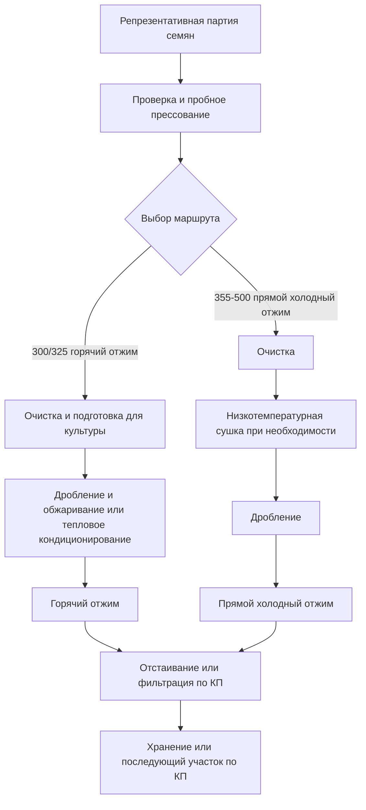

# Решения для масла семян

## Закупочная задача

Технология для семян зависит от культуры и сорта, условий уборки и хранения, примесей, влажности, доли оболочки, лабораторно определенного содержания масла, требований к маслу и назначения жмыха. Сопоставимое коммерческое предложение производителя должно опираться на репрезентативный образец, выбранный маршрут, условия площадки и письменную границу поставки.

На этой странице не задаются типовое содержание масла, выход, загрузка партии, суточная производительность, сумма инвестиций, режим работы или сорт готового масла. Любые приемочные показатели действуют только после согласованного испытания и включения в КП или договор.

## Различия сырья

| Группа семян | Что требуется уточнить | Решение по подготовке |
| --- | --- | --- |
| Соя и арахис | Сорт, влажность, кожица или скорлупа, повреждения, хранение, назначение жмыха; для арахиса также контроль афлатоксинов и других пищевых рисков | По образцу определить сортировку, шелушение, обрушивание, дробление, тепловую или холодную подготовку |
| Кунжут, рапс, перилла и лен | Очистка мелких семян, пыль и мелкая фракция, сыпучесть, чувствительность к окислению, вкус и смена продукта | Подобрать сита и очистку; обжаривание или тепловое кондиционирование применять только в горячем маршруте |
| Подсолнечник, хлопчатник и камелия | Доля лузги, повреждение ядра, примеси и влияние оболочки на прессование и фильтрацию | Необходимость обрушивания подтвердить пробой; для хлопчатника отдельно согласовать госсипол, рафинацию и область применения |
| Виноградная косточка и другие побочные семена | Остатки мякоти и сахара, ферментация, сушка, мелкая фракция и срок хранения | Подтвердить очистку, низкотемпературную сушку при необходимости, дробление, нагрузку на фильтр и пригодность к прессованию |

Каждую культуру, сорт, поставщика и партию испытывают отдельно. Результат одного материала не является основанием для другого.

## Маршрут пресса и граница подготовки

| Маршрут | Модели пресса | Обязательная последовательность | Граница применения |
| --- | --- | --- | --- |
| Горячий отжим | Серии 300/325 | Очистка и сортировка, необходимое шелушение или обрушивание, дробление, обжаривание либо тепловое кондиционирование, затем прессование | Основной вариант для продукта с жареным ароматом или заданной тепловой подготовкой; режим определяют на образце |
| Прямой холодный отжим | Серии 355-500 | Очистка, низкотемпературная сушка только при необходимости, дробление и сразу холодное прессование | Между дроблением и прессом не предполагаются обжаривание, пропаривание или варка; модель выбирают по испытанию и балансу линии |

```mermaid
flowchart TD
    A[Репрезентативная партия семян] --> B[Проверка и пробное прессование]
    B --> C{Выбор маршрута}
    C -->|300/325 горячий отжим| D[Очистка и подготовка для культуры]
    D --> E[Дробление и обжаривание или тепловое кондиционирование]
    E --> F[Горячий отжим]
    C -->|355-500 прямой холодный отжим| G[Очистка]
    G --> H[Низкотемпературная сушка при необходимости]
    H --> I[Дробление]
    I --> J[Прямой холодный отжим]
    F --> K[Отстаивание или фильтрация по КП]
    J --> K
    K --> L[Хранение или последующий участок по КП]
```

Приемка сырья, очистка, шелушение, обжаривание, низкотемпературная сушка, рафинация, розлив, инженерные сети, строительные работы, лаборатория и обращение с отходами входят в поставку только при наличии отдельных позиций в подписанной спецификации и таблице интерфейсов.

## Образец и условия испытания

До отправки письменно согласуют количество образца, упаковку, перевозку, таможенное оформление, стоимость испытания, расходные материалы, возврат или утилизацию.

Карточка образца должна содержать:

- Культуру и сорт, происхождение, поставщика, партию, историю уборки и хранения
- Форму целого семени, ядра или побочного продукта; примеси, оболочку, повреждения и влажность
- Лабораторное содержание масла и метод, если данные есть, без приравнивания к выходу масла на прессе
- Уже выполненную очистку, шелушение, сушку, обжаривание или иную обработку
- Требуемый горячий или прямой холодный маршрут, назначение масла и жмыха, основу фильтрации и лабораторную спецификацию
- Фотографии, сведения о безопасности, аллергенах и известных загрязнителях

В протоколе пробы фиксируют фактическую подготовку, массу нетто, влажность, размер частиц, температурную историю, программу давления, полный цикл, собранное масло, жмых, потери, основу фильтрации, очистку и лабораторные методы. Производительность для КП рассчитывают по проверенному полному циклу и узким местам всей линии, а не по названию модели.

## Комплектация для заводского КП

Линия семенного масла может включать следующие позиции, но объем поставки определяет только подписанная спецификация:

- Приемка, отбор проб и интерфейсы контроля сырья
- Очистка и сортировка под фактический состав примесей
- Шелушитель, обрушиватель, сепаратор или калибратор при необходимости
- Дробилка или плющилка по результату пробы
- Обжарочный аппарат или тепловой кондиционер для маршрута 300/325
- Низкотемпературная сушилка для маршрута 355-500 только при необходимости
- Выбранный пресс, гидростанция, контактные части, ограждения и управление
- Сбор, отстаивание, перекачка, фильтрация и хранение масла
- Выгрузка, сбор, охлаждение или упаковочный интерфейс для жмыха
- Шкаф управления, кабели в согласованной границе, руководства, чертежи и согласованный комплект запчастей
- Отдельно оцениваемые рафинация, розлив, лаборатория, инженерные системы и транспортирование сырья

## Исходные данные для цены

Для заводской цены и сравнения поставщиков сообщите:

- Точное сырье и все материалы, которые планируется перерабатывать на одной линии
- Горячий или прямой холодный маршрут, требуемое масло и назначение жмыха
- Целевую производительность, схему партий и смен, сезонность и частоту переходов
- Страну и город поставки, размеры помещения, доступ, ограничения по подъему и нагрузке на пол
- Напряжение, частоту, фазность, источник тепла, воду, сжатый воздух, вентиляцию и дренаж
- Материалы в контакте, фильтрацию, хранение, рафинацию, розлив и упаковочную границу
- Язык документов, перечень требований страны назначения, инспекционные документы и метод приемки покупателя
- Валюту, Инкотермс, пункт поставки, упаковку, перевозку, страхование, налоги, пусконаладку, обучение и запчасти
- Бюджетный диапазон, если требуется сравнить варианты комплектации на одной коммерческой основе

В КП следует раздельно указать модели и количество, вспомогательное оборудование, опции, исключения, допущения по инженерным сетям, коммерческие условия, срок действия предложения, базис поставки, документы и сервис. Финансовую модель строят на актуальных местных ценах покупателя на сырье, труд, энергию, логистику, налоги, финансирование и готовую продукцию.

## FAT и SAT

### FAT - заводские приемочные испытания

FAT проводят по письменно согласованным образцу, методу, стоимости и критериям. Протокол охватывает идентификацию и комплектацию оборудования, предусмотренные защитные функции, холостой и рабочий режим, подготовку сырья, материальный баланс, полный цикл, температуры, основу фильтрации, отбор масла и жмыха, очистку, документы и отклонения. Показатели вне подписанного протокола не являются приемочными обязательствами.

### SAT - приемка на площадке

SAT должен определять готовность площадки, инженерные сети, фундамент, подъемные работы и труд, границу монтажа и пусконаладки, соответствие местного сырья образцу FAT, участие операторов, метод повторных прогонов, лабораторные проверки, обучение и закрытие замечаний. Перелеты, визы, проживание, местный транспорт, расходные материалы, сторонние анализы и повторный выезд распределяют и оценивают в КП или договоре.

## Соответствие требованиям и сервис

Покупатель указывает страну назначения и применение масла и жмыха: пищевое, кормовое, косметическое, для добавок или промышленное. В договоре по ответственным сторонам перечисляют требования к продукту, предприятию, безопасности машин и электрики, пищевому контакту, маркировке, аллергенам, экологии и охране труда.

Сертификация для национального, экспортного, органического, пищевого или косметического рынка не возникает автоматически из комплектации. Действующие сертификаты и отчеты проверяют по юридическому лицу, заводу, машине, процессу, продукту и стране назначения. Пресс сам по себе не подтверждает соответствие готового масла.

В сервисных условиях письменно фиксируют начало и объем гарантии, исключения, каналы и окно ответа, границу удаленной и выездной поддержки, оплату труда и поездок, идентификацию запчастей и подтверждение срока поставки, расходники, обучение, язык документов и обязанности по обслуживанию. Услуги вне подписанного договора в поставку не входят.

## Свяжитесь с нами

Для подбора пресса, закупки линии семенного масла, сравнения заводских цен или официального КП свяжитесь с технической и коммерческой командой:

- **Горячая линия**: +86 19906365856
- **Электронная почта**: gavin@oil-pressing-machine.com
- **Адрес**: № 5888, улица Иньнэн, зона развития, город Цинчжоу, город Вэйфан, провинция Шаньдун, Китай

## Запросить цену и расчёт

Передайте карточку сырья, маршрут, целевую производительность, инженерные сети площадки, пункт назначения, границу оборудования и коммерческие условия. Тогда заводское КП сможет отдельно показать базовую линию, опции, перевозку, пусконаладку, документы и сервис для закупочной проверки.

- [Запросить цену и расчёт](/ru/contact/)

<!-- quote-cta -->
