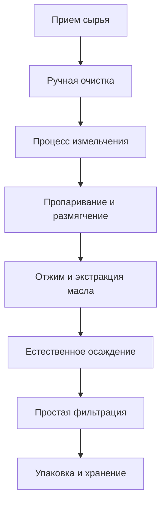

# Решения для небольших маслобоен

## Обзор

Решения для небольших маслобоен специально разработаны для предпринимателей, сельских кооперативов и семейных мастерских, обеспечивая экономически эффективное оборудование и технологии для переработки масла, чтобы помочь вам быстро начать бизнес по переработке масла. Компания Shandong Shengshi Hecheng Machinery Co., Ltd. предоставляет комплексную сервисную поддержку от выбора оборудования до технического обучения.

## Применимые сценарии

### 🏠 Семейная мастерская
- **Целевые пользователи**: Сельские предприниматели, владельцы семейных ферм
- **Ежедневная мощность переработки**: 0,5-1 тонна
- **Бюджет инвестиций**: 150 000-300 000 юаней

### 🏘️ Сельский кооператив
- **Целевые пользователи**: Деревенские коллективы, профессиональные кооперативы фермеров
- **Ежедневная мощность переработки**: 1-3 тонны
- **Бюджет инвестиций**: 300 000-500 000 юаней

### 🏪 Небольшой магазин
- **Целевые пользователи**: Индивидуальные предприниматели, специализированные маслобои
- **Ежедневная мощность переработки**: 0,5-2 тонны
- **Бюджет инвестиций**: 200 000-400 000 юаней

## Основная конфигурация оборудования

### Базовая конфигурация (150 000-300 000 юаней)
- **Пресс для масла серии 300** × 1 единица
- Базовое оборудование для очистки
- Простая система фильтрации
- Базовый электрический шкаф управления

### Стандартная конфигурация (300 000-500 000 юаней)
- **Пресс для масла серии 300/325** × 1 единица
- Система автоматической подачи
- Многоуровневое фильтрующее оборудование
- Система контроля температуры
- Базовое автоматическое управление

## Технологический процесс

## Технические характеристики

### 💰 Экономичность и практичность
- Небольшие инвестиции в оборудование, быстрая окупаемость
- Простая эксплуатация, легкое техническое обслуживание
- Низкое энергопотребление, низкие эксплуатационные расходы

### 🎯 Гибкость и универсальность
- Может перерабатывать различные масличные культуры
- Масштаб производства может гибко регулироваться
- Разнообразные варианты продукции

### 🔧 Простота эксплуатации
- В основном ручная эксплуатация с автоматизированной помощью
- Низкие технические требования, легко освоить и использовать
- Простое техническое обслуживание

## Применимые масличные культуры

### 🌾 Основные зерновые и масличные культуры
- **Соевый боб**: 18-22% содержание масла, подходит для переработки в малых масштабах
- **Арахис**: 45-55% содержание масла, высококачественное пищевое масло
- **Кунжут**: 50-60% содержание масла, богатый аромат

### 🥜 Ореховые культуры
- **Грецкий орех**: 60-70% содержание масла, высококачественное питательное масло
- **Миндаль**: 45-55% содержание масла, красота и уход за кожей
- **Лещина**: 55-65% содержание масла, богата витамином Е

### 🥑 Плодовые культуры
- **Виноградные косточки**: 12-18% содержание масла, сильный антиоксидант
- **Тыквенные семечки**: 35-45% содержание масла, сбалансированное питание

## Применение продукции

### 🍳 Пищевое масло
- Семейное масло для собственного потребления
- Характерное фермерское масло
- Масло малых партий на заказ

### 🏪 Розничная продажа
- Продажа на сельских рынках
- Работа коммунальных магазинов
- Продажа на онлайн-платформах

### 🎁 Персонализация подарков
- Характерное подарочное масло
- Праздничное масло на заказ
- Корпоративное благосостоящее масло

## Анализ окупаемости инвестиций

### 💰 Структура затрат
- **Инвестиции в оборудование**: 200 000-500 000 юаней
- **Строительство фабрики**: 100 000-200 000 юаней
- **Оборотный капитал**: 50 000-100 000 юаней
- **Общие инвестиции**: 350 000-800 000 юаней

### 📈 Ожидаемый доход
- **Ежемесячные продажи**: 50 000-150 000 юаней
- **Валовая прибыль**: 30-50%
- **Ежемесячная чистая прибыль**: 20 000-60 000 юаней
- **Период окупаемости инвестиций**: 8-18 месяцев

## Гарантия обслуживания

### 🛠️ Техническая поддержка
- Руководство по установке и наладке оборудования
- Обучение операторов на месте
- Техническое руководство по производственному процессу
- Предложения по оптимизации формулы

### 🔧 Послепродажное обслуживание
- Гарантия качества оборудования один год
- Круглосуточный технический консультационный сервис
- Своевременная поставка запчастей
- Регулярные визиты и техническое обслуживание

### 📊 Бизнес-консультации
- Отчеты по анализу рынка
- Предложения по каналам сбыта
- Руководство по созданию бренда
- Консультации по бизнес-стратегии

## Успешные кейсы

### Маслобойня на уровне деревни в провинции Шаньдун
- **Конфигурация оборудования**: Пресс для масла серии 300 × 1 единица
- **Ежедневная мощность переработки**: 1,5 тонны арахиса
- **Стоимость инвестиций**: 250 000 юаней
- **Ежемесячные продажи**: 80 000 юаней
- **Окупаемость инвестиций**: 10 месяцев

### Семейная ферма в провинции Хэнань
- **Конфигурация оборудования**: Пресс для масла серии 325 × 1 единица
- **Ежедневная мощность переработки**: 2 тонны смешанных масличных культур
- **Стоимость инвестиций**: 350 000 юаней
- **Ежемесячные продажи**: 120 000 юаней
- **Специализированные продукты**: Органическое кунжутное масло

### Специализированная маслобойня в провинции Чжэцзян
- **Конфигурация оборудования**: Пресс для масла серии 300 × 1 единица
- **Ежедневная мощность переработки**: 1 тонна грецких орехов
- **Стоимость инвестиций**: 280 000 юаней
- **Ежемесячные продажи**: 150 000 юаней
- **Позиционирование рынка**: Высококачественное подарочное масло

## Стандарты качества

### 🏆 Стандарты качества продукции
- Соответствует национальным санитарным стандартам пищевых масел
- Соответствует стандартам местных специализированных сельскохозяйственных продуктов
- Соответствует требованиям сертификации органических продуктов

### 🔍 Параметры тестирования
- Тестирование кислотности
- Тестирование перекисного числа
- Тестирование содержания примесей
- Оценка сенсорного качества

## Рекомендации по развитию

### 📈 Путь модернизации
- Расширение масштаба производства
- Повышение уровня автоматизации
- Расширение разнообразия продукции
- Создание имиджа бренда

### 🎯 Расширение рынка
- Развитие онлайн-каналов сбыта
- Участие в выставках сельскохозяйственных продуктов
- Создание сети дилеров
- Проведение маркетинга бренда

## Свяжитесь с нами

Если вас интересуют решения для небольших маслобоен, пожалуйста, свяжитесь с нашей технической командой:

- 📞 **Горячая линия**: +86 19906365856
- 📧 **Электронная почта**: sales@oil-pressing-machine.com
- 📍 **Адрес**: № 5888, улица Иньнэн, зона развития, город Цинчжоу, город Вэйфан, провинция Шаньдун, Китай

Мы предоставляем бесплатную оценку проекта, консультации по выбору оборудования и услуги выездного обследования, чтобы индивидуально подобрать наиболее подходящее решение для небольшой маслобойни.