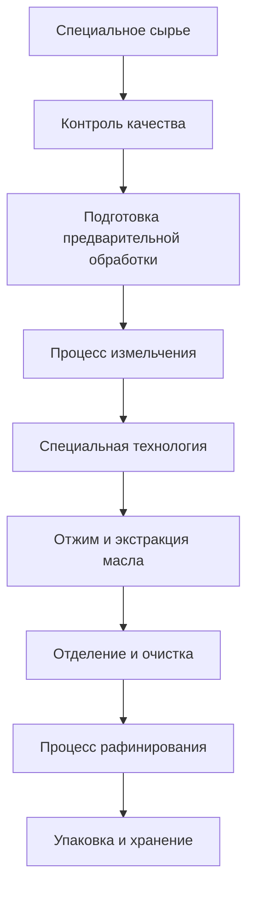

# Решения для специальных масел

## Обзор

Специальные масла включают рисовую шелуху, кукурузные зародыши, клещевину и т.д., обладающие уникальной питательной ценностью и промышленным применением. Компания Shandong Shengshi Hecheng Machinery Co., Ltd. предоставляет профессиональные решения для переработки специальных масел, чтобы удовлетворить диверсифицированные рыночные потребности.

## Основные культуры специальных масел

### 🍚 Рисовая шелуха (Рисовое масло)
**Содержание масла**: 15-25%
**Особенности**: Высокое содержание натурального антиоксиданта γ-оризанола
**Подходящее оборудование**: Специальный пресс серии 300/325
**Технология переработки**: Экстракция рисовой шелухи → Холодный отжим → Фильтрация → Рафинирование

### 🌽 Кукурузные зародыши (Кукурузное масло)
**Содержание масла**: 35-45%
**Особенности**: Богато витамином Е, хорошая стабильность
**Подходящее оборудование**: Пресс для масла серии 355/400
**Технология переработки**: Отделение зародышей → Сушка → Отжим → Фильтрация

### 🌿 Семена клещевины (Касторовое масло)
**Содержание масла**: 45-55%
**Особенности**: Промышленное смазочное масло, сырье для биодизеля
**Подходящее оборудование**: Промышленный пресс серии 425/480
**Технология переработки**: Обдирка → Варка → Отжим → Рафинирование

### 🌶️ Семена перца (Масло семян перца)
**Содержание масла**: 15-25%
**Особенности**: Высокое содержание капсаицина, ценность для здоровья
**Подходящее оборудование**: Специальный пресс серии 300/325
**Технология переработки**: Обдирка → Холодный отжим → Фильтрация

### 🍇 Виноградные косточки/Гречневые семена (Высокоценное масло)
**Содержание масла**: 10-20%
**Особенности**: Высокое содержание полифенолов, сильная антиоксидантная способность
**Подходящее оборудование**: Специальный пресс серии 300/325
**Технология переработки**: Отделение скорлупы семян → Холодный отжим → Фильтрация → Рафинирование

## Рекомендации по оборудованию

### Переработка в небольших масштабах (0,5-3 тонны/день)
- **Специальный пресс для масла серии 300/325**
- Специальное оборудование предварительной обработки
- Система контроля температуры
- Стоимость инвестиций: 500 000-1 200 000 юаней

### Переработка в средних масштабах (3-15 тонн/день)
- **Пресс для масла серии 355/400**
- Автоматизированная линия предварительной обработки
- Многоуровневая система фильтрации
- Стоимость инвестиций: 2 500 000-6 000 000 юаней

### Переработка в крупных масштабах (15+ тонн/день)
- **Пресс для масла серии 425/480**
- Полностью автоматическая производственная линия
- Интеллектуальная система управления
- Стоимость инвестиций: 10 000 000 юаней+

## Технологический процесс

## Технические преимущества

### 🎯 Специальная технология
- Целевая предварительная обработка
- Специальный процесс отжима
- Специальные методы рафинирования

### ❄️ Низкотемпературная защита
- Сохранение активных ингредиентов
- Сохранение естественных характеристик
- Повышение стоимости продукции

### 🔄 Точный контроль
- Точный контроль параметров
- Мониторинг качества в реальном времени
- Автоматическая регулировка

## Применение продукции

### 💊 Сырье для продуктов для здоровья
- Натуральные антиоксиданты
- Функциональные питательные вещества
- Лекарственные препараты

### 🏭 Промышленное применение
- Базовое смазочное масло
- Сырье для биодизеля
- Химическое сырье

### 🍳 Специальное пищевое масло
- Высококачественное питательное масло
- Функциональное пищевое масло
- Специальное приправное масло

## Питательная и оздоровительная ценность

### 🍚 Рисовое масло
- Высокое содержание γ-оризанола
- Сильная антиоксидантная способность
- Защита сердечно-сосудистой системы

### 🌽 Кукурузное масло
- Богато витамином Е
- Сбалансированные ненасыщенные жирные кислоты
- Защита здоровья кожи

### 🌶️ Масло семян перца
- Высокое содержание капсаицина
- Стимулирование метаболизма
- Укрепление иммунитета

## Перспективы рынка

### 📈 Тенденции развития
- Рост спроса на функциональные продукты питания
- Расширение рынка натуральных антиоксидантов
- Увеличение применения биоосновных материалов

### 🎯 Целевые рынки
- Предприятия продуктов для здоровья
- Предприятия по переработке продуктов питания
- Предприятия химического сырья
- Бренды красоты и ухода за кожей

## Гарантия обслуживания

### 🛠️ Техническая поддержка
- Исследование специальных процессов
- Индивидуальный дизайн оборудования
- Обучение технологиям эксплуатации
- Руководство по контролю качества

### 🔧 Послепродажное обслуживание
- Техническая поддержка 7×24 часа
- Поставка специальных запчастей
- Регулярное техническое обслуживание
- Обновление оптимизации процесса

### 📊 Услуги по работе с данными
- Анализ производственных данных
- Отчет о контроле качества
- Анализ рыночных тенденций
- Исследование потребительских потребностей

## Кейсы

### Предприятие по переработке рисового масла в провинции Шаньдун
- **Конфигурация оборудования**: Специальный пресс серии 355 × 2 единицы
- **Ежедневная мощность переработки**: 10 тонн рисовой шелухи
- **Позиционирование продукции**: Высококачественное питательное масло
- **Рыночное преимущество**: Содержание γ-оризанола лидирует в отрасли
- **Годовые продажи**: 8 000 000 юаней

### Фабрика по переработке кукурузного масла в провинции Хэнань
- **Конфигурация оборудования**: Пресс для масла серии 400 × 1 единица
- **Ежедневная мощность переработки**: 8 тонн кукурузных зародышей
- **Качество продукции**: Соответствует национальному стандарту первого класса
- **Создание бренда**: Региональный известный бренд
- **Охват рынка**: По всей стране 10+ провинций

### Предприятие по переработке касторового масла в провинции Хэбэй
- **Конфигурация оборудования**: Промышленный пресс серии 425 × 1 единица
- **Ежедневная мощность переработки**: 12 тонн семян клещевины
- **Применение продукции**: Промышленное смазочное масло
- **Стандарт качества**: Соответствует промышленным стандартам
- **Годовое производство**: 50 000 тонн

## Стандарты качества

### 🏆 Стандарты качества продукции
- Соответствует соответствующим национальным стандартам
- Соответствует требованиям качества отрасли
- Соответствует стандартам качества экспорта
- Соответствует стандартам безопасности и гигиены

### 🔍 Параметры тестирования
- Тестирование физико-химических показателей
- Анализ питательных компонентов
- Тестирование безопасности
- Тестирование стабильности
- Тестирование специальных компонентов

## Технологические инновации

### 🔬 Инновации процесса
- Новая технология экстракции
- Процесс низкотемпературной защиты
- Эффективная технология разделения

### 📊 Ориентированность на данные
- Интеллектуальный контроль качества
- Применение анализа больших данных
- Оптимизация параметров процесса

### 🌱 Устойчивое развитие
- Комплексное использование ресурсов
- Процесс энергосбережения и снижения выбросов
- Стандарты экологичного производства

## Свяжитесь с нами

Если вас интересуют решения для переработки специальных масел, пожалуйста, свяжитесь с нашей экспертной командой:

- 📞 **Горячая линия**: +86 19906365856
- 📧 **Электронная почта**: gavin@oil-pressing-machine.com
- 📍 **Адрес**: № 5888, улица Иньнэн, зона развития, город Цинчжоу, город Вэйфан, провинция Шаньдун, Китай

Мы предоставляем бесплатные технические консультации, тестирование образцов и услуги проверки процесса, обеспечивая вас самыми профессиональными решениями для переработки специальных масел.