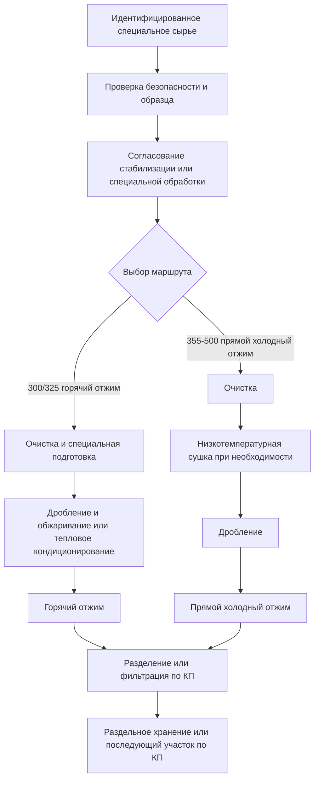

# Решения для специальных масел

## Закупочная задача

Специальное масличное сырье нельзя объединять только по названию. Рисовые отруби, кукурузный зародыш, клещевина, семена перца и другие побочные продукты отличаются свежестью, размером частиц, биологическими и химическими опасностями, стабилизацией, нагрузкой на фильтр, применением продукта и правовым статусом. Процесс и заводскую цену формируют по фактическому материалу и требованиям страны назначения.

На странице не задаются типовое содержание масла, выход, загрузка партии, суточная производительность, инвестиции, режим работы или сорт продукта. Пригодность к прессованию, комплектацию и приемочные показатели подтверждают репрезентативным образцом, письменным методом испытания и подписанным КП или договором.

## Различия сырья

| Специальный материал | Что требуется уточнить | Граница подготовки и безопасности |
| --- | --- | --- |
| Рисовые отруби | Именно отруби, а не шелуха; источник помола, свежесть, стабилизация, влажность, мелкая фракция, прогоркание и нагрузка на фильтр | До прессования распределить ответственность за стабилизацию и сроки хранения; поставщик пресса не считает входящие отруби стабилизированными без документов |
| Кукурузный зародыш | Чистота зародыша, остаточный крахмал или волокно, влажность, сушка, хранение и пищевой либо промышленный маршрут | Очистку, низкотемпературную сушку при необходимости, дробление, прессование, фильтрацию и рафинацию указывать отдельными позициями |
| Семена клещевины | Состояние семян, оболочка, состав, SDS, воздействие на персонал, токсичный жмых, очистка и промышленная спецификация | Вести как выделенный непищевой проект, если компетентные стороны письменно не установили иное; герметизация, обращение со жмыхом, обезвреживание и утилизация не предполагаются без отдельного объема |
| Семена перца | Остатки мякоти, перенос капсаициноидов, запах, пыль, влажность и перекрестное загрязнение | Согласовать очистку, вентиляцию, обязанности по СИЗ, выделенные контактные части или мойку, пищевую либо промышленную спецификацию |
| Другое необычное семя или побочный продукт | Точная идентичность, исходный процесс, загрязнители, коррозионность, история растворителей или химикатов и правовой статус | Не подбирать пресс до проверки безопасности, образца, цели продукта и пути утилизации |

Результат одного специального материала не переносится на другой. Коммерческое название не заменяет данные конкретной партии.

## Маршрут пресса и граница подготовки

| Маршрут | Модели пресса | Обязательная последовательность | Граница применения |
| --- | --- | --- | --- |
| Горячий отжим | Серии 300/325 | Очистка и специальные меры безопасности или стабилизации, дробление, обжаривание либо тепловое кондиционирование, затем прессование | Основной вариант для подтвержденного сырья, которому нужна тепловая подготовка; режим устанавливают по пробе |
| Прямой холодный отжим | Серии 355-500 | Очистка, низкотемпературная сушка только при необходимости, дробление и сразу холодное прессование | Между дроблением и прессом не предполагаются обжаривание, пропаривание или варка; стабилизация или обезвреживание являются отдельной письменной границей |

```mermaid
flowchart TD
    A[Идентифицированное специальное сырье] --> B[Проверка безопасности и образца]
    B --> C[Согласование стабилизации или специальной обработки]
    C --> D{Выбор маршрута}
    D -->|300/325 горячий отжим| E[Очистка и специальная подготовка]
    E --> F[Дробление и обжаривание или тепловое кондиционирование]
    F --> G[Горячий отжим]
    D -->|355-500 прямой холодный отжим| H[Очистка]
    H --> I[Низкотемпературная сушка при необходимости]
    I --> J[Дробление]
    J --> K[Прямой холодный отжим]
    G --> L[Разделение или фильтрация по КП]
    K --> L
    L --> M[Раздельное хранение или последующий участок по КП]
```

Стабилизация, обезвреживание, пылеулавливание, вентиляция, выделенная очистка, рафинация, экстракция растворителем, розлив, инженерные сети, лаборатория и обращение с опасным жмыхом или отходами не входят без отдельного описания оборудования, метода, ответственной стороны и приемки.

## Образец и условия испытания

До отправки письменно согласуют законность перевозки, количество образца, SDS или состав, упаковку, таможню, стоимость пробы, очистки и утилизации, расходные материалы, возврат и путь отходов. Образец может быть отклонен, если нельзя установить его идентичность, безопасность или порядок утилизации.

Карточка образца должна содержать:

- Обычное и техническое название, при необходимости ботанический источник, поставщика, происхождение, партию, дату производства и исходный процесс
- Форму семени, зародыша, отрубей, ядра, порошка, гранулы или иного материала; влажность, распределение частиц, насыпные и потоковые свойства, примеси и лабораторное содержание масла при наличии
- Свежесть, температуру хранения, стабилизацию, сушку, нагрев, растворители, химическую или ферментационную историю
- SDS, известные токсиканты, аллергены, коррозионные компоненты, пыль, запахи и запрещенный перекрестный контакт
- Пищевое, кормовое, косметическое, для добавок, химическое, смазочное или другое промышленное применение
- Требования к маслу, жмыху, фильтрату, выбросам, стокам, очистке, хранению и утилизации

В пробе записывают подготовку, массу нетто, влажность, размер частиц, температурную историю, программу давления, полный цикл, все собранные фракции, жмых или остаток, потери, основу фильтрации, очистку, меры воздействия и лабораторные методы. Производительность является результатом испытания и баланса линии, а не обещанием для категории сырья.

## Комплектация для заводского КП

Линия специального масла может включать:

- Приемку, идентификацию, отбор проб и карантин материала
- Очистку, просеивание, сепарацию, пылеулавливание или герметизацию под материал
- Стабилизатор или иную специальную подготовку только после отдельного проектирования и приемки
- Низкотемпературную сушилку для маршрута 355-500 при необходимости
- Дробилку, выбранную по пробе материала
- Обжарочный аппарат или тепловой кондиционер для одобренного маршрута 300/325
- Выбранный пресс, гидростанцию, совместимые контактные части и уплотнения, ограждения и управление
- Сбор, отстаивание, перекачку, фильтрацию и раздельное хранение масла или жидкости
- Интерфейсы для жмыха, мелкой фракции, стоков, выбросов, очистки и отходов
- Шкаф управления, документы, чертежи, согласованные запчасти и монтажные интерфейсы
- Отдельно оцениваемые рафинацию, розлив, лабораторию, инженерные сети, экстракцию и упаковку

В спецификации различают пищевой контакт и непищевое применение, выделенные детали и ограничения перехода на другое сырье.

## Исходные данные для цены

Для цены производителя и сравнения закупочных предложений предоставьте:

- Точную идентичность материала, исходный процесс, состояние образца, сведения о безопасности и все планируемое сырье
- Горячий или прямой холодный маршрут и применение продуктов
- Целевую производительность, партии или смены, сезонность, разделение, очистку и смену
- Страну и город, класс площадки, планировку, доступ, нагрузку на пол, подъем, вентиляцию и путь отходов
- Электроснабжение, тепло или холод, воду, сжатый воздух, вытяжку, дренаж и очистные сооружения
- Контактные материалы, уплотнения, фильтрацию, хранение, рафинацию, розлив, упаковку и герметизацию
- Требования к продукту и предприятию, лабораторные методы, документы, стороннюю инспекцию и приемку
- Валюту, Инкотермс, пункт поставки, экспортную упаковку, перевозку, страхование, налоги, пусконаладку, обучение и запчасти
- Бюджетный диапазон при сравнении разных границ линии

В КП раздельно оценивают пресс, подготовку, фильтрацию, системы безопасности, последующее оборудование, документы, приемочные испытания, поставку, пусконаладку и сервис. Инвестиционный расчет использует актуальные местные данные покупателя о сырье, продукте, труде, энергии, соответствии требованиям, логистике, налогах, финансировании, очистке и утилизации.

## FAT и SAT

### FAT - заводские приемочные испытания

FAT требует одобренного образца и письменной проверки безопасности. Протокол охватывает идентификацию оборудования, совместимые контактные части, предусмотренные ограждения и управление, холостой и рабочий режим, подготовку, материальный баланс, полный цикл, температуры, собранные фракции, фильтрацию, меры защиты, очистку, отходы, отбор проб, документы и критерии. Стоимость специальной очистки, СИЗ, анализа, утилизации и повторной пробы распределяют заранее.

### SAT - приемка на площадке

SAT подтверждает класс и готовность площадки, сети, вентиляцию и отходы, монтажные обязанности, соответствие местного материала образцу FAT, обучение операторов, полные прогоны, отбор проб и лабораторное сравнение, очистку, прослеживаемость и закрытие замечаний. Поездки, визы, местный труд, подъем, проживание, расходники, сторонние услуги, утилизация и повторный выезд входят только после письменной оценки.

## Соответствие требованиям и сервис

Покупатель указывает страну назначения и применение. В договоре распределяют ответственность за безопасность машин и электрики, пищевой контакт при необходимости, химикаты и SDS, воздействие на работников, аллергены, токсичный жмых, выбросы, стоки, классификацию отходов, стандарты продукта, маркировку, импортно-экспортные документы и сторонние анализы.

Сертификация для национального, экспортного, пищевого, органического, косметического, фармацевтического, промышленного или другого рынка не следует из комплектации. Документы проверяют по юридическому лицу, заводу, машине, процессу, продукту, сроку действия и стране назначения. Конфигурация пресса не доказывает законность или соответствие специального масла.

В сервисных условиях фиксируют начало и объем гарантии, исключения по сырью или коррозии при необходимости, каналы и окно ответа, удаленную и выездную границу, оплату труда и поездок, идентификацию специальных деталей, цену и срок поставки, расходники, очистку и обслуживание, руководства и обучение. Услуги вне договора в поставку не входят.

## Свяжитесь с нами

Для закупки оборудования специального масла, заводской цены, проектирования линии или письменного КП свяжитесь с технической и коммерческой командой:

- **Горячая линия**: +86 19906365856
- **Электронная почта**: gavin@oil-pressing-machine.com
- **Адрес**: № 5888, улица Иньнэн, зона развития, город Цинчжоу, город Вэйфан, провинция Шаньдун, Китай

## Запросить цену и расчёт

Передайте идентификацию и файл безопасности сырья, карточку образца, маршрут, производственный план, условия площадки, требования назначения, границу оборудования и коммерческие условия. Заводское КП сможет отдельно показать технологию, безопасность, поставку, приемку, документы соответствия и сервис.

- [Запросить цену и расчёт](/ru/contact/)

<!-- quote-cta -->
