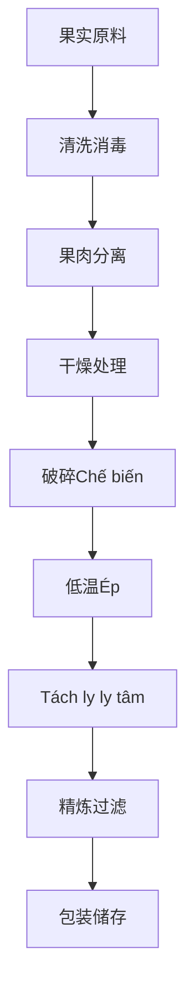

# Giải pháp dầu từ quả (Fruits)

## Tổng quan

果实类油料主要来自各种果实的果肉、果核或种子，具有独特的营养成分和健康价值。山东盛世赫程机械有限公司Cung cấp专业的果实油料Chế biếnGiải pháp，满足高端食用油和功能性食品的市场需求。

## 主要果实作物

### 🥑 鳄梨 / 牛油果（牛油果油）
**Tỷ lệ chứa dầu**: 15-25%
**特点**: 不饱和脂肪酸含量高，美容护肤
**适用Thiết bị**: 300/325系列专用机
**Chế biến工艺**: 果肉分离→低温Ép→过滤→冷藏

### 🍇 葡萄籽（葡萄籽油）
**Tỷ lệ chứa dầu**: 12-18%
**特点**: 多酚含量高，抗氧化强
**适用Thiết bị**: 300/325系列专用机
**Chế biến工艺**: 籽壳分离→低温Ép→过滤→精炼

### 🎃 南瓜籽（南瓜籽油）
**Tỷ lệ chứa dầu**: 35-45%
**特点**: 胡萝卜素含量丰富，营养均衡
**适用Thiết bị**: 300/325系列专用机
**Chế biến工艺**: 去壳→低温Ép→过滤

### 🍉 西瓜籽（西瓜籽油）
**Tỷ lệ chứa dầu**: 40-50%
**特点**: 天然清凉，适合夏季食用
**适用Thiết bị**: 300/325系列专用机
**Chế biến工艺**: 去壳→低温Ép→过滤

### 🧵 棉籽果仁（棉籽油）
**Tỷ lệ chứa dầu**: 35-45%
**特点**: 工业用油，需专业脱毒
**适用Thiết bị**: 425/480系列工业机
**Chế biến工艺**: 去壳→蒸炒→Ép→脱毒→精炼

### 🍑 桃核仁 / 杏核仁（核仁油）
**Tỷ lệ chứa dầu**: 40-50%
**特点**: 药用价值，美容护肤
**适用Thiết bị**: 300/325系列专用机
**Chế biến工艺**: 去壳→低温Ép→过滤→精炼

## Khuyến nghị thiết bị

### Chế biến quy mô nhỏ（Xử lý hàng ngày0.5-2tấn）
- **300/325系列专用榨油机**
- 果实Xử lý trướcThiết bị
- 低温控制系统
- Chi phí đầu tư：40-100vạn nhân dân tệ

### Chế biến quy mô trung bình（Xử lý hàng ngày2-8tấn）
- **355/400系列榨油机**
- Tự động hóaXử lý trướcDây chuyền sản xuất
- 温度湿度控制系统
- Chi phí đầu tư：200-500vạn nhân dân tệ

### Chế biến quy mô lớn（Xử lý hàng ngày8tấn以上）
- **425/480系列榨油机**
- 全自动Dây chuyền sản xuất
- 智能化管理系统
- Chi phí đầu tư：800vạn nhân dân tệ以上

## Quy trình chế biến

## Ưu thế kỹ thuật

### ❄️ 低温冷榨
- 保留营养成分
- 保持天然风味
- 提高产品价值

### 🎯 精准提取
- 果肉充分分离
- 油脂完全提取
- 杂质有效去除

### 🔄 连续生产
- Tự động hóaDây chuyền sản xuất
- 连续Kỹ thuật ép
- 智能质量控制

## 产品应用

### 🍳 高端食用油
- 特种营养油
- 有机健康油
- 功能性食用油

### 💄 美容护肤
- 天然护肤油
- 按摩精油
- 护发素原料

### 💊 保健营养品
- 营养补充剂
- 功能性食品
- 药用制剂

## Giá trị dinh dưỡng

### 🥑 牛油果油
- 维生素E含量高
- 不饱和脂肪酸丰富
- 美容护肤效果好

### 🍇 葡萄籽油
- OPC含量丰富
- 抗氧化能力强
- 心血管保护

### 🎃 南瓜籽油
- 锌元素含量高
- 前列腺健康
- 免疫系统支持

## Triển vọng thị trường

### 📈 发展趋势
- 功能性食品兴起
- 健康美容需求增长
- 高端油品市场扩大

### 🎯 目标市场
- 高端食品品牌
- 美容护肤企业
- 保健品制造商
- 专业营养品公司

## 服务保障

### 🛠️ 技术支持
- 工艺参数优化
- Thiết bị安装调试
- 操作人员培训
- 质量控制指导

### 🔧 售后服务
- 7×24小时技术支持
- 配件快速供应
- 定期维护保养
- 技术升级服务

### 📊 数据服务
- 生产数据分析
- 质量检测报告
- 市场趋势分析
- 客户需求调研

## 案例分享

### 山东某高端果油Chế biến厂
- **Thiết bị配置**: 355系列专用机×2台
- **Xử lý hàng ngày量**: 6tấn混合果实
- **产品种类**: 葡萄籽油、牛油果油、南瓜籽油
- **市场定位**: 高端有机食用油
- **年销售额**: 1500vạn nhân dân tệ

### 浙江某美容护肤企业
- **Thiết bị配置**: 300系列专用机×4台
- **Xử lý hàng ngày量**: 4tấn杏仁核
- **产品应用**: 护肤品原料
- **产品质量**: 符合化妆品标准
- **出口市场**: 欧洲、北美

### 河南某功能食品企业
- **Thiết bị配置**: 400系列榨油机×1台
- **Xử lý hàng ngày量**: 3tấn葡萄籽
- **产品应用**: 保健品原料
- **认证标准**: GMP认证
- **市场覆盖**: 全国健康食品市场

## Tiêu chuẩn chất lượng

### 🏆 Tiêu chuẩn chất lượng sản phẩm
- 符合国家食用油标准
- 符合有机食品认证
- 符合出口食品标准
- 符合美容护肤标准

### 🔍 Mục tiêu kiểm tra
- 酸价检测
- 过氧化值检测
- 色泽透明度检测
- 重金属含量检测
- 农药残留检测
- 营养成分分析

## 可持续发展

### 🌱 环保生产
- 废弃物循环利用
- 节能减排工艺
- 绿色生产标准

### 🔄 资源利用
- 果实综合利用
- 副产品开发
- 产业链延伸

## 联系我们

如果您对果实类油料Chế biếnGiải pháp感兴趣，请联系我们的专家团队：

- 📞 **咨询热线**: +86 19906365856
- 📧 **邮箱**: gavin@oil-pressing-machine.com
- 📍 **地址**: 山东省潍坊市青州市开发区益能街5888号

我们Cung cấp免费的技术咨询、样品测试和实地考察服务，为您量身定制最适合的果实油料Chế biếnGiải pháp。