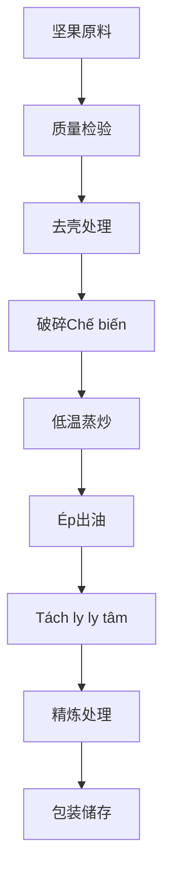

# Giải pháp dầu từ hạt (Nuts)

## Tổng quan

坚果类油料具有Tỷ lệ chứa dầu高、Giá trị dinh dưỡng丰富、产品附加值高等特点。山东盛世赫程机械有限公司Cung cấp专业的坚果油料Chế biếnGiải pháp，满足从高端食用油到美容护肤品原料的不同需求。

## 主要坚果作物

### 🥥 椰子 / 椰仁（椰子油、椰仁油）
**Tỷ lệ chứa dầu**: 60-70%
**特点**: 饱和脂肪酸含量高，稳定性好
**适用Thiết bị**: 300/325系列专用机
**Chế biến工艺**: 椰肉分离→干燥→低温Ép→过滤

### 🌴 棕榈果 / 棕榈仁（棕榈油、棕榈仁油）
**Tỷ lệ chứa dầu**: 45-55%
**特点**: 工业用油，熔点适中
**适用Thiết bị**: 425/480系列工业机
**Chế biến工艺**: 果肉分离→蒸煮→Ép→精炼

### 🥜 核桃（核桃油）
**Tỷ lệ chứa dầu**: 60-70%
**特点**: 不饱和脂肪酸丰富，Giá trị dinh dưỡng高
**适用Thiết bị**: 300/325系列专用机
**Chế biến工艺**: 去壳→低温Ép→过滤→冷藏

### 🌰 杏仁 / 苦杏仁（杏仁油）
**Tỷ lệ chứa dầu**: 45-55%
**特点**: 美容护肤，药用价值
**适用Thiết bị**: 300/325系列专用机
**Chế biến工艺**: 去壳→低温Ép→过滤→精炼

### 🌰 榛子（榛子油）
**Tỷ lệ chứa dầu**: 55-65%
**特点**: 维生素E含量高，抗氧化
**适用Thiết bị**: 300/325系列专用机
**Chế biến工艺**: 去壳→低温Ép→过滤

### 🥜 腰果（腰果油）
**Tỷ lệ chứa dầu**: 40-50%
**特点**: 特殊香气，高端食用
**适用Thiết bị**: 300/325系列专用机
**Chế biến工艺**: 去壳→低温Ép→过滤

### 🥜 开心果（开心果油）
**Tỷ lệ chứa dầu**: 45-55%
**特点**: 绿色健康，营养均衡
**适用Thiết bị**: 300/325系列专用机
**Chế biến工艺**: 去壳→低温Ép→过滤

## Khuyến nghị thiết bị

### Chế biến quy mô nhỏ（Xử lý hàng ngày0.5-2tấn）
- **300/325系列专用榨油机**
- 坚果Xử lý trướcThiết bị
- 低温控制系统
- Chi phí đầu tư：30-80vạn nhân dân tệ

### Chế biến quy mô trung bình（Xử lý hàng ngày2-10tấn）
- **355/400系列榨油机**
- Tự động hóaXử lý trướcDây chuyền sản xuất
- Kiểm soát nhiệt độ系统
- Chi phí đầu tư：150-400vạn nhân dân tệ

### Chế biến quy mô lớn（Xử lý hàng ngày10tấn以上）
- **425/480系列榨油机**
- 全自动Dây chuyền sản xuất
- 智能化控制系统
- Chi phí đầu tư：600vạn nhân dân tệ以上

## Quy trình chế biến

## Ưu thế kỹ thuật

### ❄️ 低温工艺
- 保持营养成分
- 保留天然香气
- 提高油质稳定性

### 🎯 精准控制
- Kiểm soát nhiệt độ：±1℃精度
- 压力控制：智能调节
- 时间控制：最佳工艺参数

### 🔄 连续生产
- Tự động hóa进料系统
- 连续Kỹ thuật ép
- 智能监控系统

## 产品应用

### 🍳 食用油
- 高端食用油
- 特种营养油
- 有机食品油

### 💄 美容护肤
- 天然护肤油
- 按摩精油
- 护发素原料

### 💊 保健品
- 营养补充剂
- 功能性食品
- 药用制剂

## Triển vọng thị trường

### 📈 发展趋势
- 健康食品需求增长
- 美容护肤市场扩大
- 高端油品市场发展

### 🎯 目标市场
- 高端食品品牌
- 美容护肤企业
- 保健品制造商
- 餐饮连锁企业

## 服务保障

### 🛠️ 技术支持
- 工艺参数优化
- Thiết bị调试运行
- 操作人员培训
- 质量控制指导

### 🔧 售后服务
- 7×24小时技术支持
- 配件快速供应
- 定期维护保养
- 技术升级服务

### 📊 数据服务
- 生产数据分析
- 质量检测报告
- 市场趋势分析
- 客户需求调研

## 案例分享

### 山东某高端坚果油厂
- **Thiết bị配置**: 355系列专用机×2台
- **Xử lý hàng ngày量**: 8tấn混合坚果
- **产品种类**: 核桃油、杏仁油、榛子油
- **市场定位**: 高端有机食用油
- **年销售额**: 2000vạn nhân dân tệ

### 浙江某美容护肤企业
- **Thiết bị配置**: 300系列专用机×3台
- **Xử lý hàng ngày量**: 3tấn杏仁
- **产品应用**: 护肤品原料
- **产品质量**: 符合化妆品标准
- **出口市场**: 欧洲、日本

### 河南某坚果Chế biến企业
- **Thiết bị配置**: 400系列榨油机×1台
- **Xử lý hàng ngày量**: 5tấn核桃
- **产品系列**: 核桃油、核桃仁
- **品牌建设**: 区域知名品牌
- **市场覆盖**: 全国20个省市

## Tiêu chuẩn chất lượng

### 🏆 Tiêu chuẩn chất lượng sản phẩm
- 符合国家食用油标准
- 符合有机食品认证
- 符合出口食品标准
- 符合美容护肤标准

### 🔍 Mục tiêu kiểm tra
- 酸价检测
- 过氧化值检测
- 色泽透明度检测
- 重金属含量检测
- 农药残留检测

## 联系我们

如果您对坚果类油料Chế biếnGiải pháp感兴趣，请联系我们的专家团队：

- 📞 **咨询热线**: +86 19906365856
- 📧 **邮箱**: gavin@oil-pressing-machine.com
- 📍 **地址**: 山东省潍坊市青州市开发区益能街5888号

我们Cung cấp免费的技术咨询和实地考察服务，为您量身定制最适合的坚果油料Chế biếnGiải pháp。