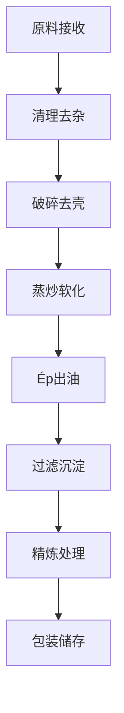

# Giải pháp hạt và dầu hạt (Seed Oils)

## Tổng quan

粮油类种子是工业榨油和食用油的主要来源，具有产量大、成本低、Chế biến工艺成熟等特点。山东盛世赫程机械有限公司Cung cấp从小型作坊到大型工厂的全套粮油种子Chế biếnGiải pháp。

## 主要粮油作物

### 🌱 大豆（豆油）
**Tỷ lệ chứa dầu**: 18-22%
**特点**: 优质蛋白质来源，油质清澈
**适用Thiết bị**: 355/400系列榨油机
**Chế biến工艺**: 浸泡→蒸炒→Ép→过滤

### 🥜 花生（花生油）
**Tỷ lệ chứa dầu**: 45-55%
**特点**: Hương vị đậm đà，营养丰富
**适用Thiết bị**: 300/325系列榨油机
**Chế biến工艺**: 去壳→蒸炒→Ép→沉淀

### 🌰 芝麻（芝麻油）
**Tỷ lệ chứa dầu**: 50-60%
**特点**: 香气独特，抗氧化强
**适用Thiết bị**: 300/325系列专用机
**Chế biến工艺**: 去杂→炒香→Ép→过滤

### 🌿 油菜籽 / 菜籽（菜籽油）
**Tỷ lệ chứa dầu**: 35-45%
**特点**: 产量高，价格实惠
**适用Thiết bị**: 355/400系列榨油机
**Chế biến工艺**: 去壳→蒸炒→Ép→精炼

### 🌻 向日葵籽（葵花籽油）
**Tỷ lệ chứa dầu**: 40-50%
**特点**: 色泽金黄，口感清爽
**适用Thiết bị**: 355/400系列榨油机
**Chế biến工艺**: 去壳→蒸炒→Ép→过滤

### 🧵 棉籽（棉籽油）
**Tỷ lệ chứa dầu**: 35-45%
**特点**: 工业用油，需脱毒处理
**适用Thiết bị**: 425/480系列工业机
**Chế biến工艺**: 去壳→蒸炒→Ép→脱毒→精炼

### 🍇 葡萄籽（葡萄籽油）
**Tỷ lệ chứa dầu**: 12-18%
**特点**: 营养丰富，抗氧化强
**适用Thiết bị**: 300/325系列专用机
**Chế biến工艺**: 去壳→低温Ép→过滤→精炼

### 🌾 荞麦籽（荞麦油）
**Tỷ lệ chứa dầu**: 25-35%
**特点**: 谷物油，营养均衡
**适用Thiết bị**: 300/325系列专用机
**Chế biến工艺**: 去杂→蒸炒→Ép→过滤

### 🌾 亚麻籽 / 胡麻（亚麻籽油）
**Tỷ lệ chứa dầu**: 35-45%
**特点**: Ω-3脂肪酸含量高
**适用Thiết bị**: 300/325系列专用机
**Chế biến工艺**: 低温Ép→过滤→冷藏保存

### 🍵 茶籽 / 山茶籽（茶籽油）
**Tỷ lệ chứa dầu**: 25-35%
**特点**: 茶多酚含量高，抗氧化
**适用Thiết bị**: 300/325系列榨油机
**Chế biến工艺**: 去壳→低温Ép→过滤

### 🌱 苏子（苏子油/紫苏油）
**Tỷ lệ chứa dầu**: 40-50%
**特点**: 特殊香气，药用价值
**适用Thiết bị**: 300/325系列专用机
**Chế biến工艺**: 低温Ép→过滤→冷藏

## Khuyến nghị thiết bị

### Chế biến quy mô nhỏ（Xử lý hàng ngày1-5tấn）
- **300/325系列榨油机**
- 基础Xử lý trướcThiết bị
- 简易过滤系统
- Chi phí đầu tư：20-50vạn nhân dân tệ

### Chế biến quy mô trung bình（Xử lý hàng ngày5-20tấn）
- **355/400系列榨油机**
- 完整Xử lý trướcDây chuyền sản xuất
- 精细过滤系统
- Chi phí đầu tư：100-300vạn nhân dân tệ

### Chế biến quy mô lớn（Xử lý hàng ngày20tấn以上）
- **425/480系列榨油机**
- 全自动Xử lý trướcDây chuyền sản xuất
- 精炼Thiết bị系统
- Chi phí đầu tư：500vạn nhân dân tệ以上

## Quy trình chế biến

## Ưu thế kỹ thuật

### 🎯 精准控制
- Kiểm soát nhiệt độ：±2℃精度
- 压力控制：精确调节
- 湿度控制：最佳含水量

### 🔄 连续生产
- 24小时不间断运行
- Tự động hóa进料出料
- 智能故障报警

### 💧 油质保证
- 冷榨工艺保留营养
- 物理Ép无化学残留
- Tỷ lệ sản lượng行业领先

## Triển vọng thị trường

### 📈 发展趋势
- 健康食用油需求增长
- 有机食品市场扩大
- 出口贸易机会增加

### 🎯 目标市场
- 国内食品Chế biến企业
- 出口贸易公司
- 健康食品品牌
- 餐饮连锁企业

## 服务保障

### 🛠️ 技术支持
- Thiết bị安装调试
- 操作人员培训
- 工艺技术指导
- 配方优化建议

### 🔧 售后服务
- 24小时技术支持
- 配件及时供应
- 定期维护保养
- 终身技术服务

### 📊 数据监控
- 生产数据实时监控
- Thiết bị运行状态分析
- 能耗优化建议
- 产量质量统计

## 案例分享

### 山东某大型油厂
- **Thiết bị配置**: 425系列榨油机×5台
- **Xử lý hàng ngày量**: 50tấn大豆
- **Tỷ lệ sản lượng**: 18.5%
- **Sản lượng hàng năm**: 3000tấn豆油
- **投资回报**: 2年回本

### 河南某专业花生油厂
- **Thiết bị配置**: 355系列榨油机×3台
- **Xử lý hàng ngày量**: 15tấn花生
- **Tỷ lệ sản lượng**: 48%
- **产品质量**: 国家一级标准
- **市场覆盖**: 省内20个城市

## 联系我们

如果您对粮油类种子Chế biếnGiải pháp感兴趣，请联系我们的技术团队：

- 📞 **咨询热线**: +86 19906365856
- 📧 **邮箱**: gavin@oil-pressing-machine.com
- 📍 **地址**: 山东省潍坊市青州市开发区益能街5888号

我们将根据您的具体需求，Cung cấp个性化的Giải pháp和技术支持。